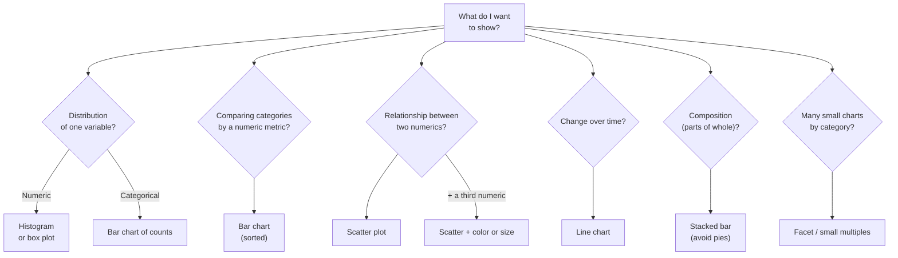
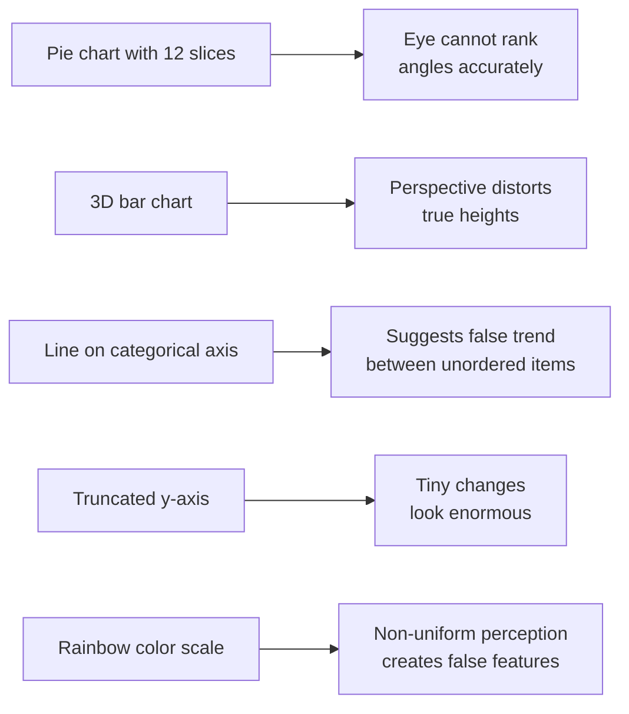

The right chart depends on *the question you're answering*.
This page is a practical decision flow plus a tour of common
charts and their failure modes.

## The decision flow

Print it. Reference it. Internalize it.

## The chart families

### Bar charts
Best for: comparing a numeric metric across distinct categories.

**Do:**
- Sort bars by value, not alphabetically.
- Start the y-axis at 0.
- Label units.

**Don't:**
- Use 3D bars.
- Compare too many categories — top-N + "Other" is often
  better.

### Histograms
Best for: showing the distribution of a single numeric column.

**Do:**
- Try several bin counts (10, 30, 100) — different bin choices
  reveal different patterns.
- Annotate the median or mean if it adds context.

**Don't:**
- Confuse histograms with bar charts. Histogram x-axis is
  continuous; bar chart x-axis is categorical.

### Box plots
Best for: comparing distributions across several groups.

**Do:**
- Show all points (`points="all"` in Plotly) when sample sizes
  are small — boxes alone can be misleading.

**Don't:**
- Use box plots for fewer than ~10 points per group.

### Scatter plots
Best for: relationships between two numeric variables.

**Do:**
- Use transparency for dense plots.
- Add a trend line if you're showing a relationship.

**Don't:**
- Read causation from a scatter — only correlation.

### Line charts
Best for: change over time, with continuous x-axis.

**Do:**
- Sort by x.
- Use color to distinguish multiple series.
- Always include a 0 baseline unless the value can't reach 0.

**Don't:**
- Use lines for categorical x-axes (use bars).

### Pie and donut charts
Best for: almost nothing. Bar charts almost always do the job
better.

**If you must:**
- Use only 2–3 slices.
- Show percentages.

## Bad choices and their consequences

## A practical anti-checklist

Before you ship a chart, ask:

- Can a reader misread the axis range and reach the wrong
  conclusion?
- Are the bars / lines / points doing the work, or is the
  decoration?
- Would a less-fancy chart be more honest?
- Is the title a *statement* of what the reader should take
  away, not just a description of what the axes are?

A great title — "Sales grew 18% in Q4 despite flat units" —
does more for understanding than a beautiful chart with the
title "Sales over time".

## Communicating uncertainty

When you show an average, also show how much it varies:

- **Error bars** on bar charts
- **Confidence bands** on line charts
- **All points** beside box plots
- **Sample size** in the caption

Hiding uncertainty makes patterns look stronger than they are.

## When in doubt — show the data

If you can't decide between two charts, pick the one that shows
*more* of the underlying data. Strip plots, jittered scatter,
overlaid points on top of boxes — when in doubt, **show the
points**.

## Check your understanding

<MultipleChoice
  markdown={`You want to show how monthly active users changed over the last 12 months. Best chart?

- Pie chart
- Stacked bar
- [o] Line chart — time is continuous and a line emphasizes the trend
  > Lines are the default for time-series.
- Box plot

Lines and time go together.`}
/>

<MultipleChoice
  markdown={`Top 5 product categories by revenue. Best chart?

- Pie chart
- 3D bar chart
- [o] Horizontal bar chart sorted by value
  > Bars rank cleanly by length; horizontal accommodates long category names.
- Histogram

Bars and categories go together.`}
/>

<MultipleChoice
  markdown={`A scatter plot of 100,000 points looks like a black blob. Best fix?

- Increase the figure size
- Plot fewer columns
- [o] Lower the opacity (or use a 2D density / hexbin plot) so the structure becomes visible
  > Overplotting is a perceptual problem — transparency and density plots are the standard fixes.
- Change the color palette

Density is information; "ink" alone is not.`}
/>

<MultipleChoice
  markdown={`A reporter shows two bar charts. The first starts the y-axis at 80; the second starts at 0. Both use the same data. Which is more *honest*?

- The y=80 chart — it shows detail
- Both are equally honest
- [o] The y=0 chart, in most cases — starting at zero preserves correct visual proportions, especially for additive quantities. A truncated axis can dramatically exaggerate small changes.
  > There are rare cases (e.g., temperature with a meaningful baseline) where truncation is fine, but the *default* is to start at zero.
- The y=80 chart — it is more zoomed in

Axis choices are editorial choices.`}
/>
