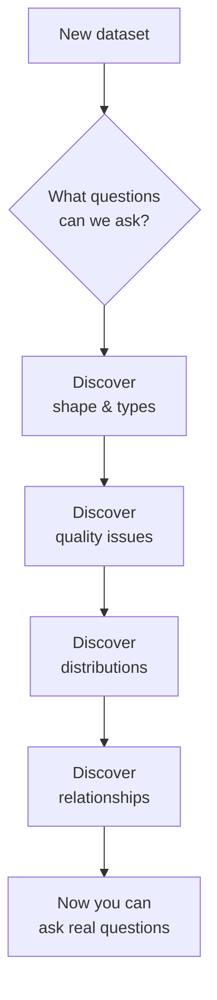
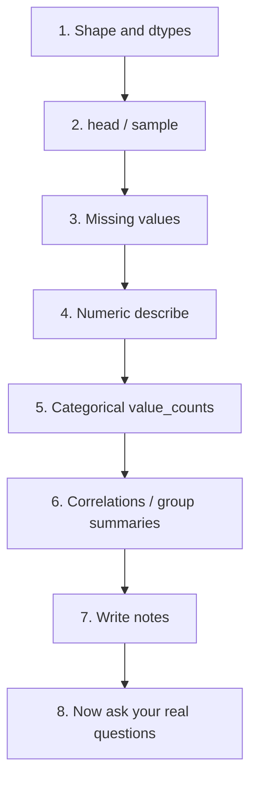

**Exploratory Data Analysis (EDA)** is the part of analysis
where you build *intuition* about a dataset before answering
specific questions. Without intuition you'll ask the wrong
questions, miss obvious problems, and trust the wrong numbers.

EDA is less about specific functions and more about a *habit*.
This page outlines a workflow you can apply to any new dataset.

## Why a workflow?

Without this scaffolding, beginners jump straight to `groupby`
and chart-making, only to realize halfway through that one
column was actually full of garbage.

## Step 1 — Shape and types

<CodeBlock
  adapter="python"
  initCode={`import pandas as pd
df = pd.read_csv("https://raw.githubusercontent.com/bdi475/datasets/main/HR-dataset-v14.csv")`}
  starterCode={`print("Shape:", df.shape)            # rows, columns
print()
print("Dtypes:")
print(df.dtypes)
print()
print("Memory:", df.memory_usage(deep=True).sum() / 1e6, "MB")
`}
/>

Questions to answer:

- How many rows and columns?
- What are the column types? Any string columns that *should*
  be numeric or date?
- Are there obviously-wrong types (e.g., `object` where you
  expected `float64`)?

## Step 2 — Eyeball the data

<CodeBlock
  adapter="python"
  initCode={`import pandas as pd
df = pd.read_csv("https://raw.githubusercontent.com/bdi475/datasets/main/HR-dataset-v14.csv")`}
  starterCode={`print(df.head())
print()
print(df.sample(5, random_state=0))   # random rows often reveal weirdness
`}
/>

`head` shows the top — but the top is often not representative.
A random sample sometimes catches surprises: a different format
midway through, mysterious sentinel values, NaNs you didn't
know about.

## Step 3 — Missing values

<CodeBlock
  adapter="python"
  initCode={`import pandas as pd
df = pd.read_csv("https://raw.githubusercontent.com/bdi475/datasets/main/HR-dataset-v14.csv")`}
  starterCode={`missing = df.isna().sum()
pct = (missing / len(df) * 100).round(2)
report = pd.DataFrame({"missing": missing, "pct": pct})
print(report[report["missing"] > 0].sort_values("missing", ascending=False))
print()
print("(If nothing prints, the dataset has no missing values.)")
`}
/>

For each column with missing data, you'll need to decide
*later* what to do — but you must know it exists *now*.

## Step 4 — Per-column distributions

For numeric columns, look at `describe()`:

<CodeBlock
  adapter="python"
  initCode={`import pandas as pd
df = pd.read_csv("https://raw.githubusercontent.com/bdi475/datasets/main/HR-dataset-v14.csv")`}
  starterCode={`print(df.describe().T)
`}
/>

For categorical columns, look at `value_counts()`:

<CodeBlock
  adapter="python"
  initCode={`import pandas as pd
df = pd.read_csv("https://raw.githubusercontent.com/bdi475/datasets/main/HR-dataset-v14.csv")`}
  starterCode={`for col in df.select_dtypes(include="object").columns:
    print(f"--- {col} ({df[col].nunique()} unique) ---")
    print(df[col].value_counts().head(10))
    print()
`}
/>

Questions:

- Any zero values where there shouldn't be?
- Any extreme min/max suggesting outliers or sentinels?
- Any category with suspiciously many entries (default values?)
- Any category appearing twice with different spelling?

## Step 5 — Relationships between columns

<CodeBlock
  adapter="python"
  initCode={`import pandas as pd
df = pd.read_csv("https://raw.githubusercontent.com/bdi475/datasets/main/HR-dataset-v14.csv")`}
  starterCode={`numeric = df.select_dtypes(include="number")
print("Correlation matrix:")
print(numeric.corr().round(2))
`}
/>

Correlations highlight pairs of columns that move together —
sometimes useful, sometimes a hint that columns are *measuring
the same thing*.

For categorical-vs-numeric relationships, group:

<CodeBlock
  adapter="python"
  initCode={`import pandas as pd
df = pd.read_csv("https://raw.githubusercontent.com/bdi475/datasets/main/HR-dataset-v14.csv")`}
  starterCode={`print(df.groupby("salary")["satisfaction_level"].describe().round(2))
`}
/>

## Step 6 — Write down what you learned

This is the step beginners skip and pros never do. Keep a
notebook section called "What I learned from EDA" with bullet
points:

- "5% of `email` is missing; mostly in early 2020 rows."
- "`country` has 'USA' and 'United States' — same value,
  different label."
- "Salary is heavily right-skewed — use median, not mean."
- "Three columns are nearly perfectly correlated."

These notes shape every subsequent decision.

<Callout type="info" title="EDA never ends">
You'll learn new things about the dataset every time you touch
it. Your notes should grow over the life of the project.
</Callout>

## An EDA checklist

Print it. Tape it to your wall. Use it on every new dataset.

## Check your understanding

<MultipleChoice
  markdown={`A friend gives you a CSV they want analysed and asks "What's the average revenue per region?" What should you do first?

- Immediately compute and reply
- Refuse — too vague
- [o] Run an EDA pass — check shape, types, missing values, distinct regions — *then* compute the answer with confidence
  > Right. Skipping EDA means you might compute the "average" while ignoring duplicates, missing rows, or merged customer records.
- Switch to SQL

EDA is what separates a credible analyst from a calculator.`}
/>

<MultipleChoice
  markdown={`Why look at \`df.sample(5)\` instead of just \`df.head()\`?

- It is faster
- It uses less memory
- [o] head shows only the top rows — random sampling reveals issues that may only occur in middle or end of the file
  > Yes. Time-series files in particular often have format drift over time.
- It returns sorted rows

A random peek at the data is a small habit with outsized payoff.`}
/>

<MultipleChoice
  markdown={`Two columns have a correlation of 0.98. What's the most likely interpretation?

- They cause each other
- They are independent
- [o] They are measuring something very similar — worth investigating whether one is derived from the other, or whether keeping both adds any information
  > Right. High correlation is a flag, not a conclusion. Investigate before either dropping or using both as separate inputs.
- It is a bug

Correlation is a signpost, not an answer.`}
/>

<MultipleChoice
  markdown={`What's the value of *writing down* what you learned during EDA?

- It is required by Pandas
- It is for your manager
- [o] The next person to read your notebook (often future-you, six weeks later) will not remember the dataset's quirks — written notes preserve hard-won knowledge
  > Yes. Undocumented EDA insights vanish the moment you close the notebook.
- It speeds up the kernel

EDA notes are part of the deliverable, not throwaway scratch.`}
/>
