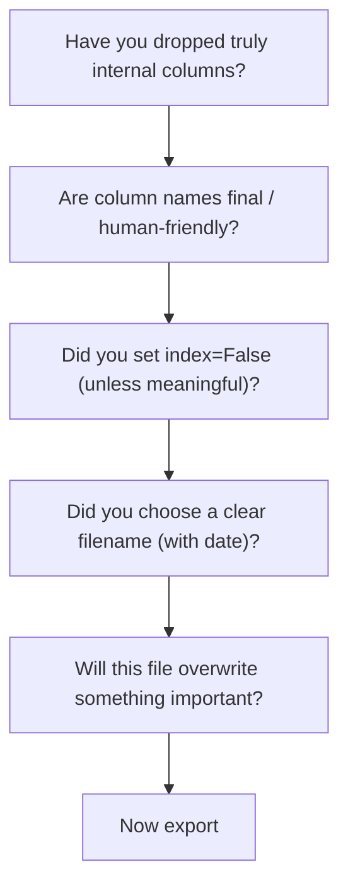

After all the loading, cleaning, and transforming, you need
to *hand off* the result. Pandas can write to dozens of formats
— this page covers the ones that matter most.

## CSV — the universal lowest common denominator

<CodeBlock
  adapter="python"
  initialCode={`import pandas as pd

df = pd.DataFrame({
    "id":   [1, 2, 3],
    "name": ["Aiko","Bilal","Chen"],
    "score": [85.5, 91.2, 77.8],
})

df.to_csv("scores.csv", index=False)
print("Written.")
print()

# Read it back to verify
roundtrip = pd.read_csv("scores.csv")
print(roundtrip)
`}
/>

**`index=False`** is almost always what you want — otherwise you
get a mystery unnamed column when someone re-reads the file.

### CSV gotchas

- Text fields containing commas need quoting (Pandas handles
  this automatically).
- Dates become strings — must re-parse on load.
- Dtypes are guessed on re-read, which can change them.
- Very large files become slow.

## Excel — the format your stakeholders want

<CodeBlock
  adapter="python"
  initialCode={`import pandas as pd

df = pd.DataFrame({
    "department": ["Eng","Sales","HR"],
    "headcount":  [120, 80, 25],
})

df.to_excel("report.xlsx", index=False, sheet_name="Headcount")
print("Written.")
`}
/>

Multiple sheets in one file:

<CodeBlock
  adapter="python"
  initialCode={`import pandas as pd

summary = pd.DataFrame({"metric": ["sales","cost"], "value":[1200, 800]})
detail  = pd.DataFrame({"order":[1,2,3], "amount":[300,500,400]})

with pd.ExcelWriter("report.xlsx") as writer:
    summary.to_excel(writer, sheet_name="Summary", index=False)
    detail.to_excel(writer,  sheet_name="Detail",  index=False)

print("Multi-sheet workbook written.")
`}
/>

Excel preserves types better than CSV but the files are bigger
and the format is messier under the hood.

## Parquet — the analyst's favorite

<CodeBlock
  adapter="python"
  initialCode={`import pandas as pd

df = pd.DataFrame({
    "id":     [1, 2, 3],
    "name":   ["Aiko","Bilal","Chen"],
    "score":  [85.5, 91.2, 77.8],
    "date":   pd.to_datetime(["2024-01-01","2024-02-15","2024-03-30"]),
})

df.to_parquet("scores.parquet")
print("Written.")
print()

back = pd.read_parquet("scores.parquet")
print(back)
print(back.dtypes)
`}
/>

Parquet is:

- **Columnar** — fast for analytics queries.
- **Typed** — datetimes stay datetimes; categories stay
  categories.
- **Compressed** — files are often 10× smaller than CSV.
- **Standard** — readable by Pandas, Spark, DuckDB, R, etc.

The only downside: non-technical users can't open a `.parquet`
in Excel without help.

## The big trade-off

| Format | Human-readable | Preserves types | Size | Speed |
| --- | --- | --- | --- | --- |
| CSV     | ✅ | ❌ | Large | Slow on big data |
| Excel   | ⚠️ (via Excel) | ⚠️ | Larger | Slow |
| Parquet | ❌ | ✅ | Small | Fast |
| JSON    | ✅ | ⚠️ | Large | Slow |
| Pickle  | ❌ | ✅ (Pandas-only) | Medium | Fast — but unsafe across versions |

A common pattern: **Parquet for internal handoffs; CSV/Excel
for sharing with humans.**

## Writing checklist

Before you `df.to_csv(...)`:

### Date-stamped filenames

A small habit with huge dividends:

<CodeBlock
  adapter="python"
  initialCode={`import pandas as pd
from datetime import date

df = pd.DataFrame({"value": [1,2,3]})

today = date.today().isoformat()
fname = f"sales_clean_{today}.csv"
df.to_csv(fname, index=False)
print("Wrote", fname)
`}
/>

`sales_clean_2024-03-18.csv` is much friendlier than
`sales_clean (3).csv`.

## Round-tripping — verify your export

Before declaring "done", read the file back and confirm:

<CodeBlock
  adapter="python"
  initialCode={`import pandas as pd

df = pd.DataFrame({"id":[1,2,3], "value":[10,20,30]})
df.to_csv("/tmp/check.csv", index=False)

back = pd.read_csv("/tmp/check.csv")

# Light verification
assert back.shape == df.shape
assert list(back.columns) == list(df.columns)
print("Round-trip OK.")
`}
/>

You'd be amazed how often the answer to "did the export work?"
is "...no, the dtypes changed."

## Handling categorical and missing data on export

- **CSV** writes NaN as an empty string by default; control
  with `na_rep="NA"` if needed.
- **CSV** has no concept of "category" type — it becomes a
  plain string column on re-read.
- **Parquet** preserves both NaN and category type, which is
  why it's preferred for intermediate storage.

## Mini challenge

<ChallengeCard
  adapter="python"
  title="Clean, export, and verify"
  instructions={`Given the raw DataFrame \`df\` (provided), produce a *cleaned* DataFrame called \`clean\` with:

- All column names lower-cased.
- A column \`full_name\` made by combining \`first\` and \`last\` with a space, then dropping the original two columns.
- Rows where \`age\` is missing dropped.
- The result written to CSV at \`/tmp/clean.csv\` with no index.
- A round-trip read into a variable \`back\` that should equal \`clean\` in shape and columns.`}
  initCode={`import pandas as pd
import numpy as np

df = pd.DataFrame({
    "First": ["Aiko","Bilal","Chen","Diego"],
    "Last":  ["Tanaka","Khan","Zhang","Ramirez"],
    "Age":   [29, np.nan, 35, 41],
})`}
  initialCode={`clean = None   # TODO
back = None    # TODO

print(clean)
print()
print(back)
`}
  solutionCode={`import pandas as pd

clean = df.copy()
clean.columns = clean.columns.str.lower()
clean["full_name"] = clean["first"] + " " + clean["last"]
clean = clean.drop(columns=["first","last"])
clean = clean.dropna(subset=["age"]).reset_index(drop=True)

clean.to_csv("/tmp/clean.csv", index=False)
back = pd.read_csv("/tmp/clean.csv")

print(clean)
print()
print(back)
`}
  tests={[
    {
      id: "types",
      name: "clean and back are DataFrames",
      description: "Type check",
      code: `import pandas as pd
assert isinstance(clean, pd.DataFrame)
assert isinstance(back, pd.DataFrame)`,
    },
    {
      id: "cols",
      name: "clean has the right columns",
      description: "lowercased; full_name; no first/last",
      code: `assert set(clean.columns) == {"age","full_name"}`,
    },
    {
      id: "drop_na",
      name: "Dropped rows with missing age",
      description: "Bilal removed",
      code: `assert len(clean) == 3`,
    },
    {
      id: "full_name",
      name: "full_name correctly formed",
      description: "First + Last with a space",
      code: `assert "Aiko Tanaka" in clean["full_name"].tolist()`,
    },
    {
      id: "roundtrip_shape",
      name: "Round-trip preserves shape and columns",
      description: "Read back equals export",
      code: `assert back.shape == clean.shape
assert list(back.columns) == list(clean.columns)`,
    },
  ]}
/>

## Check your understanding

<MultipleChoice
  markdown={`Why pass \`index=False\` when calling \`to_csv\`?

- It is faster
- It hides PII
- [o] Otherwise the DataFrame's index becomes a mystery first column ("Unnamed: 0") when someone reads the file back
  > Right. \`index=False\` is the right default unless the index is meaningful (e.g., dates).
- It is required

A small habit that saves a lot of confusion downstream.`}
/>

<MultipleChoice
  markdown={`Which format would you choose for an intermediate file that another Pandas script will load tomorrow?

- CSV
- Excel
- [o] Parquet — preserves dtypes (datetimes, categories), is smaller, and reads faster
  > Right. Parquet is the modern default for analyst-to-analyst handoffs.
- JSON

Parquet has become the standard for analytical data exchange.`}
/>

<MultipleChoice
  markdown={`A stakeholder asks for the cleaned dataset to drop into their pivot table. Best format?

- Parquet
- Pickle
- [o] Excel (.xlsx) or CSV — formats they can open without code
  > Right. Match the format to the consumer.
- HDF5

Always match the export format to who's going to consume it.`}
/>
