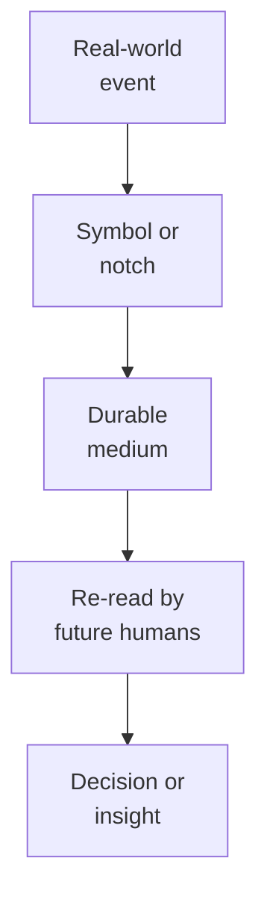
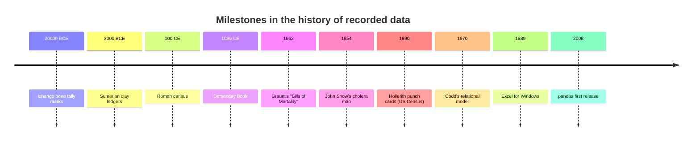

Before we touch a line of Python, it is worth asking a strange
question: *what is data, and why do humans collect it in the first
place?* The answer turns out to be older than writing itself, and
understanding it will quietly make every later chapter make more
sense.

<svg
  viewBox="0 0 640 220"
  role="img"
  aria-label="A clay tablet carrying rows of colored wedge-shaped tally marks separated by faint ruling lines — the first datasets, pressed into clay long before writing"
  style={{ display: "block", width: "100%", maxWidth: "560px", height: "auto", margin: "2.5rem auto" }}
>
  <rect x="225" y="25" width="190" height="170" rx="20" fill="currentColor" opacity="0.08" />
  <rect x="248" y="79" width="144" height="3" rx="1.5" fill="currentColor" opacity="0.12" />
  <rect x="248" y="123" width="144" height="3" rx="1.5" fill="currentColor" opacity="0.12" />
  <g style={{ color: "var(--ds-blue-500)" }} fill="currentColor">
    <polygon points="256,48 268,48 262,64" />
    <polygon points="284,48 296,48 290,64" />
    <polygon points="312,48 324,48 318,64" />
    <polygon points="340,48 352,48 346,64" />
    <polygon points="368,48 380,48 374,64" />
  </g>
  <g style={{ color: "var(--ds-green-500)" }} fill="currentColor">
    <polygon points="256,92 268,92 262,108" />
    <polygon points="284,92 296,92 290,108" />
    <polygon points="312,92 324,92 318,108" />
    <polygon points="340,92 352,92 346,108" />
  </g>
  <g style={{ color: "var(--ds-yellow-500)" }} fill="currentColor">
    <polygon points="256,136 268,136 262,152" />
    <polygon points="284,136 296,136 290,152" />
    <polygon points="312,136 324,136 318,152" fillOpacity="0.45" />
    <polygon points="340,136 352,136 346,152" fillOpacity="0.25" />
  </g>
  <g fill="currentColor" opacity="0.2">
    <circle cx="262" cy="174" r="3" />
    <circle cx="282" cy="174" r="3" />
    <circle cx="302" cy="174" r="3" />
  </g>
</svg>

## The first datasets were bones

The oldest known dataset is the **Ishango bone**, found near a
volcano in central Africa and dated to roughly 20,000 years ago.
Carved along three rows of its surface are clusters of notches —
groups of 11, 13, 17, 19 and others — that mathematicians still
argue about today. Whether they recorded prime numbers, a lunar
calendar, or simply a count of livestock, the impulse was the
same: **something happened repeatedly, and the carver wanted a
durable record of it**.

That impulse — to externalize counting so we can come back to it
later — is the seed of every spreadsheet, every CSV file, and every
SQL table you will ever see.

## Clay tablets and the first ledgers

About 5,000 years ago, the Sumerians of Mesopotamia started
pressing wedge-shaped marks into wet clay. Most of those tablets
are not poetry or religious texts — they are **receipts**. Sheep
delivered. Beer rationed. Land surveyed. Wages owed.

A typical Sumerian temple ledger looks shockingly modern. It has:

- A heading row (who, what, when).
- Repeated rows of transactions.
- Columns that align across rows so the scribe can scan down.
- A total at the bottom.

If you tilt your head, it is a spreadsheet. The technology has
changed; the *shape* of the information has not.

<Callout type="info" title="Why does this matter?">
Tabular data — rows of similar things with columns of attributes —
is not a Python invention or an Excel invention. It is the way
humans have organized records for thousands of years, because it
matches how our minds reason about *categories of things with
properties*. Pandas inherits that shape.
</Callout>

## Census, navigation, and the rise of statistics

For most of history, the largest datasets in the world were
**government records**: censuses, tax rolls, military rosters,
land registries. Rome counted citizens; Domesday Book counted
English villages; Qing officials counted households across China.

Two big shifts happened in the 1600s and 1700s:

1. **Probability theory** was invented (Pascal, Fermat, then
   Bernoulli and Bayes), giving humans a way to reason about
   *uncertain* data.
2. **Navigation** demanded the first big precomputed tables —
   logarithms, trigonometric values, ephemerides — so that
   sailors could fix their position at sea.

By the 1800s, **statistics** was a discipline. Florence
Nightingale used a polar area chart to convince Parliament that
soldiers were dying from sanitation, not bullets. John Snow mapped
cholera cases in London to a single contaminated water pump. These
were not just numbers — they were *data analyses with a
conclusion*, and they changed government policy.

## Punch cards and the first machines

The 1890 US Census was a turning point. The country had grown so
fast that hand-tabulating the previous census had taken **eight
years**, and the next one was due before the previous one was
finished. Herman Hollerith built an electromechanical tabulator
that read punched cards — one per person — and the 1890 count was
done in roughly one. The company he founded would later become
**IBM**.

Punch cards were the dominant data medium for the next seventy
years. Every payroll system, airline reservation system, and
scientific simulation in the 1950s and 60s ate boxes of cards. The
*column* on a card became the *field* in a record, which became
the *column* of a database table, which became the *column* of a
DataFrame. The vocabulary has barely changed.

## The relational model

In 1970, an IBM researcher named **Edgar F. Codd** published a
paper titled *A Relational Model of Data for Large Shared Data
Banks*. It proposed a radical idea: instead of programmers
hand-crafting the file layouts and traversal paths for each
application, data should be stored as **relations** — sets of
rows, each row a tuple of typed values — and queried with a
mathematical algebra.

This is the model behind every SQL database in the world today,
and it is also the model Pandas borrows from when it talks about
*joins*, *merges*, *groups*, and *aggregates*. When we cover those
operations later in the course, you will be using ideas that have
been around for fifty-plus years and have survived because they
*work*.

<Callout type="info" title="Pandas is not a database">
Pandas is an in-memory analytical library — it loads your data
into RAM and works on it there. Databases are designed for
persistent storage, concurrent access, and queries that may run
across machines. But the *conceptual vocabulary* — tables, rows,
columns, joins, aggregations — is shared. Learning Pandas
indirectly teaches you a great deal about databases.
</Callout>

## Why this story matters to you

A common mistake of new analysts is to think of "data" as
something that lives inside a particular tool — an Excel file, a
Pandas DataFrame, a Tableau workbook. It does not. *Data is a
record of something that happened in the world.* The tools come
and go (clay → cards → spreadsheets → DataFrames → cloud
warehouses), but the work — turning recorded observations into
useful decisions — is the same job humans have been doing for
millennia.

Every time you load a CSV in this course, picture the Sumerian
scribe with their reed stylus. The medium is different. The job
is exactly the same.

## A tiny historical experiment

Let us do our first piece of "data analysis" — on a dataset that
looks a lot like a Sumerian ledger.

<CodeBlock
  adapter="python"
  files={[
    {
      filename: "main.py",
      starterCode: `# A fictional but very Sumerian-looking ledger:
# rows = transactions, columns = (item, quantity, recipient)

ledger = [
    ("barley", 120, "temple kitchen"),
    ("beer", 30, "scribe school"),
    ("sheep", 7, "high priest"),
    ("barley", 80, "temple kitchen"),
    ("oil", 12, "weaving hall"),
    ("sheep", 3, "temple kitchen"),
    ("barley", 45, "scribe school"),
]

# Question: how much barley did each recipient get?
totals = {}
for item, qty, recipient in ledger:
    if item == "barley":
        totals[recipient] = totals.get(recipient, 0) + qty

for recipient, total in totals.items():
    print(f"{recipient:>18}: {total} units of barley")
`,
    },
  ]}
/>

Take a moment to appreciate this. We just **filtered** by item,
**grouped** by recipient, and **aggregated** by sum — three core
operations that we will spend entire chapters on in Pandas. The
scribe was doing the same calculation with a reed stylus on clay.
You did it in twelve lines of Python. The underlying *thought
process* — pick the rows you care about, slice by a category,
total something up — is unchanged.

## Check your understanding

<MultipleChoice
  markdown={`Which of the following is **not** an example of a tabular dataset in the historical sense used in this chapter?

- A Sumerian clay tablet listing daily grain rations
  > A grain-ration ledger has repeated rows of transactions with aligned columns of item, quantity, and recipient — exactly the tabular shape the chapter describes.
- A Roman census enumerating citizens by household
  > A census has repeated rows (one per household) with columns of attributes (name, property, family members) — a canonical tabular dataset.
- The 1890 US census tabulated on Hollerith punch cards
  > The 1890 census is explicitly cited in the chapter as a milestone in tabular data; each punch card was one row (one person) with columns of attributes.
- [o] A handwritten love poem on parchment
  > A poem is unstructured prose — it has no repeated rows of similar things with aligned columns of attributes. A tabular dataset is defined by its row-and-column structure, where each row represents one "thing" and each column one attribute of that thing.

Tabular structure — repeated rows of similar entities with aligned columns — is the defining shape of data analysis from clay tablets to Pandas.`}
/>

<MultipleChoice
  markdown={`Why is the relational model (Codd, 1970) relevant to a course about Pandas?

- Pandas is itself a relational database
  > The chapter explicitly states that Pandas is an in-memory analytical library, not a database; it does not provide persistent storage or concurrent access.
- Codd invented the CSV format
  > Codd's 1970 paper proposed the relational model and relational algebra; the CSV format predates and postdates that work independently and was not part of his contribution.
- [o] Pandas borrows the same conceptual vocabulary — tables, rows, columns, joins, group-bys — and the same mental model of operating on whole sets of rows at once
  > Pandas is an in-memory analytical library, not a database, but its operations are deeply inspired by relational algebra. Understanding "joins" and "group bys" in Pandas means understanding ideas that have been around for over fifty years.
- Pandas requires you to use SQL syntax internally
  > Pandas uses Python method calls, not SQL; the connection to Codd is conceptual (shared vocabulary and mental models), not syntactic.

The historical continuity between databases and DataFrames is one reason the same vocabulary keeps appearing in this course.`}
/>
