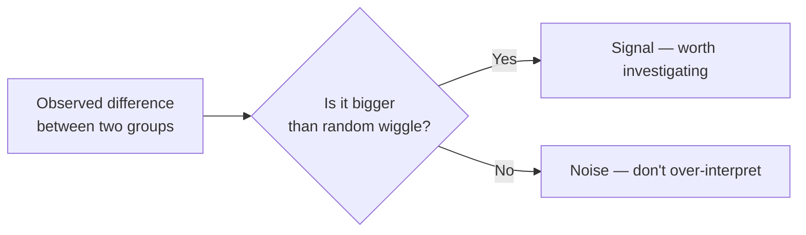
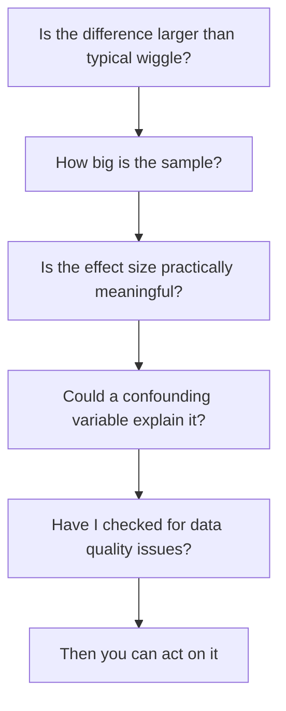

You don't need a formal statistics course to reason carefully
about data. But you *do* need intuition for a few core questions
every analyst eventually faces:

- "Group A's number is higher than Group B's. Is that *real* or
  could it just be chance?"
- "Our metric went up by 4% last week. Is that worth
  celebrating?"
- "Two variables look correlated. Could it be coincidence?"

This page introduces the *intuition* behind hypothesis-style
reasoning — without diving deep into formal tests. (Those are
the subject of a dedicated statistics course.)

## The core question: noise vs signal

Real-world measurements always wiggle. Sales aren't 100 every
day — they're 95, 110, 102, 88, 130. So when one group looks
"different" from another, you have to ask:

The whole craft is in answering that "?".

## Exploratory feel — same dataset, different samples

<CodeBlock
  adapter="python"
  initialCode={`import pandas as pd
import numpy as np

rng = np.random.RandomState(0)
# Two groups truly drawn from the same distribution
a = pd.Series(rng.normal(100, 15, size=30))
b = pd.Series(rng.normal(100, 15, size=30))

print(f"Mean A: {a.mean():.2f}")
print(f"Mean B: {b.mean():.2f}")
print(f"Difference: {a.mean() - b.mean():.2f}")
`}
/>

Re-run the cell a few times mentally with different seeds —
you'll get differences of -5, +3, -2, +6, etc., even though the
two groups come from the exact same underlying process.

**Lesson:** small differences in means happen all the time
without any "real" effect.

## The null hypothesis idea

A common framing:

- **Null hypothesis (H₀):** Boring story — "nothing is going
  on; the two groups are really the same; the difference we see
  is just luck."
- **Alternative hypothesis (H₁):** "Something is going on."

You compute *how surprising* the observed difference would be
**if H₀ were true**. If it's very surprising, you reject H₀.

That "surprise" measure is the **p-value**.

## What a p-value really means

A p-value of `0.03` means:

> If the two groups really were the same, there's only a 3%
> chance we'd see a difference at least this large just by
> luck.

Common conventions:

| p-value | Interpretation |
| --- | --- |
| > 0.10 | No real evidence |
| ~ 0.05 | Suggestive but not conclusive |
| < 0.01 | Strong evidence against H₀ |
| < 0.001 | Very strong evidence |

<Callout type="warn" title="A p-value is not a probability the result is real">
A common misreading: "p = 0.03 means there's a 97% chance
something real is happening." That's wrong. A p-value is a
statement about a hypothetical world where nothing is
happening, not about your actual hypothesis.
</Callout>

## A simple t-test (conceptual)

You don't need to memorise this — most teams use libraries.

<CodeBlock
  adapter="python"
  initialCode={`import pandas as pd
import numpy as np
from scipy import stats

rng = np.random.RandomState(42)

# Two groups truly different
control   = rng.normal(100, 10, size=40)
treatment = rng.normal(105, 10, size=40)

t_stat, p = stats.ttest_ind(control, treatment)
print(f"t = {t_stat:.2f}")
print(f"p = {p:.4f}")
`}
/>

The exact mechanics of `ttest_ind` are less important than the
**workflow**: state your hypothesis, collect data, compute a
test, decide based on the p-value plus your domain knowledge.

## Sample size matters

<CodeBlock
  adapter="python"
  initialCode={`import numpy as np
from scipy import stats

rng = np.random.RandomState(0)

for n in [10, 50, 500, 5000]:
    a = rng.normal(100, 10, n)
    b = rng.normal(100.5, 10, n)   # tiny true difference
    p = stats.ttest_ind(a, b).pvalue
    print(f"n={n:>5}: p = {p:.4f}")
`}
/>

A real-but-tiny difference of 0.5 looks like nothing at small
sample sizes and becomes statistically significant with enough
data. **Significance is not the same as importance.**

## Practical analyst checklist

Before you celebrate or panic about a difference, ask:

This is more important than any one statistical test.

## Confounders — the silent killer

A classic mistake: "City A drinks more coffee and has more car
accidents — so coffee causes accidents." Maybe. Or maybe both
are driven by *population size*. Population is a **confounder**.

Mitigation: think hard about what *else* could explain the
pattern; control for it (slice your data by it; include it as a
covariate; use stratified sampling).

## Be very skeptical of:

- Tiny samples ("I asked 4 friends...")
- "Marginally significant" results (p just under 0.05) without
  pre-registration
- Differences without a plausible mechanism
- "Statistically significant" results from huge samples (the
  effect size may be tiny)
- Comparisons across naturally different populations without
  controlling for differences

## Mini reasoning challenge

<MultipleChoice
  markdown={`Your A/B test shows a 1% improvement with p = 0.03 on 2,000 users. Your colleague claims "this proves the feature works." What's the best response?

- Agree — p < 0.05
- Disagree — p > 0.001
- [o] Push back gently — significance is real, but 1% is small, and there may be confounders (time of day, version drift, holiday traffic). Investigate effect size and replicability before shipping company-wide.
  > Right. p-values are one input. Effect size, practical significance, replicability, and confounders matter at least as much.
- Re-run with smaller sample

Analysts protect their team from over-interpreting noisy results.`}
/>

<MultipleChoice
  markdown={`You see a strong correlation between ice cream sales and drowning incidents. What is the most likely explanation?

- Ice cream causes drowning
- Drowning causes ice cream sales
- [o] A confounding variable — hot summer weather increases both
  > Right. The textbook example of confounding.
- The data is wrong

Always ask "what else could explain this?".`}
/>

<MultipleChoice
  markdown={`A p-value of 0.03 means:

- A 97% chance the result is real
- A 3% chance the data is wrong
- [o] If the null hypothesis (no real effect) were true, the chance of seeing a result this extreme by luck is 3%
  > Correct. It's a statement about a hypothetical world, not directly about your actual hypothesis being "true".
- A 30% chance of error

Misinterpreting p-values is one of the most common errors in applied analytics.`}
/>

<MultipleChoice
  markdown={`A very large dataset shows a "statistically significant" difference of 0.001 between two groups. What should you conclude?

- Definitely a real effect — ship it
- The data must be corrupt
- [o] The difference may be real but is so small it is probably not practically meaningful — large samples can detect trivially small effects
  > Yes. Big samples make tiny signals reach significance. Always ask: "Is this difference big enough to matter for my decision?"
- It is just noise

Statistical significance and practical significance are different questions.`}
/>

<MultipleChoice
  markdown={`Which is the most useful safeguard against fooling yourself with data?

- Always trusting the p-value
- Computing more decimal places
- [o] Combining: a clear hypothesis stated in advance, a check for confounders, an effect-size threshold that matters in your domain, and replication
  > Right. No single number protects you. Disciplined process does.
- Using bigger fonts in charts

Hypothesis testing is one tool inside a much larger discipline of careful thinking.`}
/>
