Welcome to **Data Analysis with Python Pandas**. If you have never
written a line of code, never touched a Jupyter notebook, and only
know spreadsheets as "that thing accountants use" — you are in the
right place.

This course is not a syntax reference. It is a guided tour through
how humans went from scratching tally marks on bones to running
multi-million-row analyses on a laptop, and how a small Python
library called **Pandas** became the lingua franca of modern data
work.

<Callout type="info" title="No setup required">
Every code block on every page runs inside your browser via a full
Python environment. There is nothing to install, no terminal to
open, no virtual environment to configure. Click *Run* and watch
the output appear underneath the editor.
</Callout>

## Who this course is for

You will fit right in if any of these sound like you:

- You have heard people say "data analysis" but you are not sure
  what an analyst actually *does* day-to-day.
- You can sum a column in Excel, but the moment a dataset has fifty
  thousand rows and a few missing values, the spreadsheet falls
  apart.
- You have tried to read a Python tutorial and bounced off `pip`,
  `venv`, and `lambda` in the first five minutes.
- You are curious about data jobs — analyst, data scientist,
  researcher, product analyst — and you want to understand the
  ground floor before you start climbing.

You do **not** need:

- Any prior Python (or any programming) experience.
- A statistics background.
- A math background beyond grade-school arithmetic.
- A computer with anything installed.

## What you will learn

By the end of the course you will be able to:

- Open a real-world dataset and confidently describe what is in it.
- Clean missing values, fix inconsistent text, and handle bad rows.
- Slice, filter, sort, and rank data to answer specific questions.
- Group data and compute summaries the way a working analyst does.
- Combine multiple datasets into one with merges and joins.
- Reshape data between wide and long formats.
- Build simple but informative visualizations.
- Write analysis code that another person (or future you) can read
  and trust.

## How the course is organized

```mermaid
flowchart LR
    A[The Story<br/>of Data] --> B[What Data<br/>Analysis Is]
    B --> C[Python for<br/>Analysis]
    C --> D[Loading &<br/>Inspecting]
    D --> E[DataFrames<br/>& Series]
    E --> F[Filter, Sort,<br/>Rank]
    F --> G[Aggregation<br/>& GroupBy]
    G --> H[Cleaning<br/>Messy Data]
    H --> I[Combining<br/>Datasets]
    I --> J[Reshaping]
    J --> K[Exploratory<br/>Analysis]
    K --> L[Visualization]
    L --> M[Reproducible<br/>Workflows]
```

We start with **a story**, not with syntax. The first chapters walk
through where data came from, how spreadsheets shaped business
analysis, and why a young economist named Wes McKinney decided to
build the library that would become Pandas.

Only after you understand *why* Pandas exists do we start typing
real code. From there each chapter builds on the previous one — by
the time we get to GroupBy and merges, you will already understand
the questions those tools are designed to answer.

## How the interactive widgets work

You will encounter three kinds of widgets:

1. **Executable code blocks.** Edit the code, click *Run*, and the
   output (printed text, tables, plots) appears right below.
2. **Challenge cards.** Small problems with hidden test cases —
   write a solution, click *Run tests*, and see which ones pass.
   Larger challenges may use multiple files so you can practice
   organizing analysis code.
3. **Multiple-choice questions.** Quick conceptual checks at the
   end of most pages, with explanations for every answer.

<Callout type="info" title="Each code block is isolated">
Variables you define in one code block are **not visible** to the
next, even on the same page. Every block starts from a clean slate.
If you want a long-lived workspace to experiment in across blocks,
open the [Python Playground](/playground/python) in a new tab.
</Callout>

## A taste of what is coming

By the end of the course, this little snippet will feel completely
natural. For now, just click *Run* and notice that data lives on
the internet, comes into Python in two lines, and you immediately
have something to look at.

<CodeBlock
  adapter="python"
  initialCode={`import pandas as pd

df = pd.read_csv(
    "https://raw.githubusercontent.com/bdi475/datasets/main/HR-dataset-v14.csv"
)

print("Rows, columns:", df.shape)
print("First few employees:")
df.head()
`}
/>

That is a real HR dataset with about 1,470 employees and 35
columns. In a few chapters you will be slicing it by department,
comparing salaries, flagging employees at risk of leaving, and
building charts that explain what you found — all in code that
you can re-run tomorrow on next month's data without changing a
single line.

## A note on philosophy

Most "learn Pandas" material is a wall of method names and shapes.
This course is different. We care more about **why** an operation
exists than about memorizing its arguments. The reason is simple:
syntax is googlable, but *judgment* — knowing when to filter
before grouping, when to keep raw versus cleaned data, when a
median tells you more than a mean — is not. We will spend a lot of
time on judgment.

<Callout type="success">
Ready to begin? Click **History of Data** in the sidebar to start
the story.
</Callout>
