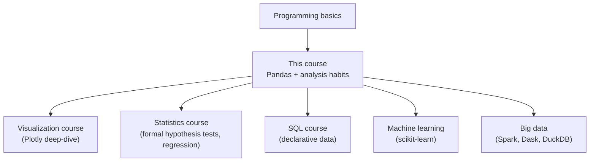

You've made it through the foundations. You can load a
dataset, understand its shape, clean it, filter it, group it,
join it, reshape it, summarize it, visualize it, and export
the result reproducibly.

That's a *lot*. Take a moment to appreciate how far you've
come.

## Where this course fits

This course is the spine that every later data-skill connects
to.

## Deeper Pandas areas worth exploring

You learned the core 80%. Here are areas where Pandas has much
more to offer:

- **MultiIndex** — hierarchical row and column indexes.
  Powerful for grouped time-series and panel data.
- **Categorical dtype** — saves memory and unlocks ordering for
  categorical columns.
- **Window functions beyond rolling** — `expanding`, `ewm`
  (exponentially-weighted moving averages).
- **`pd.cut` and `pd.qcut`** — bucketing continuous variables.
- **Method chaining** — using `pipe`, `assign`, `query` to
  write fluent pipelines.
- **`apply` vs vectorization** — knowing when to drop down to
  a per-row function and when to find the vectorized form.
- **Performance tuning** — when your code gets slow.

## Adjacent libraries

- **NumPy** — the array library Pandas is built on. Worth
  understanding for vectorization and broadcasting.
- **Plotly Express, Seaborn, Matplotlib** — three flavors of
  visualization library, each with strengths.
- **SciPy** — statistical tests, optimization, signal
  processing.
- **statsmodels** — regression with rich statistical output
  (p-values, confidence intervals).
- **scikit-learn** — classical machine learning when you're
  ready.
- **DuckDB** — SQL on Pandas DataFrames; fast and elegant.
- **Polars** — a newer, faster DataFrame library inspired by
  Pandas, written in Rust.

## Skills that compound

These habits will keep paying off forever:

- **Read other people's notebooks.** Kaggle, GitHub, blog
  posts. See how experienced analysts structure their work.
- **Write up your analyses.** Even a paragraph at the top of a
  notebook explaining "what I'm trying to learn here" sharpens
  your thinking.
- **Question every result.** "Could this number be wrong?
  How?" is the most underrated analyst skill.
- **Practice on real, messy data.** Toy datasets train you for
  toy problems. Real datasets teach you what production
  analysis actually feels like.
- **Replicate published analyses.** Find a study or report,
  get the data, and try to reproduce the figures. You'll
  learn *enormous* amounts.

## A self-guided practice plan

1. Pick a real dataset (government, sports, finance).
2. Define one clear question.
3. Do EDA *before* any modeling.
4. Clean and document.
5. Produce one chart that answers the question.
6. Write a one-paragraph conclusion.
7. Repeat with a new dataset.

Three or four of these projects will move you from
"competent" to "comfortable" with the workflow.

## Where to find datasets

- **Government open data** — local, national, international
  portals (US, UK, EU, UN).
- **Sports data** — long history, well-structured, fun.
- **Kaggle** — thousands of datasets, often with discussion.
- **Public health** — WHO, CDC, national health agencies.
- **Finance** — daily prices, company filings.
- **Your own life** — fitness trackers, music history, browser
  history.

Boring datasets make for boring practice. Pick something you
*care* about.

## On the trap of "I should know more before I start"

You don't. Build something — a small analysis, a quick
notebook, a simple chart — even if you feel under-prepared.
The discomfort of trying is the fastest path to learning.

The best analysts you'll meet are not the ones who memorized
the most syntax. They're the ones who asked the most careful
questions, made the most considered judgements, and *kept
practicing*.

## Final encouragement

Data analysis is unusual: the better you get at it, the more
you realize how much *judgement* it requires. There's no
syntax that replaces:

- A clear question
- Healthy skepticism
- Careful inspection of intermediate results
- Honesty about uncertainty
- Communication that respects the reader

Those are the skills that define a great analyst. Pandas is
just the tool that lets you act on them.

Good luck. And — most importantly — have fun.

## One last check

<MultipleChoice
  markdown={`What's the single most important habit to keep developing?

- Memorizing more Pandas methods
- Using more advanced libraries
- [o] Asking "could this number be wrong, and how?" about every result before sharing it
  > Technical skill enables analysis; skepticism makes it trustworthy.
- Switching to a faster language

Trust is built one careful analysis at a time.`}
/>

<MultipleChoice
  markdown={`Which is the best way to keep growing as an analyst?

- Read more docs
- Watch more videos
- [o] Pick a real dataset you care about, ask a clear question, and do an end-to-end analysis — repeatedly
  > The reps are where the learning lives.
- Memorize more syntax

Theory plus practice beats either one alone.`}
/>
