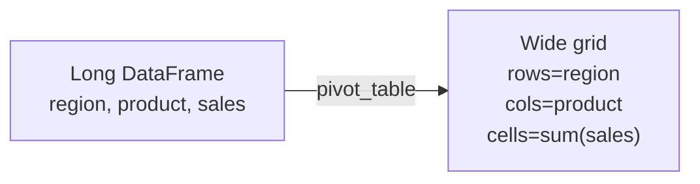

If you've ever made a pivot table in Excel — drag region to
rows, product to columns, sum of sales to values — Pandas's
`pivot_table` is the exact same idea, expressed in code.

## The shape of a pivot

You're saying: "I want a grid. The rows come from this column,
the columns come from that one, and the cells aggregate this
third one."

## A first pivot

<CodeBlock
  adapter="python"
  initialCode={`import pandas as pd

sales = pd.DataFrame({
    "region":  ["N","N","S","S","E","W","W","N"],
    "product": ["A","B","A","B","A","A","B","B"],
    "amount":  [10, 20, 30, 25, 15, 18, 22, 40],
})

p = sales.pivot_table(
    index="region",
    columns="product",
    values="amount",
    aggfunc="sum",
)
print(p)
`}
/>

Each cell is "sum of `amount` where `region` AND `product`
match that row/column".

## Pivot vs pivot_table

| Feature | `pivot` | `pivot_table` |
| --- | --- | --- |
| Duplicate (index, columns) allowed | ❌ no | ✅ yes |
| Aggregation function | n/a | yes (`sum`, `mean`, ...) |
| Multiple aggregations | n/a | yes (list of funcs) |
| Margins (row/column totals) | n/a | `margins=True` |
| Handling NaN cells | n/a | `fill_value=` |

In practice, `pivot_table` is almost always the right choice
because it gracefully handles duplicates.

## Multiple aggregation functions

<CodeBlock
  adapter="python"
  initialCode={`import pandas as pd

sales = pd.DataFrame({
    "region":  ["N","N","S","S","E","W","W","N"],
    "product": ["A","B","A","B","A","A","B","B"],
    "amount":  [10, 20, 30, 25, 15, 18, 22, 40],
})

p = sales.pivot_table(
    index="region",
    columns="product",
    values="amount",
    aggfunc=["sum","mean","count"],
)
print(p)
`}
/>

The result has a MultiIndex on the columns. Beautiful for
reporting; sometimes annoying for further computation (you may
want to flatten).

## Margins — row and column totals

<CodeBlock
  adapter="python"
  initialCode={`import pandas as pd

sales = pd.DataFrame({
    "region":  ["N","N","S","S","E","W","W","N"],
    "product": ["A","B","A","B","A","A","B","B"],
    "amount":  [10, 20, 30, 25, 15, 18, 22, 40],
})

p = sales.pivot_table(
    index="region",
    columns="product",
    values="amount",
    aggfunc="sum",
    margins=True,
    margins_name="Total",
    fill_value=0,
)
print(p)
`}
/>

This produces a row and column called `Total` containing the
overall sums — exactly like an Excel pivot's grand totals.

## Multiple index or column levels

<CodeBlock
  adapter="python"
  initialCode={`import pandas as pd

orders = pd.DataFrame({
    "year":    [2023,2023,2024,2024,2023,2024],
    "region":  ["N","S","N","S","N","S"],
    "product": ["A","B","A","A","B","B"],
    "amount":  [100,200,150,180,90,210],
})

p = orders.pivot_table(
    index=["year","region"],
    columns="product",
    values="amount",
    aggfunc="sum",
    fill_value=0,
)
print(p)
`}
/>

Hierarchical indexes are powerful for grouping (`year` is the
outer level, `region` is the inner). You can later slice with
`.loc[(2024, "S")]` or do per-level computations.

## Flattening for downstream use

When you need a "flat" DataFrame for export:

<CodeBlock
  adapter="python"
  initialCode={`import pandas as pd

sales = pd.DataFrame({
    "region":  ["N","N","S","S"],
    "product": ["A","B","A","B"],
    "amount":  [10, 20, 30, 25],
})

p = sales.pivot_table(index="region", columns="product", values="amount", aggfunc="sum")
print("Pivoted:")
print(p)
print()

flat = p.reset_index()
flat.columns.name = None   # remove the column-axis name
print("Flat:")
print(flat)
`}
/>

This is the right shape if you want to write the result back to
CSV with no weird header rows.

## Pivot table as a quick summary

<CodeBlock
  adapter="python"
  initCode={`import pandas as pd

df = pd.read_csv("https://raw.githubusercontent.com/bdi475/datasets/main/HR-dataset-v14.csv")
`}
  initialCode={`# Average monthly hours by department × salary bracket
summary = df.pivot_table(
    index="Department",
    columns="salary",
    values="average_montly_hours",
    aggfunc="mean",
).round(1)

print(summary)
`}
/>

A single call replaces a multi-step `groupby + unstack`.

## Mini challenge

<ChallengeCard
  adapter="python"
  title="Build a regional product report"
  instructions={`Given the DataFrame \`sales\` (provided), build a DataFrame \`report\` where:

- Rows are \`region\` (alphabetical)
- Columns are \`product\` (alphabetical)
- Cells are the **mean** of \`amount\`
- Missing (region, product) combinations should be 0, not NaN
- There must be a "Total" row and a "Total" column at the end containing the means across the whole region/product respectively`}
  initCode={`import pandas as pd

sales = pd.DataFrame({
    "region":  ["N","N","S","E","E","W","W","N"],
    "product": ["A","B","A","B","A","A","B","B"],
    "amount":  [10, 20, 30, 25, 15, 18, 22, 40],
})`}
  initialCode={`report = None   # TODO

print(report)
`}
  solutionCode={`import pandas as pd

report = sales.pivot_table(
    index="region",
    columns="product",
    values="amount",
    aggfunc="mean",
    margins=True,
    margins_name="Total",
    fill_value=0,
)

print(report)
`}
  tests={[
    {
      id: "type",
      name: "report is a DataFrame",
      description: "Type check",
      code: `import pandas as pd
assert isinstance(report, pd.DataFrame)`,
    },
    {
      id: "has_total_row",
      name: "Has a Total row",
      description: "margins row present",
      code: `assert "Total" in report.index`,
    },
    {
      id: "has_total_col",
      name: "Has a Total column",
      description: "margins column present",
      code: `assert "Total" in report.columns`,
    },
    {
      id: "no_nan",
      name: "No NaN cells",
      description: "fill_value applied",
      code: `assert report.isna().sum().sum() == 0`,
    },
    {
      id: "regions_present",
      name: "All four regions appear as rows",
      description: "N, S, E, W plus Total",
      code: `for r in ["N","S","E","W","Total"]:
    assert r in report.index`,
    },
  ]}
/>

## Check your understanding

<MultipleChoice
  markdown={`What is the key advantage of \`pivot_table\` over plain \`pivot\`?

- It is newer
- [o] It accepts an aggregation function, so it works even when \`(index, columns)\` combinations have duplicate rows
  > Right. \`pivot\` errors on duplicates; \`pivot_table\` aggregates them.
- It is faster
- It supports CSV

That's why \`pivot_table\` is the workhorse in practice.`}
/>

<MultipleChoice
  markdown={`What does \`margins=True\` add to a pivot table?

- Padding around the result
- Borders
- [o] A "Total" row and column that contain the aggregation applied to the entire row/column slice (typically grand totals)
  > Yes. Just like the totals row in an Excel pivot.
- Markdown formatting

Margins are a small but valuable feature when producing reports.`}
/>

<MultipleChoice
  markdown={`After pivoting, you want to write the result to CSV without weird "product" header rows. What's the right cleanup?

- Convert to JSON instead
- Delete the index manually
- [o] Call \`.reset_index()\` (and optionally clear \`columns.name\`) to flatten the pivot back into a regular DataFrame
  > CSV exports work best on flat, name-free DataFrames.
- Use \`pivot\` instead of \`pivot_table\`

Pivots are great for presentation but often need flattening before export or further joins.`}
/>
