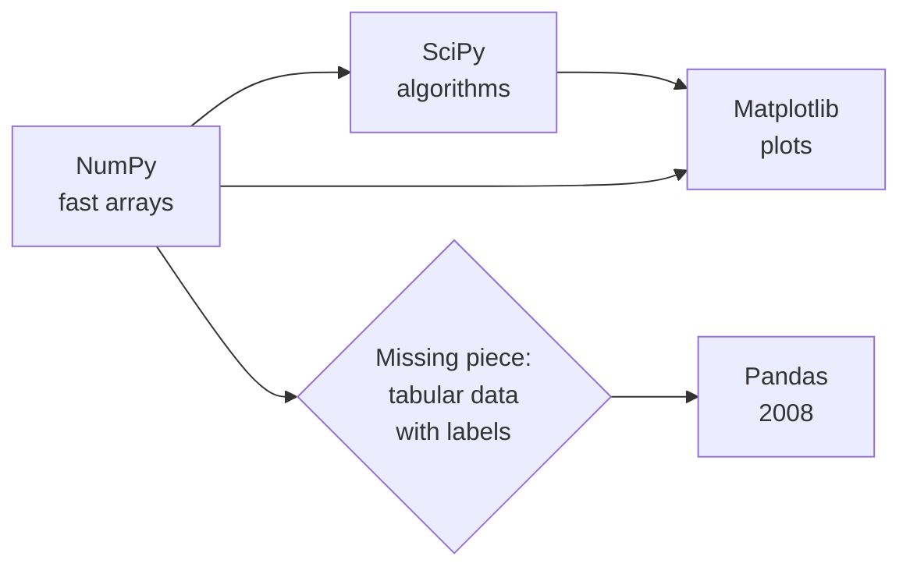
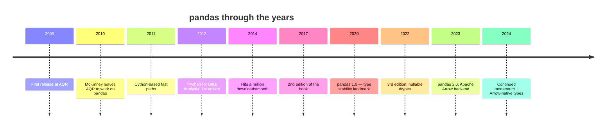

This chapter is about one person, one library, and one
unintended consequence — the way an engineer at a hedge fund
quietly reshaped how the world does data analysis.

<svg
  viewBox="0 0 640 210"
  role="img"
  aria-label="One small yellow dot sends out widening translucent ripples that reach scattered dots and a tiny data grid far away — one engineer's side project spreading across the data world"
  style={{ display: "block", width: "100%", maxWidth: "640px", height: "auto", margin: "2.5rem auto" }}
>
  <g style={{ color: "var(--ds-blue-500)" }} fill="currentColor">
    <circle cx="200" cy="105" r="95" fillOpacity="0.07" />
    <circle cx="200" cy="105" r="60" fillOpacity="0.12" />
    <circle cx="200" cy="105" r="30" fillOpacity="0.18" />
  </g>
  <g style={{ color: "var(--ds-yellow-500)" }} fill="currentColor">
    <circle cx="200" cy="105" r="10" />
  </g>
  <g style={{ color: "var(--ds-blue-500)" }} fill="currentColor">
    <circle cx="320" cy="70" r="5" fillOpacity="0.6" />
    <circle cx="345" cy="140" r="6" fillOpacity="0.7" />
    <circle cx="395" cy="92" r="7" fillOpacity="0.8" />
    <circle cx="448" cy="150" r="8" fillOpacity="0.9" />
  </g>
  <g style={{ color: "var(--ds-green-500)" }} fill="currentColor">
    <circle cx="470" cy="62" r="8" />
    <circle cx="540" cy="130" r="9" />
  </g>
  <g style={{ color: "var(--ds-blue-500)" }} fill="currentColor">
    <rect x="540" y="52" width="20" height="14" rx="3" />
    <rect x="564" y="52" width="20" height="14" rx="3" fillOpacity="0.55" />
    <rect x="540" y="70" width="20" height="14" rx="3" fillOpacity="0.55" />
    <rect x="564" y="70" width="20" height="14" rx="3" />
  </g>
</svg>

## Why Python?

Python was not invented for data analysis. Guido van Rossum
released it in 1991 as a *general-purpose, readable, scripting*
language. For its first fifteen years, scientific Python was a
small subculture: numerical hobbyists, astronomers, a few
financial quants, and academic researchers who liked Python's
syntax better than C++ or FORTRAN.

What Python *did* have, even early on, was an ethos of **glue**.
Python's C API made it easy to wrap a fast library and call it
from a friendly REPL. Three projects took that ethos and ran:

- **Numeric** (1995), later **NumPy** (2005), gave Python a fast
  N-dimensional array.
- **Matplotlib** (2003) gave Python publication-quality
  plotting.
- **SciPy** (2001) bundled algorithms — optimization,
  integration, statistics, signal processing.

By 2007 you could *technically* do data analysis in Python. You
just had to do it the way scientists did — as arrays of numbers
plus a notebook of side scripts to track which columns meant
what. Spreadsheets had labels. Python did not.

That missing piece — a Python library that handled **labeled
tabular data** the way R's `data.frame` did — is what Wes
McKinney would soon build.

## Wes McKinney's frustration

In 2007, Wes McKinney was a researcher at **AQR Capital
Management**, a quantitative hedge fund in Greenwich,
Connecticut. His job involved analyzing financial time series:
prices, returns, fundamentals, correlations. The tools at his
disposal were:

- **Excel** — fine for small examples, completely inadequate for
  daily research.
- **MATLAB** — fast for numeric work, expensive licenses, weak
  for messy tabular data.
- **R** — excellent for statistics, but at the time slow at
  large data and awkward to integrate with the rest of the
  firm's Python infrastructure.
- **Python + NumPy** — fast and flexible, but with no concept of
  a labeled column. Joining two tables on a date index meant
  writing the join logic by hand. Handling a stock that did not
  trade on a holiday meant manually padding NaNs. Computing
  rolling averages with a moving window meant a custom loop.

McKinney wanted *one library* that combined Python's general-
purpose programming power with R's friendly data semantics and
that was fast enough for financial research. None existed. So he
wrote one — initially called `pandas` after **"panel data,"** an
econometrics term for multi-dimensional structured datasets.

<Callout type="info" title="Where the name comes from">
The name "pandas" is a contraction of "panel data" — not the
bear. Wes was working with cross-sections of time series ("panel
data" in econometrics), and the library was originally built to
handle that exact shape. The cute animal coincidence helped the
name stick.
</Callout>

## The 2008 release

McKinney open-sourced pandas in 2008 under the BSD license. The
original feature set was small but pointed:

- **Series** — a one-dimensional labeled array.
- **DataFrame** — a two-dimensional labeled table (rows ×
  columns).
- **Index** — a first-class object representing the labels of an
  axis (often timestamps, in McKinney's use case).
- **Alignment** — when you add two Series with overlapping but
  different indexes, pandas lines them up by label
  automatically.
- **Missing-value handling** — `NaN` is a first-class citizen,
  not an exception you have to remember to check.
- **GroupBy** — split, apply, combine: the fundamental tabular
  operation, exposed as a fluent API.

McKinney left AQR in 2010 and spent the next two years working
on pandas almost full-time, eventually writing the book *Python
for Data Analysis* (2012) that introduced an entire generation of
analysts to the library.

## Why pandas won

Within a few years, pandas was the dominant tabular-data library
in Python. A few reasons:

1. **It met people where they were.** Excel users could think
   in rows and columns; pandas let them keep thinking that way.
   R users could think in `data.frame`; pandas mapped almost
   one-to-one.
2. **It was *fast enough*.** Built on NumPy, with Cython hot
   paths, it handled millions of rows comfortably on the laptops
   of the day.
3. **It fit the ecosystem.** A pandas DataFrame plugged
   seamlessly into NumPy, SciPy, Matplotlib, scikit-learn,
   statsmodels, and (later) every deep-learning framework.
4. **It came with a book.** McKinney's *Python for Data
   Analysis* is the rare "official" book that is actually a
   pleasure to read.
5. **It encouraged a notebook-first workflow.** Jupyter +
   pandas + matplotlib was the workflow you saw in every data
   science blog post by 2014.

<Callout type="info" title="The vocabulary pandas inherited">
- *DataFrame* — borrowed from R.
- *Series* — original (loosely inspired by R's named vectors).
- *index* — borrowed from databases.
- *groupby* / *split-apply-combine* — borrowed from a 2011 paper
  by Hadley Wickham about R's plyr package.
- *merge* / *join* — borrowed wholesale from SQL.

This is one of pandas's quiet strengths: it borrows freely from
the best parts of every adjacent tradition.
</Callout>

## What pandas is *not*

It is worth saying clearly:

- Pandas is **not** a database. It is an in-memory library.
- Pandas is **not** distributed. For data that does not fit on
  one machine, you reach for Spark, Dask, Polars, or DuckDB.
- Pandas is **not** a statistical package. It can compute
  descriptive statistics, but inferential statistics (p-values,
  confidence intervals, regression diagnostics) usually involve
  statsmodels or scipy.stats.
- Pandas is **not** a visualization library. It has thin
  built-in plotting that wraps Matplotlib, but for serious
  visualization you reach for Matplotlib, Seaborn, or Plotly.

It is, however, the **glue** that connects all of those things.
A typical analysis pulls data from a database, manipulates it
with pandas, fits a model with scikit-learn, and visualizes the
result with Plotly. Pandas is in the middle.

## A modern hello

Let us write our first piece of "real" pandas code, in the style
McKinney's book would teach. The dataset is the same HR file you
saw earlier.

<CodeBlock
  adapter="python"
  files={[
    {
      filename: "main.py",
      starterCode: `import pandas as pd

df = pd.read_csv(
    "https://raw.githubusercontent.com/bdi475/datasets/main/HR-dataset-v14.csv"
)

# The four most common first things you do with a new DataFrame:
print(">>> df.shape")
print(df.shape)
print()

print(">>> df.head(3)")
print(df.head(3))
print()

print(">>> df.dtypes")
print(df.dtypes)
print()

print(">>> df.describe(include='all').T.head(8)")
print(df.describe(include="all").T.head(8))
`,
    },
  ]}
/>

You already used three or four pandas idioms in that snippet:
the `.shape` attribute, `.head()` for a peek at the data,
`.dtypes` to see what types each column was inferred as, and
`.describe()` for a quick statistical summary. These four moves
will become muscle memory by the third week of using pandas.

## A small thought experiment

Imagine you are McKinney in 2007. You have:

- Daily stock returns for 5,000 tickers over 30 years.
- The earnings announcements for those companies.
- The macro indicators (interest rates, GDP, unemployment) for
  the same period.

You want to ask: *how does a stock's return on the day after an
earnings beat correlate with the level of interest rates that
month?*

In MATLAB or NumPy alone, you would write maybe 200 lines of
indexing logic to align the three time series, handle holidays,
join on dates, group by month, compute correlations. In pandas
(once it exists) it is about 15 lines. *That* is the productivity
delta that drove pandas's adoption.

## Wes today

McKinney has continued to influence the data ecosystem far
beyond pandas. He co-founded **Apache Arrow** (a cross-language
in-memory columnar format that is now the backbone of many
analytical systems, including newer versions of pandas
themselves), and he founded **Voltron Data** to push that vision
further. The most modern versions of pandas (2.x) can use Arrow
as their storage backend, closing a loop that started in 2008.

The community around pandas is large, active, and welcoming.
Bug reports turn into pull requests; pull requests turn into
releases; the library that started as one person's frustration is
now used by millions every day.

## Check your understanding

<MultipleChoice
  markdown={`Where does the name "pandas" come from?

- The animal, because the logo is cute
  > The panda animal branding is a coincidence, not the origin; the name comes from the econometrics term "panel data."
- A clever acronym
  > "Pandas" is not an acronym; it is a contraction of "panel data," the type of financial time-series data McKinney was working with.
- [o] "Panel data" — an econometrics term for multi-dimensional structured datasets, which is what McKinney was working with at AQR
  > Pandas was originally designed for panel data in finance; the bear-themed branding came later as a happy coincidence.
- "Python and dataframes"
  > The chapter explicitly states the name derives from "panel data"; "Python and dataframes" is a plausible-sounding but incorrect backronym.

Knowing the origin helps explain why pandas takes labeled multi-dimensional data so seriously.`}
/>

<MultipleChoice
  markdown={`What problem in McKinney's day-to-day work motivated him to start pandas?

- He needed a new project for his MBA
  > The chapter makes no mention of an MBA; McKinney built pandas out of day-to-day frustration at AQR Capital Management, not as an academic exercise.
- He wanted to compete with Microsoft Excel
  > Competing with Excel was not McKinney's stated motivation; he needed a tool that combined R-like data semantics with Python's speed and general-purpose programming.
- [o] None of his available tools — Excel, MATLAB, R, plain Python + NumPy — combined fast tabular operations, label-aware alignment, and Python's general-purpose programming in one place
  > Each existing tool covered some of those needs, but no single tool covered all of them. Pandas was built to fill the intersection.
- He wanted to learn a new programming language
  > McKinney was already proficient in Python; his motivation was to solve a practical data analysis problem, not to acquire new language skills.

The tool you reach for shapes the questions you can comfortably ask. McKinney wanted to remove that friction for himself and ended up doing it for everyone.`}
/>

<MultipleChoice
  markdown={`Which of these is **not** something pandas is designed to be?

- A library for labeled tabular data
  > Pandas is explicitly designed to be a library for labeled tabular data — this is one of its core purposes, not something it is not.
- A bridge into the broader scientific Python ecosystem
  > The chapter describes pandas as the glue that connects NumPy, scikit-learn, Matplotlib, and other libraries — being a bridge into the ecosystem is one of its stated strengths.
- [o] A distributed system that scales transparently across many machines
  > Pandas runs in one process, on one machine, in memory. Scaling to many machines is what tools like Spark, Dask, and DuckDB are for.
- A friendly home for the split-apply-combine pattern
  > The chapter explicitly credits Hadley Wickham's split-apply-combine paper as an influence on pandas's groupby API — this is one of the things pandas is designed to support.

Knowing pandas's *scope* — what it does and does not try to do — keeps you from misusing it.`}
/>
