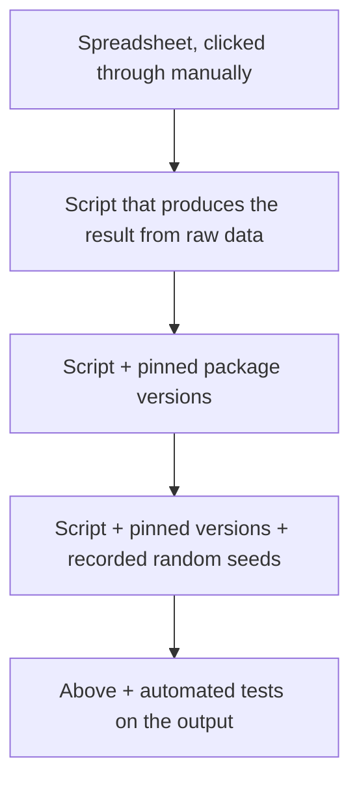

A "one-off" spreadsheet analysis becomes a "rerun-this-every-
month" report faster than anyone expects. Reproducibility is
the discipline of making sure that future-you (or future-them)
can re-run your work and get the same result.

## The reproducibility ladder



Most teams hover around L1–L2. The higher you go, the easier
it is to trust — and reuse — the analysis later.

## Why this matters

- **Time:** running the analysis again takes one command, not
  one afternoon.
- **Auditability:** if a stakeholder challenges a number, you
  can trace exactly how it was produced.
- **Onboarding:** a new teammate can rerun your work without a
  one-on-one walkthrough.
- **Mistakes:** when a bug is found, every dependent number
  can be regenerated automatically.

## The core habits

### 1. Never modify the raw data

Treat the raw file as immutable. Every cleaning step should be
code, not manual edits.

```text
data/
  raw/         ← never edited
  interim/     ← intermediate steps
  processed/   ← final, analysis-ready
```

If your boss asks for the "original" file, you should always
be able to point to `data/raw/`.

### 2. Top-of-notebook imports

```python
import pandas as pd
import numpy as np
import plotly.express as px

pd.options.display.max_columns = 50
```

Future readers (including you) should be able to scan the
imports and know what they're getting into.

### 3. Set random seeds

<CodeBlock
  adapter="python"
  initialCode={`import numpy as np
import pandas as pd

rng = np.random.RandomState(42)
sample = pd.Series(rng.randn(5))

print(sample)
`}
/>

Any operation involving randomness — train/test splits,
samples, model initializations — should set a seed. Otherwise
your "reproducible" notebook gives slightly different numbers
each run.

### 4. Restart and run-all, regularly

A notebook that works because you ran the cells out of order is
*not* reproducible. Periodically: kernel → restart → run all.
If it doesn't produce the same result from a blank state,
something is wrong.

### 5. Pin your environments

A `requirements.txt` (or `environment.yml`) freezes package
versions:

```text
pandas==2.2.2
numpy==1.26.4
plotly==5.21.0
```

A year from now, Pandas may have removed or renamed something
your notebook depends on. Pinning protects you.

### 6. Parameterize, don't hard-code

```python
# Bad
df = df[df["year"] == 2024]

# Better
ANALYSIS_YEAR = 2024
df = df[df["year"] == ANALYSIS_YEAR]
```

Or, for more elaborate setups, load parameters from a config
file or environment variables.

### 7. Separate steps clearly

A typical analysis notebook reads like a recipe:


Each section should produce a clearly named intermediate
variable so you can pick up at any step.

### 8. Sanity-check the output

```python
assert orders["amount"].min() >= 0, "Negative amounts shouldn't exist"
assert len(orders) > 0, "Empty result — check filters"
```

`assert` statements throughout a pipeline catch regressions
before they propagate to charts and reports.

## Notebook vs script

| Notebooks (.ipynb) | Scripts (.py) |
| --- | --- |
| Great for exploration | Great for production |
| Mix code + narrative + output | Pure code |
| Hard to diff in git | Easy to diff |
| Risk of out-of-order state | Linear execution |
| Best for one-off analyses | Best for repeated jobs |

Many teams use notebooks for exploration and *promote* the
final logic into a script as the analysis stabilizes.

## A reproducibility checklist

Before you call an analysis "done", check:

- [ ] Raw data is unchanged on disk.
- [ ] All steps are in code (no manual Excel edits).
- [ ] Notebook runs top-to-bottom from a fresh kernel.
- [ ] Random seeds are set.
- [ ] Package versions are recorded.
- [ ] Key outputs (DataFrames, charts) are exported with date-
      stamped filenames.
- [ ] Inputs and parameters are clearly listed at the top.
- [ ] At least one sanity-check assertion exists per step.

## Automation as the next step

Reproducible code is the precondition for *automation*. Once
your analysis can be re-run with one command, you can:

- Schedule it weekly with a cron job.
- Run it on a fresh dataset uploaded by a colleague.
- Hand it off to an engineering team to productionize.

Without reproducibility, automation is impossible.

## Check your understanding

<MultipleChoice
  markdown={`The single most important habit for reproducible analyses is:

- Using emoji in chart titles
- Writing many comments
- [o] Treating the raw data as immutable and capturing every transformation in code that can be re-run from scratch
  > Right. If raw data is untouched and all steps are in code, the analysis can always be regenerated.
- Saving to xlsx instead of csv

Immutability of inputs is the bedrock.`}
/>

<MultipleChoice
  markdown={`Why is "restart kernel and run all" a useful regular practice?

- It saves memory
- It triggers garbage collection
- [o] It guarantees the notebook actually produces its results from a clean state — otherwise hidden side effects from out-of-order cells can give false confidence
  > Right. The only test that matters is whether the notebook works from scratch.
- It speeds up Pandas

Restart-and-run-all is the cheapest reproducibility test you can run.`}
/>

<MultipleChoice
  markdown={`You're tweaking an analysis that uses random sampling. Each run gives slightly different numbers. What's the fix?

- Increase the sample size
- Decrease the sample size
- [o] Set a random seed (e.g. \`np.random.RandomState(42)\`) so the "random" choices are deterministic across runs
  > Right. Set a seed and the same input always gives the same output — even when randomness is involved.
- Disable random sampling

Seeded randomness is one of the simplest reproducibility wins.`}
/>

<MultipleChoice
  markdown={`Why pin package versions in a \`requirements.txt\`?

- Smaller install
- Required by Python
- [o] Pandas (and other libraries) evolve — methods get renamed or removed. Pinning protects your notebook from breaking when versions change.
  > Right. Pinning trades fresh-features for *stability*. For analyses, stability usually wins.
- Faster execution

Pinning is the difference between "works today" and "works in two years".`}
/>
