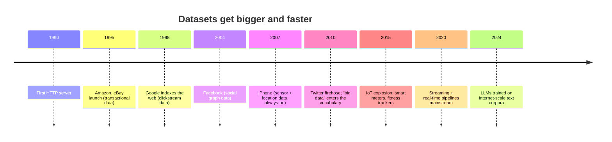
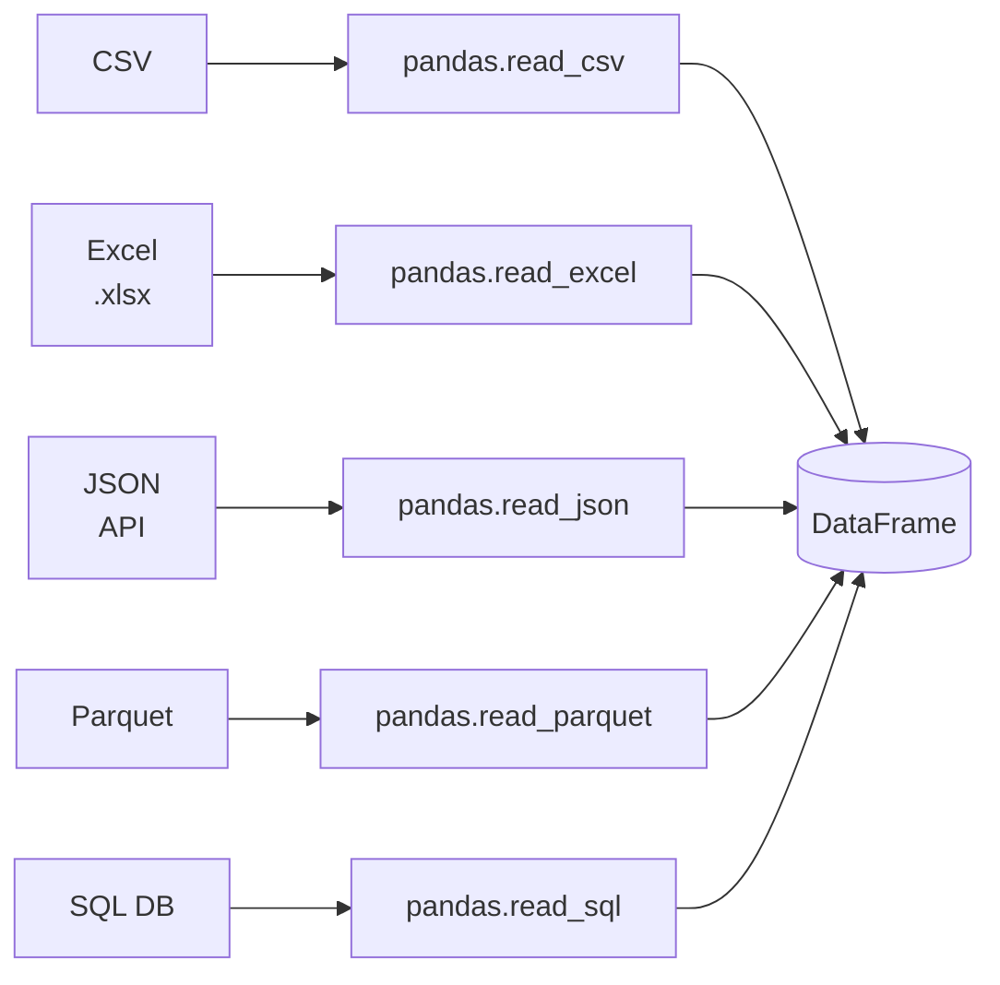

The 1980s spreadsheet was designed for the world it was born
into: small, slow, expensive computers, holding small datasets,
typed in by hand. Within twenty years, every one of those
assumptions had been quietly demolished.

## The internet became a data firehose

In 1990 the world had about 300,000 internet hosts. In 2000 it had
100 million. In 2020 it had over 4 *billion* users producing
content — clicks, posts, searches, purchases, GPS pings — every
second. Every one of those interactions is a row in some
dataset somewhere.

Three forces drove this growth:

1. **Cheap storage.** A megabyte of disk cost $200,000 in 1980
   and about $0.00001 in 2020. That is a *ten-billion-fold* drop.
   Suddenly there was no reason to throw data away.
2. **Cheap sensors.** A smartphone has a GPS, an accelerometer, a
   gyroscope, a magnetometer, two cameras, a microphone, and a
   barometer — all producing data constantly.
3. **Cheap collection.** A line of JavaScript on a webpage can
   send a click event back to a server in microseconds. You do
   not have to ask the user, fill in a form, or wait for a
   keypress.

## What "big" actually means

Before going further, let us be honest about scale. When people
say "big data," they usually mean one of three different things:

- **Bigger than a spreadsheet.** Hundreds of thousands to tens of
  millions of rows. Comfortable for Pandas on a laptop.
- **Bigger than memory.** Tens of millions to billions of rows.
  Requires chunking, on-disk formats (Parquet), or out-of-core
  tools (Dask, Polars, DuckDB).
- **Bigger than one machine.** Petabytes and up. Requires
  distributed systems (Spark, BigQuery, Snowflake).

This course lives almost entirely in the first zone, with a few
visits to the second. The third zone is a different (and much
more expensive) world. **The good news**: the *concepts* you
learn in the first zone — DataFrames, group-bys, joins, missing
data, reshape — carry over directly to all three.

<Callout type="info" title="Most analyst work is small data">
A common misconception is that all modern data work is "big data."
In practice, the great majority of business analysis fits
comfortably on a laptop with Pandas. Even at large tech companies,
most ad-hoc analyses operate on filtered, aggregated extracts that
are small enough to load in memory. Big-data tools are usually
used to *produce* the small dataset that the analyst actually
explores.
</Callout>

## Where digital datasets live

When you start analyzing real data, you will encounter it in many
shapes. Five of the most common:

- **CSV (comma-separated values).** A plain text file with one row
  per line and columns separated by commas. Easy to read, easy to
  write, the universal currency of small data. We will use these
  a lot.
- **Excel files (`.xlsx`).** Spreadsheets, with all their power
  (multiple sheets, formulas, formatting) and all their pain
  (Excel's auto-conversions, hidden cells).
- **JSON.** Hierarchical, nested data — common in web APIs.
  Often has to be *flattened* into a tabular shape before
  analysis.
- **Parquet.** A columnar binary format optimized for analytical
  queries. Faster and smaller than CSV but not human-readable.
- **SQL databases.** Tables that live on a server. Pandas can
  query them and pull results into DataFrames.

Pandas's superpower is that, once data is inside a DataFrame, the
**rest of your analysis does not care where it came from**. You
might pull from five different sources and join them together in
one notebook without changing your downstream code.

## What digital datasets are usually *not*

Real-world digital datasets are messy. As we go through the
course you will see all of these, but it helps to have the
vocabulary up front:

- **Incomplete.** Survey questions get skipped, sensors drop
  packets, users abandon forms. *Missing values* are
  everywhere.
- **Inconsistent.** "USA", "U.S.A.", "United States", and
  "Murica" might all mean the same country.
- **Duplicated.** The same event recorded by two pipelines, or a
  user double-clicking a button.
- **Mislabeled.** Columns named `id_1`, `id_2`, `temp`, `x`,
  `value`. What do they mean? Hope there is documentation.
- **Wrongly typed.** A "ZIP code" column where Excel helpfully
  stripped the leading zero from `04210`.
- **Biased.** The data is only of people who *answered* the
  survey, only of users who *clicked* the button, only of
  patients who *visited* the clinic.

Most of an analyst's day is spent dealing with the items on this
list, not running the eventual `mean()` at the end. We will
devote multiple chapters to this work.

## A first encounter with a real dataset

Let us actually load a real digital dataset — a public HR file
with employee attributes from a fictional company — and look at
its shape.

<CodeBlock
  adapter="python"
  initialCode={`import pandas as pd

# Load directly from GitHub — Pandas can read URLs as easily as files
df = pd.read_csv(
    "https://raw.githubusercontent.com/bdi475/datasets/main/HR-dataset-v14.csv"
)

print("Shape (rows, columns):", df.shape)
print("Columns:")
for col in df.columns:
    print(" -", col)
`}
/>

That is a tabular dataset of about 15,000 employees and around a
dozen columns. We have not analyzed anything yet — we just *loaded*
it. But notice what already changed compared to the spreadsheet
era:

- We never opened a file dialog.
- The data lives on the public internet and came to us over HTTP.
- The shape and column names are programmatically inspectable.
- The next person who reads our code can re-run these two lines
  and get *exactly the same dataset* back.

This is the workflow we will use through the rest of the course.

## Mid-page check

<MultipleChoice
  markdown={`Which of these is the **most accurate** definition of "big data" as discussed in this chapter?

- Any dataset larger than 1,000 rows
- [o] "Big data" is context-dependent — usually it means a dataset that does not fit on one machine's memory or disk, requiring distributed systems
  > Correct. The chapter gives three rough tiers — bigger than a spreadsheet, bigger than memory, bigger than one machine — and notes that the third tier is what most practitioners mean by "big data".
- Any dataset that contains numbers
- Any dataset that requires Pandas

Most analyst work, even at large companies, lives in the "fits on a laptop" tier and is well-served by Pandas.`}
/>

## Why this matters for your career

Almost every modern job that involves data — analyst, product
manager, scientist, engineer, marketer — assumes you can:

1. **Find** the data (databases, APIs, files, dashboards).
2. **Load** it into a tool you can manipulate.
3. **Clean** it.
4. **Slice and summarize** it.
5. **Visualize** the result.
6. **Write down** what you did so others can reproduce it.

Pandas is currently the dominant tool for steps 2–5 in the
Python world. Learning it well will let you move fluidly between
roles and industries because the *operations* are the same
whether the dataset is healthcare claims, ad impressions,
sensor readings, or sales orders.

## A short exercise

Pick a question — a real one — about the HR dataset above:

- *What is the average tenure?*
- *Which department has the most employees?*
- *How many employees left the company?*

Hold onto that question. By the end of the **Aggregation & GroupBy**
chapter, you will be able to answer it in one line.

## Check your understanding

<MultipleChoice
  markdown={`Why did digital datasets explode in size starting around the year 2000?

- Pandas was released and people had to fill it with data
- Excel was upgraded
- [o] A combination of cheaper storage, ubiquitous sensors (especially smartphones), and effortless web-based collection (clickstreams, APIs)
  > Yes — the chapter highlights cheap storage, cheap sensors, and cheap collection as the three forces behind the data explosion. Each one independently lowered the cost of *keeping* an extra row of data.
- Hard drives became more reliable

Pandas appeared *because* of this explosion, not the other way around.`}
/>

<MultipleChoice
  markdown={`What does Pandas do once data is loaded into a DataFrame, regardless of whether the source was a CSV, Excel file, JSON, Parquet, or SQL?

- It writes the data back to the source automatically
- [o] Downstream code can manipulate the DataFrame in the same way regardless of where it originally came from
  > Right. The "many readers, one DataFrame" pattern means your analysis code is decoupled from the data source. You can swap a CSV for a SQL query without changing the rest of your notebook.
- It compresses the data
- It encrypts the data

Decoupling the *source* of data from the *operations* you perform on it is one of Pandas's biggest practical wins.`}
/>

<MultipleChoice
  markdown={`A junior analyst says "we have big data — about 40,000 rows." How should you (gently) respond?

- They are correct
- [o] 40,000 rows fits comfortably in memory on any laptop; Pandas will handle it instantly, and "big data" is normally reserved for datasets that no longer fit in memory or on one machine
  > Exactly. Vocabulary matters. Calling small tabular data "big" causes teams to over-engineer with Spark, BigQuery, or distributed systems when Pandas alone would do the job in seconds.
- They are correct, but only on Tuesdays

Resist the temptation to use big-data tooling on small-data problems — it adds cost, latency, and operational pain without adding insight.`}
/>
