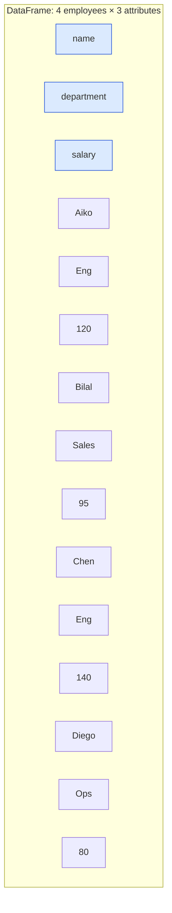
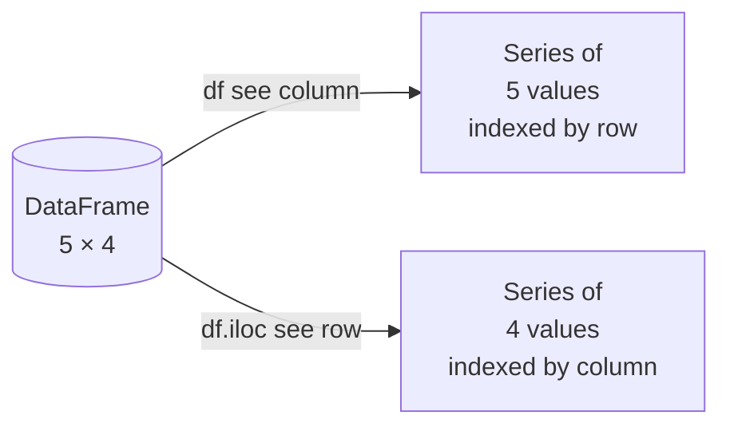

Almost every dataset you will analyze in your life eventually
takes the shape of a **rectangle of rows and columns**. This
sentence sounds trivial. It is not. Internalizing the
*meaning* of rows and columns is the single biggest
conceptual unlock for Pandas.

## The basic mental model

- A **row** is one "thing." One person, one transaction, one
  sensor reading, one survey response, one football play.
- A **column** is one "attribute" of those things. Age, price,
  temperature, satisfaction score, yards gained.
- The **cell** at row $r$, column $c$ is *that thing's value of
  that attribute*.



When you read a Pandas tutorial and see `df.shape == (1470, 35)`,
that means "1,470 things, each with 35 attributes." When you see
`df.groupby("department")`, it means "split the rows into groups
by their value in the *department* column, then do something with
each group."

That is essentially the whole course in two paragraphs.

## Why "rows are things"

It is tempting to think of a row as just *some numbers*. But
naming the thing each row represents (and naming it the same
across every dataset in a project) is the difference between
analyses that are easy to read and analyses that are mysterious.

In this course we will be very explicit about it:

| Dataset                | Each row is one… |
| ---------------------- | ---------------- |
| HR employees           | Employee         |
| Retail orders          | Order (or order line) |
| Weather observations   | Measurement at a location at a time |
| Public health records  | Patient visit    |
| Movies                 | Movie            |
| Survey responses       | Respondent       |
| Transportation logs    | Trip             |

Naming the row clearly is also the first sanity check on a
dataset. "Is each row really one customer?" Sometimes a CSV that
looks customer-shaped is actually *customer × month*, with one
row per customer per month. The shape of subsequent analysis
depends on getting this right.

<Callout type="info" title="The grain of the data">
The size of the "thing" a row represents is called the
**grain** of the dataset. *Customer-month* grain is finer than
*customer* grain. Most data bugs come from analysts not noticing
that two datasets they are joining are at different grains.
</Callout>

## Why "columns are attributes"

Columns share three properties that you will rely on constantly:

1. **A column has a name.** That name is the human-facing label
   for the attribute.
2. **A column has a type.** All its values are (in principle)
   the same kind of thing — integers, strings, dates.
3. **A column is the unit of most Pandas operations.** You
   filter rows *based on a column*. You group rows *by a
   column*. You sum, average, or count *a column*.

The Pandas operation `df["salary"].mean()` reads naturally as
"the mean of the salary column" because the column *is* the
operand.

## Putting it together

Let us make a small dataset by hand to feel the rows-and-columns
geometry.

<CodeBlock
  adapter="python"
  initialCode={`import pandas as pd

employees = pd.DataFrame({
    "name":       ["Aiko","Bilal","Chen","Diego","Eve"],
    "department": ["Eng","Sales","Eng","Ops","Eng"],
    "salary":     [120, 95, 140, 80, 128],
    "tenure_yrs": [3, 6, 7, 2, 4],
})

print("Shape:", employees.shape, "<-- (rows, columns)")
print()
print(employees)
print()
print("Columns:", employees.columns.tolist())
print("Each row represents: one employee")
`}
/>

Now look at how naturally the basic operations read:

<CodeBlock
  adapter="python"
  initCode={`import pandas as pd
employees = pd.DataFrame({
    "name":       ["Aiko","Bilal","Chen","Diego","Eve"],
    "department": ["Eng","Sales","Eng","Ops","Eng"],
    "salary":     [120, 95, 140, 80, 128],
    "tenure_yrs": [3, 6, 7, 2, 4],
})`}
  initialCode={`# Filter: rows where the department attribute equals "Eng"
eng = employees[employees["department"] == "Eng"]
print("Engineers:")
print(eng)
print()

# Aggregate: average of the salary column for those rows
print("Average engineer salary:", eng["salary"].mean())
`}
/>

Reading the code out loud as **"rows where ... average of ..."**
matches the English question almost word for word.

## The shape of "long" vs "wide"

The same logical information can be arranged in two very
different rectangle shapes. Consider monthly sales for three
products:

**Long form** (also called *tidy*):

```text
product  month  sales
Latte    Jan    1200
Latte    Feb    1100
Latte    Mar    1500
Mocha    Jan     800
Mocha    Feb     950
Mocha    Mar     900
Espresso Jan     400
Espresso Feb     450
Espresso Mar     500
```

**Wide form** (more spreadsheet-like):

```text
product   Jan   Feb   Mar
Latte    1200  1100  1500
Mocha     800   950   900
Espresso  400   450   500
```

Both contain the same information. But the row in long form is
*one (product, month) measurement*; in wide form it is *one
product, across many months*. The grain has changed. We will
spend a whole chapter (*Wide vs Long*) on when each shape is
better and how to convert between them.

<Callout type="info" title="Prefer long when manipulating, wide when displaying">
Pandas operations (groupby, filter, plot) are much easier on
long-form data because each row is a single observation. Humans,
however, often find wide form easier to *read*. A common workflow
is: keep your working copy long, pivot to wide only for display.
</Callout>

## Visualizing a Pandas slice

When you select a column, you get back a **Series** (a labeled
1-D array). When you select a row, you also get a Series, but
indexed by the column names. This duality — same underlying
type, different axis — is a recurring theme.



We will study Series and DataFrames in depth in the *DataFrames
and Series* chapter. For now, just know that they share a lot of
machinery.

## A small challenge

Try the challenge below to cement the rows-as-records,
columns-as-attributes idea.

<ChallengeCard
  adapter="python"
  title="Build a typed DataFrame by hand"
  instructions={`Construct a DataFrame called \`students\` with exactly 5 rows and 4 columns. Each row should represent one student. The columns should be:

- \`name\` — a string
- \`grade\` — an integer between 1 and 12
- \`gpa\` — a float between 0.0 and 4.0
- \`passed_math\` — a boolean

You can pick any names, grades, GPAs, and pass/fail values.`}
  initialCode={`import pandas as pd

students = None  # TODO: replace with a real DataFrame

print(students)
`}
  solutionCode={`import pandas as pd

students = pd.DataFrame({
    "name":        ["Ana", "Ben", "Cara", "Dan", "Eli"],
    "grade":       [9, 10, 11, 12, 9],
    "gpa":         [3.8, 3.4, 2.9, 3.6, 3.1],
    "passed_math": [True, True, False, True, True],
})

print(students)
`}
  tests={[
    {
      id: "is_dataframe",
      name: "`students` is a DataFrame",
      description: "Variable `students` should be a pandas DataFrame",
      code: `import pandas as pd
assert isinstance(students, pd.DataFrame), "students is not a DataFrame"`,
    },
    {
      id: "shape",
      name: "Has 5 rows and 4 columns",
      description: "Shape should be (5, 4)",
      code: `assert students.shape == (5, 4), f"Expected shape (5, 4), got {students.shape}"`,
    },
    {
      id: "columns",
      name: "Correct column names",
      description: "Columns must be exactly name, grade, gpa, passed_math",
      code: `expected = ["name", "grade", "gpa", "passed_math"]
assert list(students.columns) == expected, f"Got {list(students.columns)}, expected {expected}"`,
    },
    {
      id: "types",
      name: "Each column has the right type",
      description: "name=string, grade=int, gpa=float, passed_math=bool",
      code: `import pandas as pd
assert students["name"].dtype == object, "name should be string/object"
assert pd.api.types.is_integer_dtype(students["grade"]), "grade should be integer"
assert pd.api.types.is_float_dtype(students["gpa"]), "gpa should be float"
assert students["passed_math"].dtype == bool, "passed_math should be bool"`,
    },
    {
      id: "value_ranges",
      name: "Values are within sensible ranges",
      description: "grades 1-12, gpa 0-4",
      code: `assert students["grade"].between(1, 12).all(), "grade out of [1,12]"
assert students["gpa"].between(0, 4).all(), "gpa out of [0,4]"`,
    },
  ]}
/>

## Check your understanding

<MultipleChoice
  markdown={`In a DataFrame of retail orders where each row represents one order line, which of these is most appropriate as a column?

- The store address
- A pie chart of the orders
- [o] The quantity of items in that order line
  > Yes. Columns are *attributes of each row*. Quantity is a property of a single order line. Store address could also be a column, but only if it varies by row.
- A spreadsheet formula

A column is an attribute that applies to every row of the dataset.`}
/>

<MultipleChoice
  markdown={`What does the term *grain* mean in the context of a tabular dataset?

- The font used to display the data
- The total size of the dataset in bytes
- [o] The level of detail each row represents — for example "one row per customer" versus "one row per customer-month"
  > Grain is one of the most under-discussed concepts in data work; getting it wrong leads to double-counting in joins and aggregations.
- The color scheme of the table

Always state the grain of a dataset before joining or aggregating it.`}
/>

<MultipleChoice
  markdown={`Long form versus wide form: which one is generally easier for Pandas to filter, group, and plot?

- Wide
- They are equivalent
- [o] Long
  > Right. In long form, each row is a single observation, which makes group-by, filter, and plot operations straightforward. Wide form is often nicer for *humans* to read, but harder to manipulate programmatically.
- Neither

The standard workflow is "keep it long while working, pivot to wide for display."`}
/>
