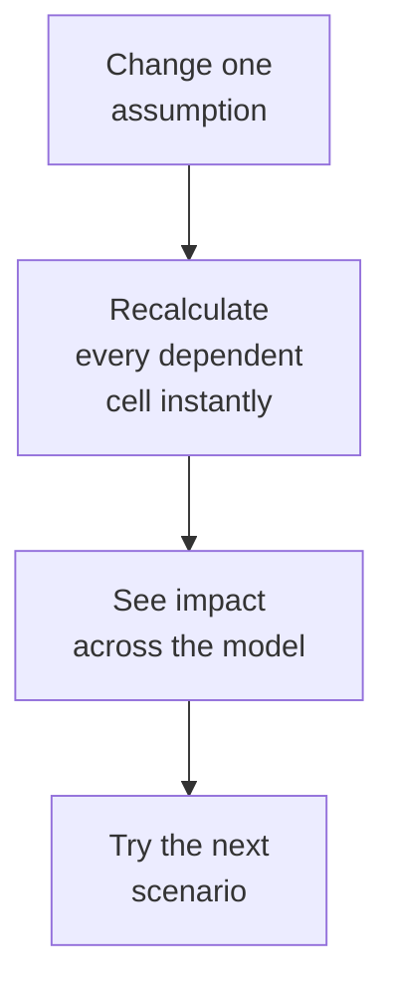

If clay tablets are the deep ancestor of the DataFrame, the
**spreadsheet** is its parent. To understand why Pandas exists, we
have to understand why spreadsheets *won* in the business world,
and why — three decades later — they started to feel small.

## The personal computer needed a reason to exist

In 1979, the personal computer was a curiosity. Hobbyists and
hackers loved the Apple II, but most companies could not articulate
why their accounting department needed one. The mainframe in the
basement did the books, and the typewriter on every desk did the
letters. Where did a "personal" computer fit?

The answer came from two MBA students, **Dan Bricklin** and **Bob
Frankston**. Bricklin was tired of recalculating financial
forecasts by hand every time a single assumption changed. He
imagined an "electronic blackboard" where each cell could hold a
number or a formula, and changing one cell would *automatically*
ripple through the rest. He and Frankston shipped that idea in
1979 as **VisiCalc**.

VisiCalc sold the Apple II by the truckload. Suddenly there was a
reason for a businessperson to spend $2,000 on a personal
computer: it could turn a week of financial modeling into ten
minutes.

## Lotus 1-2-3 and the rise of the analyst

In 1983, **Lotus 1-2-3** launched on the IBM PC. It was faster,
had better graphics, and bundled in charting and primitive
database features. By 1985 it was the best-selling software on
Earth and *the* tool of corporate finance.

A new job emerged: the **business analyst**. Their toolkit was
Lotus 1-2-3 macros, a printer, and a calculator. They produced
the budget forecasts, the sales reports, the headcount projections
that ran companies. The job description — *take raw numbers,
clean them up, summarize them, communicate them* — is almost
identical to today's data analyst.

## Excel inherits the throne

**Microsoft Excel** arrived on the Mac in 1985 and on Windows in
1987. By the mid-1990s it had displaced Lotus 1-2-3 and become
synonymous with the genre. The reasons Excel won are worth
listing because they are still the reasons spreadsheets dominate
business analysis today:

- **Direct manipulation.** Click a cell, type a number. There is
  no compilation step, no interpreter to learn.
- **Visible state.** Every value is on screen at all times. You
  can see what the data *is*, not just what it *was*.
- **Instant feedback.** Edit one cell, every dependent
  recalculates immediately.
- **Universal interchange.** `.xls` and later `.xlsx` became the
  default way that humans send each other data.
- **Charting in two clicks.** Select a range, pick a chart type,
  drop it next to the table.
- **A formula language anyone can read.** `=SUM(A1:A10)` is
  understandable without a programming background.

That last point matters more than the others. For decades, the
*only* programming language that ordinary office workers were
willing to learn was the spreadsheet formula language. Pandas
will eventually take you somewhere more powerful, but it has to
earn the trade-off.

<Callout type="info" title="Spreadsheets are programming">
A spreadsheet formula is a real program: it has inputs, outputs,
conditionals (`IF`), aggregations (`SUM`, `AVERAGE`), and even
function composition (`=IF(SUM(A1:A10)>100, "high", "low")`).
The spreadsheet itself is a *visual programming environment* with
the grid as both the data store and the user interface. Most
"non-technical" analysts have been programming for decades — they
just have not been calling it that.
</Callout>

## What spreadsheets are great at

Before we talk about where spreadsheets break down, give them
their due. There are problems for which a spreadsheet is, and
will always remain, the right tool:

- **Small, one-off calculations.** Mortgage payment, simple
  budget, expense reimbursement.
- **Visual modeling.** Pricing scenarios, planning grids, project
  schedules that someone needs to *see* and *touch*.
- **Collaboration with non-technical stakeholders.** Your CFO is
  not going to git-pull a Jupyter notebook.
- **Quick exploratory totals on a couple thousand rows.** Filter,
  sort, pivot, done.

Pandas is not in competition with spreadsheets here. It is in
competition with spreadsheets *outside* this zone — and that zone
is bigger than you might think.

## Where spreadsheets start to creak

Walk into any data team and you will hear a familiar list of
spreadsheet horror stories:

- **The 65,536-row wall.** The classic Excel `.xls` format
  capped sheets at exactly $2^{16}$ rows. Modern Excel raised it
  to ~1 million, but real-world datasets routinely exceed that.
- **Silent data corruption.** Excel famously interprets gene
  names like `SEPT2` and `MARCH1` as dates. A 2016 study found
  this error in 20% of published genetics papers. *Twenty
  percent.*
- **Untraceable copy-paste.** A formula in cell `K47` references
  cell `D12`, which was copy-pasted from a sheet that was
  emailed to you three weeks ago. Why is the number wrong? Good
  luck.
- **No version control.** What did this model look like last
  Friday? Hope someone saved a copy.
- **No reproducibility.** "Run the report" means *Steve opens
  the file, clicks through the macros, copy-pastes from the
  database, fixes any errors he notices, and emails the result.*
  When Steve is on vacation, the report does not get run.
- **No tests.** A subtle off-by-one in a `VLOOKUP` produced one
  of the largest trading losses in JPMorgan's history (the 2012
  "London Whale" affair).

A typical "analysis" flows through a chain of hand-edited sheets
before anyone makes a decision:

1. Raw data
2. Excel sheet 1 — manual cleanup
3. ⚠️ Excel sheet 2 — copy-pasted by Alice
4. ⚠️ Excel sheet 3 — VLOOKUPs into a CSV Steve emailed last week
5. Excel sheet 4 — charts for the board deck
6. Decision

The ⚠️ steps are the points where, in a real company, *nobody
remembers what was done or how*. The chain is **not
reproducible**. Six months later, when an auditor asks "show me
exactly how this number was computed," the honest answer is "we
cannot."

This is the gap Pandas — and the broader data-science toolchain —
was built to close.

## A small example: the same task in both worlds

Imagine a tiny dataset: ten employees, each with a department, a
salary, and a tenure. We want the average salary by department.

In a spreadsheet you would:

1. Sort or filter by department.
2. Highlight the salary cells for each department.
3. Type `=AVERAGE(...)` in a cell next to each group.
4. Copy the resulting numbers into a chart.

Now consider what happens when the data refreshes next month. You
do it all again. By hand. Hopefully without forgetting a row.

In Pandas:

<CodeBlock
  adapter="python"
  starterCode={`import pandas as pd

employees = pd.DataFrame(
    {
        "name": [
            "Aiko",
            "Bilal",
            "Chen",
            "Diego",
            "Eve",
            "Farah",
            "Gabe",
            "Hana",
            "Ivan",
            "Jin",
        ],
        "department": [
            "Eng",
            "Eng",
            "Sales",
            "Sales",
            "Eng",
            "Ops",
            "Ops",
            "Sales",
            "Eng",
            "Ops",
        ],
        "salary": [120, 135, 95, 110, 128, 80, 85, 105, 140, 90],
        "tenure_yrs": [3, 6, 2, 8, 4, 1, 5, 3, 7, 2],
    }
)

print("Average salary by department:")
print(employees.groupby("department")["salary"].mean().round(1))
`}
/>

One line of Pandas does what required a sort, a series of
selections, and a series of formulas in Excel. And — this is the
important part — **next month**, when the data refreshes, you do
not redo the work. You re-run the same line of code. It produces
the same answer for the same input every time. That is what
*reproducibility* means.

## What you should take away

- Spreadsheets are not bad. For the right problem, they are the
  right tool.
- The right problem is small, exploratory, and visual — a
  one-time question for one person.
- The wrong problem is large, recurring, multi-step, or
  audit-sensitive — and that is most real-world business work.
- Pandas does not replace Excel; it complements it. Analysts
  routinely use both — Pandas to compute, Excel (or a CSV export)
  to share.

The next chapter follows what happened when datasets started
growing in ways spreadsheets simply could not keep up with.

## Check your understanding

<MultipleChoice
  markdown={`What was VisiCalc's most important contribution to computing history?

- It was the first programming language for personal computers
- It introduced the relational database
- [o] It gave businesspeople a compelling reason to buy a personal computer, by turning "what-if" financial modeling from days into minutes
  > VisiCalc was the original "killer app" — it justified the existence of the personal computer for offices. The Apple II's commercial success was driven largely by VisiCalc demand.
- It invented the chart and graph

The chapter argues that the *concept* of automatic recalculation across a grid was VisiCalc's lasting contribution — every modern spreadsheet inherits it.`}
/>

<MultipleChoice
  markdown={`Which of the following is a **real, well-documented limitation of using spreadsheets for serious analysis**?

- Spreadsheets cannot perform addition
- Spreadsheets cannot display dates
- [o] Spreadsheet workflows are often non-reproducible — there is no record of which cells were edited, in what order, or why, making it impossible to re-run an analysis identically months later
  > The chapter highlights this as the central failure mode of spreadsheets in business contexts. Auditors, scientists, and analysts all need to be able to re-run a calculation and get the same number. Manual spreadsheet workflows make that very hard.
- Spreadsheets cannot produce charts

Reproducibility is the dominant reason organizations migrate analyses from Excel to code.`}
/>

<MultipleChoice
  markdown={`What is the "row limit" issue mentioned in this chapter, and why does it matter?

- Modern Excel allows infinite rows
- [o] Even modern Excel caps a sheet at around one million rows, which is small by today's data standards — real-world tables routinely exceed that
  > Modern \`.xlsx\` files cap at 1,048,576 rows (the classic \`.xls\` capped at 65,536). Web analytics, IoT, transaction logs, and many scientific datasets blow past this limit easily.
- The row limit is set by your operating system
- The row limit only applies to text columns

This is one of many points where Pandas (which is limited only by your computer's RAM) is more comfortable than Excel.`}
/>
