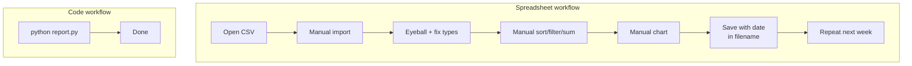
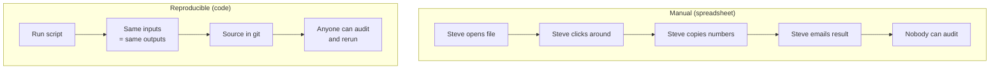

You have already heard the high-level argument: spreadsheets are
manual, code is reproducible. This chapter makes the comparison
concrete with side-by-side scenarios so you can feel, in your
bones, where each tool wins and where each one loses.

## Two tools, one job

Pretend you are an analyst at a coffee company. Every Monday
morning a CSV file lands in your inbox with last week's orders.
You need to produce:

- Total revenue.
- Top-selling product.
- Revenue by region.
- A chart for the weekly team meeting.

Let us do this both ways and compare the *feel*.

### The spreadsheet way

1. Open Excel. Double-click the CSV.
2. Excel asks how to import. Pick "general." Click through.
3. Click the column headers to confirm types. Notice that the
   `phone` column got auto-converted to scientific notation
   (`5.55E+11`). Sigh, fix.
4. Select the `revenue` column. Read the sum off the status bar.
   Copy it into a separate "Summary" sheet.
5. Sort the table by `product`, eyeball the top one. Type it
   into the summary sheet.
6. Sort by `region`. Use `=SUMIF(B:B, "West", D:D)` for each
   region. Copy values into summary sheet.
7. Highlight summary cells, *Insert > Chart*, pick bar.
8. Save as `weekly_report_2024_03_18.xlsx`. Email it.
9. **Next Monday: do it all again.**

### The code way

```python
import pandas as pd

df = pd.read_csv("orders.csv")

print("Total revenue:", df["revenue"].sum())
print("Top product:", df.groupby("product")["revenue"].sum().idxmax())
print(df.groupby("region")["revenue"].sum())
df.groupby("region")["revenue"].sum().plot.bar()
```

Save the file as `weekly_report.py`. **Next Monday: re-run.**



## What the comparison actually proves

The "code" version takes more upfront learning. There is no
pretending otherwise. But once the learning is paid for, every
repeated run is essentially free — and the script is itself a
**record of how the analysis was done**.

That is the central trade-off:

|                                  | Spreadsheet            | Code              |
| -------------------------------- | ---------------------- | ----------------- |
| First-time cost                  | Low                    | Higher            |
| Cost of next run                 | Same as first run      | Near zero         |
| Self-documenting                 | No (only final state)  | Yes (the source)  |
| Audit trail                      | Weak                   | Strong (with git) |
| Handles 5 million rows           | Painfully or not at all | Yes              |
| Easy to share visually           | Yes                    | Requires hosting  |
| Easy for non-coders to edit      | Yes                    | No                |

There is no winner in the abstract — only winners *for a given
problem*.

<Callout type="info" title="The 'recurring' test">
A useful heuristic: if you will do this analysis **more than
twice**, write it in code. If it is genuinely a one-off (a
meeting prep, a quick sanity check), reach for the spreadsheet.
You will not regret using code for recurring work, and you will
not regret using a spreadsheet for true one-offs.
</Callout>

## Five common spreadsheet pains, in Pandas

### 1. Accidental edits

In Excel, every interaction modifies the file. There is no
"diff" of what you changed; no `git log` of why. In Pandas, your
script is the file. Diffs are line-by-line. Reviewers can ask
"why did you switch from `mean` to `median` on line 42?"

### 2. Copy-paste from another sheet

In Excel, this is invisible after the fact. Was that column
copied from `Q4_sales.xlsx` or `Q4_sales_FINAL_v2.xlsx`? In
Pandas, the source filename or URL is right there in your
`pd.read_csv(...)` call.

### 3. The 65k-row wall and slowness

`.xls` capped at 65,536 rows. `.xlsx` raised it but became slow.
Pandas handles tens of millions of rows on a laptop, and
millions interactively.

### 4. Manually-tracked transformations

In a spreadsheet, "I filtered out test users, dropped Saturday,
and converted everything to USD" lives in someone's head. In
Pandas:

<CodeBlock
  adapter="python"
  initialCode={`import pandas as pd

orders = pd.DataFrame({
    "user_id":   [1,2,3,4,5,6,7,8],
    "is_test":   [False,True,False,False,True,False,False,False],
    "day":       ["Mon","Sat","Tue","Wed","Sun","Thu","Fri","Sat"],
    "amount":    [100, 50, 80, 120, 60, 90, 110, 70],
    "currency":  ["USD","EUR","USD","USD","GBP","USD","EUR","USD"],
})

# 1. Drop test users
clean = orders[~orders["is_test"]]

# 2. Drop weekends
clean = clean[~clean["day"].isin(["Sat", "Sun"])]

# 3. Convert all to USD using a simple rate table
rates = {"USD": 1.00, "EUR": 1.08, "GBP": 1.27}
clean = clean.assign(amount_usd=clean["amount"] * clean["currency"].map(rates))

print(clean)
`}
/>

Anyone reading this code knows *exactly* what you did. There is
no oral history.

### 5. "Refresh the report"

In Excel, a refresh means an analyst manually re-doing the
work, or building a fragile chain of `Power Query` /
`VBA` / `OFFSET` formulas that one person on the team understands.
In Pandas, refreshing is `python report.py` — or scheduling that
command to run automatically every morning.

## Where spreadsheets still win

It is important not to overstate the case. Pandas can be
overkill for:

- **Quick exploratory totals on a tiny file.** Excel is faster
  for "how much did I spend at the grocery store last month?"
- **Sharing a working model with a non-technical stakeholder.**
  The CFO wants to *play with* the model — change assumptions,
  see results. A spreadsheet is the right vehicle.
- **Visual layout.** Excel is also a layout tool — borders,
  shading, merged cells, embedded charts. For documents whose
  appearance matters, it is still hard to beat.

A mature analyst uses both. The pipeline often looks like:
**raw data → Pandas (clean, summarize, validate) → Excel (final
presentation for humans).**

## A hybrid example

Pandas can write `.xlsx` files directly. So you can do the
intelligence in code and the presentation in Excel — best of
both worlds. (We will return to this in the *Exporting Cleaned
Data* chapter.)

<CodeBlock
  adapter="python"
  initialCode={`import pandas as pd
import io

# Tiny demo dataset
df = pd.DataFrame({
    "product": ["Latte","Cappuccino","Espresso","Mocha"],
    "units":   [120, 95, 60, 75],
    "revenue": [600, 475, 240, 412.50],
})

# Compute a quick summary
summary = df.assign(price_each=df["revenue"] / df["units"]).round(2)

# Write to an in-memory Excel workbook so we do not pollute disk
buf = io.BytesIO()
with pd.ExcelWriter(buf, engine="openpyxl") as writer:
    summary.to_excel(writer, sheet_name="products", index=False)
print("Wrote", buf.tell(), "bytes of Excel to in-memory buffer.")
print(summary)
`}
/>

In a real workflow you would write to a real `.xlsx` file and
email it (or upload it to a shared drive). The *analysis* lives
in Python so it is reproducible; the *delivery* lives in Excel so
the audience can read it.

## Conceptual comparison: manual vs reproducible



That right-hand pipeline — *same inputs, same outputs, audit
trail* — is the whole game. Pandas is the most popular tool for
building it in the Python world.

## What to take away

- This course is *not* anti-spreadsheet. It is *pro-
  reproducibility*.
- The single biggest reason analysts move from spreadsheets to
  code is not speed; it is the ability to *re-run* an analysis
  reliably.
- The second biggest reason is *transparency*: code is the
  record of the analysis. Spreadsheets are only the result.
- The third is scale: code does not care whether the dataset has
  fifty rows or fifty million.

## Check your understanding

<MultipleChoice
  markdown={`Which of these is the chapter's stated **biggest practical reason** analysts move from spreadsheets to code?

- Code is shorter
- Code is more fun
- [o] Code-based analyses are *reproducible* — re-running on next week's data gives the same results without manual effort
  > Yes. Reproducibility is the single biggest selling point of moving from spreadsheets to code, even if you never touch a dataset larger than 1,000 rows.
- Code uses less memory

Speed and scale matter too, but the everyday win is reproducibility.`}
/>

<MultipleChoice
  markdown={`In the chapter's "recurring test," what is the heuristic for choosing between a spreadsheet and Pandas?

- [o] If you will do this analysis more than twice, write it in code
  > The upfront cost of code pays off as soon as you have to repeat the work. One-off analyses are still fine in a spreadsheet.
- If the dataset has more than 50 rows, use Pandas
- If the analysis has more than 3 steps, use Excel
- If you have meetings on Mondays, use Pandas

It is a rule of thumb, not a law — but a useful one.`}
/>

<MultipleChoice
  markdown={`Which of these is **still** a legitimate strength of spreadsheets versus Pandas?

- Handling millions of rows
- Reproducibility
- Version control via git
- [o] Letting a non-technical stakeholder play with assumptions in a visual model
  > Right. Spreadsheets are also user-interfaces. For a CFO who needs to tweak inputs and see outputs change live, Excel is still better than a Python script.

The chapter argues for *both* tools, not against spreadsheets.`}
/>
