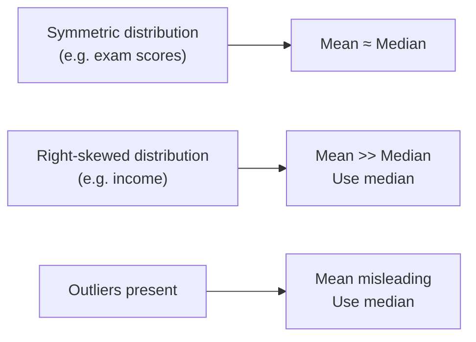

Summary statistics compress a big, messy distribution into a
few interpretable numbers. They're the first vocabulary every
analyst needs.

## The cheat sheet

| Statistic | Meaning |
| --- | --- |
| **count**  | How many non-missing values |
| **mean**   | Arithmetic average |
| **median** | Middle value (50th percentile) |
| **std**    | Standard deviation — how spread out |
| **min / max** | Smallest / largest value |
| **25% / 50% / 75%** | Quartiles |
| **mode**   | Most common value |
| **nunique** | How many distinct values |

## describe — the one-shot summary

<CodeBlock
  adapter="python"
  initCode={`import pandas as pd
df = pd.read_csv("https://raw.githubusercontent.com/bdi475/datasets/main/HR-dataset-v14.csv")`}
  starterCode={`print(df.describe().round(2).T)
`}
/>

`describe()` shows everything at once for numeric columns. Use
`.T` (transpose) to put columns as rows — much easier to read
when you have many columns.

For non-numeric columns:

<CodeBlock
  adapter="python"
  initCode={`import pandas as pd
df = pd.read_csv("https://raw.githubusercontent.com/bdi475/datasets/main/HR-dataset-v14.csv")`}
  starterCode={`print(df.describe(include="object"))
`}
/>

You get `count`, `unique`, `top` (most common), and `freq`.

## Mean vs Median — the classic trap

<CodeBlock
  adapter="python"
  starterCode={`import pandas as pd

# A small team where one CEO skews everything
salaries = pd.Series([45_000, 52_000, 48_000, 55_000, 60_000, 47_000, 850_000])

print(f"Mean:   $ {salaries.mean():>10,.0f}")
print(f"Median: $ {salaries.median():>10,.0f}")
`}
/>

The mean salary is \$165K — almost nobody earns that. The median
is \$52K — much more representative. **For skewed
distributions, prefer median.** Income, prices, durations, and
file sizes are almost always skewed.

## Quantiles — beyond the median

<CodeBlock
  adapter="python"
  starterCode={`import pandas as pd

s = pd.Series([1, 2, 4, 5, 7, 9, 12, 15, 20, 35, 50])

print("25%:", s.quantile(0.25))
print("50%:", s.quantile(0.50))   # same as median
print("75%:", s.quantile(0.75))
print("90%:", s.quantile(0.90))
print("99%:", s.quantile(0.99))
`}
/>

Quantiles are great for things like SLAs ("95% of our requests
finish in under X ms") or pay-band analyses.

## Spread — std and IQR

<CodeBlock
  adapter="python"
  starterCode={`import pandas as pd

a = pd.Series([50, 50, 50, 50, 50])           # no spread
b = pd.Series([20, 30, 50, 70, 80])           # moderate
c = pd.Series([0, 10, 50, 90, 100])           # large

for name, s in [("a", a), ("b", b), ("c", c)]:
    iqr = s.quantile(0.75) - s.quantile(0.25)
    print(f"{name}: mean={s.mean()}, std={s.std():.1f}, IQR={iqr}")
`}
/>

**std** (standard deviation) is the typical distance from the
mean. **IQR** (interquartile range = Q3 − Q1) is the middle 50%
spread. IQR is more robust to outliers; std is more sensitive.

## value_counts — the categorical describe

<CodeBlock
  adapter="python"
  initCode={`import pandas as pd
df = pd.read_csv("https://raw.githubusercontent.com/bdi475/datasets/main/HR-dataset-v14.csv")`}
  starterCode={`print(df["Department"].value_counts())
print()
print("As percentages:")
print((df["Department"].value_counts(normalize=True) * 100).round(1))
`}
/>

`normalize=True` gives proportions instead of counts — perfect
for "what share of our customers are in each tier?".

## Correlation

<CodeBlock
  adapter="python"
  initCode={`import pandas as pd
df = pd.read_csv("https://raw.githubusercontent.com/bdi475/datasets/main/HR-dataset-v14.csv")`}
  starterCode={`numeric = df.select_dtypes(include="number")
corr = numeric.corr().round(2)
print(corr)
`}
/>

The correlation between two columns ranges from -1 to +1:

| Value | Meaning |
| --- | --- |
| +1.0 | Perfect positive — they move identically |
| +0.7 | Strong positive — they often move together |
| 0    | No linear relationship |
| -0.7 | Strong negative — one goes up, the other goes down |
| -1.0 | Perfect negative |

<Callout type="warn" title="Correlation ≠ causation">
A high correlation does not mean A causes B. Both might be
driven by a third variable, or it could be coincidence. Always
investigate further before claiming a cause.
</Callout>

## Grouped summaries

The natural extension — `describe` per group:

<CodeBlock
  adapter="python"
  initCode={`import pandas as pd
df = pd.read_csv("https://raw.githubusercontent.com/bdi475/datasets/main/HR-dataset-v14.csv")`}
  starterCode={`# Tenure summary per department
print(df.groupby("Department")["time_spend_company"].describe().round(2))
`}
/>

## Outlier flags via the 1.5×IQR rule

A common rule of thumb: anything beyond Q1 − 1.5×IQR or Q3 +
1.5×IQR is a candidate outlier.

<CodeBlock
  adapter="python"
  starterCode={`import pandas as pd

s = pd.Series([10, 12, 11, 13, 12, 11, 14, 13, 12, 95])

q1, q3 = s.quantile([0.25, 0.75])
iqr = q3 - q1
lo, hi = q1 - 1.5*iqr, q3 + 1.5*iqr

print(f"Outlier bounds: [{lo:.1f}, {hi:.1f}]")
print("Outliers:", s[(s < lo) | (s > hi)].tolist())
`}
/>

This is a **heuristic**, not a verdict — you still have to
decide whether the outlier is wrong data, a real edge case, or
the most important customer on the list.

## Mini challenge

<ChallengeCard
  adapter="python"
  title="Compute a robust summary"
  instructions={`Given a Series \`values\` (provided), build a Python dict \`summary\` containing exactly these keys with the indicated values:

- "count": non-missing count (int)
- "mean": arithmetic mean (float)
- "median": median (float)
- "p95": 95th percentile (float)
- "iqr": Q3 minus Q1 (float)
- "n_outliers": number of values outside [Q1 - 1.5*IQR, Q3 + 1.5*IQR] (int)`}
  initCode={`import pandas as pd
import numpy as np

values = pd.Series([5, 7, 6, 8, 7, 5, 9, 8, 6, 7, 6, 100, 5, 7, 8, np.nan, 6])`}
  starterCode={`summary = {}   # TODO

print(summary)
`}
  solutionCode={`import pandas as pd
import numpy as np

s = values.dropna()
q1, q3 = s.quantile([0.25, 0.75])
iqr = q3 - q1
lo, hi = q1 - 1.5*iqr, q3 + 1.5*iqr

summary = {
    "count":      int(s.count()),
    "mean":       float(s.mean()),
    "median":     float(s.median()),
    "p95":        float(s.quantile(0.95)),
    "iqr":        float(iqr),
    "n_outliers": int(((s < lo) | (s > hi)).sum()),
}

print(summary)
`}
  tests={[
    {
      id: "type",
      name: "summary is a dict",
      description: "Type check",
      code: `assert isinstance(summary, dict)`,
    },
    {
      id: "keys",
      name: "Has the required keys",
      description: "All six keys",
      code: `for k in ("count","mean","median","p95","iqr","n_outliers"):
    assert k in summary, f"Missing key {k}"`,
    },
    {
      id: "count",
      name: "Excludes missing in count",
      description: "16 non-NaN values",
      code: `assert summary["count"] == 16`,
    },
    {
      id: "median",
      name: "Median is ~7",
      description: "Median is robust to the outlier",
      code: `assert 6.0 <= float(summary["median"]) <= 8.0`,
    },
    {
      id: "outlier_count",
      name: "Detects the single outlier (100)",
      description: "Exactly one value outside the IQR fences",
      code: `assert summary["n_outliers"] == 1`,
    },
  ]}
/>

## Check your understanding

<MultipleChoice
  markdown={`Reporting income data for a country, which is usually the more representative single number?

- mean
- [o] median — incomes are right-skewed and median is robust to the few very high earners
  > Mean income is dragged upward by a small number of very large values.
- mode
- std

This is among the most common real-world stats mistakes.`}
/>

<MultipleChoice
  markdown={`What does \`value_counts(normalize=True)\` return?

- Sorted values
- Z-scores
- [o] Proportions (relative frequencies) instead of raw counts — perfect for "what share of rows fall into each category"
  > Multiply by 100 for percentages.
- A heatmap

A small but frequently used flag.`}
/>

<MultipleChoice
  markdown={`Two columns have a correlation of -0.95. The correct interpretation is:

- One causes the other
- They are unrelated
- [o] They have a very strong **inverse** linear relationship — when one goes up, the other tends to go down. (No claim about cause.)
  > Strong correlation, negative direction — but causation is a separate investigation.
- It is a bug

Sign matters as much as magnitude.`}
/>

<MultipleChoice
  markdown={`The 1.5×IQR rule flags a few "outliers" in your data. What is the correct next step?

- Delete them immediately
- Ignore them
- [o] Investigate — they might be data errors, sentinel values, or genuinely important edge cases. The decision to drop, cap, or keep depends on context.
  > The rule highlights candidates; you make the judgement.
- Replace them with the mean

Outlier handling is a thinking task, not a mechanical one.`}
/>
