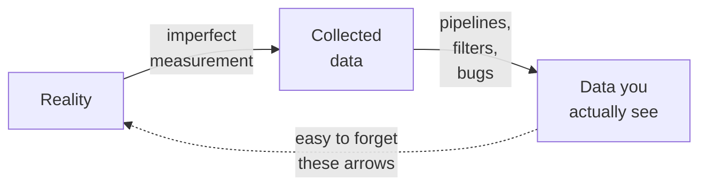
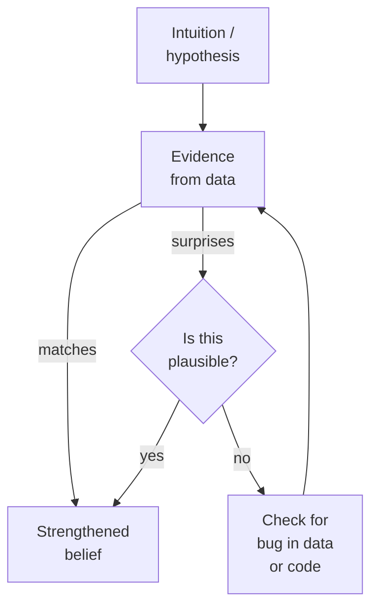
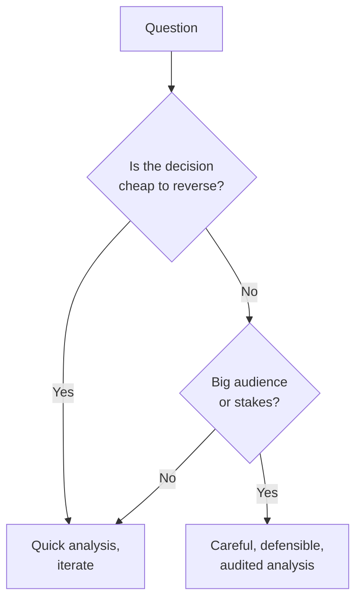

Tools are only as good as the person wielding them. A spreadsheet
in the hands of a careful analyst can outperform Pandas in the
hands of a careless one. This chapter is about the *habits of
mind* that distinguish good analytical work — habits that apply
no matter what tool you eventually pick up.

## The five habits

1. **Be skeptical of your data.**
2. **Explore before you conclude.**
3. **Prefer evidence over intuition (and intuition over guesses).**
4. **Make your reasoning legible.**
5. **Treat every analysis as if it will be audited.**

We will walk through each.

### 1. Be skeptical of your data

The most dangerous assumption is that your data is correct. It
almost never is — at least, not entirely. Before you trust a
number, ask:

- **Where did it come from?** Which system collected it, when,
  and how?
- **What was filtered out before I got it?** Test users? Internal
  employees? Cancelled orders?
- **What does "missing" mean?** Was the field skipped, defaulted,
  or set to zero by a downstream process?
- **What changed about the collection over time?** Did the form
  add a new field in 2022? Did the logging switch from "click" to
  "tap" mid-year?

Every dataset is a *photograph* of reality, taken through an
imperfect lens. Treat it that way.

### 2. Explore before you conclude

A common rookie mistake is to look up an answer (`df["revenue"]
.sum()`) and immediately put it in a report. A more experienced
analyst spends a few minutes first looking at the *distribution*:

- What does a histogram of revenue look like?
- Are there a few outlier orders that dominate the total?
- Are there negative or zero values (refunds, voids)?
- Does the count of orders look reasonable for the time period?

These checks take 30 seconds and routinely catch data bugs that
would have made the eventual conclusion wrong.

<CodeBlock
  adapter="python"
  starterCode={`import pandas as pd

# A small "orders" table — a few suspicious values hidden in there
orders = pd.DataFrame(
    {
        "order_id": range(1, 11),
        "amount": [100, 250, 80, -50, 9999999, 120, 0, 60, 80, 110],
    }
)

# Naive answer:
print("Naive total revenue:", orders["amount"].sum())

# But let us look at the distribution before trusting that number:
print()
print(orders["amount"].describe())
print()
print("Suspicious rows:")
print(orders[(orders["amount"] <= 0) | (orders["amount"] > 100000)])
`}
/>

The naive total includes a giant outlier and a refund — both of
which deserve investigation before the number is reported.

### 3. Prefer evidence over intuition (and intuition over guesses)

Your gut is useful for *generating hypotheses* — "I think
customers from New York spend more." Your gut is bad at
*confirming* those hypotheses. Check.

But your intuition is still better than random guessing. If a
result looks shocking, you are right to be suspicious. Most
surprising results in data are data bugs, not breakthroughs.

The path through "surprises → check for bug" is travelled many
times a week by every working analyst.

### 4. Make your reasoning legible

Two flavors of legibility:

- **Code legibility.** Use descriptive variable names. Break
  complex pipelines into small steps with intermediate
  variables. Add comments where intent is non-obvious.
- **Communication legibility.** When you present a number, also
  present its denominator, its time window, and any filters
  applied. *"Revenue from US customers in Q1, excluding refunds:
  $4.2M"* is far more useful than *"$4.2M"*.

A handy heuristic: imagine your future self trying to extend the
analysis in three months. Can they follow what you did?

### 5. Treat every analysis as if it will be audited

Even small companies eventually have an investor, a board
member, a regulator, or an internal compliance officer who asks
*"how did you arrive at this number?"* The analysts who can
answer in two minutes — by re-running a script and walking
through it — are the ones whose careers thrive.

This is why we will spend a whole chapter on **Reproducible
Analysis**. It is not academic. It is professional self-defense.

## Common cognitive traps

Even experienced analysts fall into these. Awareness helps.

### Confirmation bias

You expect the answer to be X, so when the first analysis
produces X, you stop looking. Counter: deliberately try to
*disprove* your hypothesis.

### Survivorship bias

Your dataset only contains the things that *made it through*
some filter — users who completed onboarding, planes that
landed, companies that did not go bankrupt. Conclusions about
"users" or "companies" are really conclusions about the
*surviving* subset.

### Simpson's paradox

A pattern that holds in subgroups can reverse when the groups
are aggregated. The most famous example: a 1973 lawsuit against
UC Berkeley alleging gender bias in admissions found that men
were admitted at a higher rate overall, but **each department
admitted women at an equal or higher rate** than men. Women
applied disproportionately to more competitive departments.

This is a real and constant risk. Whenever you compute an
aggregate, ask whether breaking it down by an important
sub-group changes the story.

<Callout type="info" title="Simpson in one line">
"Means of means are not the mean of the union." It is a good
mantra to memorize.
</Callout>

### Cherry-picking

Running fifty comparisons and reporting only the one that turned
out interesting. The standard defense in scientific work is
**pre-registering** your hypotheses — writing them down before
looking at the data — but in business work the discipline is
less common, so the temptation is constant.

## A small skepticism drill

Below is a tiny dataset of customer satisfaction scores. Do *not*
just take the mean. Look first.

<CodeBlock
  adapter="python"
  starterCode={`import pandas as pd

satisfaction = pd.DataFrame(
    {
        "customer_id": range(1, 16),
        "score": [5, 4, 5, 5, 1, 5, 4, 5, 5, 1, 5, 5, 4, 5, 1],
        "submitted_via": ["email"] * 12 + ["phone"] * 3,
    }
)

print("Naive mean score:", satisfaction["score"].mean().round(2))
print()
print("By channel:")
print(satisfaction.groupby("submitted_via")["score"].mean().round(2))
print()
print("Counts by channel:")
print(satisfaction["submitted_via"].value_counts())
`}
/>

The naive mean hides the fact that all the low scores came in
through the phone channel. *That* is the headline. The headline
mean is misleading. A skeptical analyst spots this in seconds.

## When to slow down and when to speed up

There is also a counter-temptation: an analyst who is *so*
careful that they never produce anything. Some questions deserve
an hour, some deserve a week. A rough decision tree:

A decision about "which font should the homepage use" deserves a
back-of-the-envelope check. A decision about "should we lay off
10% of the company based on this attrition model" deserves
double-checking by someone other than you.

## The mindset, distilled

If you internalize one thing from this chapter:

> *Every number you report is a contract with your reader. The
> contract says: "if you make a decision based on this number, I
> have done my due diligence so that the decision is well-
> founded."*

That contract is what makes analysis a profession, rather than
just a tool-using activity.

## Check your understanding

<MultipleChoice
  markdown={`Why did the naive mean satisfaction score in the chapter's example mislead?

- The mean function in Pandas is broken
  > \`df["score"].mean()\` computed the correct arithmetic mean of the values in the column; the problem was with interpretation, not computation.
- There were too few rows
  > The dataset had 15 rows — enough to compute a meaningful mean; the issue was that grouping by channel revealed a pattern the overall mean concealed.
- [o] All the low scores came in through one channel; aggregating across channels hid the variation that mattered
  > This is a small Simpson's-paradox-flavored example. Always look at meaningful sub-groups before trusting an aggregate.
- The scores were on a wrong scale
  > The scores were on a consistent 1–5 scale; the misleading result came from mixing channels with different underlying distributions, not from a scaling error.

This is why the analyst's first instinct after computing an aggregate should be "now break it down."`}
/>

<MultipleChoice
  markdown={`Which of these is **Simpson's paradox**?

- The number of pandas dataframes you create doubles every six months
  > This describes a humorous growth pattern, not a statistical phenomenon; Simpson's paradox is about aggregation reversals, not exponential growth.
- A function that returns different answers each time
  > A non-deterministic function is a reproducibility problem, not Simpson's paradox; the paradox is specifically about how combining sub-groups can reverse a trend.
- [o] A pattern that holds in every sub-group can reverse direction when the sub-groups are combined
  > The Berkeley admissions case is the classic example. Whenever you compute an aggregate, ask whether a known sub-grouping would change the conclusion.
- A statistical test that always rejects the null
  > A test that always rejects the null would be a broken statistical procedure; Simpson's paradox is about how aggregate statistics can contradict sub-group statistics.

Awareness of Simpson's paradox is one of the few things that consistently separates intermediate from beginner analysts.`}
/>

<MultipleChoice
  markdown={`Which habit does the chapter call "professional self-defense"?

- Memorizing every Pandas function
  > Pandas has hundreds of methods; no analyst memorizes them all, and that is not what the chapter calls professional self-defense.
- Charting everything
  > Visualization is valuable, but the chapter's "professional self-defense" specifically refers to making analyses auditable and reproducible.
- [o] Treating every analysis as if it will be audited — i.e., making it reproducible, traceable, and explainable
  > When (not if) someone asks "how did you arrive at this number?", being able to re-run a script and walk through it is what protects you and your team.
- Drinking lots of coffee
  > Caffeine is not among the chapter's analytical habits; this is a humorous distractor.

Reproducibility is not academic; it is the everyday professional baseline.`}
/>

<MultipleChoice
  markdown={`When a result is **surprising**, what is the chapter's recommended first instinct?

- Publish it immediately
  > Publishing a surprising result before verifying it risks distributing a number that turns out to be a data or code error, damaging credibility.
- Assume the data is correct and report it
  > The chapter explicitly argues that most surprising results in data are bugs, not breakthroughs; assuming correctness without checking is the opposite of the recommended instinct.
- [o] Suspect a data or code bug, and investigate before trusting it
  > The base rate of "shocking findings" being bugs is very high. Build the reflex now.
- Ignore it
  > Ignoring a surprising result leaves either a real finding or a real bug unaddressed; both outcomes are bad for the analysis.

Most "anomalies" in data turn out to be join mistakes, type bugs, or filter errors.`}
/>
