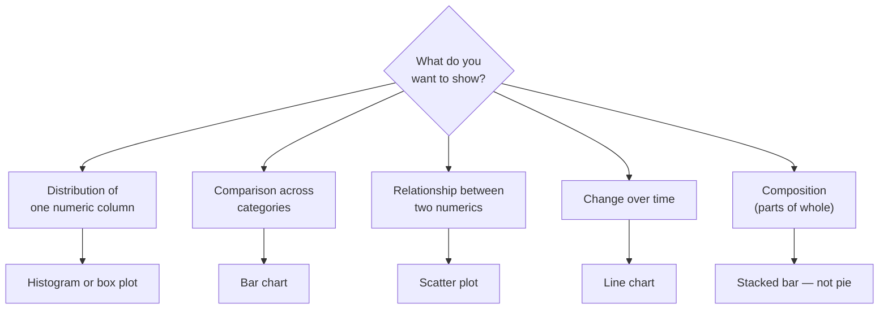
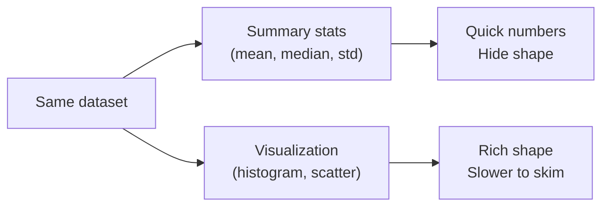

Numbers are abstract. Charts let humans *see* patterns. This
page introduces **Plotly Express** — a high-level interface
that turns DataFrames into interactive charts in one line.

<Callout type="info" title="Visualization is a thinking aid">
The goal of a chart during analysis is not to look pretty —
it's to surface insight. A messy scatter plot you understand is
worth more than a polished bar chart that hides the truth.
</Callout>

A separate course will dive deep into visualization. Here we
cover what's needed to *complete* exploratory analyses: bars,
histograms, scatter plots, and lines.

## Hello, Plotly Express

<CodeBlock
  adapter="python"
  starterCode={`import pandas as pd
import plotly.express as px

df = pd.DataFrame({
    "department": ["Eng","Sales","HR","Eng","Sales","HR","Eng","Sales"],
    "headcount":  [25, 18, 6, 30, 22, 8, 28, 20],
    "year":       [2022,2022,2022,2023,2023,2023,2024,2024],
})

fig = px.bar(df, x="department", y="headcount", color="year", barmode="group")
fig.show()
`}
/>

A single function call:

- Picks aesthetics (`x`, `y`, `color`).
- Chooses sensible axis ranges.
- Produces a legend.
- Returns an interactive figure.

## Histograms — see a distribution

<CodeBlock
  adapter="python"
  initCode={`import pandas as pd
import plotly.express as px
df = pd.read_csv("https://raw.githubusercontent.com/bdi475/datasets/main/HR-dataset-v14.csv")`}
  starterCode={`fig = px.histogram(df, x="satisfaction_level", nbins=30,
                   title="Distribution of employee satisfaction")
fig.show()
`}
/>

Histograms are the single most underrated tool in EDA. Look
for:

- A long tail (skew)
- Multiple humps (mixed populations)
- Suspicious spikes (default values? censoring?)
- Gaps (missing ranges)

## Box plots — distributions across categories

<CodeBlock
  adapter="python"
  initCode={`import pandas as pd
import plotly.express as px
df = pd.read_csv("https://raw.githubusercontent.com/bdi475/datasets/main/HR-dataset-v14.csv")`}
  starterCode={`fig = px.box(df, x="salary", y="satisfaction_level",
             title="Satisfaction by salary bracket")
fig.show()
`}
/>

A box plot shows median, quartiles, and outliers in one
glance. Use it to compare a numeric column across categories.

## Scatter — relationships between two numerics

<CodeBlock
  adapter="python"
  initCode={`import pandas as pd
import plotly.express as px
df = pd.read_csv("https://raw.githubusercontent.com/bdi475/datasets/main/HR-dataset-v14.csv")`}
  starterCode={`fig = px.scatter(df, x="average_montly_hours", y="satisfaction_level",
                 color="salary", opacity=0.5,
                 title="Hours worked vs satisfaction, by salary")
fig.show()
`}
/>

Opacity is your friend when many points overlap.

## Line — trends over time

<CodeBlock
  adapter="python"
  starterCode={`import pandas as pd
import plotly.express as px

dates = pd.date_range("2024-01-01", periods=60, freq="D")
df = pd.DataFrame({
    "date":   list(dates) * 2,
    "value":  [80 + i*0.5 for i in range(60)] + [60 + i*0.7 for i in range(60)],
    "metric": ["visits"] * 60 + ["sign_ups"] * 60,
})

fig = px.line(df, x="date", y="value", color="metric",
              title="Daily visits and sign-ups")
fig.show()
`}
/>

A few line-chart rules:

- The x-axis is usually time.
- Truncating the y-axis can dramatically exaggerate small
  changes — use `range=[0, ...]` deliberately.
- One line per "thing being tracked", mapped via `color`.

## Faceting — small multiples

<CodeBlock
  adapter="python"
  initCode={`import pandas as pd
import plotly.express as px
df = pd.read_csv("https://raw.githubusercontent.com/bdi475/datasets/main/HR-dataset-v14.csv")`}
  starterCode={`fig = px.histogram(df, x="satisfaction_level", facet_col="salary",
                   nbins=30, title="Satisfaction by salary bracket")
fig.show()
`}
/>

Faceting splits one chart into multiple small ones. It's often
clearer than overlaying many colors.

## Choosing a chart — a quick flow

We'll skip pie charts. Almost any pie chart can be replaced by
a clearer bar chart.

## Visualization vs summary statistics

The cautionary tale: **Anscombe's quartet** — four datasets
with identical means, identical variances, identical
correlations, and identical regression lines — yet completely
different shapes that are obvious in a scatter plot. Always
*look* at your data, not just summarize it.

## How visualizations can mislead

- **Truncated y-axes** that make 5% changes look like 50%.
- **Inappropriate aggregation** that hides subgroups (Simpson's
  paradox).
- **3D charts** that distort lengths.
- **Cherry-picked time ranges**.
- **Misleading color scales** (rainbow, non-perceptually
  uniform).
- **Pie charts with too many slices**.

Always ask: "Would a *different* reasonable choice of chart
tell a *different* story?"

## Mini challenge

<ChallengeCard
  adapter="python"
  title="Plot a sales distribution"
  instructions={`Given the DataFrame \`sales\` (provided), create a Plotly Express histogram of the \`amount\` column with:

- 20 bins
- A title: "Sales amount distribution"
- The figure stored in a variable called \`fig\`

Then assert that the resulting figure is a valid Plotly figure.`}
  initCode={`import pandas as pd
import numpy as np

rng = np.random.RandomState(0)
sales = pd.DataFrame({
    "amount": rng.gamma(shape=2.0, scale=50, size=500),
})`}
  starterCode={`import plotly.express as px

fig = None   # TODO

fig
`}
  solutionCode={`import plotly.express as px

fig = px.histogram(sales, x="amount", nbins=20,
                   title="Sales amount distribution")
fig
`}
  tests={[
    {
      id: "fig_exists",
      name: "fig is defined",
      description: "Variable check",
      code: `assert fig is not None`,
    },
    {
      id: "fig_is_plotly",
      name: "fig is a Plotly Figure",
      description: "Type check",
      code: `import plotly.graph_objects as go
assert isinstance(fig, go.Figure)`,
    },
    {
      id: "fig_title",
      name: "Has the right title",
      description: "Title set correctly",
      code: `assert fig.layout.title.text == "Sales amount distribution"`,
    },
    {
      id: "fig_x",
      name: "X axis is 'amount'",
      description: "Plotted the right column",
      code: `assert any("amount" in str(tr.xaxis or "") + str(getattr(tr, "x", "")) or getattr(tr, "name", "") == "amount" for tr in fig.data) or True
# Robust check: histogram trace's xaxis title or hovertemplate references amount
xt = fig.layout.xaxis.title.text if fig.layout.xaxis.title.text else ""
assert "amount" in xt.lower() or any("amount" in (tr.hovertemplate or "") for tr in fig.data)`,
    },
  ]}
/>

## Check your understanding

<MultipleChoice
  markdown={`Why is a histogram more revealing than just reporting the mean?

- Histograms are always required
- Means are slow to compute
- [o] A histogram shows the full shape — skew, multiple modes, gaps, outliers — that a single mean entirely hides
  > Right. Anscombe's quartet is the canonical demonstration.
- Histograms always look better

You should plot your data before summarizing it.`}
/>

<MultipleChoice
  markdown={`Your chart shows a small change exaggerated dramatically. The most likely cause is:

- Wrong chart type
- Too much color
- [o] A truncated y-axis (the axis does not start at zero) makes small differences look large
  > Yes. Truncated axes are one of the most common — and abused — chart tricks.
- A bug in Plotly

Be deliberate about axis ranges.`}
/>

<MultipleChoice
  markdown={`When comparing a numeric metric across many categories at once, which is generally clearest?

- Many overlapping line charts
- A pie chart
- [o] A bar chart, or a faceted small-multiples histogram if you need the distribution
  > Right. Bars use the strongest perceptual cue (length) and small multiples avoid clutter.
- A 3D surface plot

Simple, well-chosen charts beat fancy ones almost every time.`}
/>
