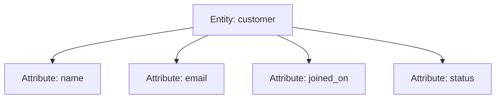
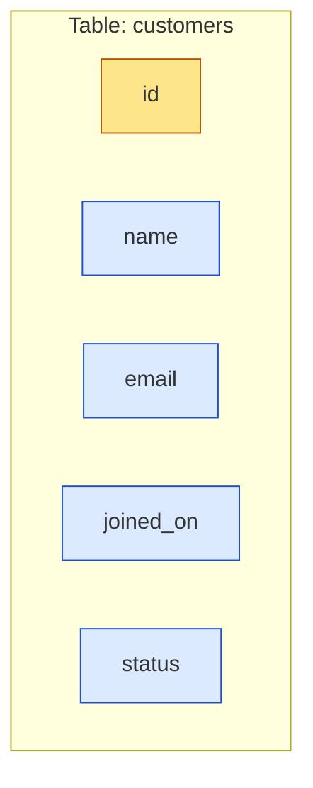
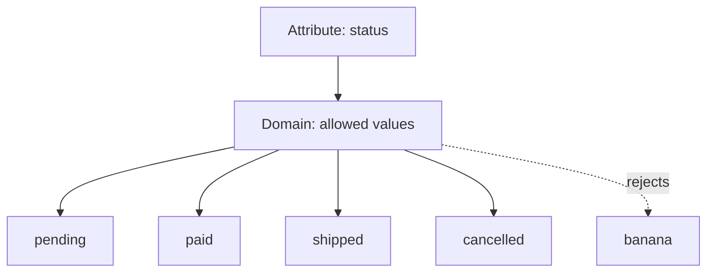
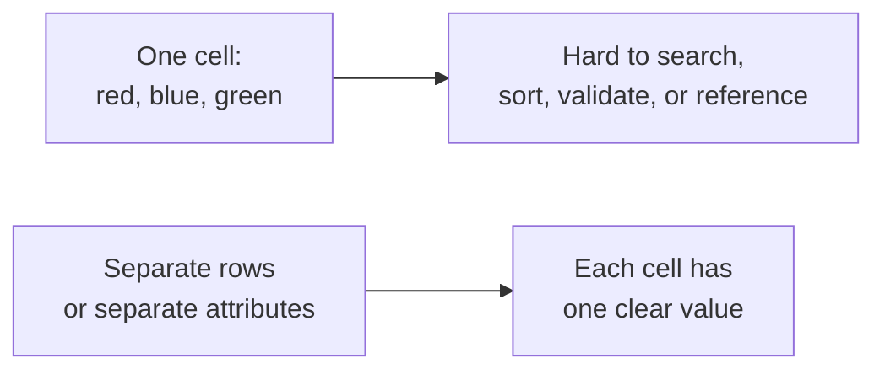
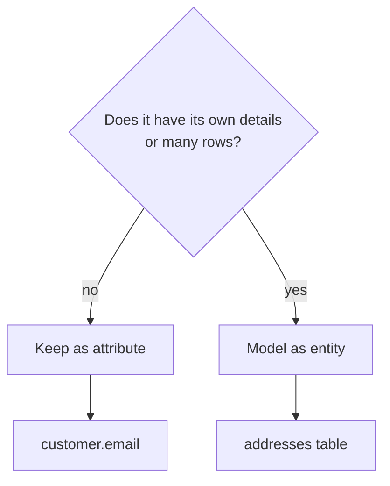
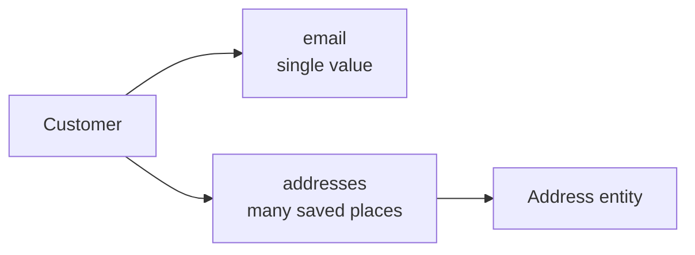
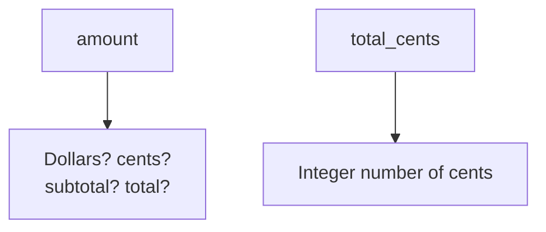

Once you have an entity like `customer`, the next question is: *what
facts do we need to remember about each customer?* Those facts are
**attributes**.

Attributes become columns. But good columns are not just names — they
also have **domains**, the set of values that are allowed to appear.

## Attributes describe an entity

An **attribute** is a property of an entity. A customer might have a
name, email address, signup date, and loyalty status. An order might
have an order date, status, and total amount.

In a table, each attribute usually becomes one column. Each row then
stores the values for one real entity.

## Domains say what values are allowed

A **domain** is the set of valid values for an attribute. In SQL, the
domain is partly expressed by the column's data type and partly by
rules such as `NOT NULL`, `CHECK`, and `UNIQUE`.

The point is not just neatness. A narrow domain protects meaning. If
`status` can contain anything, your application must guess what
`sent`, `shipped`, `SHIP`, and `done` mean.

<SqlCodeBlock
  dialect="postgres"
  title="Types and checks define a column's domain"
  initSql={`CREATE TABLE orders (
  id          INTEGER PRIMARY KEY,
  status      TEXT NOT NULL CHECK (status IN ('pending', 'paid', 'shipped', 'cancelled')),
  total_cents INTEGER NOT NULL CHECK (total_cents >= 0),
  placed_on   DATE NOT NULL
);
INSERT INTO orders VALUES
  (1, 'pending', 2599, DATE '2025-01-10'),
  (2, 'paid',    1200, DATE '2025-01-11');`}
  starterCode={`-- Try changing 'paid' to 'banana' or total_cents to -5.
INSERT INTO
  orders (id, status, total_cents, placed_on)
VALUES
  (3, 'shipped', 3499, DATE '2025-01-12');

SELECT
  *
FROM
  orders
ORDER BY
  id;`}
/>

A good design lets PostgreSQL reject values that do not belong. That
makes bad data harder to create in the first place.

## Atomic values: one value per cell

A column should usually hold one value, not a list packed into a
single cell. This is called **atomicity**. It is the core idea behind
first normal form, which we will study later.

A `phone_numbers` value like `'555-1111, 555-2222'` may look simple,
but it hides multiple facts in one cell. If you later need to verify,
label, or delete one phone number, the design fights you.

## Quick check

<MultipleChoice
  markdown={`What does a column's **domain** describe?

- The table where the column appears.
  > The table gives context, but the domain is about which values are allowed.
- [o] The set of valid values for that attribute, often enforced by types and constraints.
  > A domain combines data type and rules, such as allowed statuses or nonnegative amounts.
- The number of rows currently in the table.
  > Row count changes over time and is not the domain of a column.
- The order in which columns are displayed.
  > Display order is not a data rule.

A domain is the allowed meaning-space for a column.`}
/>

## Attribute or its own entity?

Some facts are simple properties. Others deserve their own table. The
question is not "is it a noun?" but "does this thing have its own
identity, attributes, or relationships?"

For example, `customer.email` is often a simple attribute. But
`address` might become an entity if a customer can have many addresses,
if orders ship to saved addresses, or if addresses need their own
validation and history.

<Callout type="warn" title="Do not model everything as a separate table">
A table has a cost: keys, relationships, joins, and rules. Make a new
entity when the thing has independent meaning, repeated instances, or
relationships of its own — not just because it is a noun.
</Callout>

## Attributes should be named for meaning

Good attribute names describe what the value means. `created_at` is
clearer than `date`. `total_cents` is clearer than `amount` when the
unit matters.

The name, type, and constraints work together. A column called
`total_cents` with type `INTEGER` and a nonnegative check is much
harder to misunderstand.

## Check your understanding

<MultipleChoice
  markdown={`What is an **attribute** of an entity?

- A database backup of that entity.
  > Backups are operational copies, not properties of an entity.
- [o] A property or fact about the entity, such as a customer's email address.
  > Attributes describe the entity and usually become columns.
- A relationship between two unrelated tables.
  > Relationships connect entities; attributes describe one entity.
- The SQL command used to query the table.
  > SQL commands operate on data but are not attributes of the modeled thing.

Attributes are the facts stored about each row of an entity table.`}
/>

<MultipleChoice
  markdown={`Why is storing red, blue, green in one colors cell usually a design smell?

- Because text columns cannot store commas.
  > Text can store commas; the problem is mixing multiple values into one cell.
- [o] Because the cell contains a list instead of one atomic value.
  > Non-atomic values are hard to validate, search, join, or update individually.
- Because colors must always be stored as numbers.
  > Colors may be text or codes; the issue is one value versus many values.
- Because PostgreSQL cannot read strings with spaces.
  > PostgreSQL handles strings with spaces normally.

Atomic cells keep each stored fact clear and manageable.`}
/>

<MultipleChoice
  markdown={`When is a concept more likely to become its own entity instead of just an attribute?

- When it is spelled with more than five letters.
  > Spelling length has no relationship to data modeling.
- When it appears near the top of a form.
  > Interface position is not a reliable modeling rule.
- [o] When it has its own details, repeated instances, or relationships to other entities.
  > Independent meaning and connections are signs that a separate table may be useful.
- Whenever it is stored as text.
  > Many attributes are text; data type alone does not decide entity status.

A separate entity is justified by meaning and relationships, not by word shape.`}
/>
