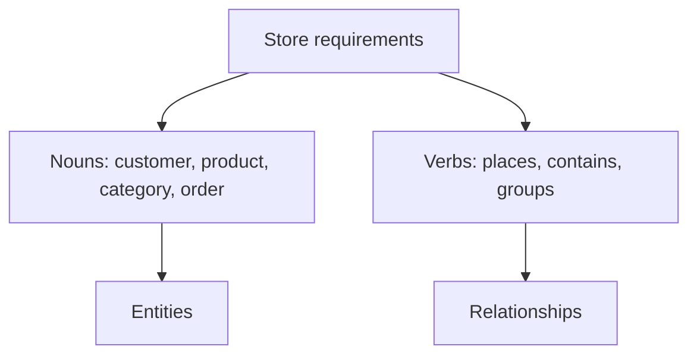
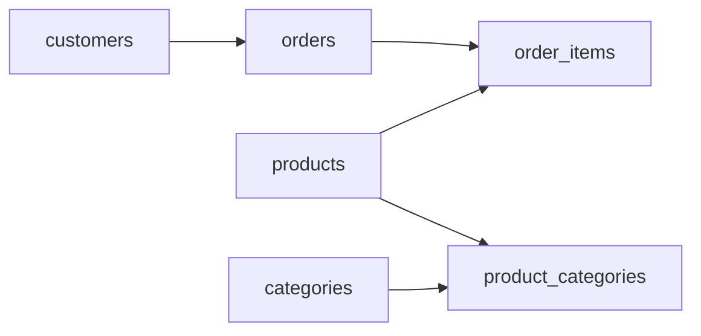
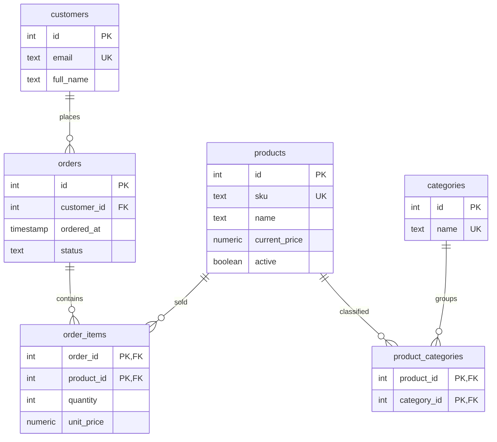
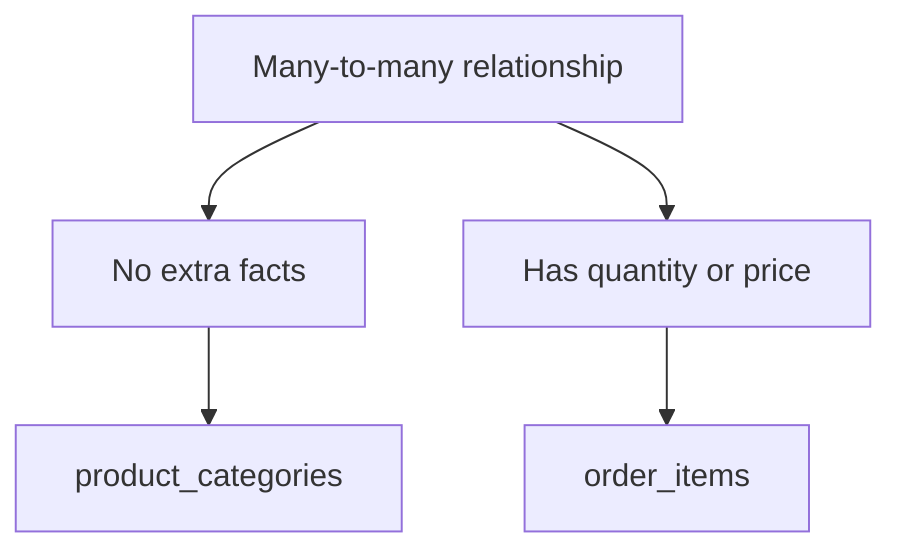
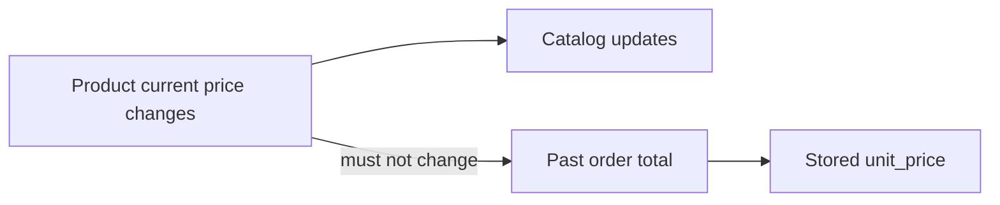

An online store looks familiar from the outside: customers buy
products. But the database design has to preserve details that matter
later, especially order history.

This case study builds a store schema from requirements to tables.

## Start with requirements

A small store needs to remember:

- A customer has an email and name.
- A product has a name, current price, and active flag.
- A category groups many products.
- A product can appear in many categories.
- A customer places orders.
- An order contains one or more products.
- Each order line stores quantity and the price charged at the time.

The phrase "an order contains products" hides a key design point.
The relationship itself has attributes: quantity and price charged.
That means it needs a table.

## Find the entities and relationships

The core entities are `customers`, `products`, `categories`, and
`orders`. Two relationship tables complete the model:

- `product_categories` connects products and categories.
- `order_items` connects orders and products with line-item facts.

<MultipleChoice
  markdown={`Why is \`order_items\` more than just a technical join table?

- It stores no facts of its own.
  > The line item stores quantity and the charged unit price.
- [o] The relationship between an order and a product has its own attributes.
  > Quantity and unit price describe the line item, not only the order or only the product.
- It replaces the need for an \`orders\` table.
  > Orders still need their own identity and order-level facts.
- It makes every product belong to one category.
  > Product categories are modeled by a separate relationship.

When a relationship has attributes, model it as a table with those facts.`}
/>

## Draw the full schema

The model has two many-to-many relationships, but they are different.
`product_categories` is a pure classification relationship.
`order_items` is a line-item table because it stores facts about each
purchased product.

## Why copy unit_price?

`products.current_price` is the price now. `order_items.unit_price` is
the price charged then.

Copying the price onto the line item is a deliberate denormalization.
It repeats a fact on purpose because order history must not change
when a product's current price changes.

This is a design trade-off: a little duplication protects historical
accuracy.

## Create the schema

<SqlCodeBlock
  dialect="postgres"
  title="Create an online store schema"
  initSql={`DROP TABLE IF EXISTS product_categories;
DROP TABLE IF EXISTS order_items;
DROP TABLE IF EXISTS orders;
DROP TABLE IF EXISTS products;
DROP TABLE IF EXISTS categories;
DROP TABLE IF EXISTS customers;

CREATE TABLE customers (
    id INT GENERATED ALWAYS AS IDENTITY PRIMARY KEY,
    email TEXT NOT NULL UNIQUE,
    full_name TEXT NOT NULL
);

CREATE TABLE products (
    id INT GENERATED ALWAYS AS IDENTITY PRIMARY KEY,
    sku TEXT NOT NULL UNIQUE,
    name TEXT NOT NULL,
    current_price NUMERIC(10, 2) NOT NULL CHECK (current_price >= 0),
    active BOOLEAN NOT NULL DEFAULT TRUE
);

CREATE TABLE categories (
    id INT GENERATED ALWAYS AS IDENTITY PRIMARY KEY,
    name TEXT NOT NULL UNIQUE
);

CREATE TABLE product_categories (
    product_id INT NOT NULL REFERENCES products(id),
    category_id INT NOT NULL REFERENCES categories(id),
    PRIMARY KEY (product_id, category_id)
);

CREATE TABLE orders (
    id INT GENERATED ALWAYS AS IDENTITY PRIMARY KEY,
    customer_id INT NOT NULL REFERENCES customers(id),
    ordered_at TIMESTAMP NOT NULL,
    status TEXT NOT NULL CHECK (status IN ('placed', 'paid', 'shipped', 'cancelled'))
);

CREATE TABLE order_items (
    order_id INT NOT NULL REFERENCES orders(id),
    product_id INT NOT NULL REFERENCES products(id),
    quantity INT NOT NULL CHECK (quantity > 0),
    unit_price NUMERIC(10, 2) NOT NULL CHECK (unit_price >= 0),
    PRIMARY KEY (order_id, product_id)
);

INSERT INTO customers (email, full_name) VALUES
    ('ana@example.com', 'Ana Rivera'),
    ('ben@example.com', 'Ben Cho');

INSERT INTO products (sku, name, current_price) VALUES
    ('MUG-001', 'Postgres Mug', 12.00),
    ('TEE-001', 'Schema T-Shirt', 24.00);

INSERT INTO categories (name) VALUES
    ('drinkware'),
    ('apparel'),
    ('featured');

INSERT INTO product_categories (product_id, category_id) VALUES
    (1, 1),
    (1, 3),
    (2, 2),
    (2, 3);

INSERT INTO orders (customer_id, ordered_at, status) VALUES
    (1, '2025-04-10 14:00', 'paid');

INSERT INTO order_items (order_id, product_id, quantity, unit_price) VALUES
    (1, 1, 2, 10.00),
    (1, 2, 1, 24.00);
`}
  starterCode={`SELECT o.id AS order_id,
       c.full_name AS customer,
       p.name AS product,
       oi.quantity,
       oi.unit_price,
       oi.quantity * oi.unit_price AS line_total
FROM orders AS o
JOIN customers AS c ON c.id = o.customer_id
JOIN order_items AS oi ON oi.order_id = o.id
JOIN products AS p ON p.id = oi.product_id
ORDER BY o.id, p.name;`}
/>

The query uses the relationships exactly as the model describes.

## Test a design rule

The schema says an order line must have a positive quantity. That is a
design rule, not just a user-interface rule.

<SqlCodeBlock
  dialect="postgres"
  title="A line item must have positive quantity"
  initSql={`DROP TABLE IF EXISTS order_items;
DROP TABLE IF EXISTS orders;
DROP TABLE IF EXISTS products;

CREATE TABLE orders (
    id INT GENERATED ALWAYS AS IDENTITY PRIMARY KEY
);

CREATE TABLE products (
    id INT GENERATED ALWAYS AS IDENTITY PRIMARY KEY,
    name TEXT NOT NULL
);

CREATE TABLE order_items (
    order_id INT NOT NULL REFERENCES orders(id),
    product_id INT NOT NULL REFERENCES products(id),
    quantity INT NOT NULL CHECK (quantity > 0),
    unit_price NUMERIC(10, 2) NOT NULL CHECK (unit_price >= 0),
    PRIMARY KEY (order_id, product_id)
);

INSERT INTO orders DEFAULT VALUES;
INSERT INTO products (name) VALUES ('Postgres Mug');
`}
  starterCode={`INSERT INTO order_items (order_id, product_id, quantity, unit_price)
VALUES (1, 1, 0, 12.00);`}
/>

## Check your understanding

<MultipleChoice
  markdown={`Why does \`orders\` have \`customer_id\`?

- To copy the customer's email into every order.
  > The foreign key references the customer row without copying customer attributes.
- [o] To represent that each order is placed by one customer.
  > The order belongs to a customer, so the foreign key lives on the many side.
- To make products unique.
  > Product uniqueness is handled on \`products\`.
- To store the order total automatically.
  > The customer foreign key does not calculate totals.

Foreign keys make relationships enforceable.`}
/>

<MultipleChoice
  markdown={`What is the main reason \`order_items.unit_price\` exists?

- PostgreSQL cannot join to \`products.current_price\`.
  > PostgreSQL can join tables, but joining to the current price would not preserve history.
- [o] Past orders need the price charged at the time of purchase.
  > A product's current price can change after the order is placed.
- Every numeric column must be duplicated.
  > Duplication is a deliberate trade-off here, not a general rule.
- It replaces the quantity column.
  > Quantity and unit price are separate line-item facts.

Some controlled duplication protects historical meaning.`}
/>

<MultipleChoice
  markdown={`Which table models the many-to-many relationship between products and categories?

- \`orders\`
  > Orders model customer purchases.
- \`order_items\`
  > Order items connect orders and products.
- [o] \`product_categories\`
  > This table stores product-category pairs.
- \`customers\`
  > Customers are not part of product classification.

A pure many-to-many classification uses a junction table.`}
/>
