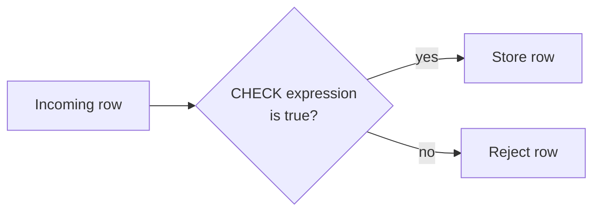
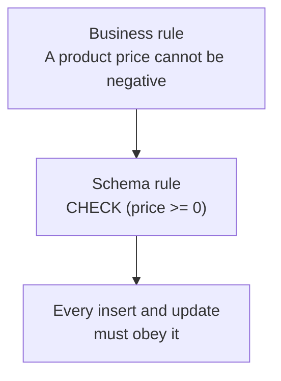
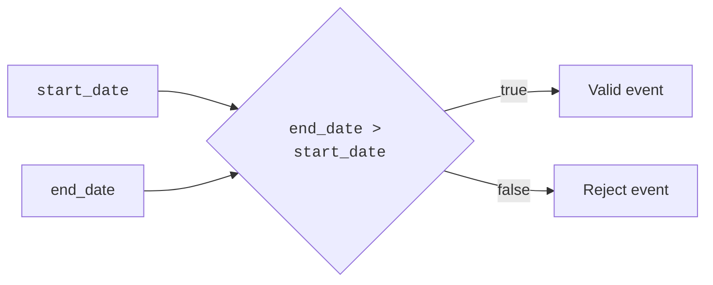
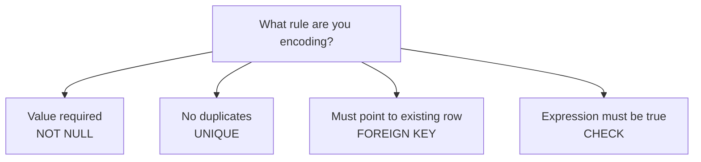
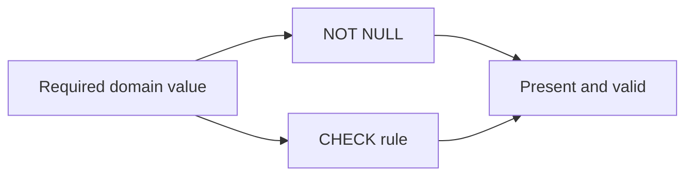

A product with a negative price is not a discounted product. It is bad
data. An order with status `banana` is not creative; it is invalid.

A **CHECK** constraint lets the schema say those things out loud.

## CHECK encodes a domain rule

A CHECK constraint is a boolean expression that must be true for every
row. If the expression is false, PostgreSQL rejects the write.

The expression can refer to columns in the same row. That makes CHECK a
natural fit for rules like:

- `price >= 0`
- `quantity > 0`
- `status IN ('draft', 'published', 'archived')`
- `end_date > start_date`

These are **domain rules**: they define which values make sense for the
kind of thing the table stores.

## Business rule to schema rule

The most important design move is translating a sentence about the
business into a rule the database can enforce.

Once the rule lives in the schema, it applies to every writer. No import
job, admin script, or forgotten form can sneak around it.

<Callout type="success" title="CHECK is a guardrail">
A CHECK constraint is especially useful when a value has a small valid
range, a minimum or maximum, or a relationship to another column in the
same row.
</Callout>

## Watch CHECK reject bad values

This table protects two rules: product prices cannot be negative, and
status must be one of a small set of allowed values.

<SqlCodeBlock
  dialect="postgres"
  title="CHECK rejects negative prices and bad statuses"
  initSql={`CREATE TABLE products (
  id     SERIAL PRIMARY KEY,
  name   TEXT NOT NULL,
  price  NUMERIC NOT NULL CHECK (price >= 0),
  status TEXT NOT NULL CHECK (status IN ('draft', 'active', 'archived'))
);

INSERT INTO products (name, price, status)
VALUES ('Notebook', 4.50, 'active');`}
  starterCode={`-- Negative prices are not valid products.
INSERT INTO
  products (name, price, status)
VALUES
  ('Impossible discount', -2.00, 'active');

-- Try commenting the insert above, then run this bad status instead.
INSERT INTO
  products (name, price, status)
VALUES
  ('Mystery item', 5.00, 'banana');

SELECT
  id,
  name,
  price,
  status
FROM
  products;`}
/>

The error is the lesson: the schema refuses to contain rows that break
its definition of a valid product.

## CHECK with multiple columns

CHECK constraints can compare columns in the same row. For an event,
`end_date` should come after `start_date`.

<SqlCodeBlock
  dialect="postgres"
  title="A CHECK constraint can compare columns"
  initSql={`CREATE TABLE events (
  id         SERIAL PRIMARY KEY,
  name       TEXT NOT NULL,
  start_date DATE NOT NULL,
  end_date   DATE NOT NULL,
  CHECK (end_date > start_date)
);`}
  starterCode={`-- The end date is before the start date, so the row is rejected.
INSERT INTO
  events (name, start_date, end_date)
VALUES
  (
    'Backwards conference',
    '2026-06-10',
    '2026-06-08'
  );

SELECT
  *
FROM
  events;`}
/>

This is still one-row logic. CHECK is excellent for rules that can be
decided by looking at the row being written.

## Quick check

<MultipleChoice
  markdown={`Which business rule is a natural fit for a \`CHECK\` constraint?

- Every order must reference an existing customer.
  > That is a foreign key rule because it depends on another table.
- [o] A product price must be greater than or equal to zero.
  > This rule can be checked from the product row itself, so CHECK is a good fit.
- Every email must be different from every other email.
  > That is a uniqueness rule, handled by UNIQUE.
- Every row must have a primary key.
  > Primary key constraints provide row identity.

CHECK is best for row-level domain rules that evaluate to true or false.`}
/>

## CHECK vs. other constraints

CHECK is one member of the constraint family. It does not replace the
others.

If the rule is "this value is required," use `NOT NULL`. If the rule is
"this value cannot repeat," use `UNIQUE`. If the rule is "this reference
must exist," use `FOREIGN KEY`. If the rule is "this expression must be
true for the row," use `CHECK`.

## A note about NULL and CHECK

At a beginner level, the safe pattern is simple: combine CHECK with
`NOT NULL` when the value is required.

Why? SQL treats NULL as unknown. A CHECK constraint rejects false, but a
NULL expression may be unknown rather than false. If the column must be
present, say that directly with `NOT NULL`.

For example, prefer `price NUMERIC NOT NULL CHECK (price >= 0)` when
every product must have a price.

## Quick check

<MultipleChoice
  markdown={`Why are \`NOT NULL\` and \`CHECK (price >= 0)\` often used together for a required price?

- CHECK automatically creates a price when it is missing.
  > CHECK does not fill in values; DEFAULT handles omitted values.
- [o] NOT NULL requires the value to exist, and CHECK requires the existing value to be valid.
  > The two constraints protect different parts of the rule: presence and allowed range.
- NOT NULL prevents duplicate prices.
  > Duplicate prevention is handled by UNIQUE.
- CHECK makes the column a primary key.
  > CHECK does not identify rows; it only tests a condition.

Required domain values often need both presence and validity rules.`}
/>

## Check your understanding

<MultipleChoice
  markdown={`What does a \`CHECK\` constraint do?

- It checks whether a query returned at least one row.
  > CHECK constraints are part of table definitions and run during writes.
- [o] It requires a boolean expression to be true for each row being inserted or updated.
  > PostgreSQL rejects the write when the CHECK expression fails.
- It checks spelling in text columns.
  > CHECK evaluates SQL expressions; it is not a spellchecker.
- It checks whether the database has a backup.
  > Backups are operational; CHECK constraints protect row validity.

CHECK constraints enforce row-level expressions in the schema.`}
/>

<MultipleChoice
  markdown={`Which SQL fragment best enforces that \`status\` is one of three allowed values?

- \`status TEXT UNIQUE\`
  > UNIQUE would prevent two rows from sharing the same status, which is not the goal.
- \`status TEXT DEFAULT 'draft'\`
  > DEFAULT supplies an omitted value but does not reject other bad statuses.
- [o] \`status TEXT CHECK (status IN ('draft', 'active', 'archived'))\`
  > The CHECK expression limits the column to the allowed set.
- \`status TEXT REFERENCES status\`
  > This is not a complete foreign key definition and is not the simplest form for this small fixed list.

A CHECK with IN is a common way to encode a small allowed set.`}
/>

<MultipleChoice
  markdown={`A rule says \`end_date\` must be after \`start_date\` in the same row. Which constraint type fits best?

- DEFAULT.
  > DEFAULT chooses omitted values; it does not compare dates.
- UNIQUE.
  > UNIQUE prevents duplicates, not backwards date ranges.
- [o] CHECK.
  > CHECK can compare columns in the same row with an expression like \`end_date > start_date\`.
- FOREIGN KEY.
  > A foreign key checks references between tables, not two columns in one row.

CHECK is the row-level expression constraint.`}
/>
