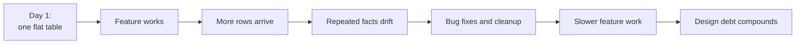
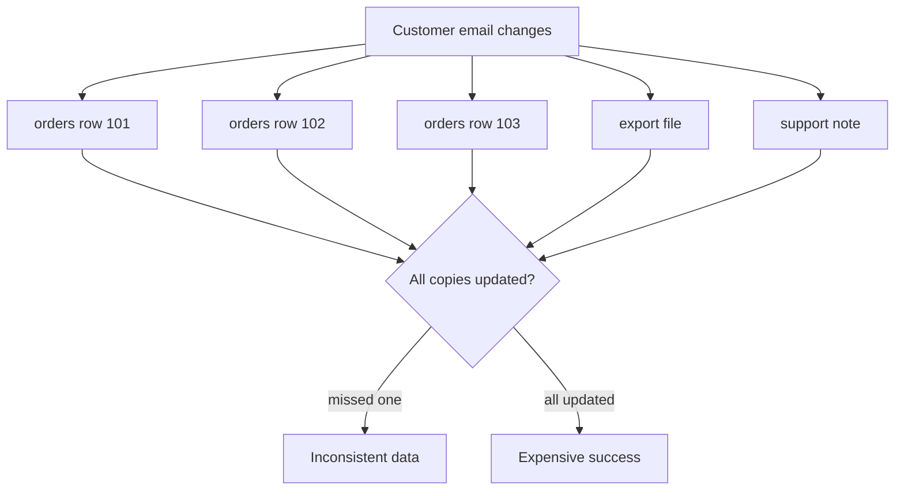
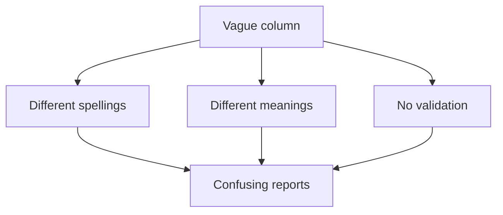
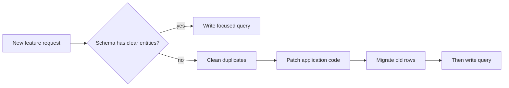

A bad schema rarely feels bad on the first day. You create one table,
put every visible field into it, insert a few rows, and the first
screen works. The trap is that day-one success can hide design choices
that become expensive only after real data, real users, and real
features arrive.

**Poor design** is cheap to create because it avoids hard questions:
What is the real entity? What facts repeat? What must be unique? What
relationship should the database protect? But those questions do not
disappear. They come back later as bugs, cleanup scripts, confusing
queries, and fear of changing anything.

## The day-one trap

Imagine an order screen that stores customer and product details in one
flat table. The first report works because there are only three rows.
Then customers change emails, product names change, and new features
need order history by product.

The schema did not suddenly become worse. The system simply grew large
enough for the original shortcuts to matter.

## Duplication turns one fact into many chores

If Ada's email is stored on every order row, then Ada's email is not
one fact anymore. It is many copies of a fact. Every copy must stay in
sync forever.

Even if every update succeeds, the design has made success expensive.
The system must keep fixing the same fact in many places.

<Callout type="warn" title="Design debt behaves like interest">
A shortcut in the schema can save one hour today and cost ten minutes
on every future change. The problem is not only the first cleanup. It
is the repeated cost paid by every developer and every feature after
that.
</Callout>

## Missing keys create uncertainty

A table without a reliable key cannot always say which row represents
which thing. Two customers may share a name. One customer may change an
email. A product name may be corrected.

Without keys, application code starts using unstable details as
identity. That leads to bugs like:

- Updating the wrong customer because names match.
- Treating one customer as two because an email changed.
- Joining rows on text that was typed slightly differently.
- Creating duplicates because nothing prevents them.

Keys are not just technical decoration. They are how a database lets
other rows point to one exact thing.

## Quick check

<MultipleChoice
  markdown={`Why can a schema that "works on day one" still be a poor design?

- Day-one schemas are never allowed in PostgreSQL.
  > PostgreSQL will store many weak designs if the SQL is valid.
- [o] Early data may be too small to reveal duplication, missing keys, and vague meanings.
  > Many design problems become visible only after data grows and requirements change.
- A first feature cannot read from a database table.
  > A first feature can work while still depending on fragile structure.
- Poor design always causes an immediate syntax error.
  > Schema design problems are often logical, not syntax errors.

A schema can pass the first demo and still create long-term cost.`}
/>

## Vague columns push rules into people's heads

Columns like `status`, `type`, `data`, or `notes` are not automatically
bad. They become risky when nobody can say exactly what values mean or
which values are allowed.

A vague `status` column might contain:

| order_id | status |
| --- | --- |
| 101 | paid |
| 102 | Paid |
| 103 | complete |
| 104 | done |

Are those four different states? Two states? One state typed four
ways? If the database does not know, every query and every application
has to decide.

Clear design gives important concepts names, types, and constraints so
the database can protect them.

## Update anomalies are design warnings

An **update anomaly** happens when changing one real-world fact
requires updating multiple rows, and missing one row leaves the data
in disagreement with itself.

Run this example. The update fixes Ada's email in two rows, but only
because the query found every matching copy.

<SqlCodeBlock
  dialect="postgres"
  title="A flat design forces a multi-row update"
  initSql={`DROP TABLE IF EXISTS order_spreadsheet;

CREATE TABLE order_spreadsheet (
  order_id       INTEGER PRIMARY KEY,
  customer_name  TEXT NOT NULL,
  customer_email TEXT NOT NULL,
  product_name   TEXT NOT NULL,
  quantity       INTEGER NOT NULL CHECK (quantity > 0)
);

INSERT INTO order_spreadsheet VALUES
  (101, 'Ada Lovelace', 'ada@old.example', 'Notebook', 2),
  (102, 'Ada Lovelace', 'ada@old.example', 'Pen', 5),
  (103, 'Grace Hopper', 'grace@example.com', 'Notebook', 1);`}
  initialCode={`UPDATE order_spreadsheet
SET customer_email = 'ada@new.example'
WHERE customer_name = 'Ada Lovelace';

SELECT
  customer_name,
  customer_email,
  COUNT(*) AS rows_with_that_email
FROM order_spreadsheet
GROUP BY customer_name, customer_email
ORDER BY customer_name, customer_email;`}
/>

This is only a teaser. Later, normalization will show how to store Ada
once in a `customers` table and let orders point to her. Then changing
her email is one update to one row.

## Quick check

<MultipleChoice
  markdown={`What is the design problem shown by an update anomaly?

- The database cannot update rows at all.
  > PostgreSQL can update rows; the problem is that one fact has been copied into many rows.
- The table has too many numeric columns.
  > An update anomaly is about repeated facts, not numeric data specifically.
- [o] One real-world fact must be changed in multiple stored places.
  > Repeated copies can drift apart when one copy is missed.
- The query uses \`ORDER BY\` after updating.
  > Sorting results does not cause the anomaly.

An update anomaly is a symptom that a fact may need one authoritative home.`}
/>

## Bad design slows future features

Poor schemas make simple feature requests surprisingly large. Suppose a
product manager asks, "show the top-selling products this month." If
products are stored as repeated text in orders, the team must decide
whether `Notebook`, `notebook`, and `A5 Notebook` are the same product.
They may need cleanup before the feature can even begin.

A better design stores products once and order items point to them.
Then the feature is mostly a query.

The difference is not developer talent. It is whether the schema has
already answered the modeling questions the feature depends on.

## Design debt compounds

Design debt compounds because data outlives code. You can rewrite a
function tomorrow. But if a million rows store a confused idea, every
new version of the software must either understand that confusion or
pay to clean it up.

Common long-term costs include:

- Extra code to handle inconsistent old values.
- Reports that require manual correction.
- Migrations that are risky because relationships are unclear.
- Slow development because nobody trusts what a column means.
- More bugs because validation lives in scattered application code.

Good design is not about predicting every future feature. It is about
making the important facts clear enough that future change has a stable
base.

## Check your understanding

<MultipleChoice
  markdown={`Which design choice most directly creates duplicate facts?

- Giving a table a primary key.
  > A primary key gives rows identity; it does not by itself duplicate facts.
- [o] Storing customer email on every order row.
  > The same customer email becomes many copies that must stay synchronized.
- Using \`DATE\` for an order date.
  > A date type gives one fact an appropriate type.
- Creating a separate \`customers\` table.
  > A customers table usually reduces duplication by giving customer facts one home.

Duplicate facts create repeated maintenance work and inconsistency risk.`}
/>

<MultipleChoice
  markdown={`Why are missing keys expensive later?

- They make it impossible to insert any rows.
  > Tables can store rows without keys, but the rows may lack reliable identity.
- They force every value to be unique.
  > Keys enforce uniqueness only where defined; missing keys do not enforce it.
- [o] Code and people may not know which exact row a fact refers to.
  > Without stable identity, updates, joins, and deduplication become uncertain.
- They automatically delete old data.
  > Missing keys do not automatically delete rows.

Reliable keys reduce ambiguity before many features depend on the data.`}
/>

<MultipleChoice
  markdown={`What is a likely symptom of a vague \`status\` column with no rules?

- Every row will be rejected by PostgreSQL.
  > PostgreSQL accepts many text values unless a constraint limits them.
- [o] Reports may disagree because similar states are spelled or interpreted differently.
  > Values like \`paid\`, \`Paid\`, and \`complete\` can make counts depend on guesswork.
- The table cannot have a primary key.
  > A table can have a primary key and still have vague columns.
- Joins become mathematically impossible.
  > Joins may still run, but the meaning of the results can be unclear.

Important states deserve explicit modeling and validation.`}
/>

<MultipleChoice
  markdown={`What does it mean that design debt compounds?

- A database charges money for every table.
  > The cost is maintenance effort and risk, not a literal per-table fee.
- Poor design becomes easier to fix automatically as rows increase.
  > More data and more dependent code usually make cleanup harder.
- [o] A shortcut can add repeated cost to many future changes.
  > Each later feature may need extra cleanup, special cases, or migration work because of the original shortcut.
- Schema design matters only after performance tuning begins.
  > Design affects correctness and changeability long before performance tuning.

The cheapest time to clarify core facts is before many rows and features depend on them.`}
/>
