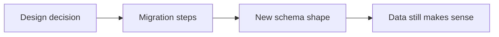
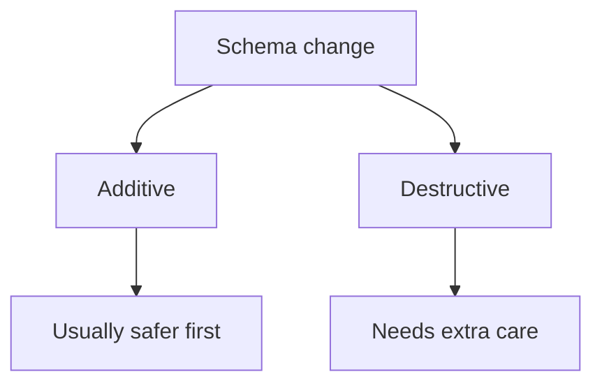
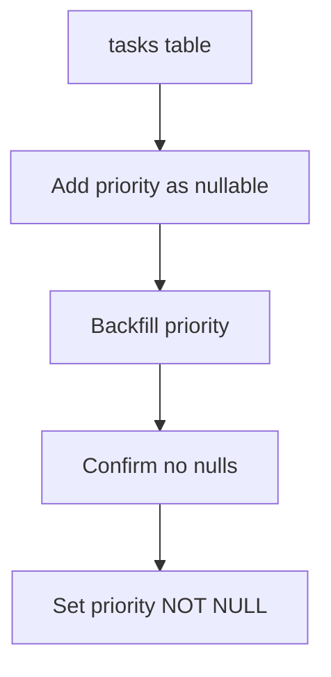
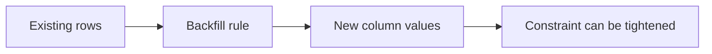
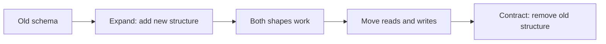
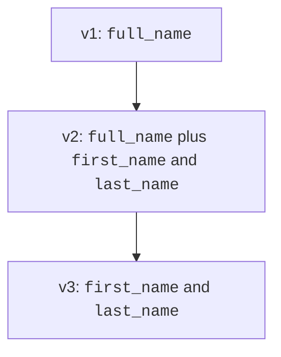
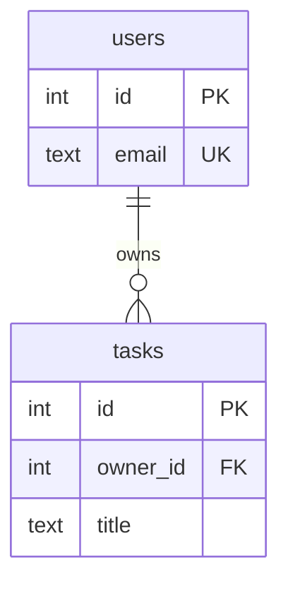
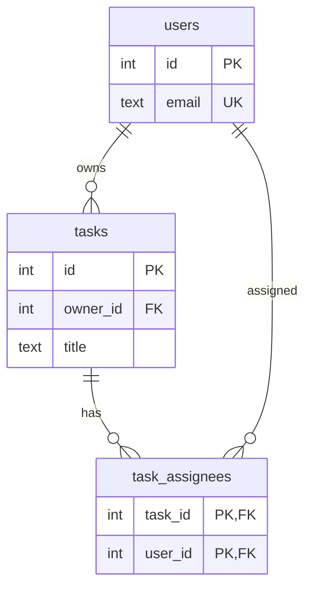

Changing a schema is easy when no one uses it yet. It is harder after
real rows, real queries, and real application code depend on it.

A safe schema change treats the migration as a sequence of deliberate
steps, not one dramatic rewrite:

1. Start from the new requirement.
2. Plan the migration.
3. Add compatible structure.
4. Backfill existing rows.
5. Verify the data matches the new rule.
6. Tighten the constraint.
7. Remove the old structure later.

<svg
  viewBox="0 0 640 210"
  role="img"
  aria-label="Version circles climb a dotted trail, each one carrying a larger green wedge of completed change — a migration advancing in small deliberate steps"
  style={{ display: "block", width: "100%", maxWidth: "640px", height: "auto", margin: "2.5rem auto" }}
>
  <g style={{ color: "var(--ds-blue-500)" }} fill="currentColor">
    <circle cx="130" cy="150" r="26" fillOpacity="0.85" />
    <circle cx="320" cy="105" r="26" fillOpacity="0.85" />
    <circle cx="510" cy="60" r="26" fillOpacity="0.85" />
  </g>
  <g style={{ color: "var(--ds-green-500)" }} fill="currentColor">
    <path d="M130 150 L130 124 A26 26 0 0 1 156 150 Z" />
    <path d="M320 105 L320 79 A26 26 0 0 1 320 131 Z" />
    <path d="M510 60 L510 34 A26 26 0 1 1 484 60 Z" />
  </g>
  <g fill="currentColor" opacity="0.3">
    <circle cx="180" cy="142" r="3" />
    <circle cx="210" cy="132" r="3" />
    <circle cx="270" cy="114" r="3" />
    <circle cx="370" cy="97" r="3" />
    <circle cx="400" cy="88" r="3" />
    <circle cx="460" cy="69" r="3" />
  </g>
  <g style={{ color: "var(--ds-yellow-500)" }} fill="currentColor">
    <circle cx="240" cy="123" r="5" />
    <circle cx="430" cy="78" r="5" />
  </g>
</svg>

## Migrations are ordered changes

A **migration** is an intentional change to the schema. It might add a
column, create a table, copy data, add a constraint, or remove an old
column after the new design is ready.

Good migrations are:

- small enough to understand
- ordered so each step has a reason
- reversible when possible
- tested against existing data

This page stays at the design level. The point is not database
operations; it is how to protect meaning while the model changes.

## Additive changes are safer

An **additive** change adds something without removing the old shape.
Examples include adding a nullable column, adding a new table, or
adding a new relationship table.

A **destructive** change removes or changes something existing. Dropping
a column, renaming a table, or changing a required type can break code
and lose data.

<MultipleChoice
  markdown={`Why are additive schema changes usually safer than destructive ones?

- They never require design thinking.
  > Additive changes still need clear modeling decisions.
- [o] Existing data and code can often keep using the old shape while the new shape is introduced.
  > Adding compatible structure reduces the chance of breaking current dependencies immediately.
- PostgreSQL refuses to run destructive changes.
  > PostgreSQL can run destructive changes, but they may remove data or break code.
- Additive changes automatically normalize every table.
  > Adding structure does not guarantee a normalized model.

Safe evolution often introduces the new design before removing the old one.`}
/>

## Add a NOT NULL column safely

A common mistake is trying to add a required column in one step when
old rows do not have values yet.

A safer pattern is:

1. Add the column as nullable.
2. Backfill values for existing rows.
3. Check that every row now has a value.
4. Set the column `NOT NULL`.

<SqlCodeBlock
  dialect="postgres"
  title="Add a required column in safe steps"
  initSql={`DROP TABLE IF EXISTS tasks;

CREATE TABLE tasks (
    id INT GENERATED ALWAYS AS IDENTITY PRIMARY KEY,
    title TEXT NOT NULL,
    status TEXT NOT NULL CHECK (status IN ('open', 'done'))
);

INSERT INTO tasks (title, status) VALUES
    ('Draft design', 'open'),
    ('Review keys', 'done');
`}
  starterCode={`ALTER TABLE tasks
ADD COLUMN priority TEXT;

UPDATE tasks
SET
  priority = 'normal'
WHERE
  priority IS NULL;

ALTER TABLE tasks
ALTER COLUMN priority
SET NOT NULL;

ALTER TABLE tasks
ADD CONSTRAINT tasks_priority_check CHECK (priority IN ('low', 'normal', 'high'));

SELECT
  id,
  title,
  status,
  priority
FROM
  tasks
ORDER BY
  id;`}
/>

The end state has a required, constrained column. The path avoids
asking old rows to magically have a value before you provide one.

## Backfilling preserves meaning

A **backfill** fills new structure using existing data or a chosen
default. The design question is: what value should old rows mean?

Backfills should be explicit. If every old task should start as
`normal` priority, write that rule down in the migration.

<MultipleChoice
  markdown={`In the safe \`NOT NULL\` pattern, why do you backfill before setting \`NOT NULL\`?

- Backfilling deletes rows with missing values.
  > A backfill supplies values; it should not delete rows by default.
- [o] Existing rows need valid values before the database can enforce the required rule.
  > A required column cannot contain nulls once the constraint is tightened.
- PostgreSQL requires every nullable column to be backfilled daily.
  > Backfilling is a design step for this change, not a daily requirement.
- It makes the column disappear from queries.
  > Backfilling changes data values, not column visibility.

Tighten constraints after the data satisfies them.`}
/>

## Expand and contract

The **expand/contract** pattern, also called parallel change, avoids a
big-bang switch.

First you expand the schema so both old and new shapes can exist. Then
you move data and code toward the new shape. Finally, after the old
shape is no longer needed, you contract by removing it.

For example, a `customers.full_name` column might become separate
`first_name` and `last_name` columns.

The middle version is temporary, but important. It gives the product a
safe bridge from old meaning to new meaning.

## Before and after a relationship change

Suppose each task originally has one owner.

Later, tasks can have multiple assignees. The expanded schema adds a
new table before the old column is removed.

Only after data and code use `task_assignees` would a later migration
remove `tasks.owner_id`.

## Check your understanding

<MultipleChoice
  markdown={`What is the safest order for adding a required column to a table with existing rows?

- Add it as \`NOT NULL\`, then decide values later.
  > Existing rows would immediately violate the requirement unless a valid default exists.
- [o] Add nullable, backfill, verify, then set \`NOT NULL\`.
  > This order lets existing data satisfy the rule before the rule is enforced.
- Drop the table and recreate it from memory.
  > Dropping the table is destructive and can lose data.
- Add a foreign key to an unrelated table first.
  > An unrelated foreign key does not solve missing values.

Safe migrations make invalid intermediate states unlikely.`}
/>

<MultipleChoice
  markdown={`What does the "expand" phase do in expand/contract?

- Removes the old schema immediately.
  > Removing old structure is the contract phase, and it should happen later.
- [o] Adds new structure while keeping the old structure available.
  > Expansion creates a compatibility period where both shapes can exist.
- Deletes all existing data.
  > Expansion should preserve existing data.
- Prevents any future constraints.
  > New constraints may be added after data is prepared.

Expand first, contract only after the new design is in use.`}
/>

<MultipleChoice
  markdown={`Why is a backfill a design decision?

- [o] It chooses what old rows mean in the new schema.
  > The value assigned to existing rows should reflect product meaning, not guesswork.
- It only changes table names.
  > A backfill writes data into new or changed structure.
- It is required only for empty tables.
  > Empty tables usually do not need old rows filled.
- It replaces primary keys.
  > Backfilling does not generally change row identity.

Data migration should preserve meaning, not just satisfy syntax.`}
/>

<MultipleChoice
  markdown={`When should the old column usually be removed in a parallel change?

- Before the new table exists.
  > Removing first creates a gap where the new design cannot yet represent the data.
- Immediately after writing the first diagram.
  > Diagrams do not prove that data and code have moved.
- [o] After data and dependent code have moved to the new structure.
  > The contract phase should happen only when the old shape is no longer needed.
- Never, even if nothing depends on it.
  > Keeping unused structure forever can confuse future design.

Contract after the new design has safely taken over.`}
/>
