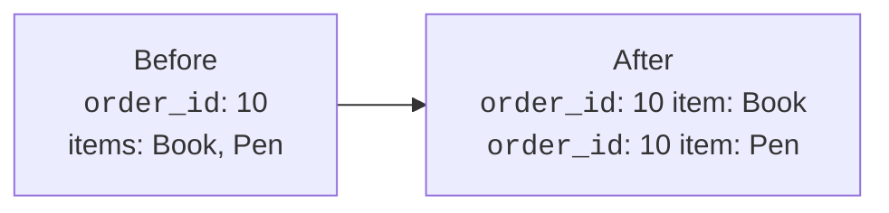
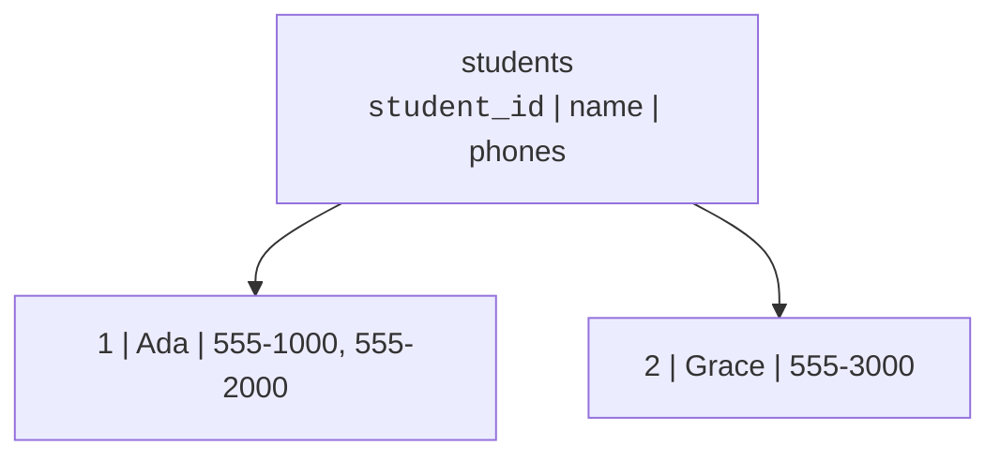
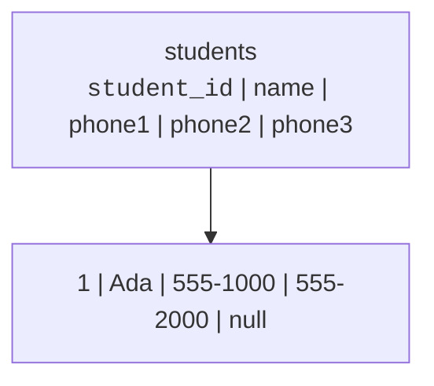
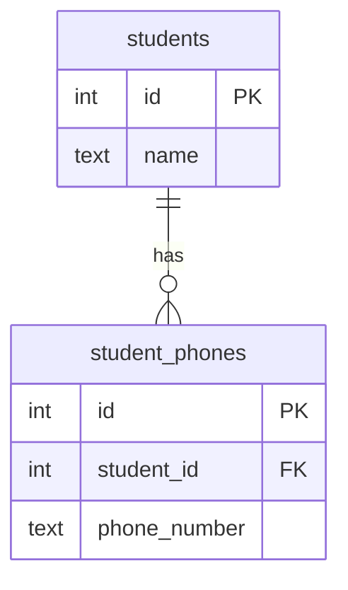
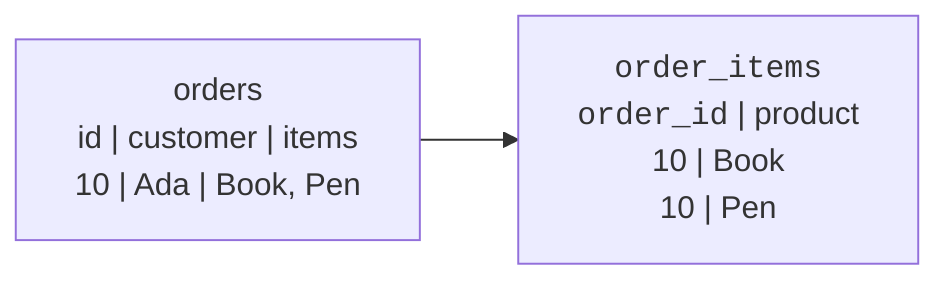

A table can look tidy and still hide a design problem. Imagine an order
row with a cell that says `Book, Pen, Mug`. It is one cell, but it is
really three values squeezed together.

**First normal form (1NF)** is the first cleanup step: every cell holds
one value, and the table has no repeating groups.

## What 1NF protects you from

A table violates 1NF when it stores multiple values in one place or
repeats the same kind of column several times.

Common warning signs:

- comma-separated lists like `Book, Pen`
- columns like `phone1`, `phone2`, `phone3`
- columns like `product_a`, `product_b`, `product_c`
- a cell that must be split apart before you can query it

The after version has more rows, but each row is simpler. SQL can
filter, count, join, and constrain the values because each value has its
own cell.

## One value per cell

Suppose a school stores student phone numbers like this:

That `phones` cell is not atomic. **Atomic** means the value is treated
as one indivisible value for the purpose of the design. A phone number
is atomic here; a comma-separated list of phone numbers is not.

If you want to find the student with phone `555-2000`, the database has
to search inside a string. If you want to prevent duplicate phone
numbers, a normal `UNIQUE` constraint cannot see the separate values.

## Repeating columns are the same problem

Some designs avoid comma-separated lists by adding more columns:

This also violates the spirit of 1NF. The columns `phone1`, `phone2`,
and `phone3` form a **repeating group**. They answer the same question
three times: *what phone number belongs to this student?*

The design also bakes in a limit. What happens when a student has four
numbers? Add `phone4`? Every query and form must then learn about a new
column.

## Quick check

<MultipleChoice
  markdown={`Which table design most clearly violates 1NF?

- \`students(student_id, name)\` with one row per student.
  > Each listed column stores one value about one student.
- [o] \`students(student_id, name, phones)\` where \`phones\` contains \`555-1000, 555-2000\`.
  > The phones cell contains multiple values hidden inside one string.
- \`student_phones(student_id, phone_number)\` with one row per phone number.
  > Separate rows are the usual 1NF-friendly way to store multiple values.
- \`products(product_id, name, price)\` with one price per product.
  > One price value per row does not create a repeating group.

1NF asks whether each cell holds one value of the right kind.`}
/>

<MultipleChoice
  markdown={`Why are columns like \`phone1\`, \`phone2\`, and \`phone3\` a design smell?

- They use text instead of numbers.
  > The problem is not the data type; phone numbers are often stored as text.
- They prevent the table from having a primary key.
  > A table could still have a primary key while using a poor repeating-column design.
- [o] They are a repeating group that should usually become rows in a child table.
  > Repeating columns are multiple slots for the same kind of fact.
- They make every phone number required.
  > Some columns may be nullable, but the repeating-group problem remains.

When the same attribute name needs a number suffix, look for a child table.`}
/>

## Fixing a 1NF violation

The usual fix is to split the repeating values into rows. When those
values belong to another entity, place them in a **child table** that
references the parent.

Now each phone number is a row. A student can have zero, one, or many
phone numbers without changing the table structure.

<SqlCodeBlock
  dialect="postgres"
  title="A 1NF-friendly child table"
  initSql={`CREATE TABLE students (
  id   INTEGER PRIMARY KEY,
  name TEXT NOT NULL
);

CREATE TABLE student_phones (
  id           INTEGER PRIMARY KEY,
  student_id   INTEGER NOT NULL REFERENCES students(id),
  phone_number TEXT NOT NULL,
  UNIQUE (student_id, phone_number)
);

INSERT INTO students VALUES
  (1, 'Ada'),
  (2, 'Grace');

INSERT INTO student_phones VALUES
  (101, 1, '555-1000'),
  (102, 1, '555-2000'),
  (103, 2, '555-3000');`}
  starterCode={`-- Each phone number is now its own row.
SELECT
  s.name,
  p.phone_number
FROM
  students s
  JOIN student_phones p ON p.student_id = s.id
ORDER BY
  s.name,
  p.phone_number;`}
/>

The child table also lets the database protect facts. The foreign key
requires every phone row to belong to a real student. The `UNIQUE`
constraint prevents the same phone number from being listed twice for
the same student.

## Orders and line items

The same idea appears in order design. A single order can contain many
products, but that does not mean the order row should contain a product
list.

A separate `order_items` table gives every item its own row. Later, when
you learn about many-to-many relationships, this pattern will become
one of the most important tools in your design toolkit.

## 1NF is necessary, not sufficient

Reaching 1NF does not mean the design is fully normalized. It only means
the table no longer has repeating groups or multi-value cells.

The next normal forms ask a different question: once the cells are
atomic, do the columns depend on the right key?

## Check your understanding

<MultipleChoice
  markdown={`What does first normal form require?

- Every table must have exactly one column.
  > 1NF says cells should hold single values; it does not limit a table to one column.
- [o] Each cell should hold one value, with no repeating groups such as lists or numbered columns.
  > Atomic cells and no repeating groups are the core 1NF idea.
- Every table must avoid foreign keys.
  > Foreign keys often appear in the child tables that fix 1NF violations.
- Every text column must be replaced with an integer.
  > Text can be perfectly valid in 1NF when each cell holds one value.

1NF is about the shape of values inside rows and columns.`}
/>

<MultipleChoice
  markdown={`A row stores \`items = 'Book, Pen, Mug'\`. What is the best 1NF-friendly fix?

- Keep the list and search it with string matching.
  > String matching hides separate values inside one cell and keeps the 1NF problem.
- Add more commas so the format is consistent.
  > A consistently formatted list is still a multi-value cell.
- [o] Store each item as its own row, usually in an order-items child table.
  > Separate rows let SQL treat each item as a real value.
- Store the list in the primary key.
  > A primary key should identify a row, not pack repeated values into one field.

When a cell contains a list, the list usually wants to become rows.`}
/>

<MultipleChoice
  markdown={`Why is a child table useful for multi-valued facts like student phone numbers?

- It limits each student to exactly one phone number.
  > A child table allows many phone rows per student.
- [o] It stores one phone number per row while linking each number back to its student.
  > The foreign key keeps the relationship, and each value gets its own row.
- It removes the need for a student table.
  > The child table depends on the parent student table.
- It makes phone numbers impossible to query.
  > Separate rows make phone numbers easier to filter, count, and constrain.

Child tables are the standard way to model repeated facts without repeated columns.`}
/>

<MultipleChoice
  markdown={`After a table reaches 1NF, what question do later normal forms ask next?

- Whether all values have been converted to uppercase.
  > Case formatting is not the purpose of later normal forms.
- Whether every query can avoid joins.
  > Later normal forms often introduce clean joins between related tables.
- [o] Whether non-key columns depend on the right key and only that key.
  > 2NF and 3NF focus on dependencies between keys and non-key columns.
- Whether the database has only one table.
  > Normalization usually splits facts across several related tables.

1NF fixes repeated values; 2NF and 3NF examine dependencies.`}
/>
