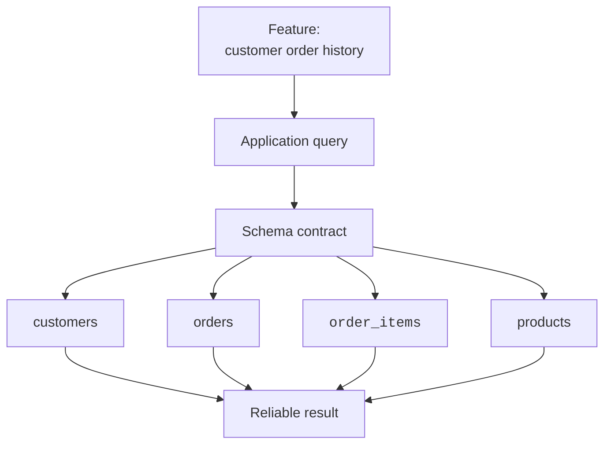
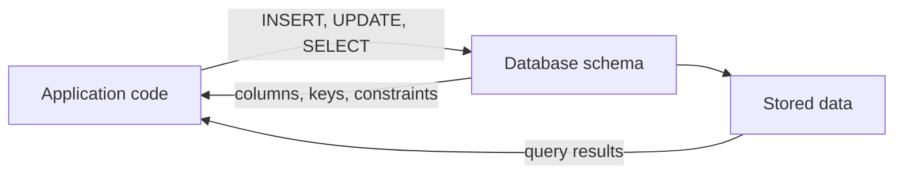
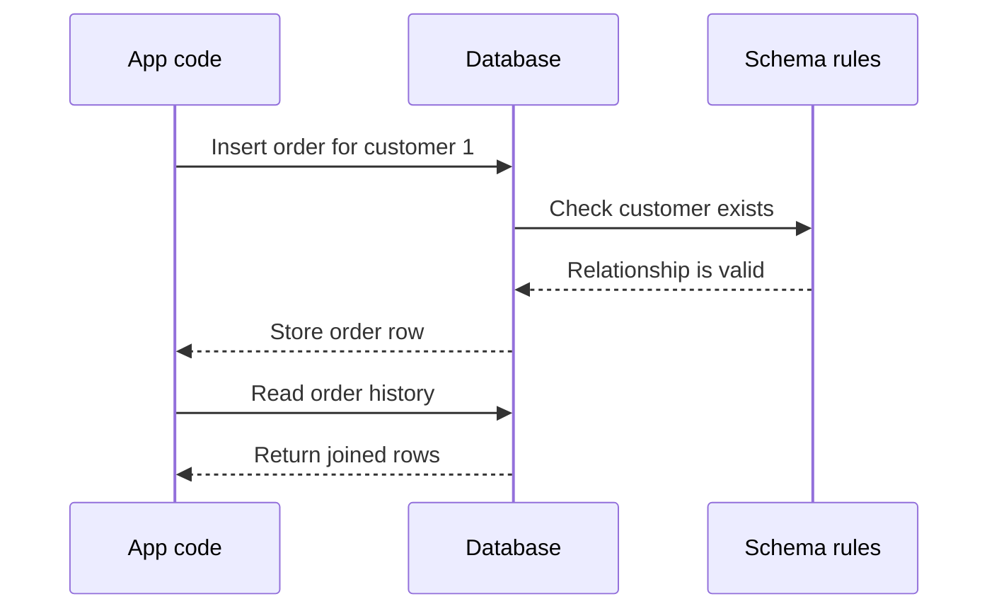
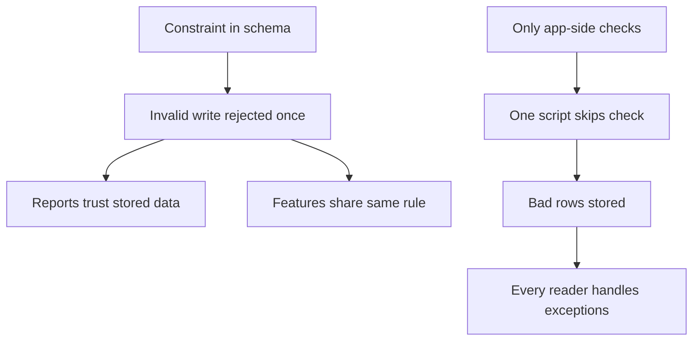
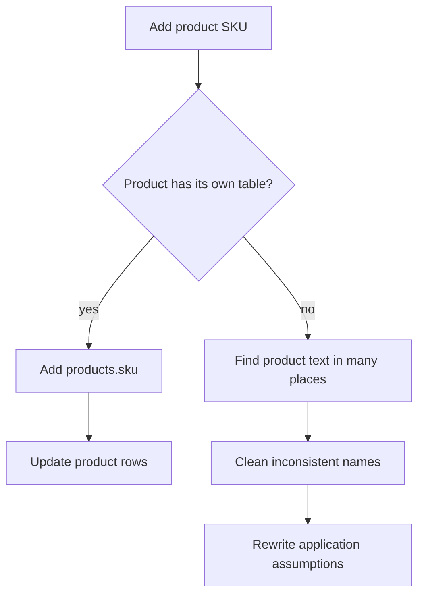

When an application feels easy or painful to change, the schema is often
part of the reason. A feature may look like a button or a report, but
underneath it is a question about stored facts. If the facts are cleanly
modeled, the feature can be small. If the facts are tangled, the
feature may become a rewrite.

A **schema decision** is not isolated inside the database. It shapes the
code that reads, writes, validates, displays, imports, exports, and
reports on the data.

## The schema is the foundation

Application code does not talk to vague ideas like "an order" in the
abstract. It talks to tables, columns, keys, and constraints. Those
schema choices become the foundation every feature stands on.

If the schema says orders point to customers and order items point to
products, the code can build on that contract. If the schema stores a
product name in a free-text note, the code has to guess.

## Code and schema depend on each other

The relationship goes both ways. The schema shapes code, and code
creates data that must obey the schema.

This feedback loop is why changing a schema later can be hard. A column
name, relationship, or meaning may be referenced in many places:
forms, API handlers, reports, tests, exports, and background jobs.

<Callout type="info" title="Schemas become contracts">
A schema is a contract between the database and every program that uses
it. Changing the contract can be necessary, but it requires care
because many callers may depend on the old shape.
</Callout>

## How applications read and write through a schema

A clean schema gives the application a path. The app asks for a write,
the database checks the rules, and later queries can trust the stored
relationships.

The important idea is that the database is not a passive file. The
schema participates in every read and write by defining what is valid
and how facts connect.

## Quick check

<MultipleChoice
  markdown={`Why can changing a schema later be difficult?

- PostgreSQL allows tables to be created only once ever.
  > Schemas can change, but changes must account for existing data and dependent code.
- [o] Application code, reports, and tests may already depend on the old shape.
  > The schema becomes a contract used by many parts of the system.
- A changed schema automatically deletes every row.
  > Some changes can risk data loss, but schema changes do not automatically delete everything.
- SQL queries never reference column names.
  > Queries commonly reference table and column names directly.

Schema changes affect both stored data and the software that uses it.`}
/>

## Clean design makes new features smaller

Suppose a product manager asks, "Which customers bought a notebook?"
With a clean schema, that is a join across known relationships:
customers to orders, orders to order items, order items to products.

<SqlCodeBlock
  dialect="postgres"
  title="A new question answered by a clean schema"
  initSql={`DROP TABLE IF EXISTS order_items;
DROP TABLE IF EXISTS orders;
DROP TABLE IF EXISTS products;
DROP TABLE IF EXISTS customers;

CREATE TABLE customers (
  id    INTEGER PRIMARY KEY,
  name  TEXT NOT NULL,
  email TEXT NOT NULL UNIQUE
);

CREATE TABLE products (
  id    INTEGER PRIMARY KEY,
  name  TEXT NOT NULL UNIQUE
);

CREATE TABLE orders (
  id          INTEGER PRIMARY KEY,
  customer_id INTEGER NOT NULL REFERENCES customers(id),
  ordered_on  DATE NOT NULL
);

CREATE TABLE order_items (
  order_id   INTEGER NOT NULL REFERENCES orders(id),
  product_id INTEGER NOT NULL REFERENCES products(id),
  quantity   INTEGER NOT NULL CHECK (quantity > 0),
  PRIMARY KEY (order_id, product_id)
);

INSERT INTO customers VALUES
  (1, 'Ada Lovelace', 'ada@example.com'),
  (2, 'Grace Hopper', 'grace@example.com'),
  (3, 'Katherine Johnson', 'katherine@example.com');

INSERT INTO products VALUES
  (10, 'Notebook'),
  (20, 'Pen'),
  (30, 'Backpack');

INSERT INTO orders VALUES
  (101, 1, DATE '2025-03-01'),
  (102, 2, DATE '2025-03-02'),
  (103, 1, DATE '2025-03-03');

INSERT INTO order_items VALUES
  (101, 10, 2),
  (101, 20, 5),
  (102, 30, 1),
  (103, 10, 1);`}
  starterCode={`SELECT DISTINCT
  customers.name,
  customers.email
FROM
  customers
  JOIN orders ON orders.customer_id = customers.id
  JOIN order_items ON order_items.order_id = orders.id
  JOIN products ON products.id = order_items.product_id
WHERE
  products.name = 'Notebook'
ORDER BY
  customers.name;`}
/>

The query is not magic. It is possible because the schema already knows
what a customer, order, order item, and product are.

## Messy design turns features into rewrites

Now imagine the same system stored each order as one text note:

| order_id | note |
| --- | --- |
| 101 | Ada bought 2 notebooks and 5 pens |
| 102 | Grace bought a backpack |

The feature request becomes harder. The code must parse text, handle
misspellings, decide whether `notebook` and `notebooks` match, and hope
old notes use the same pattern. The feature is no longer just a query.
It is data cleanup, parsing logic, and risk.

With a clean schema, a new question is short:

1. New question arrives.
2. Write a small join.

With a messy schema, the same question turns into a project:

1. New question arrives.
2. Parse the free text.
3. Clean up old values.
4. Patch the edge cases.
5. Maybe get an answer.

Good schema design does not remove all application work. It makes the
work about the feature instead of about recovering meaning from messy
storage.

## Quick check

<MultipleChoice
  markdown={`Why did the clean customer-product example need only a small query?

- The dataset had no relationships.
  > The query was small because relationships were explicit, not absent.
- The product name was stored inside one long note.
  > Free-text notes would require parsing and guesswork.
- [o] Customers, orders, order items, and products were modeled as related tables.
  > The schema already represented the path from customers to purchased products.
- PostgreSQL guessed which rows belonged together without keys.
  > Joins worked because keys and foreign keys made relationships explicit.

Clean relationships turn many feature requests into direct queries.`}
/>

## Constraints shape application behavior

Constraints do not just protect the database after the application does
something wrong. They also simplify application thinking. If
`order_items.quantity` has `CHECK (quantity > 0)`, every feature can
trust that stored quantities are positive.

Without that rule, every report, export, and calculation must wonder
whether negative or zero quantities already exist.

A database constraint is a central rule. Application validation is still
useful for friendly error messages, but the database rule protects the
shared data even when a different program writes to it.

## Schema choices affect future change

Changing a schema later is normal. The goal is not to freeze the first
model forever. The goal is to make changes understandable.

A well-modeled schema makes future changes more local. If product facts
live in `products`, adding a `sku` column belongs there. If product
facts are copied into order notes, adding reliable SKUs may require
parsing and rewriting historical text.

The best designs do not prevent change. They keep meaning clear enough
that change has somewhere sensible to go.

## Check your understanding

<MultipleChoice
  markdown={`What does it mean to say the schema is a foundation for features?

- Features can ignore the database after the first release.
  > Most data-backed features continue to read and write through the schema.
- [o] Feature code depends on the tables, columns, relationships, and rules that exist.
  > The schema defines the facts that application code can safely use.
- The schema decides the visual layout of every page.
  > The schema influences data behavior, not visual design directly.
- A foundation means the schema can never change.
  > Foundations can be renovated, but changes require care because other things rest on them.

Application features are easier to build when their data foundation is clear.`}
/>

<MultipleChoice
  markdown={`Which schema would best support the question "which customers bought notebooks?"

- One \`orders.note\` text column containing sentences about purchases.
  > Sentence parsing makes the answer depend on wording and cleanup.
- A spreadsheet exported once per month.
  > Exports may help analysis, but they are not a reliable live schema for application features.
- [o] Related \`customers\`, \`orders\`, \`order_items\`, and \`products\` tables.
  > This model gives the query a clear relationship path from customers to products.
- A table with no product identity and only customer names.
  > Without product identity, the database cannot reliably connect purchases to products.

Feature questions become simpler when the schema already models the relationships they need.`}
/>

<MultipleChoice
  markdown={`Why are database constraints useful even when applications also validate input?

- Constraints make user-friendly error messages unnecessary in every case.
  > Applications still often validate for helpful messages before data reaches the database.
- [o] Constraints protect the data no matter which program writes to the table.
  > A database rule is shared by apps, scripts, imports, and admin tools.
- Constraints allow invalid rows to be stored for later cleanup.
  > Constraints reject invalid rows according to the rule.
- Constraints replace the need to choose tables and relationships.
  > Constraints protect a design; they do not decide the whole model by themselves.

Application validation helps users, while database constraints protect shared truth.`}
/>

<MultipleChoice
  markdown={`What is a sign that a new feature may require a messy rewrite instead of a small query?

- The needed facts are already in separate related tables.
  > Clear related tables usually make the feature more direct.
- The schema has primary keys and foreign keys for core relationships.
  > Keys usually reduce ambiguity for feature code.
- [o] The needed facts are hidden inside free-text notes or copied across many places.
  > Hidden and duplicated facts require parsing, cleanup, and special cases before reliable queries are possible.
- The query needs a join between well-modeled tables.
  > Joins are normal when relationships are explicitly modeled.

Messy storage moves work from SQL questions into data recovery and redesign.`}
/>
