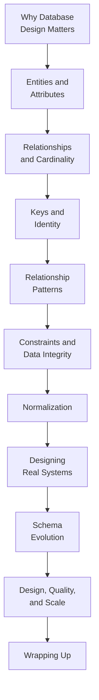

Welcome to **Database Design with PostgreSQL**. If you can already
write a `SELECT` with a `JOIN`, filter rows, and group results — but
you have never been the person who *decided what the tables should be
in the first place* — this course is built for you.

Writing queries and designing schemas are two different skills.
Querying asks *"how do I get the answer out of this database?"*
Design asks *"how should this database be shaped so that the answers
are easy, correct, and trustworthy for years to come?"* This course
is entirely about that second question.

<Callout type="info" title="Nothing to install">
Every SQL example runs **inside your browser** on a real PostgreSQL
engine (PGlite — PostgreSQL compiled to WebAssembly). There is no
server, no signup, and nothing to install. Edit the SQL, click
*Run*, and the results appear right below the editor.
</Callout>

## Who this course is for

You will feel at home here if:

- You can read and write basic SQL — `SELECT`, `WHERE`, `JOIN`,
  `GROUP BY` — but schema design still feels like guesswork.
- You have inherited a messy database and wondered *why* it is so
  painful to change.
- You are about to start a project and want to design the tables
  *before* the data turns into a mess.
- You understand what a table and a row are, but terms like
  *cardinality*, *normalization*, *referential integrity*, and
  *surrogate key* are fuzzy.

We assume you already understand the basics of querying and what a
relational table is. We do **not** assume you understand *why*
databases are structured the way they are — and that "why" is the
heart of this course.

## What this course is *not*

This is a **design and modeling** course. It deliberately spends
little or no time on the *operational* side of databases:

- Database administration, backups, and monitoring
- Query optimization and performance tuning
- PostgreSQL internals, replication, and high availability
- Cloud infrastructure, security hardening, and multi-user access
- ORMs, backend frameworks, and distributed systems

Those topics matter, but they are a different discipline. They also
make far more sense *after* you can design a clean schema — which is
exactly what you will be able to do by the end.

## What you will be able to do

By the end of the course you will be able to:

- Explain *why* structure, keys, and constraints exist — not just
  how to type them.
- Identify the **entities**, **attributes**, and **relationships**
  in a real-world system.
- Read and draw **entity-relationship diagrams** and reason about
  **cardinality**.
- Choose **primary keys** and **foreign keys**, and use
  **constraints** to protect data integrity.
- Model **one-to-many**, **many-to-many**, **one-to-one**, and
  **self-referencing** relationships correctly.
- Apply **normalization** (and know when to deliberately break it).
- Evolve a schema safely as requirements change.
- Reason about how design decisions affect **data quality** and
  **scalability**.

## How the course is organized

We begin with *ideas, not syntax*. The first section answers the
question most tutorials skip entirely: **why does database design
even matter?** From there we build the vocabulary of modeling —
entities, relationships, keys, constraints — and then put it all to
work designing real systems, evolving them, and reasoning about
quality and scale.

## Two kinds of interactive widgets

You will meet two interactive elements throughout:

1. **Runnable SQL blocks.** A live PostgreSQL editor. Edit the SQL,
   click *Run*, and inspect the result. We use these to *demonstrate*
   design ideas — watching a constraint reject bad data teaches more
   than a paragraph about it.
2. **Multiple-choice questions.** Quick conceptual checks with an
   explanation for every choice. Foundational pages include several,
   because the concepts — not the syntax — are what take time to sink
   in.

<Callout type="info" title="Each SQL block is independent">
Tables you create in one runnable block are **not** visible to the
next block, even on the same page. Every block that needs data sets
it up itself. For a single long-lived workspace, open the
[PostgreSQL Playground](/playground/postgres) in a new tab.
</Callout>

## A first taste of design thinking

Here are two ways to store the same information. Both "work." Run
each and read the comments — by the end of this course you will be
able to explain precisely why the second design is the one a
professional would reach for.

<SqlCodeBlock
  dialect="postgres"
  title="One flat table vs. two related tables"
  initSql={`-- Design A: everything crammed into one table.
CREATE TABLE orders_flat (
  order_id      INTEGER,
  customer_name TEXT,
  customer_email TEXT,
  product       TEXT,
  price         NUMERIC
);
INSERT INTO orders_flat VALUES
  (1, 'Ada', 'ada@x.com', 'Book', 20),
  (2, 'Ada', 'ada@x.com', 'Pen',  3);`}
  initialCode={`-- Ada's email is repeated on every order.
-- If she changes it, we must update EVERY row or the data disagrees
-- with itself. That fragility is a design problem, not a query problem.
SELECT * FROM orders_flat;`}
/>
