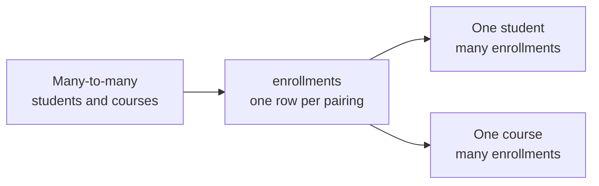
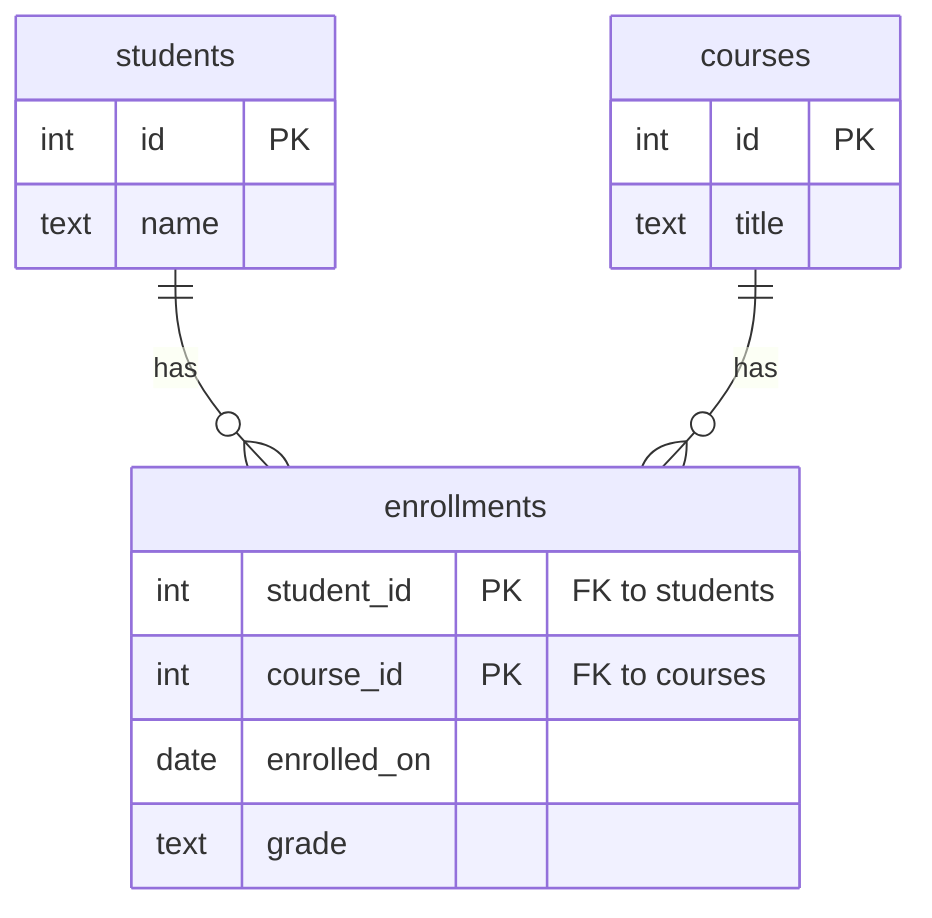
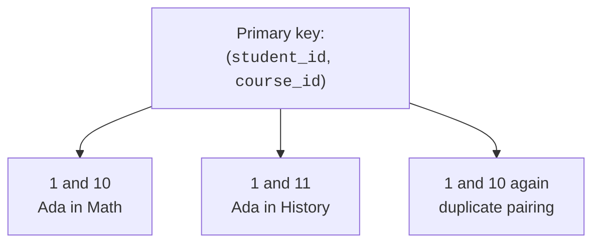
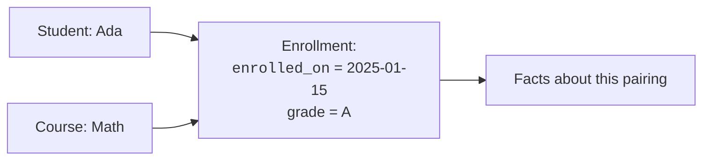
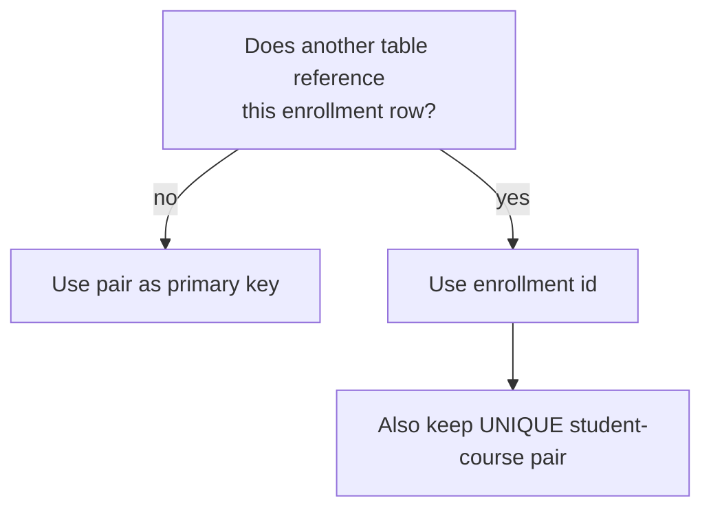

When two entities can relate to many rows on both sides, the clean
relational move is to create a third table. That table is a
**junction table**: one row per pairing, with foreign keys to both
sides.

You will also hear it called a **bridge table**, **join table**, or
**associative table**. The names differ, but the design job is the
same.

## Turning many-to-many into two one-to-many links

A many-to-many relationship is hard to store directly because the
relationship itself has many instances. A junction table gives each
instance its own row.

In ER form, the resolved design looks like this:

The junction table is the child of both parent tables. Its two foreign
keys point outward to the rows being connected.

## The pair is the identity

Often the natural primary key of a junction table is the pair of
foreign keys. In `enrollments`, the pair `(student_id, course_id)` says
"this exact student in this exact course."

That **composite primary key** prevents duplicate pairings. Ada can be
enrolled in Math once, not two separate times by accident.

<Callout type="info" title="Composite does not mean complicated">
A composite key is just a key made from more than one column. The rule
is still simple: the *combination* must be unique and not null.
</Callout>

## Quick check

<MultipleChoice
  markdown={`What does a composite primary key on \`(student_id, course_id)\` prevent in an \`enrollments\` table?

- One student from taking more than one course.
  > The same \`student_id\` can appear many times with different courses.
- One course from having more than one student.
  > The same \`course_id\` can appear many times with different students.
- [o] The exact same student-course pairing from being inserted twice.
  > The combination of both values must be unique, so duplicates of the pair are rejected.
- Students and courses from being joined in a query.
  > The key helps joins by making pairings reliable.

The composite key protects the uniqueness of each relationship instance.`}
/>

## Facts about the relationship itself

A junction table can hold more than just foreign keys. Some facts do
not belong to either parent alone; they belong to the **relationship**.

For an enrollment:

- `enrolled_on` describes when this student joined this course.
- `grade` describes this student's result in this course.
- `role` might distinguish learner, assistant, or auditor.

A grade cannot live in `students`, because Ada has different grades in
different courses. It cannot live in `courses`, because Math has
different grades for different students. It belongs on the row that
represents Ada-in-Math.

## Building a junction table

Run this example and then try changing the final insert to repeat an
existing pair. The composite primary key protects the table.

<SqlCodeBlock
  dialect="postgres"
  title="A junction table with relationship attributes"
  initSql={`CREATE TABLE students (
  id   INTEGER PRIMARY KEY,
  name TEXT NOT NULL
);

CREATE TABLE courses (
  id    INTEGER PRIMARY KEY,
  title TEXT NOT NULL
);

CREATE TABLE enrollments (
  student_id  INTEGER NOT NULL REFERENCES students(id),
  course_id   INTEGER NOT NULL REFERENCES courses(id),
  enrolled_on DATE NOT NULL,
  grade       TEXT CHECK (grade IN ('A', 'B', 'C', 'D', 'F')),
  PRIMARY KEY (student_id, course_id)
);

INSERT INTO students (id, name) VALUES
  (1, 'Ada'), (2, 'Grace'), (3, 'Linus');

INSERT INTO courses (id, title) VALUES
  (10, 'Math'), (11, 'History');

INSERT INTO enrollments (student_id, course_id, enrolled_on, grade) VALUES
  (1, 10, DATE '2025-01-15', 'A'),
  (1, 11, DATE '2025-01-16', 'B'),
  (2, 10, DATE '2025-01-18', 'A');`}
  starterCode={`SELECT
  s.name,
  c.title,
  e.enrolled_on,
  e.grade
FROM
  enrollments e
  JOIN students s ON s.id = e.student_id
  JOIN courses c ON c.id = e.course_id
ORDER BY
  s.name,
  c.title;`}
/>

The result reads naturally because the design matches the real-world
sentence: "student is enrolled in course, with these details about the
enrollment."

## When to give the junction its own id

Sometimes you will see a junction table with a surrogate `id` as its
primary key. That can be reasonable if other tables need to point at a
specific enrollment row.

Even then, you usually still add `UNIQUE (student_id, course_id)` so
the same pairing cannot be duplicated.

The design principle is the same either way: one row represents one
pairing, and the database should prevent accidental duplicate pairings.

## Check your understanding

<MultipleChoice
  markdown={`Which statement best describes a junction table?

- A table that stores a copy of every column from two parent tables.
  > Copying parent data would create duplication; the junction stores links.
- [o] A table that stores one row per relationship instance, usually with foreign keys to both related tables.
  > Each row represents one pairing between rows from the two sides.
- A table that can never have its own columns beyond foreign keys.
  > Junction tables often have attributes that describe the relationship itself.
- A table used only for speeding up reports.
  > The purpose is modeling relationships and protecting integrity, not caching report output.

A junction table makes each many-to-many pairing an ordinary row.`}
/>

<MultipleChoice
  markdown={`Where should an \`enrolled_on\` date belong in a students-courses design?

- In \`students\`, because each student has one enrollment date for all courses.
  > A student can enroll in different courses on different dates.
- In \`courses\`, because each course has one enrollment date for all students.
  > Different students can join the same course on different dates.
- [o] In \`enrollments\`, because the date describes a specific student-course pairing.
  > The date is a fact about the relationship instance, so it belongs on the junction row.
- In no table, because dates cannot be constrained.
  > Dates are normal data values and can be stored where they describe the right thing.

Relationship attributes belong with the row that represents the relationship.`}
/>

<MultipleChoice
  markdown={`If a junction table uses a surrogate \`id\` primary key, what constraint often still protects the design?

- \`CHECK (id > 1000)\`
  > That checks the id value but says nothing about duplicate pairings.
- [o] \`UNIQUE (student_id, course_id)\`
  > The unique constraint keeps the same pair from appearing twice even when the primary key is a separate id.
- \`UNIQUE (grade)\`
  > Many students can receive the same grade, so that uniqueness would be wrong.
- \`CHECK (student_id = course_id)\`
  > Student ids and course ids identify different tables and should not be forced to match.

A surrogate id does not replace the need to protect the natural uniqueness of the pairing.`}
/>
