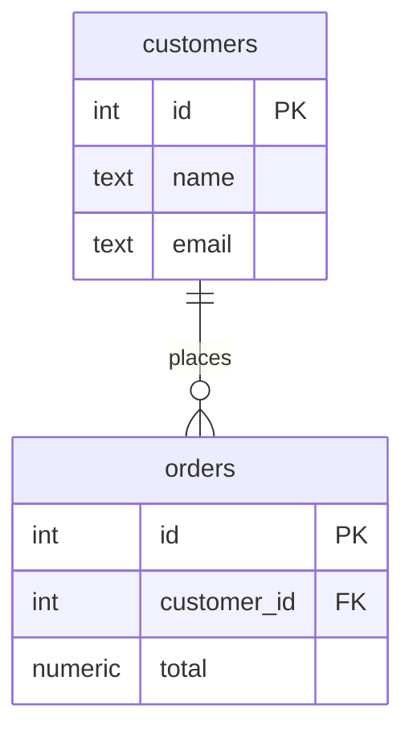
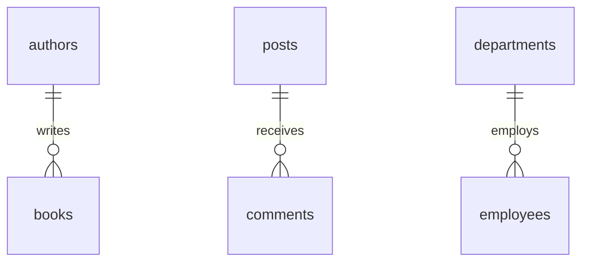
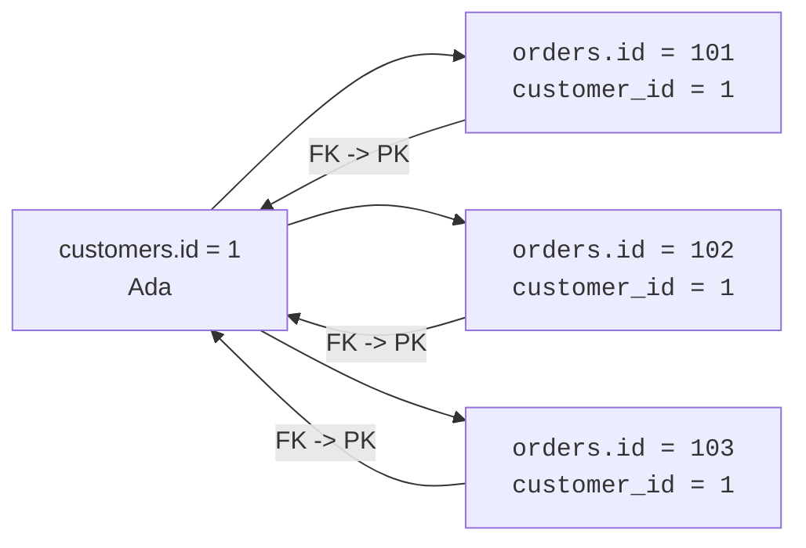
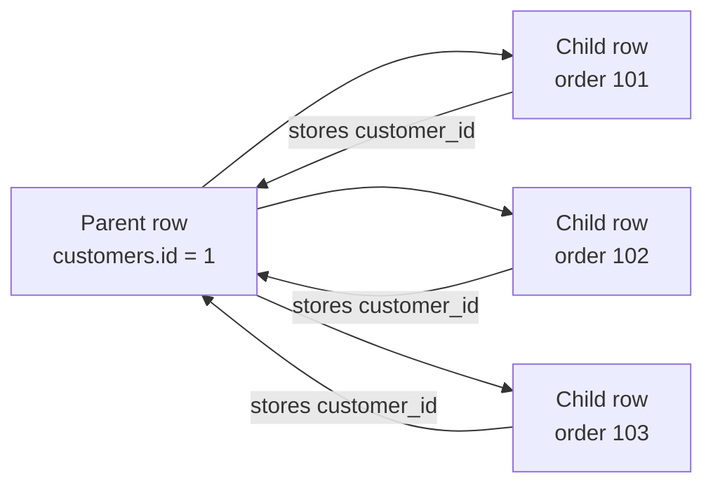

A customer can place many orders. An author can write many books. A
post can receive many comments. In each case, one row on the **one**
side is connected to several rows on the **many** side.

That shape is a **one-to-many relationship**, and it is the pattern
you will use more than any other in relational design.

## The basic shape

Read the diagram from left to right: one customer may place zero,
one, or many orders. Each order belongs to one customer.

The symbols matter. `||` means exactly one customer on that side.
`o{` means zero or many orders on the other side. The relationship is
not saying every customer has an order; it is saying every order, if it
exists, points back to one customer.

Other examples have the same shape:

The nouns change, but the design decision is the same: the child row
stores a reference to its parent.

## The foreign key lives on the many side

A **foreign key** is the column that stores the primary key of the
related row. In a one-to-many relationship, that foreign key belongs on
the **many** side.

Each order needs only one `customer_id`, because each order belongs to
one customer. The customer row does **not** need a list of order ids.
That would break the table shape: a cell would have to hold many
values, and every new order would require editing the parent row.

| Approach | Where the link lives | Result |
| --- | --- | --- |
| Bad idea | `customers.order_ids = 101, 102, 103` | One cell stores a list; hard to validate, query, and update. |
| Good idea | `orders.customer_id` | One child row stores one parent id; a join rebuilds the full picture. |

The many side can repeat the same parent id safely. That repetition is
not a duplication problem; it is the relationship itself.

## Quick check

<MultipleChoice
  markdown={`In a one-to-many relationship between \`customers\` and \`orders\`, where should the foreign key usually go?

- On \`customers\`, as a comma-separated list of order ids.
  > A list inside one cell is difficult to validate and violates the relational table shape.
- [o] On \`orders\`, as a \`customer_id\` column pointing to \`customers.id\`.
  > Each order belongs to one customer, so each order row can store exactly one parent id.
- On both tables, with each row copying all columns from the other.
  > Copying both directions creates duplication and still does not define the relationship cleanly.
- On neither table, because joins can guess the relationship.
  > Joins need matching key values; the database cannot reliably guess which rows belong together.

The foreign key goes on the many side because each child row points to one parent row.`}
/>

## Building and querying a one-to-many

Here is the pattern in PostgreSQL. The `orders.customer_id` column
references `customers.id`, so every order must point at a real
customer.

<SqlCodeBlock
  dialect="postgres"
  title="Customers and their orders"
  initSql={`CREATE TABLE customers (
  id    SERIAL PRIMARY KEY,
  name  TEXT NOT NULL,
  email TEXT NOT NULL UNIQUE
);

CREATE TABLE orders (
  id          SERIAL PRIMARY KEY,
  customer_id INTEGER NOT NULL REFERENCES customers(id),
  placed_on   DATE NOT NULL,
  total       NUMERIC NOT NULL CHECK (total >= 0)
);

INSERT INTO customers (name, email) VALUES
  ('Ada', 'ada@example.com'),
  ('Grace', 'grace@example.com');

INSERT INTO orders (customer_id, placed_on, total) VALUES
  (1, DATE '2025-01-10', 42.50),
  (1, DATE '2025-01-12', 18.00),
  (2, DATE '2025-01-13', 27.25);`}
  starterCode={`SELECT
  c.name,
  o.id AS order_id,
  o.placed_on,
  o.total
FROM
  customers c
  JOIN orders o ON o.customer_id = c.id
ORDER BY
  c.name,
  o.placed_on;`}
/>

The join follows the arrow from child to parent: `orders.customer_id`
points at `customers.id`. One customer can appear in several result
rows because that customer has several orders.

## Parent rows and child rows

Designers often call the one side the **parent** and the many side the
**child**. The child depends on the parent for meaning.

The parent can exist without children: a new customer may not have
ordered yet. But a child usually should not exist without a parent: an
order with no customer is an orphan. The foreign key prevents that
broken design.

## Check your understanding

<MultipleChoice
  markdown={`What does \`customers ||--o{ orders\` mean in an ER diagram?

- Each customer must have exactly one order.
  > The \`o{\` side means zero or many, so a customer may have no orders or many orders.
- [o] One customer can be related to zero, one, or many orders.
  > The customer side is one, and the order side is optional many.
- One order can belong to many customers.
  > The diagram places the many marker on orders, not on customers.
- Customers and orders are unrelated tables.
  > The line between the entities states that a relationship exists.

A one-to-many relationship has one parent row on one side and many possible child rows on the other.`}
/>

<MultipleChoice
  markdown={`Why is \`customers.order_ids\` a poor way to store a customer's orders?

- Because PostgreSQL cannot store text values.
  > PostgreSQL can store text; the issue is storing multiple ids in one cell.
- [o] Because one cell would contain a list of many values, making the relationship hard to validate and query.
  > Relational tables work best when each row stores one fact and child rows carry the reference.
- Because primary keys are optional in parent tables.
  > Primary keys are still essential; the problem is where the foreign key should live.
- Because order ids should be random words instead of numbers.
  > The identifier format is not the core issue; the list-in-a-cell design is.

Put the foreign key on the child table instead of storing a list on the parent.`}
/>

<MultipleChoice
  markdown={`In an authors-and-books design, which column most likely represents the one-to-many relationship?

- \`authors.book_titles\`
  > Book titles copied into the author row would duplicate data and fail for many books.
- [o] \`books.author_id\`
  > Each book row can point to the one author row it belongs to.
- \`authors.author_id\`
  > A column pointing from a table to itself would not connect books to authors.
- \`books.all_author_names\`
  > A list of names is not a reliable foreign key to author identity.

The child table usually stores the parent table's primary key as its foreign key.`}
/>
