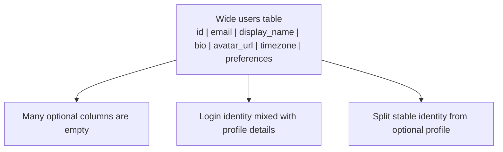
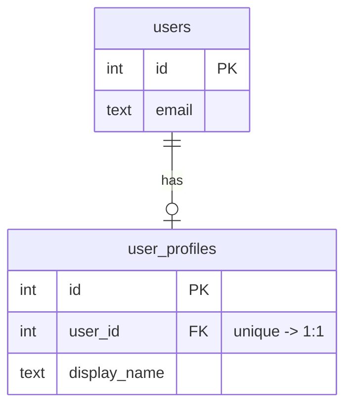
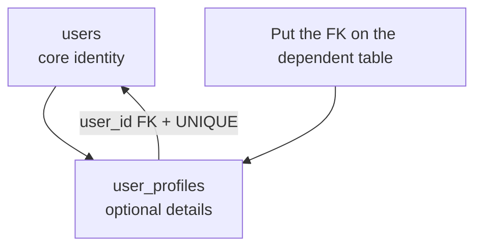

Most relationships are not one-to-one. Customers have many orders;
posts have many comments; students take many courses. But sometimes a
single entity is best split across two tables while keeping a strict
one-row-to-one-row connection.

That is a **one-to-one relationship**. It is rarer, but useful when a
separate table makes the design clearer or safer.

## Why split a one-to-one?

Imagine a `users` table that starts small, then grows a large set of
profile details. Some users have those details, many do not.

A separate table can help when:

- The extra attributes are optional or rarely used.
- The attributes represent a separate concern.
- The data is large, such as a biography or document blob.
- You want clearer ownership of which columns describe which idea.

The split should still describe one real-world thing. A user has at
most one profile; a profile belongs to exactly one user.

## The exact-one version

If both rows must exist, the ER shape is one-to-one on both sides.

The important database rule is not just the foreign key. It is the
foreign key plus a **unique constraint**. `user_profiles.user_id`
points to `users.id`, and `UNIQUE` says the same user id cannot appear
in two profile rows.

## Optional one-to-one

Often the second row is optional: every profile must belong to a user,
but not every user has filled out a profile yet.

The `o|` side means zero or one. This is a common way to model optional
details without filling the main table with null columns.

## Quick check

<MultipleChoice
  markdown={`What enforces that each user can have at most one profile row?

- A foreign key from \`user_profiles.user_id\` to \`users.id\` by itself.
  > The foreign key proves the user exists, but repeated \`user_id\` values would still be allowed without uniqueness.
- [o] A foreign key plus \`UNIQUE (user_id)\` on the profile table.
  > The foreign key links to a real user, and the unique constraint prevents two profiles for the same user.
- A \`CHECK (display_name IS NOT NULL)\` constraint.
  > That can require a value, but it does not limit how many profile rows point to one user.
- Putting \`profile_ids\` as a list on \`users\`.
  > A list of ids would not enforce one-to-one and would complicate the design.

One-to-one needs both a reference and a uniqueness rule on that reference.`}
/>

## Building a one-to-one

This example models optional user profiles. Ada and Grace are users;
Ada has a profile, and Grace does not yet.

<SqlCodeBlock
  dialect="postgres"
  title="A unique foreign key enforces one-to-one"
  initSql={`CREATE TABLE users (
  id    SERIAL PRIMARY KEY,
  email TEXT NOT NULL UNIQUE
);

CREATE TABLE user_profiles (
  id           SERIAL PRIMARY KEY,
  user_id      INTEGER NOT NULL UNIQUE REFERENCES users(id),
  display_name TEXT NOT NULL,
  bio          TEXT
);

INSERT INTO users (email) VALUES
  ('ada@example.com'),
  ('grace@example.com');

INSERT INTO user_profiles (user_id, display_name, bio) VALUES
  (1, 'Ada', 'Enjoys careful schema design.');`}
  starterCode={`SELECT u.email, p.display_name, p.bio
FROM users u
LEFT JOIN user_profiles p ON p.user_id = u.id
ORDER BY u.id;`}
/>

The `LEFT JOIN` keeps users who do not have a profile row. That matches
the optional one-to-one design: the main entity can exist before the
optional detail row exists.

## Where should the foreign key go?

In a one-to-one relationship, either table could technically hold the
foreign key. Choose the table whose row is dependent or optional.

For optional profiles, the profile table is dependent: a profile makes
no sense without a user, but a user can exist without a profile. That
is why `user_profiles.user_id` is the usual choice.

If the split is mandatory in both directions, the design can get more
subtle because SQL constraints are checked row by row. In beginner
schemas, start with the optional-or-dependent side unless you have a
strong reason not to.

## Check your understanding

<MultipleChoice
  markdown={`Why are one-to-one relationships rarer than one-to-many relationships?

- Because PostgreSQL does not support unique constraints.
  > PostgreSQL supports unique constraints; rarity comes from modeling needs, not missing features.
- [o] Because most real-world relationships naturally involve multiple related rows, while strict one-to-one splits solve narrower design problems.
  > One-to-one is useful, but many common relationships involve repeated children.
- Because one-to-one relationships cannot be queried.
  > They can be queried with ordinary joins.
- Because every one-to-one should be converted into many-to-many.
  > Many-to-many represents a different cardinality and would be incorrect here.

Use one-to-one when the split has a design reason, not just because two tables can be joined.`}
/>

<MultipleChoice
  markdown={`In \`users ||--o| user_profiles\`, what does the profile side mean?

- Every user must have many profiles.
  > The \`o|\` marker means optional single, not many.
- [o] A user may have zero or one profile.
  > Optional one means the related row may be absent, but cannot appear multiple times.
- A profile may belong to many users.
  > The diagram shows a profile connected to one user.
- Users and profiles cannot be joined.
  > The foreign key is what makes the join possible.

Optional one-to-one means the detail row may be missing, but duplicates are still forbidden.`}
/>

<MultipleChoice
  markdown={`Why might \`user_profiles\` be separated from \`users\`?

- To make every query slower on purpose.
  > The purpose is clearer modeling and optional data separation, not slowing queries.
- [o] To keep optional or separate-concern profile details out of the core identity table.
  > Splitting can keep the main table focused while giving optional details their own home.
- To allow two profiles for the same user.
  > The one-to-one design specifically prevents duplicate profiles.
- To avoid using primary keys.
  > The split still relies on primary keys and a unique foreign key.

A one-to-one split is a modeling choice for optional, large, or separate-concern data.`}
/>
