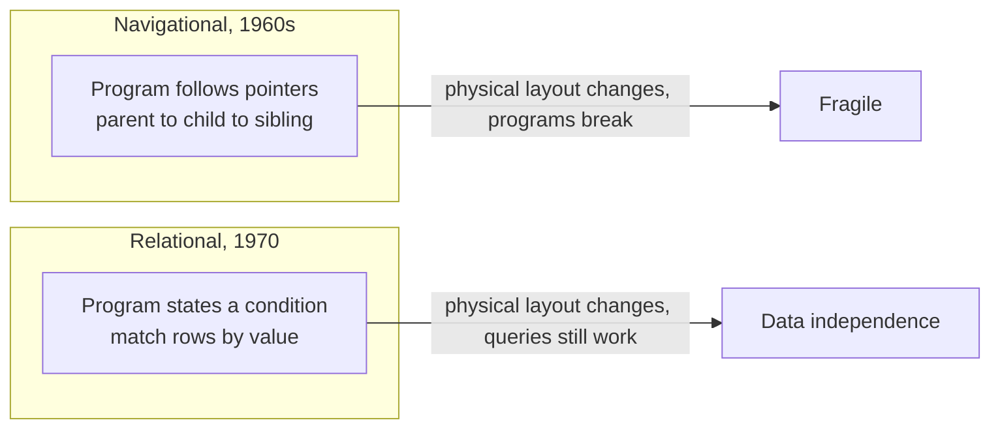

Every table you have designed in this course — every primary key,
every foreign key, every join — descends from a single
fourteen-page paper published in June 1970. This page tells that
story. Nothing here is required to pass a quiz; it is here because
knowing where ideas came from makes them easier to remember, and
because this particular story is genuinely good.

## The world before tables

In the 1960s, databases existed, but they did not look like anything
in this course. The dominant systems were **hierarchical** and
**network** databases. IBM's IMS — originally built in the late
1960s to track the millions of parts in the Apollo program's Saturn V
rocket — stored data as a tree: to find a record, a program navigated
from parent to child, following physical pointers. The CODASYL
network model generalized the tree into a graph, but the principle
was the same: *the program had to know the route to the data.*

That had a brutal consequence. If the database's physical structure
changed — a file reorganized, a pointer chain reshuffled — the
programs that navigated it broke. Data and code were welded
together. Asking a new question often meant writing a new navigation
program, and only programmers could ask questions at all.

## Codd's heresy

Edgar F. "Ted" Codd was a British-born mathematician working at
IBM's San Jose research laboratory. In June 1970 he published
"A Relational Model of Data for Large Shared Data Banks" in
*Communications of the ACM*. Its core proposal sounds almost too
plain to be revolutionary: store all data in **relations** — what we
now call tables — and connect records not with pointers but with
*values*. An order finds its customer not by following a physical
link but because both rows share a customer number.

The payoff Codd was after has a name you have already lived through
in this course: **data independence**. If the data's logical shape is
just tables of values, the database is free to reorganize how it
physically stores them — and no application breaks, because no
application ever depended on the physical layout. Programs ask *what*
they want, not *where to walk*. Every time you have joined two tables
in this course by matching key values, you have used Codd's idea.

You can feel the difference in one query. The block below answers
"which orders belong to Ada?" with no knowledge of how PostgreSQL
arranges bytes on disk — only a shared value connects the rows.

<SqlCodeBlock
  dialect="postgres"
  title="Connected by value, not by pointer"
  initSql={`CREATE TABLE customers (
  id   INTEGER PRIMARY KEY,
  name TEXT NOT NULL
);
CREATE TABLE orders (
  id          INTEGER PRIMARY KEY,
  customer_id INTEGER NOT NULL REFERENCES customers(id),
  total       NUMERIC NOT NULL
);
INSERT INTO customers VALUES (1, 'Ada'), (2, 'Grace');
INSERT INTO orders VALUES
  (101, 1, 25.00),
  (102, 2, 18.00),
  (103, 1, 42.00);`}
  starterCode={`-- No pointers, no navigation: rows connect because values match.
SELECT
  o.id AS order_id,
  o.total
FROM
  orders o
  JOIN customers c ON c.id = o.customer_id
WHERE
  c.name = 'Ada';`}
/>

## IBM's lukewarm reception

You might expect IBM to have rushed Codd's idea to market. It did
not. IMS was one of IBM's most important products, with enormous
customers and enormous revenue, and the relational model was — among
other things — an argument that IMS's whole approach was wrong.
Critics also doubted that a system which matched rows by value could
ever be fast enough to compete with one that followed pointers
directly. For years, the relational model lived mostly in research
papers and academic debate.

To settle the performance question, IBM's San Jose lab launched the
**System R** project in the mid-1970s: build a real, working
relational database and see whether it could be made efficient. It
could. System R pioneered much of the machinery production databases
still use, and along the way two of its researchers, Donald
Chamberlin and Raymond Boyce, designed a query language meant to be
readable by non-programmers. They called it **SEQUEL** — Structured
English Query Language. The name turned out to collide with a
trademark held by an aircraft company, so the vowels were dropped,
and the language became **SQL**.

Boyce did not live to see what his language became. He died of a
brain aneurysm in 1974, shortly after presenting the SEQUEL work,
still in his twenties. His name survives in **Boyce–Codd normal
form**, the refinement of third normal form he and Codd worked on in
the same year — you met its neighborhood in the normalization
chapter.

## The race IBM lost

The System R papers were published openly, and one of their most
attentive readers was not at IBM. A small California company —
eventually renamed after its flagship product — used them as a
blueprint, and in 1979 **Oracle** shipped the first commercially
available SQL database, beating IBM to the market it had invented.
IBM followed with SQL/DS in 1981 and DB2 in 1983, and SQL went on to
become one of the longest-lived languages in all of computing.

Codd received the Turing Award — computing's highest honor — in
1981, cited for his fundamental contributions to database theory and
practice. He spent much of his later career as the relational
model's sternest defender, famously publishing twelve rules (1985)
for what a database must do before it deserves to be called
relational, largely because so many products had started using the
word as a marketing label.

## Why this matters to your designs

Two lessons from this story echo through the rest of the course.

First, *the relational model is a theory of meaning, not a storage
trick.* Codd was a mathematician; relations, keys, and normal forms
came from logic and set theory. That is why design questions in this
course keep returning to meaning — what is an entity, what does a row
represent, which fact determines which — rather than to bytes and
files.

Second, *good models outlive their critics.* The performance
objections of the 1970s were real, and engineering answered them.
More than half a century later, you are running a relational database
inside a browser tab. When someone tells you that careful modeling is
a luxury that will not survive contact with production, remember that
people said the same thing about the model itself.

The next page follows the other thread of this history — the one
that starts at Berkeley, passes through a system called Ingres, and
ends with the engine executing your queries on this very page.
