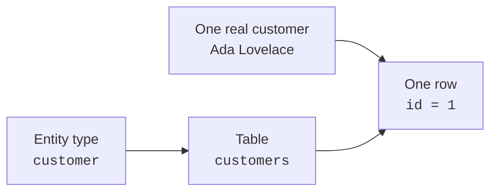
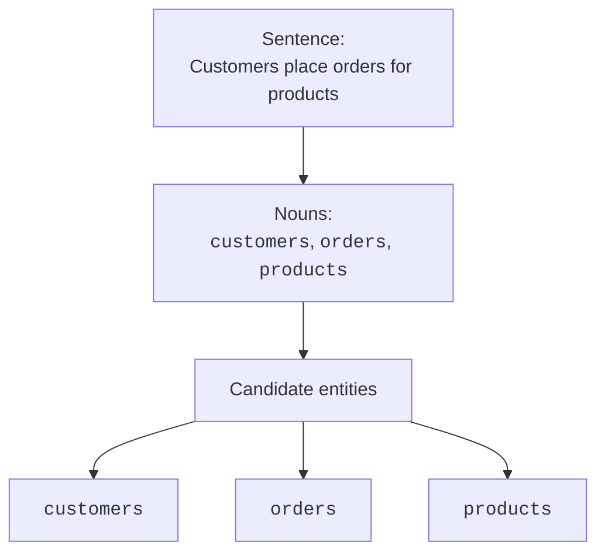
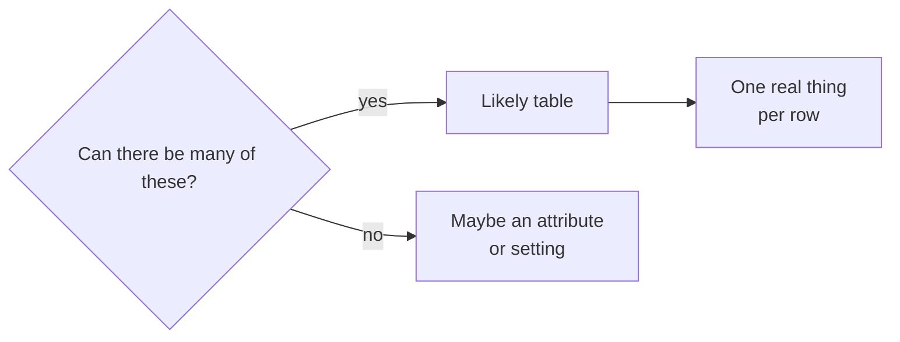
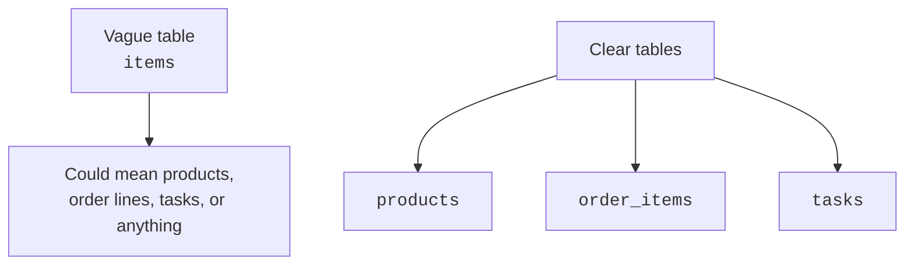

Suppose someone says, "Customers place orders for products." Before
we write a single `CREATE TABLE`, we have to ask a design question:
*what kinds of things are worth tracking?*

Those things are **entities**. Learning to see them is the first step
from "I know SQL" to "I can design a database."

<svg
  viewBox="0 0 640 210"
  role="img"
  aria-label="From a sentence of word pills, the three noun pills rise along dotted trails and crystallize into rounded entity containers — spotting the things worth tracking"
  style={{ display: "block", width: "100%", maxWidth: "640px", height: "auto", margin: "2.5rem auto" }}
>
  <g style={{ color: "var(--ds-blue-500)" }} fill="currentColor">
    <rect x="90" y="168" width="92" height="20" rx="10" fillOpacity="0.7" />
    <rect x="70" y="40" width="130" height="72" rx="14" fillOpacity="0.25" />
    <circle cx="103" cy="68" r="7" />
    <circle cx="103" cy="92" r="7" fillOpacity="0.45" />
  </g>
  <g fill="currentColor" opacity="0.18">
    <rect x="194" y="168" width="56" height="20" rx="10" />
    <rect x="346" y="168" width="40" height="20" rx="10" />
  </g>
  <g style={{ color: "var(--ds-green-500)" }} fill="currentColor">
    <rect x="262" y="168" width="72" height="20" rx="10" fillOpacity="0.7" />
    <rect x="255" y="40" width="130" height="72" rx="14" fillOpacity="0.25" />
    <circle cx="288" cy="68" r="7" />
    <circle cx="288" cy="92" r="7" fillOpacity="0.45" />
  </g>
  <g style={{ color: "var(--ds-yellow-500)" }} fill="currentColor">
    <rect x="398" y="168" width="88" height="20" rx="10" fillOpacity="0.7" />
    <rect x="440" y="40" width="130" height="72" rx="14" fillOpacity="0.25" />
    <circle cx="473" cy="68" r="7" />
    <circle cx="473" cy="92" r="7" fillOpacity="0.45" />
  </g>
  <g fill="currentColor" opacity="0.3">
    <circle cx="136" cy="152" r="3" />
    <circle cx="135" cy="134" r="3" />
    <circle cx="135" cy="122" r="3" />
    <circle cx="299" cy="152" r="3" />
    <circle cx="306" cy="134" r="3" />
    <circle cx="312" cy="122" r="3" />
    <circle cx="448" cy="152" r="3" />
    <circle cx="464" cy="134" r="3" />
    <circle cx="478" cy="122" r="3" />
  </g>
</svg>

## What an entity is

An **entity** is a distinct kind of thing your system cares about:
`customer`, `order`, `product`, `invoice`, `student`, `appointment`.
It is not one specific thing yet. It is the *type* of thing.

One entity type usually becomes **one table**. One real thing of that
type becomes **one row**.

That distinction matters. `customers` is the table because it stores
many customers. Ada is one row because she is one real customer.

## Start with the nouns

A practical way to begin is to read a description of the system and
circle the nouns. Nouns are not automatically entities, but they are
excellent candidates.

> Customers place orders for products. Each order has a shipping
> address and a status.

The verbs matter too. "Place" hints that `customers` and `orders` are
connected. But the first pass is about finding the things.

<Callout type="info" title="Nouns are clues, not commands">
Some nouns are only attributes. In "customer email," `customer` is an
entity, but `email` is probably a column on `customers`.
</Callout>

## Candidate entities are boxes

Designers often sketch entities as boxes before deciding exact columns
or SQL syntax. Each box says, "this is a kind of thing we may need to
store." An online shop might begin with:

- Customer
- Order
- Product
- Payment
- Shipment

At this stage, the candidates are intentionally simple. You are building
a map of the domain, not a finished schema.

## One entity type, one table

Once an entity is real enough to track, it usually gets its own table.
A table should hold rows that are all the same kind of thing.

Table: `customers`

| id | name  |
| -- | ----- |
| 1  | Ada   |
| 2  | Grace |

Table: `products`

| id | name     |
| -- | -------- |
| 10 | Notebook |
| 11 | Pen      |

Mixing different entity types into one table creates confusion. A
customer row and a product row do not have the same meaning, the same
attributes, or the same relationships.

<SqlCodeBlock
  dialect="postgres"
  title="Separate entities become separate tables"
  initSql={`CREATE TABLE customers (
  id   INTEGER PRIMARY KEY,
  name TEXT NOT NULL
);
CREATE TABLE products (
  id    INTEGER PRIMARY KEY,
  name  TEXT NOT NULL,
  price NUMERIC NOT NULL
);
INSERT INTO customers VALUES (1, 'Ada'), (2, 'Grace');
INSERT INTO products VALUES (10, 'Notebook', 8.50), (11, 'Pen', 1.25);`}
  starterCode={`SELECT
  'customer' AS kind,
  id,
  name
FROM
  customers
UNION ALL
SELECT
  'product' AS kind,
  id,
  name
FROM
  products
ORDER BY
  kind,
  id;`}
/>

The tables stay separate because they represent different entity
types. Queries can combine them later when a question needs both.

## Quick check

<MultipleChoice
  markdown={`In the sentence "Students borrow books from a library," which pair is most likely to be modeled as entity types?

- Borrow and from.
  > Verbs and prepositions usually describe actions or connections, not the main kinds of things being tracked.
- [o] Students and books.
  > Students and books are distinct kinds of things the system may need to store as rows in tables.
- Library and from.
  > A library might be an entity in a multi-branch system, but "from" is not a thing worth storing.
- Students and borrow.
  > Students are likely an entity; borrow is an action that hints at a relationship or event.

Nouns give you candidate entities, while verbs often hint at relationships.`}
/>

## Test the idea with rows

A helpful question is: *can I imagine many rows of this kind?* If yes,
you may have an entity type.

For an online shop, there are many customers, many orders, and many
products. Those are strong entity candidates. A single order's `status`
can have many possible values, but it describes an order rather than
standing alone as the main thing.

## Entity names should be clear

Good entity names are ordinary words from the domain. Prefer
`customers`, `orders`, and `products` over vague names like `data`,
`records`, or `items` unless those are truly the business terms.

Clear names make the design easier to discuss. If the team cannot
explain what belongs in a table, the entity is probably not clear yet.

## Check your understanding

<MultipleChoice
  markdown={`What is an **entity** in database design?

- A single SQL query that returns rows.
  > A query asks a question of the database; an entity is a kind of thing the database stores.
- [o] A distinct kind of thing worth tracking, such as a customer, order, or product.
  > An entity type names the real-world category that usually becomes a table.
- Any word that appears in a user interface.
  > Interface words can be clues, but not every label is a stored thing.
- A column that stores a number.
  > Columns are attributes; entities are the larger things those attributes describe.

Entities are the main real-world things your schema is about.`}
/>

<MultipleChoice
  markdown={`How does an entity type usually map to a relational table?

- One entity type becomes one column.
  > Columns describe properties of an entity; they do not represent the whole entity type.
- One entity type becomes one database server.
  > Server setup is unrelated to logical modeling.
- [o] One entity type becomes one table, and each real thing becomes one row.
  > A customers table stores many individual customer rows.
- Every entity type must be stored in the same table.
  > Mixing unrelated entity types in one table usually creates unclear and fragile designs.

A table is the collection; a row is one specific member of that collection.`}
/>

<MultipleChoice
  markdown={`Why is "circle the nouns" a useful early modeling habit?

- Because every noun must become a table.
  > Nouns are candidates, but some become attributes or are not stored at all.
- [o] Because nouns often reveal the things, people, places, or events the system cares about.
  > Candidate entities usually appear as nouns in a plain-English description of the domain.
- Because verbs are never useful in database design.
  > Verbs are useful too; they often reveal relationships between entities.
- Because SQL table names are required to match every noun exactly.
  > Table names should be clear, but they do not have to copy every word from the description.

Nouns start the conversation; design judgment decides what becomes a table.`}
/>
