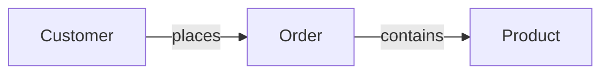
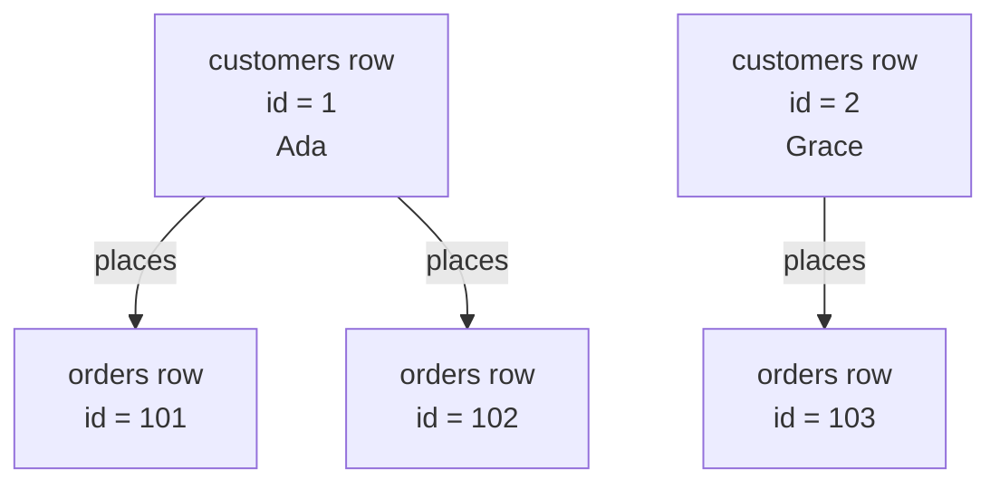
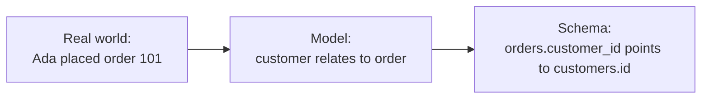
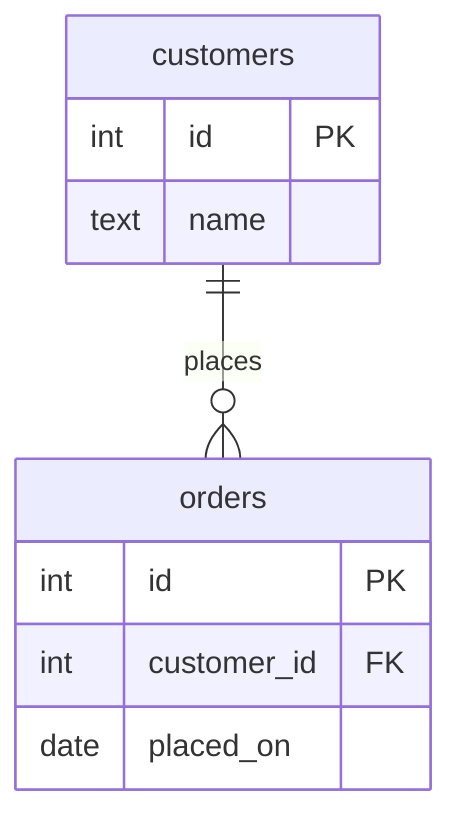
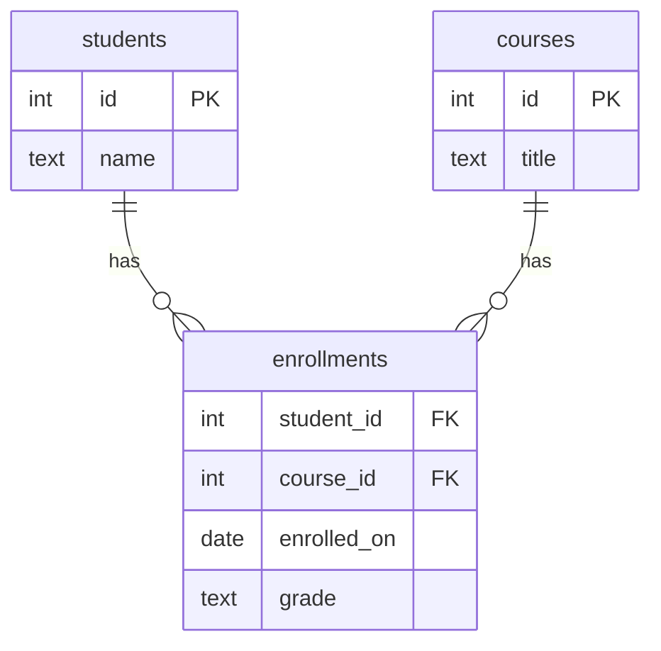
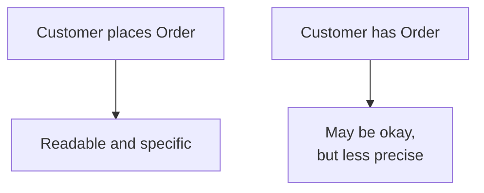

A database full of isolated tables is not very useful. Customers matter
because they place orders. Orders matter because they contain products.
Employees matter because they belong to departments.

A **relationship** is an association between entities. It says how the
things in your model are connected.

## Relationships are the verbs

If entities often come from nouns, relationships often come from
verbs: a customer **places** an order, a book **belongs to** an author,
a student **enrolls in** a course.

Those labels are plain English, but they are serious design clues.
They tell you which tables will need to refer to other tables.

## A relationship connects rows

At the entity level, we say "customers place orders." At the row
level, a specific customer row is connected to specific order rows.

That is why relationships are central to relational design. They make
separate tables act like one connected model.

## From real-world link to schema link

In PostgreSQL, a relationship is usually realized with keys. One table
has a **primary key**. Another table stores a **foreign key** that
points to it.

The relationship is the idea. The foreign key is the database
mechanism that stores and protects the idea.

The line says the entities are related. The `customer_id FK` column
shows how the relationship will be stored.

## Quick check

<MultipleChoice
  markdown={`In the sentence "A customer places an order," what does "places" most likely reveal?

- A column data type.
  > A verb does not usually tell you the SQL type of a column.
- [o] A relationship between the customer entity and the order entity.
  > The verb describes how the two entities are associated.
- A primary key value.
  > Primary key values identify rows; the verb explains a connection.
- A table that should store every possible noun.
  > The verb points to a relationship, not a catch-all table.

Verbs often reveal how entity types connect.`}
/>

## Relationships answer business questions

Relationships are not just structure for structure's sake. They let the
database answer questions that cross entity boundaries:

- Which orders did Ada place?
- Which products appear in order `101`?
- Which department does each employee belong to?
- Which students are enrolled in Biology?

<SqlCodeBlock
  dialect="postgres"
  title="A relationship lets a query cross tables"
  initSql={`CREATE TABLE customers (
  id   INTEGER PRIMARY KEY,
  name TEXT NOT NULL
);
CREATE TABLE orders (
  id          INTEGER PRIMARY KEY,
  customer_id INTEGER NOT NULL REFERENCES customers(id),
  placed_on   DATE NOT NULL
);
INSERT INTO customers VALUES (1, 'Ada'), (2, 'Grace');
INSERT INTO orders VALUES
  (101, 1, DATE '2025-03-01'),
  (102, 1, DATE '2025-03-02'),
  (103, 2, DATE '2025-03-03');`}
  starterCode={`SELECT
  c.name,
  o.id AS order_id,
  o.placed_on
FROM
  customers c
  JOIN orders o ON o.customer_id = c.id
ORDER BY
  c.name,
  o.id;`}
/>

Without the relationship, the query could list customers and list
orders, but it could not reliably know which orders belonged to whom.

## Some relationships become entities

A relationship can be important enough to store as its own entity. For
example, an enrollment is the relationship between a student and a
course — but it may also have attributes like `enrolled_on` or `grade`.

When the association itself has facts, a table for the association is
often the cleanest design.

## Relationship names should be readable

A good relationship label creates a sentence:

`has` is sometimes fine, especially in compact diagrams, but a more
specific verb can reveal business meaning. "Customer places order" is
clearer than "customer has order."

## Check your understanding

<MultipleChoice
  markdown={`What is a relationship in database design?

- A rule that every table must have the same columns.
  > Tables usually have different columns because they model different entities.
- [o] An association between entities, such as a customer placing an order.
  > Relationships describe how entity rows connect to each other.
- A backup copy of a table.
  > Backups are operational; relationships are part of the logical model.
- A column that always stores text.
  > Relationships may be stored with key columns, but they are broader than a text column.

Relationships turn separate entity tables into a connected model.`}
/>

<MultipleChoice
  markdown={`How is a relationship usually realized later in a relational schema?

- By giving both tables exactly the same name.
  > Table names do not create enforced links between rows.
- By storing all rows from both entities in one cell.
  > Packing data into one cell destroys structure rather than modeling a relationship.
- [o] By using a foreign key that points to a primary key.
  > The foreign key stores the link and lets the database enforce that the target row exists.
- By deleting the primary keys.
  > Relationships depend on reliable row identities, so primary keys are essential.

The relationship is the meaning; keys are the usual database mechanism.`}
/>

<MultipleChoice
  markdown={`Why might an enrollment between a student and a course become its own table?

- Because every verb must become a table.
  > Some verbs are simple relationships and do not need their own table.
- Because students and courses cannot be queried together.
  > They can be queried together; the issue is how to represent many pairings and facts about them.
- [o] Because the association may have its own attributes, such as enrolled date or grade.
  > Facts about the pairing belong naturally on a row that represents that pairing.
- Because PostgreSQL does not allow course tables.
  > PostgreSQL allows ordinary tables for courses and many other entities.

When a relationship has its own facts, modeling it as an entity can be clearer.`}
/>
