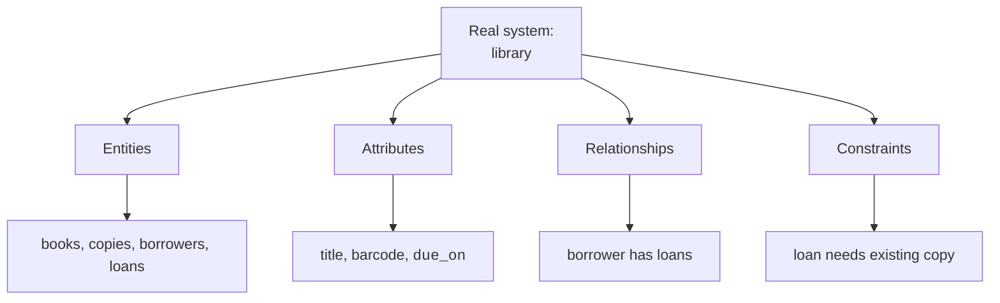
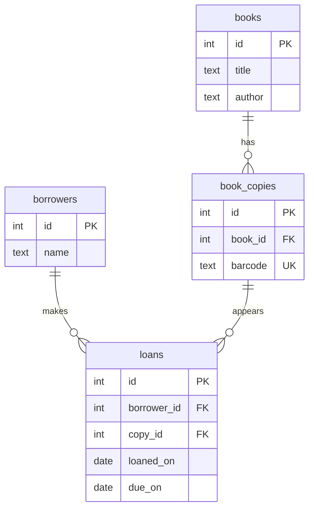

Before you build a library app, you can start coding screens: add a
book form, a borrower form, a checkout button. But sooner or later the
code must answer design questions. What is a book? Is a physical copy
different from a title? Can one borrower have many loans? What should
happen if a loan points to a missing copy?

**Database design** is the work of answering those questions before the
rest of the software quietly answers them in inconsistent ways.

It means deciding what tables exist, what each table represents, how
those tables relate, and what rules protect the data.

<svg
  viewBox="0 0 640 210"
  role="img"
  aria-label="On a faint blueprint grid of construction dots, one table stands decided while a second is still a dotted outline holding a question mark — design answers questions before they are built"
  style={{ display: "block", width: "100%", maxWidth: "640px", height: "auto", margin: "2.5rem auto" }}
>
  <g fill="currentColor" opacity="0.14">
    <circle cx="80" cy="45" r="1.8" />
    <circle cx="176" cy="45" r="1.8" />
    <circle cx="272" cy="45" r="1.8" />
    <circle cx="368" cy="45" r="1.8" />
    <circle cx="464" cy="45" r="1.8" />
    <circle cx="560" cy="45" r="1.8" />
    <circle cx="80" cy="105" r="1.8" />
    <circle cx="176" cy="105" r="1.8" />
    <circle cx="272" cy="105" r="1.8" />
    <circle cx="368" cy="105" r="1.8" />
    <circle cx="464" cy="105" r="1.8" />
    <circle cx="560" cy="105" r="1.8" />
    <circle cx="80" cy="165" r="1.8" />
    <circle cx="176" cy="165" r="1.8" />
    <circle cx="272" cy="165" r="1.8" />
    <circle cx="368" cy="165" r="1.8" />
    <circle cx="464" cy="165" r="1.8" />
    <circle cx="560" cy="165" r="1.8" />
  </g>
  <g style={{ color: "var(--ds-blue-500)" }} fill="currentColor">
    <rect x="118" y="62" width="160" height="90" rx="14" fillOpacity="0.3" />
    <circle cx="150" cy="92" r="8" />
    <rect x="170" y="86" width="76" height="11" rx="5.5" fillOpacity="0.55" />
    <rect x="142" y="118" width="104" height="11" rx="5.5" fillOpacity="0.3" />
  </g>
  <g style={{ color: "var(--ds-yellow-500)" }} fill="currentColor">
    <circle cx="380" cy="62" r="3" />
    <circle cx="420" cy="62" r="3" />
    <circle cx="460" cy="62" r="3" />
    <circle cx="500" cy="62" r="3" />
    <circle cx="540" cy="62" r="3" />
    <circle cx="380" cy="107" r="3" />
    <circle cx="540" cy="107" r="3" />
    <circle cx="380" cy="152" r="3" />
    <circle cx="420" cy="152" r="3" />
    <circle cx="460" cy="152" r="3" />
    <circle cx="500" cy="152" r="3" />
    <circle cx="540" cy="152" r="3" />
    <text x="460" y="122" textAnchor="middle" fontFamily="var(--font-sans), Georgia, serif" fontSize="42" fontWeight="bold" fillOpacity="0.85">?</text>
  </g>
</svg>

## Design is not just writing `CREATE TABLE`

SQL syntax is how you express a design. It is not the design itself.
The design is the set of modeling decisions behind the SQL:

- Which real-world things become tables?
- Which facts become columns?
- Which rows need stable identity?
- Which tables point to other tables?
- Which values must be present, unique, or limited?

A schema is good when those choices match the meaning of the system and
make invalid data difficult to store.

## What tables represent

A table should usually represent one kind of thing or one kind of
relationship. In a library, `books` might store titles such as
*Database Design Basics*. But if the library owns three physical copies
of that title, those copies may need their own table because each copy
has a barcode and can be loaned separately.

That is design thinking: not "how many columns can fit in one table?"
but "what distinct things does the system need to remember?"

This design separates a book title from a physical copy. That choice
matters because a loan is about a copy, not just a title.

## Quick check

<MultipleChoice
  markdown={`Which question is most clearly a database design question?

- What color should the checkout button be?
  > Button color is a user-interface decision, not a schema modeling decision.
- Which cloud region should host the server?
  > Hosting location is an operations decision, not logical database design.
- [o] Should library loans point to book titles or physical book copies?
  > This decides what real-world thing a relationship represents in the schema.
- Which font should reports use?
  > Report styling does not decide tables, relationships, or constraints.

Database design is about the meaning and protection of stored facts.`}
/>

## Conceptual, logical, and physical design

Design happens at different levels. Beginners often mix these together,
so it helps to separate them.

**Conceptual design** names the important things in the real world. It
is close to plain language: customers place orders; orders contain
products; authors write posts.

**Logical design** turns those ideas into relational structure: tables,
columns, primary keys, foreign keys, and constraints. This is the main
focus of this course.

**Physical design** concerns how a particular database stores and runs
that schema: indexes, storage settings, partitioning, and operational
choices. Those topics matter, but they are not our focus here.

You will see PostgreSQL syntax because schemas must eventually become
real. But the course is about the logical shape: what the tables mean
and what rules preserve that meaning.

## Logical design protects meaning

Here is a small logical design for blog posts and comments. Notice that
the design does more than store text. It says each comment belongs to
one existing post, each post has a unique slug, and required fields
cannot be missing.

<SqlCodeBlock
  dialect="postgres"
  title="A small logical design"
  initSql={`DROP TABLE IF EXISTS comments;
DROP TABLE IF EXISTS posts;

CREATE TABLE posts (
  id         INTEGER GENERATED ALWAYS AS IDENTITY PRIMARY KEY,
  title      TEXT NOT NULL,
  slug       TEXT NOT NULL UNIQUE,
  published  BOOLEAN NOT NULL DEFAULT false
);

CREATE TABLE comments (
  id         INTEGER GENERATED ALWAYS AS IDENTITY PRIMARY KEY,
  post_id    INTEGER NOT NULL REFERENCES posts(id),
  author     TEXT NOT NULL,
  body       TEXT NOT NULL,
  created_on DATE NOT NULL
);

INSERT INTO posts (title, slug, published) VALUES
  ('Designing Blog Data', 'designing-blog-data', true),
  ('Draft Notes', 'draft-notes', false);

INSERT INTO comments (post_id, author, body, created_on) VALUES
  (1, 'Ada', 'This made relationships clearer.', DATE '2025-02-01'),
  (1, 'Linus', 'The slug rule is helpful.', DATE '2025-02-02');`}
  starterCode={`SELECT
  posts.title,
  COUNT(comments.id) AS comment_count
FROM
  posts
  LEFT JOIN comments ON comments.post_id = posts.id
GROUP BY
  posts.id,
  posts.title
ORDER BY
  posts.title;`}
/>

The important part is not that this is the only possible blog schema.
It is that the schema makes clear promises about identity,
relationships, and allowed values.

## Quick check

<MultipleChoice
  markdown={`Which level is this course mainly about?

- Physical design, such as storage parameters and server tuning.
  > Physical choices are useful later, but this course focuses on modeling and relational structure.
- [o] Logical relational design, such as tables, keys, relationships, and constraints.
  > The course teaches how to shape facts so PostgreSQL can store and protect them well.
- Frontend component design.
  > Application interfaces use the data, but they are not the focus of schema design.
- Backup scheduling and monitoring.
  > Operational DBA work is outside the scope of this design course.

Logical design is the bridge between real-world meaning and SQL schema definitions.`}
/>

## Design happens before code depends on it

Application code tends to harden around the schema. If the first
version stores product names as free text on orders, many functions may
start assuming that is where product information lives. Changing the
schema later then means changing code, migrations, tests, reports, and
possibly old data.

Design first does not mean you must predict everything. It means you
pause long enough to model the core facts that are already visible.

| Design first | Skip modeling |
| --- | --- |
| Model core facts | Code invents assumptions |
| Create tables and constraints | Data grows around shortcuts |
| Write application code on stable meaning | Expensive redesign later |

The schema becomes a contract. It is much easier to make that contract
clear before many callers depend on it.

## What this course means by design

In this course, database design means:

1. Finding entities: customers, orders, products, posts, comments.
2. Choosing attributes: names, dates, quantities, statuses.
3. Defining relationships: customers place orders, posts have comments.
4. Choosing keys: stable identities for rows.
5. Adding constraints: rules that reject impossible or unsafe data.
6. Revising the model as requirements become clearer.

It does not mean becoming a PostgreSQL administrator. We will not focus
on replication, backups, server memory, or query tuning. Those are
important jobs, but they are different from deciding what the data
means.

## Check your understanding

<MultipleChoice
  markdown={`What is the best plain-English definition of database design?

- Choosing the fastest database server hardware.
  > Hardware choices are operational, not the core modeling work of design.
- Writing queries after all tables already exist.
  > Querying uses a design; it does not decide the schema shape by itself.
- [o] Deciding what tables, relationships, and rules should represent the system's facts.
  > Design shapes how facts are stored, related, and protected before code depends on them.
- Picking random column names and fixing them later.
  > Careless naming and delayed modeling often create ambiguity and migration cost.

Database design is the intentional modeling of stored facts.`}
/>

<MultipleChoice
  markdown={`In a library schema, why might \`book_copies\` be separate from \`books\`?

- Because every table must have exactly two columns.
  > Tables need the columns required by the facts they represent.
- Because PostgreSQL cannot store book titles.
  > PostgreSQL can store titles as text; the issue is what thing each row represents.
- [o] Because a title and a physical copy are different things with different facts.
  > A title has an author, while a copy has a barcode and can be loaned separately.
- Because joins should always be avoided.
  > Separate tables often require joins, and those joins express real relationships.

Good table boundaries follow the meaning of the real-world system.`}
/>

<MultipleChoice
  markdown={`Which item belongs most clearly to logical design?

- Choosing a backup retention policy.
  > Backup retention is an operational concern.
- [o] Adding a foreign key from \`comments.post_id\` to \`posts.id\`.
  > A foreign key is a logical rule that protects a relationship between tables.
- Deciding how much RAM the database server needs.
  > Server memory is a physical or operational concern.
- Selecting the color palette for the admin page.
  > Visual style is outside schema design.

Logical design describes the relational structure and rules of the data.`}
/>

<MultipleChoice
  markdown={`Why is it useful to design before writing much application code?

- Application code cannot be written until every future feature is known.
  > You do not need perfect prediction; you need clear modeling of core facts.
- [o] Code quickly starts depending on whatever schema shape exists.
  > Early schema choices become assumptions in queries, forms, reports, and tests.
- PostgreSQL refuses schemas created after code exists.
  > PostgreSQL does not know when application code was written.
- Designing first removes the need for future schema changes.
  > Requirements can still change, but a clear starting model makes change safer.

A schema is easier to clarify before many parts of the system depend on it.`}
/>
