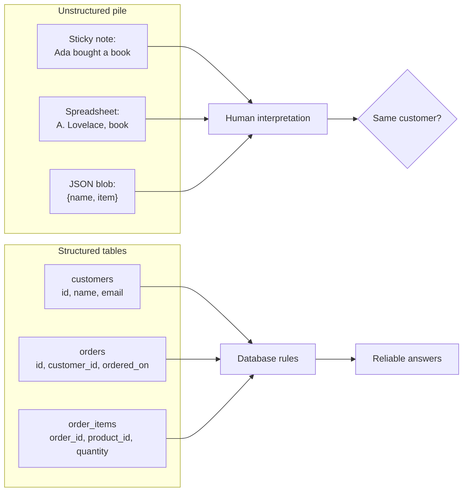
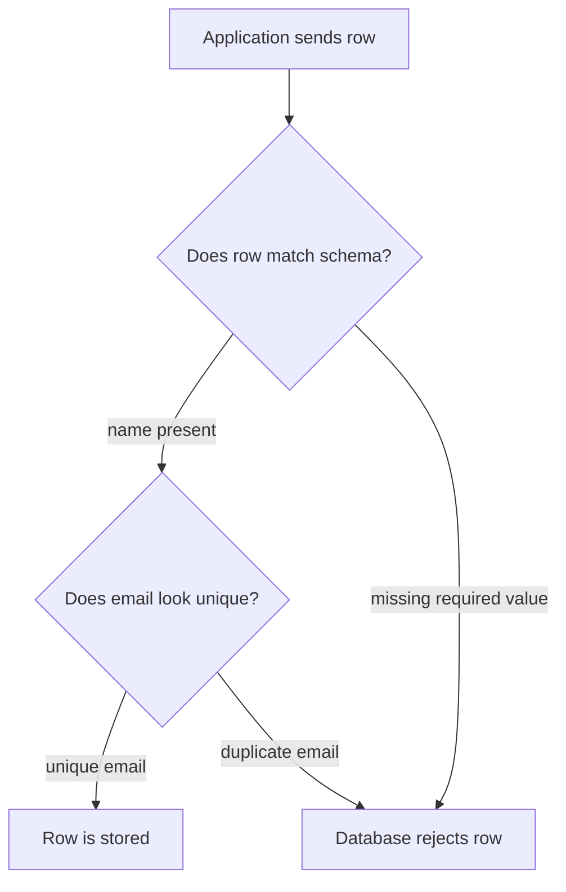
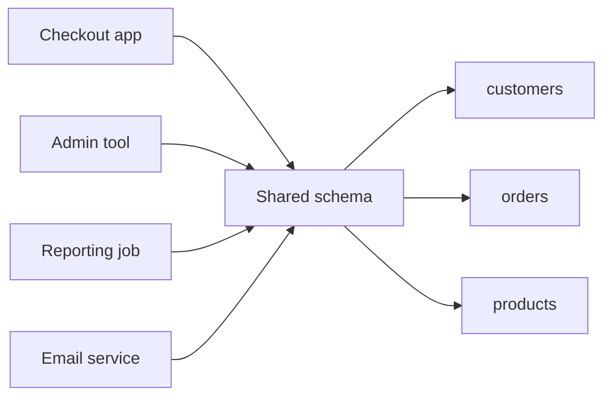

Imagine a small shop tracking orders in whatever place feels easiest
that day: a sticky note, a spreadsheet row, a chat message, and a JSON
file copied from an old feature. At first, everyone can still remember
what the notes mean. Then the shop grows. Someone asks, *which
customers bought notebooks last month?* Suddenly the problem is not
SQL syntax. The problem is that the information never had one reliable
shape.

Software needs **structured data** because programs are literal. They
cannot guess that `Ada L.`, `Ada Lovelace`, and `ada@example.com` are
probably the same customer unless the data model gives them a safe way
to know.

## Structure gives data an agreed shape

A database table is more than a place to put rows. It is an agreement:

- This table stores one kind of thing.
- These columns are the facts we record about it.
- These columns must be present, unique, or related to other rows.
- These values have predictable types.

That agreement is what lets many pieces of software read and write the
same data without inventing their own private interpretation.

The unstructured side may contain useful information, but the meaning
lives mostly in people's heads. The structured side puts meaning into
the schema so the database can help enforce it.

## Unstructured data is not automatically bad

Unstructured notes, documents, logs, and JSON blobs can be useful. A
support ticket needs a free-text description. A product may have a JSON
field for optional metadata. The problem appears when the core facts a
system depends on are stored only as ad-hoc text.

If an order is just a note that says `Ada - 2 books - paid`, the
software cannot reliably ask:

- Which customer is Ada?
- Is `books` a real product?
- Is `2` a quantity or part of a note?
- Has this order already been paid?

A relational schema turns those assumptions into separate, named facts.

<Callout type="info" title="Structure is not decoration">
A schema is not paperwork around the real system. For data-heavy
software, the schema *is* part of the system. It defines what facts can
exist and how other programs are allowed to depend on them.
</Callout>

## Quick check

<MultipleChoice
  markdown={`Why is a pile of notes hard for software to use reliably?

- The notes might contain no useful facts at all.
  > Notes can contain useful facts, but the facts are not arranged in a predictable shape.
- [o] The meaning depends on human interpretation instead of database rules.
  > Software needs explicit fields and rules; otherwise each program has to guess what the text means.
- PostgreSQL cannot store text values.
  > PostgreSQL stores text well; the issue is whether important facts are hidden inside unstructured text.
- A note can never be converted into a table later.
  > Notes can be cleaned and imported, but that cleanup becomes extra work and risk.

Structured data moves important meaning out of memory and into a shared schema.`}
/>

## Structure enables reliable answers

Suppose you want to know how many orders each customer placed. In a
spreadsheet, you might need to decide whether `Ada`, `Ada L.`, and
`ada@example.com` all refer to one person. In a structured schema, the
answer can come from the relationship between tables.

<SqlCodeBlock
  dialect="postgres"
  title="Answering a question from structured tables"
  initSql={`DROP TABLE IF EXISTS orders;
DROP TABLE IF EXISTS customers;

CREATE TABLE customers (
  id    INTEGER PRIMARY KEY,
  name  TEXT NOT NULL,
  email TEXT NOT NULL UNIQUE
);

CREATE TABLE orders (
  id          INTEGER PRIMARY KEY,
  customer_id INTEGER NOT NULL REFERENCES customers(id),
  ordered_on  DATE NOT NULL
);

INSERT INTO customers VALUES
  (1, 'Ada Lovelace', 'ada@example.com'),
  (2, 'Grace Hopper', 'grace@example.com');

INSERT INTO orders VALUES
  (101, 1, DATE '2025-01-05'),
  (102, 1, DATE '2025-01-20'),
  (103, 2, DATE '2025-01-21');`}
  starterCode={`SELECT
  customers.name,
  COUNT(orders.id) AS order_count
FROM
  customers
  LEFT JOIN orders ON orders.customer_id = customers.id
GROUP BY
  customers.id,
  customers.name
ORDER BY
  customers.name;`}
/>

The query is short because the design did earlier work. The customer
has one identity, each order points to that identity, and PostgreSQL
can enforce the relationship.

## Structure lets the database reject bad data

A plain text file can record almost anything. That flexibility sounds
nice until bad values quietly enter the system. A structured table can
say, "an order must have a real customer" or "an email cannot be
missing" and refuse rows that break those rules.

That rejection is not the database being picky. It is the database
protecting the rest of the software from facts that would make future
answers unreliable.

## Quick check

<MultipleChoice
  markdown={`What does it mean to say a schema is an "agreed shape"?

- It means every table must have the same columns.
  > Different tables usually represent different things, so they need different columns.
- It means the database stores data only as pictures.
  > A schema is a set of tables, columns, relationships, and rules, not an image format.
- [o] It means programs share expectations about what facts exist and how they are stored.
  > The schema gives every program the same contract for reading and writing data.
- It means users are not allowed to enter new rows.
  > Structure controls the shape of rows; it does not prevent valid new data.

An agreed shape lets independent code work with the same facts safely.`}
/>

## Structure helps programs share data

Most useful systems have more than one program touching the same data:

a checkout page, an admin tool, a reporting dashboard, a background job,
and maybe a data export. If each program stores customer details in its
own format, the system becomes a set of disconnected islands.

The schema gives these programs a common language. The checkout app
creates an order. The reporting job counts orders. The admin tool edits
a customer address. They can cooperate because they agree on what an
order and a customer are.

## Structure supports growth

Small systems can survive on memory and convention. Growing systems
cannot. As data grows, you need to answer new questions, add features,
and trust old rows you no longer remember entering.

A good structure helps because it is explicit:

- New developers can read the schema instead of guessing.
- New queries can combine tables through known relationships.
- New features can reuse existing facts instead of copying them.
- Constraints keep old and new code from storing impossible states.

Structure does not make every future change easy. But without
structure, every future change starts with detective work.

## Check your understanding

<MultipleChoice
  markdown={`Which statement best describes structured relational data?

- Data stored in one large text field so every row can be different.
  > That is flexible, but it gives the database little ability to validate or relate facts.
- Data stored only in spreadsheets for human review.
  > Spreadsheets can be structured, but relational design is about tables, relationships, and enforceable rules.
- [o] Data stored in tables with predictable columns, relationships, and constraints.
  > Relational structure gives facts a stable shape that software and the database can rely on.
- Data stored without any rules so applications can decide everything later.
  > Moving all rules into applications often creates inconsistent behavior across programs.

Structured relational data gives important facts a shared, enforceable form.`}
/>

<MultipleChoice
  markdown={`Why can a well-designed table answer questions more cleanly than a giant spreadsheet? 

- It always contains fewer rows than a spreadsheet.
  > A database table may contain far more rows; the benefit is structure, not size.
- [o] It separates facts into predictable columns and relationships.
  > Queries can use known columns and keys instead of interpreting mixed text manually.
- It prevents users from asking new questions.
  > Good structure makes new questions easier to ask, not harder.
- It stores every value as the same data type.
  > Tables usually have different column types so each fact can be represented appropriately.

Clean answers come from cleanly modeled facts.`}
/>

<MultipleChoice
  markdown={`What is one advantage of letting PostgreSQL enforce a rule such as \`email TEXT NOT NULL UNIQUE\`?

- The application no longer needs to display email addresses.
  > Constraints protect stored data; they do not remove application features.
- The database will automatically invent missing emails.
  > \`NOT NULL\` rejects missing values rather than filling them in.
- [o] Every program writing to the table gets the same protection.
  > A database constraint applies no matter which application, script, or tool attempts the write.
- The table can no longer be queried with SQL.
  > Constraints affect what data can be stored, not whether SQL can read it.

Database-enforced rules create shared protection across the whole system.`}
/>

<MultipleChoice
  markdown={`When might unstructured data still be appropriate?

- [o] For free-form notes or descriptions that are not the main facts used for relationships.
  > Some information is naturally open-ended and does not need to become separate relational columns immediately.
- For customer identity in an ordering system.
  > Core identity facts need structure so orders can point to the right customer reliably.
- For product IDs that orders reference.
  > Referenced identifiers need stable structure and constraints.
- For every field that more than one program depends on.
  > Shared program dependencies are a strong sign that structure is needed.

Use unstructured fields for genuinely open-ended information, not for facts the system must trust and relate.`}
/>
