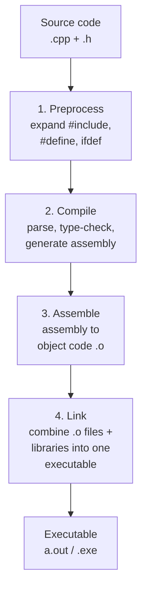
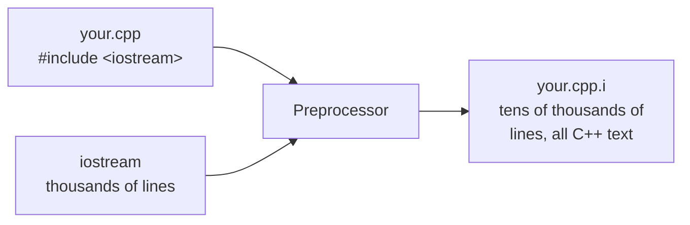
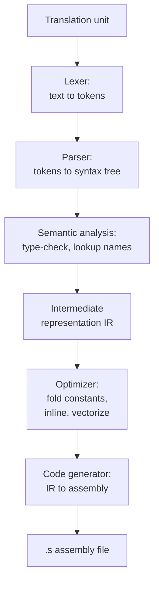
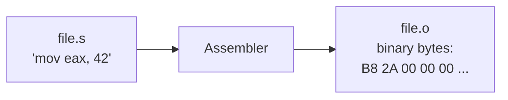
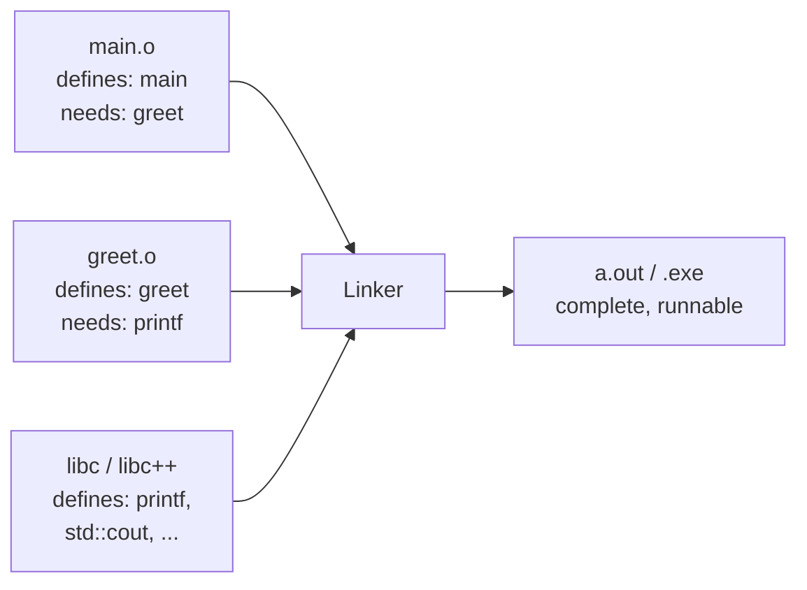
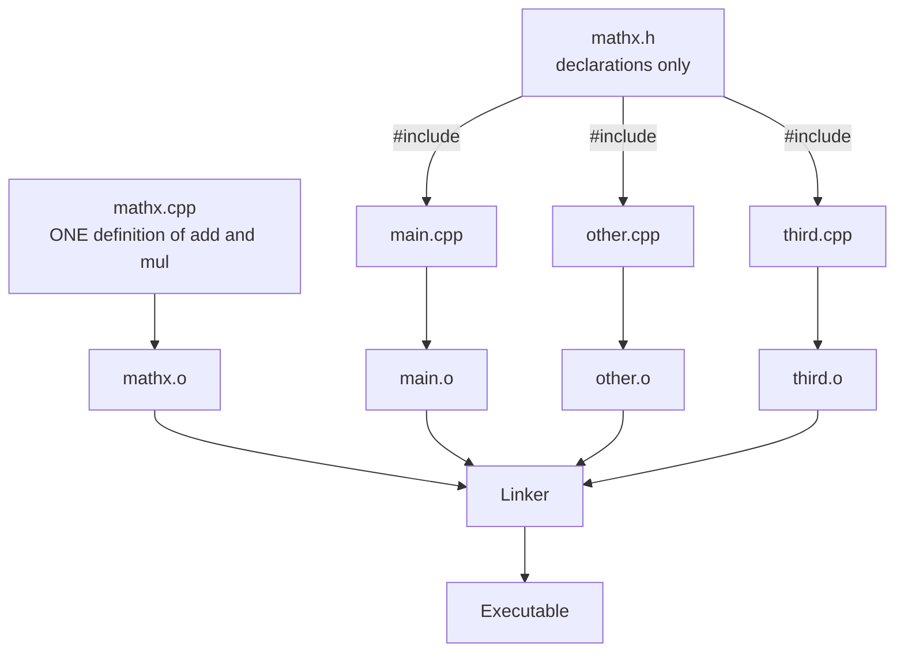

You have already run a few C++ programs in your browser. But what
*really* happens when you press the *Run* button? The text you typed
does not magically become electricity in a CPU; it travels through
several distinct stages of translation. Understanding those stages
will save you days of debugging time later, because most beginner
errors come from confusing one stage with another.

## A four-step pipeline

The traditional C++ toolchain has four steps:



Each step produces a real artifact you can sometimes inspect. Each
step has its own kind of error message. Let's walk through them.

## Step 1: the preprocessor

Before the compiler proper sees your code, a simpler tool called the
**preprocessor** runs over it and performs *text substitution*. It
handles every line that starts with `#`:

- `#include <iostream>` is replaced, in place, with the entire text
  of the `<iostream>` header file.
- `#define MAX 100` tells the preprocessor "wherever you see `MAX`,
  paste `100`."
- `#ifdef DEBUG ... #endif` conditionally keeps or deletes code
  blocks based on whether a name is defined.



After preprocessing, your single short `.cpp` file may have ballooned
into *tens of thousands of lines* of pure C++ source, because every
header was pasted in. The result is called a **translation unit**.

<Callout type="info" title="A common beginner surprise">
The preprocessor does pure text substitution, with **no** knowledge
of types or syntax. If you `#define square(x) x*x` and then write
`square(1+2)`, the preprocessor produces `1+2*1+2`, which evaluates
to `5`, not `9`. This is one big reason modern C++ prefers
`inline` functions and `constexpr` over macros.
</Callout>

## Step 2: the compiler

The actual **compiler** takes one translation unit and turns it into
**assembly**, the human-readable form of machine code for your target
CPU. Inside, the compiler runs many sub-passes:



This is the stage where almost all of your *type errors* are caught.
If you write

```cpp
int x = "hello";
```

it is the compiler — not the linker, not the OS — that complains:
*"cannot initialize a variable of type `int` with an lvalue of type
`const char[6]`."*

<CodeBlock
  adapter="cpp"
  starterCode={`// Try uncommenting the bad line. The error you see comes from the
// compiler in step 2, not from the linker, and definitely not at
// runtime.
#include <iostream>

int main() {
    int x = 42;
    // int y = "hello";   // <-- compile error
    std::cout << x << "\\n";
    return 0;
}
`}
/>

## Step 3: the assembler

The **assembler** translates assembly text into actual binary
**machine code**, packaged into a file called an **object file**
(usually with extension `.o` on Linux/macOS or `.obj` on Windows).
This step is essentially a one-to-one translation table.



An object file contains:

- The bytes of every function's machine code.
- A table of *symbols* that this file **defines** (functions and
  globals it provides).
- A table of *symbols* this file **needs** but does not define
  (calls to `printf`, references to `std::cout`, etc.).

Object files are not runnable on their own. They are puzzle pieces.

## Step 4: the linker

The **linker** is the puzzle-piece assembler. It takes one or more
object files plus any libraries (the standard library, third-party
libraries) and glues them into a single **executable**. Its main
job is *symbol resolution*: every "needs" entry in one object file
must be matched against a "defines" entry in another.



When you forget to compile a `.cpp` file, or you misspell a function
name, you get the famous **undefined reference** error:

```
undefined reference to `Greeter::greet()`
```

That message comes from the linker, not the compiler. It means
"somebody asked for `Greeter::greet`, but no object file I was given
defines it."

## See it for yourself: a multi-file program

Below is a real multi-file C++ project. The browser compiles all
three files together, links them, and runs the executable.

<CodeBlock
  adapter="cpp"
  entryFilename="main.cpp"
  files={[
    {
      filename: "main.cpp",
      initialContent: `#include <iostream>
#include "mathx.h"

int main() {
    int a = 6, b = 7;
    std::cout << "add(" << a << ", " << b << ") = " << add(a, b) << "\\n";
    std::cout << "mul(" << a << ", " << b << ") = " << mul(a, b) << "\\n";
    return 0;
}
`,
    },
    {
      filename: "mathx.h",
      initialContent: `#pragma once

int add(int a, int b);
int mul(int a, int b);
`,
    },
    {
      filename: "mathx.cpp",
      initialContent: `#include "mathx.h"

int add(int a, int b) { return a + b; }
int mul(int a, int b) { return a * b; }
`,
    },
  ]}
/>

Notice the split:

- `mathx.h` is the **header**. It contains only **declarations**:
  "there exist functions called `add` and `mul` with these
  signatures." It does *not* say what they do.
- `mathx.cpp` is the **implementation**. It provides the
  **definitions** — the actual code.
- `main.cpp` `#include`s the header so the compiler knows that
  `add` and `mul` exist. The **linker** later matches those calls
  to the definitions in `mathx.cpp`.

This *separation of declaration from definition* is the foundation
of how large C++ projects scale to millions of lines.

## Headers, definitions, and the one-definition rule

C++ has a very important rule called the **One-Definition Rule
(ODR)**: every non-inline function and every global variable must
have *exactly one* definition across the entire program. The
header/implementation split exists to obey this rule even when many
`.cpp` files need to *use* the same function.



If you accidentally put the *definition* of `add` inside `mathx.h`
and `#include` that header from two `.cpp` files, the linker will
see two `add` functions and refuse to build. This is why headers
typically only contain declarations (or `inline` / `template`
definitions, which the language explicitly exempts from ODR).

## The picture you should remember

When something goes wrong, ask: **at which stage did this fail?**

| Symptom | Most likely stage |
| --- | --- |
| `'unterminated #ifdef'` | Preprocessor |
| `'expected ;'`, `'unknown type name'`, `'no matching function'` | Compiler |
| `'undefined reference to X'`, `'multiple definition of X'` | Linker |
| Crash, wrong output, hang | Runtime |

Knowing the stage instantly narrows the search.

## A small challenge

Try the multi-file challenge below. Read all three files first;
they describe a tiny library and an entry point. Implement the
missing function — and remember, the linker is what binds your
implementation to the call from `main`.

<ChallengeCard
  adapter="cpp"
  title="Implement greet() in a separate translation unit"
  instructions={`Open \`greeter.cpp\` and implement \`greet(name)\` so the program prints \`Hello, <name>!\` (with a newline). The header and \`main.cpp\` are already wired up — your job is to provide the **definition** that satisfies the **declaration** in the header.`}
  entryFilename="main.cpp"
  files={[
    {
      filename: "main.cpp",
      initialContent: `#include "greeter.h"\n\nint main() {\n    greet("Ada");\n    greet("Linus");\n    return 0;\n}\n`,
    },
    {
      filename: "greeter.h",
      initialContent: `#pragma once\n#include <string>\n\nvoid greet(const std::string& name);\n`,
    },
    {
      filename: "greeter.cpp",
      initialContent: `#include <iostream>\n#include "greeter.h"\n\nvoid greet(const std::string& name) {\n    // your code here\n}\n`,
      solutionContent: `#include <iostream>\n#include "greeter.h"\n\nvoid greet(const std::string& name) {\n    std::cout << "Hello, " << name << "!\\n";\n}\n`,
    },
  ]}
  tests={[
    {
      id: "greets",
      name: "Greets Ada and Linus",
      description: "Exact stdout match across two lines",
      expect: {
        stdoutLines: ["Hello, Ada!", "Hello, Linus!"],
        stdoutLinesExact: true,
      },
    },
  ]}
/>

## Test your understanding

<MultipleChoice
  markdown={`Which stage of the pipeline expands \`#include\` directives?

- [o] The preprocessor.
  > The preprocessor pastes the entire contents of the included file before the compiler sees anything.
- The compiler.
  > By the time the compiler runs, includes have already been expanded.
- The assembler.
  > The assembler turns assembly text into machine code; it does not handle includes.
- The linker.
  > The linker resolves references between object files; it has nothing to do with \`#include\`.`}
/>

<MultipleChoice
  markdown={`You see the error \`undefined reference to 'foo()'\`. Where did it come from?

- The preprocessor.
  > The preprocessor does not check whether functions exist.
- The compiler.
  > The compiler accepts a declaration of \`foo\`; it does not need a body.
- [o] The linker.
  > The linker tried to match a *use* of \`foo\` to a *definition* and could not find one.
- The operating system at runtime.
  > By the time the OS runs the program, all references must already be resolved.`}
/>

<MultipleChoice
  markdown={`Why do C++ projects typically put declarations in \`.h\` files and definitions in \`.cpp\` files?

- To save typing.
  > That's a side benefit, not the main reason.
- Because compilers cannot read \`.cpp\` files.
  > Compilers absolutely can read \`.cpp\` files.
- [o] To obey the One-Definition Rule: many \`.cpp\` files can share the same *declarations* (via \`#include\`) but the function must be *defined* in exactly one place.
  > Putting definitions in headers would cause linker errors when the header is included by more than one source file.
- Because headers run faster than source files.
  > Headers and source files do not "run"; they are just compiled.`}
/>

<MultipleChoice
  markdown={`What kind of file does the compiler emit *before* the linker runs?

- The final executable.
  > That is produced by the linker, not the compiler.
- A source file with macros expanded.
  > That is the output of the preprocessor.
- [o] An object file containing machine code plus tables of defined and required symbols.
  > Object files are the puzzle pieces the linker assembles.
- An interpreter bytecode file.
  > C++ is not interpreted; it produces native machine code.`}
/>

Next: let's actually look at "Hello, World!" line by line, and see
which parts of the language each piece is using.
