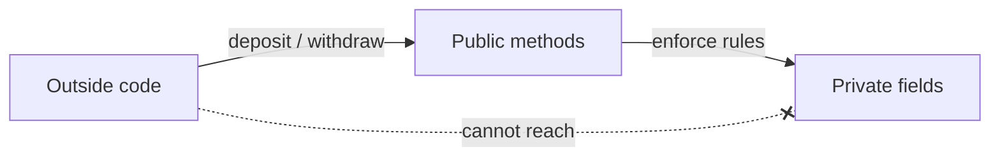
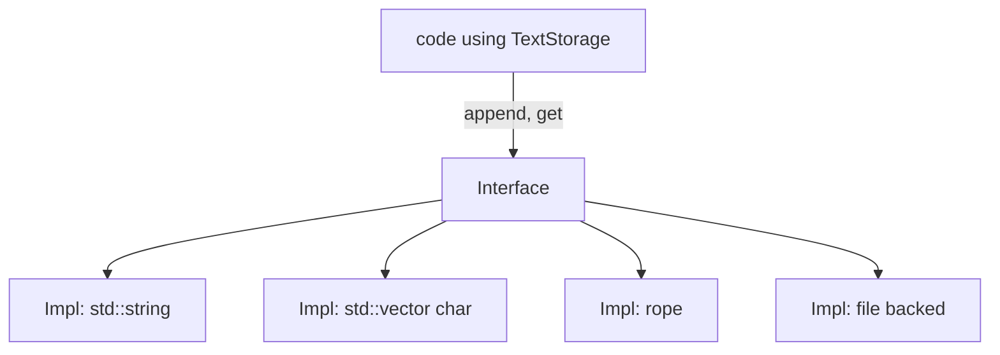

A class is a *contract*. From the outside, it offers a set of
operations and promises certain things will always be true. From the
inside, it is whatever code is needed to keep those promises.

Two ideas make this work:

- **Encapsulation** — bundling data with the code that controls it
  and hiding the data from the outside world.
- **Abstraction** — exposing a simple interface that captures the
  *what* without committing to the *how*.

These aren't C++ features; they are *design principles* that the
language gives you tools to apply.

## Invariants: truths your class must keep

An **invariant** is a rule about a class's state that must always
hold while no method is in progress. Some examples:

| Class | Invariant |
| --- | --- |
| `BankAccount` | `balance >= 0` |
| `Date` | `1 <= month <= 12` |
| `Stack<T>` | `size <= capacity` and `size >= 0` |
| `SortedVector<int>` | the elements are non-decreasing |

If a field is `public`, anyone can break the invariant by assigning
to it. Making it `private` and offering controlled methods is how
you defend the invariant.



## A `Date` that cannot be invalid

<CodeBlock
  adapter="cpp"
  initialCode={`#include <iostream>

class Date {
public:
    Date(int y, int m, int d) {
        if (m < 1 || m > 12) m = 1;
        if (d < 1 || d > 31) d = 1;
        year_  = y;
        month_ = m;
        day_   = d;
    }

    int year()  const { return year_;  }
    int month() const { return month_; }
    int day()   const { return day_;   }

private:
    int year_, month_, day_;
};

int main() {
    Date d1(2025, 11, 7);
    Date d2(2025, 99, 99);   // invalid -> snapped to 1/1
    std::cout << d1.year() << "-" << d1.month() << "-" << d1.day() << "\\n";
    std::cout << d2.year() << "-" << d2.month() << "-" << d2.day() << "\\n";
    return 0;
}
`}
/>

There is no way a `Date` object can exist with `month == 99`.
Outside code never sees the fields, only the safe getters. The
class is **encapsulated**.

## Abstraction: same interface, different implementations

Imagine a `TextStorage` that you can `append` to and read by index.
You could implement it as a `std::string`, a `std::vector<char>`, a
rope data structure, even an on-disk file. The *interface* — the
public method names and meanings — stays the same. Code that uses a
`TextStorage` does not care which implementation it got.



That is abstraction. You name the *what* (`append`, `get`) and hide
the *how* (the data structure). Later you can swap implementations
without changing any caller.

## Why this matters

When a program is small you can keep everything in your head. When
it grows past a few hundred lines, you need ways to reason about
*pieces* without re-reading the whole codebase. Encapsulation gives
you those pieces:

- You can change a class's internals without breaking its users, as
  long as you keep its public interface stable.
- You can test a class in isolation.
- You can let multiple people work on different classes without
  stepping on each other.

This is the difference between programs that grow gracefully and
programs that calcify under their own weight.

## Getters, setters, and a word of caution

It's tempting to write a getter and a setter for every field. That
turns your class right back into a struct with extra steps:

```cpp
// anti-pattern
class Point {
public:
    int x() const { return x_; }
    void set_x(int v) { x_ = v; }
    int y() const { return y_; }
    void set_y(int v) { y_ = v; }
private:
    int x_, y_;
};
```

If a class has no invariants and no behaviour, just use a `struct`.
Reach for `class` when you have something to protect.

## Test your understanding

<MultipleChoice
  markdown={`What is an *invariant* of a class?

- A method that never changes.
  > That would be a constant method.
- A field whose value is fixed.
  > That would be a \`const\` member.
- [o] A property of the object's state that must always hold whenever no method is in progress.
  > Correct. The class's public methods are responsible for maintaining it.
- A type alias used by the class.
  > That is not the meaning here.`}
/>

<MultipleChoice
  markdown={`What is the main reason to make fields \`private\`?

- The compiler runs faster.
  > Access level doesn't affect runtime performance.
- It hides the field from the debugger.
  > It does not; debuggers can see private members.
- [o] It prevents outside code from putting the object in an invalid state, letting the class defend its invariants.
  > Correct. It also lets you change the storage without breaking callers.
- It is required for inheritance.
  > It isn't.`}
/>

Next: how objects come to life and how they clean up after
themselves — *constructors* and *destructors*.
