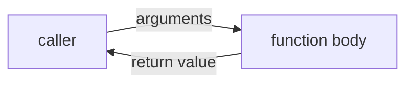
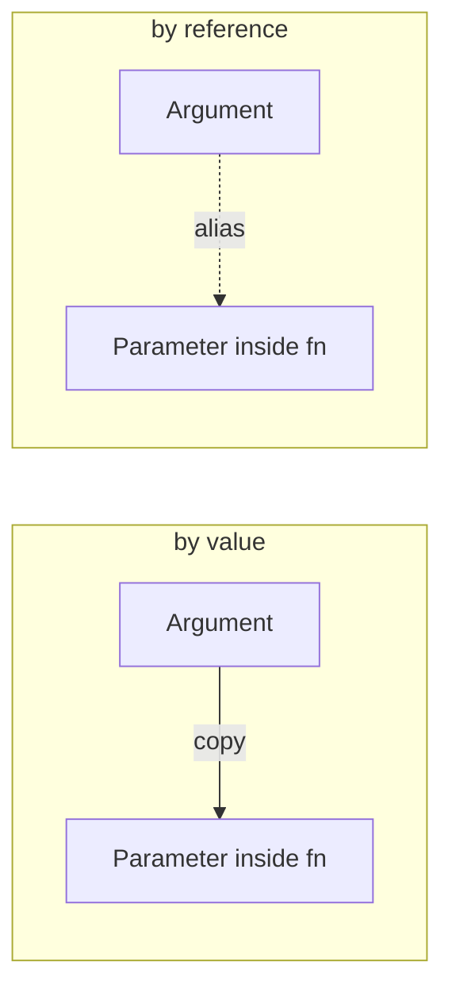

A **function** is a named, reusable chunk of code. It takes some
inputs (called **parameters**), does something, and optionally
returns a value. Functions are the single most important tool you
have for managing complexity: they let you replace a tangle of
inline code with a one-line *call* whose name documents intent.



Every C++ program already uses one function: `main`. Now let's
write our own.

## Anatomy of a function

```cpp
int add(int a, int b) {     // return type, name, parameter list
    return a + b;           // body
}
```

The parts:

- **Return type** (`int`) — what kind of value flows back to the
  caller. Use `void` if the function returns nothing.
- **Name** (`add`) — what callers will use to invoke it.
- **Parameter list** (`int a, int b`) — typed slots for the inputs.
- **Body** (between `{` and `}`) — the code that runs when the
  function is called.

A function must have one **definition** (the body) and may have many
**declarations** (signatures without a body, often in a header).

<CodeBlock
  adapter="cpp"
  starterCode={`#include <iostream>

// Declaration — tells the compiler "this exists".
int square(int n);

int main() {
  std::cout << square(7) << "\\n";
  return 0;
}

// Definition — the actual body.
int square(int n) { return n * n; }
`}
/>

The declaration above `main` lets `main` *call* `square` before the
compiler has seen its body. Without the declaration, the compiler
would say "what is `square`?"

## Parameters: by value, by reference, by const reference

Choosing how to pass parameters is one of the most important small
decisions in C++.



### By value: a copy

```cpp
void doubled(int x) { x *= 2; }
```

The function receives a *copy* of the caller's argument. Modifying
the parameter does **not** affect the caller. Use this for small,
cheap-to-copy types like `int`, `double`, `bool`, `char`.

### By reference: an alias

```cpp
void doubled(int& x) { x *= 2; }
```

The function receives a *reference* — essentially a second name for
the caller's variable. Modifying it modifies the caller's variable.

### By const reference: a read-only alias

```cpp
void print(const std::string& s) { std::cout << s; }
```

A reference that you promise not to modify. No copy, no risk. This
is the standard way to pass large objects (strings, vectors,
classes) into functions when you only need to read them.

<CodeBlock
  adapter="cpp"
  starterCode={`#include <iostream>
#include <string>

void by_value(int x) { x = 100; }
void by_reference(int &x) { x = 100; }
void print(const std::string &s) { std::cout << "received: " << s << "\\n"; }

int main() {
  int n = 1;
  by_value(n);
  std::cout << "after by_value:     n = " << n << "\\n"; // still 1

  by_reference(n);
  std::cout << "after by_reference: n = " << n << "\\n"; // 100

  std::string greeting = "Hello!";
  print(greeting); // no copy made; we just borrow it.
  return 0;
}
`}
/>

A quick rule of thumb:

| Argument type | How to take it |
| --- | --- |
| Small (fits in a register or two) and read-only | by value |
| Large and read-only | by **const reference** |
| Must be modified by the function | by reference |
| Optional / may be null | by pointer |

## Return values

A function returns at most one value. Returning a large object used
to mean an expensive copy, but modern C++ optimizes this with
**Return Value Optimization** (RVO) and **move semantics**: returning
a `std::string` or `std::vector` is essentially free.

<CodeBlock
  adapter="cpp"
  starterCode={`#include <iostream>
#include <string>
#include <vector>

std::vector<int> first_n_squares(int n) {
  std::vector<int> out;
  for (int i = 1; i <= n; ++i)
    out.push_back(i * i);
  return out; // no expensive copy; the compiler "moves" the vector.
}

int main() {
  auto v = first_n_squares(5);
  for (int x : v)
    std::cout << x << " ";
  std::cout << "\\n";
  return 0;
}
`}
/>

If you need to return multiple things, use a `struct`, `std::pair`,
or `std::tuple`. We will see structs soon.

## Default arguments

Parameters can have **default values**. Callers may omit those
arguments at the end of the list.

<CodeBlock
  adapter="cpp"
  starterCode={`#include <iostream>
#include <string>

void greet(const std::string &name, const std::string &punctuation = "!") {
  std::cout << "Hello, " << name << punctuation << "\\n";
}

int main() {
  greet("Ada");
  greet("Linus", ".");
  return 0;
}
`}
/>

Defaults only go at the *end* of the parameter list. Once one
parameter has a default, every parameter after it must too.

## Function overloading

C++ lets multiple functions share a name as long as they differ in
their parameter types. The compiler picks the right one at the call
site based on the arguments.

<CodeBlock
  adapter="cpp"
  starterCode={`#include <iostream>
#include <string>

void show(int n) { std::cout << "int: " << n << "\\n"; }
void show(double d) { std::cout << "double: " << d << "\\n"; }
void show(const std::string &s) { std::cout << "string: " << s << "\\n"; }

int main() {
  show(42);
  show(3.14);
  show(std::string{"hi"});
  return 0;
}
`}
/>

This is **compile-time polymorphism**: one name, several
implementations, chosen by static type. Don't confuse it with the
runtime polymorphism we'll meet in the OOP chapter (virtual
functions).

## `void`, single responsibility, and good naming

A function that returns `void` is one that exists for its **side
effects** (printing, modifying things). A function that returns a
value but has no side effects is sometimes called **pure**, and is
the easiest kind to reason about and test.

A useful design principle: every function should do **one thing**,
and its name should describe that thing. Functions over ~30 lines
or with names like `do_stuff` are usually doing too much.

```cpp
// Bad: vague name, multiple responsibilities
void process(int n) { ... 80 lines of code ... }

// Better: small, named, composable pieces
int  parse(const std::string& s);
bool validate(int n);
void persist(int n);
```

## Recursion: a function that calls itself

A function can call itself. This is called **recursion**, and it is
sometimes the most natural way to express problems that have a
naturally recursive structure (trees, lists, mathematical sequences).

<CodeBlock
  adapter="cpp"
  starterCode={`#include <iostream>

int factorial(int n) {
  if (n <= 1)
    return 1;                  // base case
  return n * factorial(n - 1); // recursive case
}

int main() {
  for (int i = 0; i <= 6; ++i) {
    std::cout << i << "! = " << factorial(i) << "\\n";
  }
  return 0;
}
`}
/>

Every recursive function needs:

1. A **base case** that returns without recursing (otherwise it
   recurses forever and overflows the stack).
2. A **recursive case** that calls itself with a *smaller* problem.

For now, prefer loops when in doubt. Recursion shines when we hit
trees and divide-and-conquer algorithms later.

## A small multi-file project

In real code, related functions live in their own header /
implementation pair. The example below splits string utilities out
into their own file.

<CodeBlock
  adapter="cpp"
  entryFilename="main.cpp"
  files={[
    {
      filename: "main.cpp",
      initialContent: `#include "strutil.h"
#include <iostream>

int main() {
  std::cout << to_upper("hello") << "\\n";
  std::cout << repeat("ab", 3) << "\\n";
  return 0;
}
`,
    },
    {
      filename: "strutil.h",
      initialContent: `#pragma once
#include <string>

std::string to_upper(const std::string &s);
std::string repeat(const std::string &s, int n);
`,
    },
    {
      filename: "strutil.cpp",
      initialContent: `#include "strutil.h"
#include <cctype>

std::string to_upper(const std::string &s) {
  std::string out;
  out.reserve(s.size());
  for (char c : s)
    out += static_cast<char>(std::toupper(static_cast<unsigned char>(c)));
  return out;
}

std::string repeat(const std::string &s, int n) {
  std::string out;
  out.reserve(s.size() * n);
  for (int i = 0; i < n; ++i)
    out += s;
  return out;
}
`,
    },
  ]}
/>

This pattern scales. Real C++ projects have hundreds of
header/implementation pairs grouped into folders.

## Challenges

<ChallengeCard
  adapter="cpp"
  title="Implement min3"
  instructions={`Implement \`int min3(int a, int b, int c)\` that returns the smallest of three integers. \`main\` already prints \`min3(7, 2, 5)\`, which should be \`2\`.`}
  starterCode={`#include <iostream>

int min3(int a, int b, int c) {
  // your code here
  return 0;
}

int main() {
  std::cout << min3(7, 2, 5);
  return 0;
}
`}
  solutionCode={`#include <algorithm>
#include <iostream>

int min3(int a, int b, int c) { return std::min({a, b, c}); }

int main() {
  std::cout << min3(7, 2, 5);
  return 0;
}
`}
  tests={[
    {
      id: "min",
      name: "min3(7,2,5) = 2",
      description: "Exact stdout match",
      expect: { stdoutEquals: "2" },
    },
  ]}
/>

<ChallengeCard
  adapter="cpp"
  title="Pass-by-reference swap"
  instructions={`Implement \`void swap_ints(int& a, int& b)\` that swaps the values of its two arguments **in place**. \`main\` will print the values after the swap and expects to see \`9 1\`.`}
  starterCode={`#include <iostream>

void swap_ints(int &a, int &b) {
  // your code here
}

int main() {
  int x = 1, y = 9;
  swap_ints(x, y);
  std::cout << x << " " << y;
  return 0;
}
`}
  solutionCode={`#include <iostream>

void swap_ints(int &a, int &b) {
  int tmp = a;
  a = b;
  b = tmp;
}

int main() {
  int x = 1, y = 9;
  swap_ints(x, y);
  std::cout << x << " " << y;
  return 0;
}
`}
  tests={[
    {
      id: "swap",
      name: "Swapped to 9 1",
      description: "Exact stdout match",
      expect: { stdoutEquals: "9 1" },
    },
  ]}
/>

<ChallengeCard
  adapter="cpp"
  title="Library split: arithmetic"
  instructions={`Open \`arith.cpp\` and implement \`gcd(a, b)\` using Euclid's algorithm — repeatedly replace \`(a, b)\` with \`(b, a % b)\` until \`b == 0\`. Return the absolute value of \`a\` at that point (assume positive inputs). \`main\` prints \`gcd(48, 18)\` which should be \`6\`.`}
  entryFilename="main.cpp"
  files={[
    {
      filename: "main.cpp",
      initialContent: `#include "arith.h"
#include <iostream>

int main() {
  std::cout << gcd(48, 18);
  return 0;
}
`,
    },
    {
      filename: "arith.h",
      initialContent: `#pragma once\n\nint gcd(int a, int b);\n`,
    },
    {
      filename: "arith.cpp",
      initialContent: `#include "arith.h"

int gcd(int a, int b) {
  // your code here
  return 0;
}
`,
      solutionContent: `#include "arith.h"

int gcd(int a, int b) {
  while (b != 0) {
    int t = a % b;
    a = b;
    b = t;
  }
  return a;
}
`,
    },
  ]}
  tests={[
    {
      id: "gcd",
      name: "gcd(48,18) = 6",
      description: "Exact stdout match",
      expect: { stdoutEquals: "6" },
    },
  ]}
/>

## Test your understanding

<MultipleChoice
  markdown={`A function takes a parameter as \`const std::string&\`. What does that mean?

- The function gets a copy of the string that it cannot modify.
  > It does not get a copy — \`&\` means *reference*, not value.
- The function gets a pointer to the caller's string.
  > It gets a *reference*, which is similar in spirit but different in syntax and safety.
- [o] The function gets an alias for the caller's string, with a promise not to modify it.
  > This is the standard way to accept large read-only inputs without copying.
- The function will compile only if the string is a literal.
  > Any string can be passed.`}
/>

<MultipleChoice
  markdown={`What is required for every recursive function to terminate?

- A loop inside the function.
  > A pure recursive function has no loop; the recursion *is* the repetition.
- [o] A base case that returns without making another recursive call, and a recursive case that progresses toward the base case.
  > Without both, you'll either never recurse or recurse forever.
- A maximum-depth guard set by the compiler.
  > The compiler does not insert such guards; you must design termination yourself.
- A pointer parameter.
  > Pointers are unrelated to recursion termination.`}
/>

<MultipleChoice
  markdown={`When you write \`int square(int n);\` near the top of a file (no body), what is that?

- A function call.
  > A call would have parentheses with arguments and no return type.
- [o] A function **declaration**: it tells the compiler the signature without providing the body.
  > The body (the *definition*) can appear later, or in another file.
- A typo — function bodies are mandatory.
  > Declarations without bodies are valid and common.
- A way to make the function virtual.
  > That would require the \`virtual\` keyword inside a class.`}
/>

<MultipleChoice
  markdown={`Why can two overloads differ in their *parameter types* but not in *return type alone*?

*Hint: think about what information is available at the call site when the compiler decides which overload to use.*

- [o] The compiler chooses the overload by looking at the arguments you pass, and the arguments don't tell it what return type you expected.
  > Parameter types are visible at the call; the expected return type is not, so return type alone can't disambiguate.
- Two functions with the same name are forbidden by the standard.
  > They are allowed, as long as their parameter lists differ.
- Overloading only works for functions that return \`void\`.
  > Overloads can return any type; the return type simply isn't what selects them.
- C++ inherited the rule unchanged from C.
  > C does not support function overloading at all, so it can't be the source of this rule.`}
/>

Next: where do function calls actually live in memory? Meet *the
call stack*.
