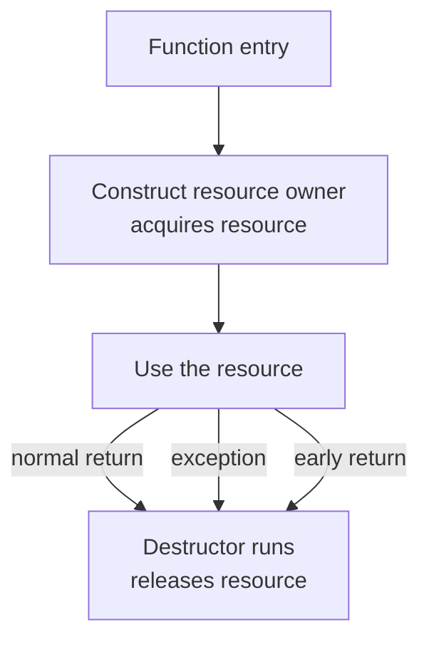
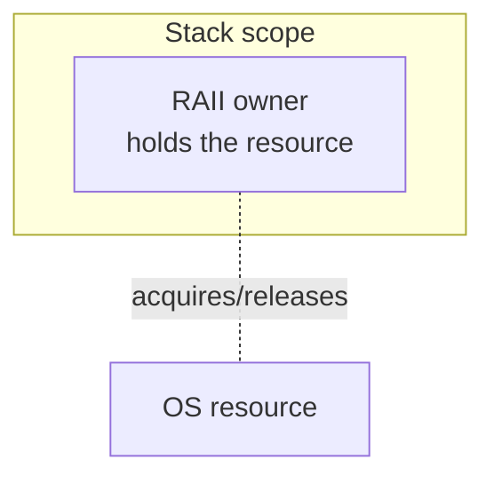

The single most powerful idea in C++ has an awkward acronym: **RAII**,
*Resource Acquisition Is Initialization*. It is the discipline that
lets you write programs that allocate memory, open files, lock
mutexes, and acquire any other resource you can imagine — and have
them all released correctly, on every code path, with no manual
cleanup calls.

## What is a "resource"?

Anything you *acquire* and must later *release*. Examples:

- Heap memory (must be `delete`-ed)
- Open files (must be `close`-ed)
- Network sockets (must be `close`-ed)
- Locks (must be released)
- Database connections
- Graphics handles, audio buffers, OS handles of every kind

Forgetting to release any of these causes leaks, deadlocks, or
worse. C alone gives you no help — you must remember every paired
acquire/release on every code path including error paths. C++ gives
you RAII.

## The RAII pattern

> **Acquire the resource in the constructor.<br/>
> Release the resource in the destructor.<br/>
> Use objects, not raw resources.**

Because destructors run deterministically when objects go out of
scope, *any* resource owned by an object on the stack will be
cleaned up automatically — even if an exception is thrown, even if
the function has many `return` paths.



The function author cannot forget cleanup, because there *is* no
cleanup to write.

## A toy file handle

Here is a hand-written RAII wrapper around C's `fopen`/`fclose` to
make the pattern concrete. (In real code, use `std::ofstream` —
which *is* a RAII wrapper around the OS file handle.)

<CodeBlock
  adapter="cpp"
  initialCode={`#include <cstdio>
#include <iostream>
#include <stdexcept>

class File {
public:
    File(const char* path, const char* mode) {
        fp_ = std::fopen(path, mode);
        if (!fp_) throw std::runtime_error("could not open file");
    }
    ~File() {
        if (fp_) std::fclose(fp_);
    }
    // (For now we forbid copying. We'll explain why in the next chapters.)
    File(const File&) = delete;
    File& operator=(const File&) = delete;

    void writeln(const char* s) { std::fprintf(fp_, "%s\\n", s); }

private:
    std::FILE* fp_;
};

int main() {
    try {
        File f("/tmp/raii_demo.txt", "w");
        f.writeln("hello from RAII");
        // no close needed: ~File runs here, no matter what.
    } catch (const std::exception& e) {
        std::cerr << "error: " << e.what() << "\\n";
    }
    std::cout << "done\\n";
    return 0;
}
`}
/>

What you should notice:

- We acquire the resource (open the file) in the **constructor**.
- We release it (close it) in the **destructor**.
- The user of the class writes no `close` call.
- If anything throws after `f` is constructed but before scope exit,
  the destructor still runs — no leak.

## Scoped locks: the textbook RAII

The `std::lock_guard` (and its newer cousin `std::scoped_lock`) is
the canonical example. It locks a mutex in its constructor and
unlocks it in its destructor.

```cpp
std::mutex m;
void do_work() {
    std::lock_guard<std::mutex> guard(m);   // locks
    // ... critical section ...
}   // <- guard destroyed, mutex unlocked, even if an exception was thrown
```

You will not find a single `m.unlock()` call in any well-written
modern C++ codebase. RAII does it for you.

## What "owns" means

A class **owns** a resource when it is responsible for releasing it.
The two questions to ask of every resource in your program:

1. *Which object owns it?*
2. *When does that object end?*

If you can't answer both, the resource is at risk of leaking or
being released twice. RAII makes these questions easy: the answer to
#1 is always "the wrapper object," and the answer to #2 is "when its
scope ends."



## Containers and strings are RAII

You've been using RAII the whole course without naming it.

- `std::vector` owns its heap buffer. When the vector dies, the
  buffer is freed.
- `std::string` owns its character storage.
- `std::ifstream`/`std::ofstream` own their file handles.
- Smart pointers (next chapter) own heap objects.

That is why modern C++ has almost no `new`/`delete`, `fopen`/`fclose`,
or `lock`/`unlock` in application code: those calls are buried inside
RAII wrappers, where the language can enforce correctness.

## Resource ownership rules of thumb

1. **Every resource has exactly one owner at any given time.**
2. **Prefer stack-allocated owners.** They clean up automatically.
3. **Express ownership in the type.** `std::unique_ptr<T>` *is*
   "exclusive owner of a T"; raw `T*` just means "address of a T."
4. **If a class owns a resource, define its destructor — or use a
   member that already owns it.**
5. **Avoid copying owners** unless you have a clear, well-defined
   copy operation. Otherwise prefer moves (next chapter) or delete
   the copy operations entirely.

## Test your understanding

<MultipleChoice
  markdown={`What does RAII stand for, and what is its core idea?

- Run-time Allocation In Iterations; allocate inside loops.
  > That is not a real term.
- Recursive Algorithm Implementation Interface.
  > Also not a real term.
- [o] *Resource Acquisition Is Initialization*: acquire resources in constructors and release them in destructors, so that scope exit always cleans up correctly.
  > It is the foundation of modern C++ resource management.
- Read-After-Initialize Idiom; read fields after constructing.
  > That is not what RAII means.`}
/>

<MultipleChoice
  markdown={`Why does RAII still work correctly when an exception is thrown?

- Exceptions disable the destructor calls along the unwound path.
  > The opposite: exceptions *trigger* destructors for objects whose scopes are unwound.
- The runtime keeps a list of every \`new\` and calls \`delete\` for each.
  > It does not; you must arrange ownership yourself.
- [o] During stack unwinding, the destructors of every fully-constructed object in scope run automatically, releasing their resources.
  > This is why RAII makes exception safety practical.
- It does not; exceptions are unsafe and you should disable them.
  > Modern C++ relies on exception-safe RAII.`}
/>

Next: the standard library's RAII wrappers for heap memory — *smart
pointers*.
