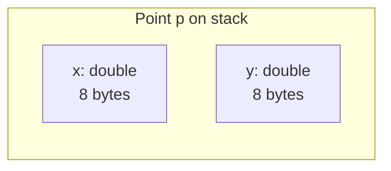

Once your programs grow past a few variables, you'll find yourself
passing the *same* group of values around together: a point's `x`
and `y`, a person's `name`, `age`, `email`. C++ lets you give that
group a name — a **struct** — and then treat it as one thing.

## A struct is a named bundle

```cpp
struct Point {
    double x;
    double y;
};
```

That's it. `Point` is now a type. You can create one, copy it,
return it, store it in a vector, anything you can do with a built-in
type.

<CodeBlock
  adapter="cpp"
  starterCode={`#include <iostream>

struct Point {
  double x;
  double y;
};

int main() {
  Point p{3.0, 4.0}; // aggregate initialization
  std::cout << "p = (" << p.x << ", " << p.y << ")\\n";

  p.x = 10.0;
  std::cout << "p = (" << p.x << ", " << p.y << ")\\n";
  return 0;
}
`}
/>

In memory, a `Point` is just the two `double`s laid out one after
the other:



The compiler may insert **padding** to align fields properly. Don't
worry about that yet — just know `sizeof(Point)` may be slightly
larger than the sum of its parts.

## Initialization shapes

```cpp
Point a;                  // default-initialized; fields are uninitialized!
Point b{};                // value-initialized; both fields zero
Point c{3.0, 4.0};        // aggregate init in declaration order
Point d{.x = 3.0, .y = 4.0};   // designated initializers (C++20)
```

The third and fourth forms are the safest and most readable. Always
*explicitly* initialize structs — uninitialized fields are a classic
source of silent bugs.

## Passing structs to functions

Structs follow the same value/reference rules as built-in types.

```cpp
double length(const Point& p) {   // const ref: no copy, can't modify
    return std::sqrt(p.x * p.x + p.y * p.y);
}

void scale(Point& p, double k) {  // non-const ref: modify caller
    p.x *= k;
    p.y *= k;
}

Point midpoint(Point a, Point b) {  // by value: small struct, fine
    return {(a.x + b.x) / 2.0, (a.y + b.y) / 2.0};
}
```

Rule of thumb: pass by `const&` unless the struct is two or three
fundamental fields, in which case by value is fine and may even be
faster.

## Aggregates of aggregates

Structs compose. A `Rectangle` can be made of two `Point`s:

<CodeBlock
  adapter="cpp"
  starterCode={`#include <iostream>

struct Point {
  double x;
  double y;
};

struct Rectangle {
  Point top_left;
  Point bottom_right;
};

double area(const Rectangle &r) {
  double w = r.bottom_right.x - r.top_left.x;
  double h = r.top_left.y - r.bottom_right.y;
  return w * h;
}

int main() {
  Rectangle box{{0.0, 10.0}, {5.0, 0.0}};
  std::cout << "area = " << area(box) << "\\n";
  return 0;
}
`}
/>

This is the seed of object-oriented design: small, focused types
combined into larger ones.

## `std::pair` and `std::tuple`

For one-off groupings where naming a struct would be overkill, the
standard library provides:

<CodeBlock
  adapter="cpp"
  starterCode={`#include <iostream>
#include <tuple>
#include <utility>

std::pair<int, int> min_max(int a, int b) {
  return {std::min(a, b), std::max(a, b)};
}

std::tuple<int, int, int> sort3(int a, int b, int c) {
  if (a > b)
    std::swap(a, b);
  if (b > c)
    std::swap(b, c);
  if (a > b)
    std::swap(a, b);
  return {a, b, c};
}

int main() {
  auto [lo, hi] = min_max(7, 3); // structured binding
  std::cout << lo << " " << hi << "\\n";

  auto [a, b, c] = sort3(5, 1, 3);
  std::cout << a << " " << b << " " << c << "\\n";
  return 0;
}
`}
/>

For anything more than two or three values, or anything that will
appear in more than one function, define a real `struct`. It's far
more readable.

## struct vs class

In C++, `struct` and `class` are *almost* the same. The only
language-level difference is the default access level:

- `struct` members are `public` by default.
- `class` members are `private` by default.

Conventionally:

- Use `struct` for plain data bundles (no invariants, no methods, or
  trivial methods).
- Use `class` when you have *invariants* to protect (data that must
  always satisfy some condition) — which leads us straight into the
  object-oriented chapter.

## Challenges

<ChallengeCard
  adapter="cpp"
  title="Average of points"
  instructions={`Given a hard-coded list of three \`Point\`s in \`main\`, compute the centroid (average of \`x\`, average of \`y\`) and print it as \`x y\` with no extra formatting. Expected output: \`3 4\`.`}
  starterCode={`#include <iostream>

struct Point {
  double x;
  double y;
};

int main() {
  Point pts[3] = {{1.0, 2.0}, {3.0, 4.0}, {5.0, 6.0}};
  // your code
  return 0;
}
`}
  solutionCode={`#include <iostream>

struct Point {
  double x;
  double y;
};

int main() {
  Point pts[3] = {{1.0, 2.0}, {3.0, 4.0}, {5.0, 6.0}};
  double sx = 0, sy = 0;
  for (auto &p : pts) {
    sx += p.x;
    sy += p.y;
  }
  std::cout << sx / 3 << ' ' << sy / 3;
  return 0;
}
`}
  tests={[
    {
      id: "centroid",
      name: "Centroid printed",
      description: "Exact stdout match",
      expect: { stdoutEquals: "3 4" },
    },
  ]}
/>

## Test your understanding

<MultipleChoice
  markdown={`In C++, what is the only language-level difference between \`struct\` and \`class\`?

- \`struct\` cannot have methods.
  > It can; both can have any kind of member.
- \`class\` is allocated on the heap, \`struct\` on the stack.
  > Storage location is independent of \`struct\` vs \`class\`.
- [o] The default member access: \`struct\` members are public by default, \`class\` members are private by default.
  > Conventions add more meaning, but the language only distinguishes default access.
- \`struct\` does not support inheritance.
  > It does.`}
/>

<MultipleChoice
  markdown={`Why is \`Point p;\` (default-initialized) potentially dangerous?

- It allocates memory on the heap.
  > It does not; \`p\` is a local on the stack.
- [o] The fields hold whatever bytes were already in that memory, so reading them is undefined behavior until you assign meaningful values.
  > Prefer \`Point p{};\` or aggregate initialization with explicit values.
- It is forbidden by the C++ standard.
  > It is allowed; that's why it's a footgun.
- It causes the compiler to emit a warning.
  > Most compilers do not warn at this declaration alone.`}
/>

Next: the leap from passive data bundles to active objects with
behaviour — classes.
