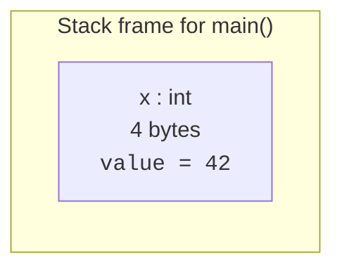
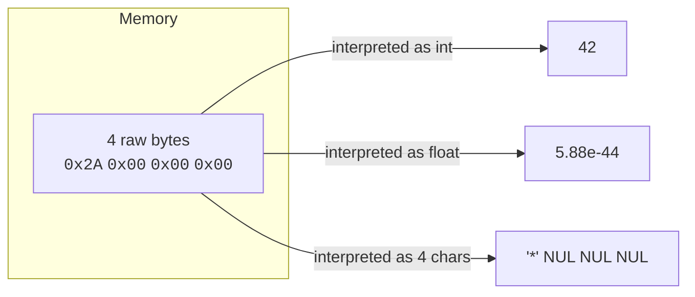
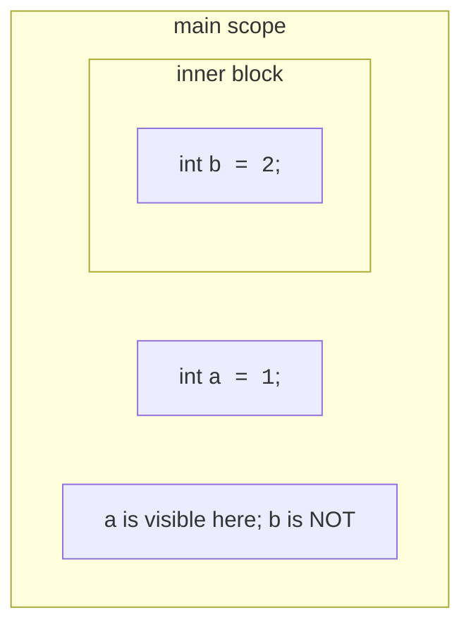
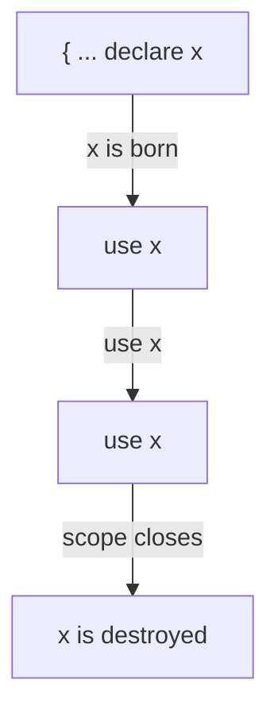

In every language, a **variable** is just a *name you give to a
place in memory*. In C++ that statement is almost literally true.
When you write

```cpp
int x = 42;
```

you are telling the compiler:

1. Reserve enough memory for an `int` (typically 4 bytes).
2. Remember that the name `x` refers to that piece of memory.
3. Initialize it to the value `42`.



You can later **read** the variable (`std::cout << x;`) or **write**
to it (`x = 99;`). The name `x` stays bound to the same place in
memory for as long as the variable is alive.

## Declarations vs definitions vs assignments

These three words sound similar but mean different things.

| Code | What it does |
| --- | --- |
| `int x;` | **Definition.** Reserves memory; the value is *uninitialized* (garbage). |
| `int x = 42;` | **Definition + initialization.** Reserves memory and gives it the value 42. |
| `extern int x;` | **Declaration only.** "Promise: an `int` named `x` is defined somewhere else." |
| `x = 99;` | **Assignment.** `x` must already exist; overwrite its value. |

Beginners almost never write the third form, but they care a lot
about the difference between the second and the fourth: *creating a
variable* vs *changing one*.

## Always initialize

C++ does not zero-initialize local variables by default. If you
forget to give a local variable a value, reading it is **undefined
behavior** — the compiler is allowed to do anything in response,
including making your program appear to work in testing and fail in
production. Make this a habit:

<CodeBlock
  adapter="cpp"
  files={[
    {
      filename: "main.cpp",
      starterCode: `#include <iostream>

int main() {
  int safe = 0; // good: initialized.
  int risky;    // bad: uninitialized!
  risky = 7;    // we fix it before reading, so this run is fine.

  std::cout << "safe  = " << safe << "\\n";
  std::cout << "risky = " << risky << "\\n";

  // Try uncommenting this: it would read 'risky' before assignment.
  // int risky2;
  // std::cout << risky2 << "\\n"; // undefined behavior!
  return 0;
}
`,
    },
  ]}
/>

Modern C++ tip: write `int x{};` (called **value initialization**)
when you want a default zero. The empty braces are the safest way
to ask for a sensible starting value.

## Types are promises about memory

Every variable in C++ has a **type**. The type is *not* just a
label; it tells the compiler:

- **How much memory to reserve.** An `int` is 4 bytes (typically),
  a `double` is 8 bytes, a `char` is 1 byte.
- **How to interpret those bytes.** The same 4 bytes might encode an
  integer, a float, or four ASCII characters; the *type* tells the
  compiler which interpretation to use.
- **What operations are allowed.** You can add two `int`s. You
  can index into an `int*`. You cannot multiply two `std::string`s.



This is why C++ is called a **statically typed** language: every
variable's type is decided at compile time and the compiler enforces
it. You cannot do `x = "hello";` if `x` is an `int`. The compiler
catches the bug before your program ever runs.

## A tour of fundamental types

You will use these constantly:

| Type | What it stores | Typical size | Range / notes |
| --- | --- | --- | --- |
| `bool` | `true` / `false` | 1 byte | yes/no |
| `char` | one character or small integer | 1 byte | -128..127 or 0..255 |
| `int` | integer | 4 bytes | about ±2.1 billion |
| `long` | larger integer | 4 or 8 bytes | platform-dependent |
| `long long` | even larger | 8 bytes | about ±9.2 quintillion |
| `unsigned int` | non-negative integer | 4 bytes | 0..4.29 billion |
| `float` | single-precision floating-point | 4 bytes | ~7 decimal digits |
| `double` | double-precision floating-point | 8 bytes | ~15 decimal digits |
| `std::string` | growable string of characters | depends | from `<string>` |

When you don't know which integer type to use, reach for `int`. When
you need to be precise about width (say, a 16-bit network protocol
field), use `<cstdint>` types like `int16_t`, `int32_t`, `int64_t`.

<CodeBlock
  adapter="cpp"
  files={[
    {
      filename: "main.cpp",
      starterCode: `#include <cstdint>
#include <iostream>

int main() {
  bool flag = true;
  char letter = 'Q';
  int count = 42;
  long long big = 12345678901234LL;
  float ratio = 0.5f;
  double precise = 3.14159265358979;
  int32_t fixed32 = -7;

  std::cout << flag << " " << letter << " " << count << " " << big << " "
            << ratio << " " << precise << " " << fixed32 << "\\n";
  return 0;
}
`,
    },
  ]}
/>

## `auto`: let the compiler infer the type

Modern C++ lets you write `auto` instead of spelling the type out,
and the compiler will fill in the right type by looking at the
initializer. This is handy for long type names.

<CodeBlock
  adapter="cpp"
  files={[
    {
      filename: "main.cpp",
      starterCode: `#include <iostream>
#include <string>

int main() {
  auto x = 42;                    // int
  auto y = 3.14;                  // double
  auto name = std::string{"Ada"}; // std::string
  auto flag = true;               // bool

  std::cout << x << " " << y << " " << name << " " << flag << "\\n";
  return 0;
}
`,
    },
  ]}
/>

`auto` does *not* mean "no type." It means "you, the compiler,
figure out the type and lock it in." `x` is just as much an `int`
as if you had written `int x;`.

## Scope: where a variable is visible

A variable's **scope** is the region of source code where its name
makes sense. The most common rule: a variable's scope starts at its
declaration and ends at the closing `}` of the smallest enclosing
block.



<CodeBlock
  adapter="cpp"
  files={[
    {
      filename: "main.cpp",
      starterCode: `#include <iostream>

int main() {
  int a = 1;
  {
    int b = 2;
    std::cout << "inside : a=" << a << ", b=" << b << "\\n";
  }
  std::cout << "outside: a=" << a << "\\n";
  // std::cout << b;  // <-- error: 'b' was not declared in this scope
  return 0;
}
`,
    },
  ]}
/>

Smaller scopes are *better*. Declare each variable as close to its
first use as possible, and the program becomes much easier to read
and reason about.

## Lifetime: when a variable lives and dies

Closely related to scope is **lifetime**: the period of time during
*execution* when the variable's memory is valid.



For a local variable, the lifetime equals the scope: the variable is
born when execution reaches its declaration and dies at the closing
`}` of its block. For a *global* variable (declared outside any
function) the lifetime is the entire program. For a heap-allocated
object (with `new`) the lifetime is *whatever you say*; we will
spend whole chapters on that.

A common bug is returning a pointer or reference to a local
variable: by the time the caller uses it, the variable has been
destroyed.

```cpp
int* bad() {
    int x = 42;
    return &x;     // returning the address of a local --
}                  // -- x dies HERE, the pointer dangles.
```

This is undefined behavior. We will cover pointers, references, and
how to avoid this trap properly in upcoming chapters.

## `const`: variables that don't vary

If a "variable" is never supposed to change, mark it `const`. The
compiler will enforce that, and you'll never have an accidental
overwrite.

<CodeBlock
  adapter="cpp"
  files={[
    {
      filename: "main.cpp",
      starterCode: `#include <iostream>

int main() {
  const int max_users = 100;
  std::cout << "max users = " << max_users << "\\n";

  // Try uncommenting this -- the compiler will refuse.
  // max_users = 200;
  return 0;
}
`,
    },
  ]}
/>

A useful habit: declare *everything* `const` by default, and only
remove `const` from things that genuinely need to change. Most of
your variables will turn out to be effectively constant once you
inspect them.

## Implicit conversions and a famous footgun

C++ will sometimes silently convert one type to another. Most are
harmless (`int` to `double`); some are dangerous (`double` to `int`
truncates, `signed` to `unsigned` wraps).

<CodeBlock
  adapter="cpp"
  files={[
    {
      filename: "main.cpp",
      starterCode: `#include <iostream>

int main() {
  double pi = 3.14159;
  int rounded = pi; // silently truncates to 3
  std::cout << "rounded = " << rounded << "\\n";

  int negative = -1;
  unsigned int u = negative; // !! wraps to a huge positive number
  std::cout << "u = " << u << "\\n";
  return 0;
}
`,
    },
  ]}
/>

Modern advice: prefer `static_cast<T>(value)` when you genuinely want
a conversion. It makes the intent explicit and easier to grep for.

## Challenge: variable practice

<ChallengeCard
  adapter="cpp"
  title="Celsius to Fahrenheit"
  instructions={`Implement \`celsius_to_fahrenheit\` so the program prints \`98.6\` (no trailing newline, just \`98.6\`).\n\nThe formula is \`F = C * 9/5 + 32\`. Watch out: \`9/5\` in integer arithmetic is \`1\`, not \`1.8\`!`}
  files={[
    {
      filename: "main.cpp",
      starterCode: `#include <iostream>

double celsius_to_fahrenheit(double c) {
  // your code here
  return 0.0;
}

int main() {
  std::cout << celsius_to_fahrenheit(37.0);
  return 0;
}
`,
      solutionCode: `#include <iostream>

double celsius_to_fahrenheit(double c) { return c * 9.0 / 5.0 + 32.0; }

int main() {
  std::cout << celsius_to_fahrenheit(37.0);
  return 0;
}
`,
    },
  ]}
  tests={[
    {
      id: "37c",
      name: "37 C = 98.6 F",
      description: "Exact stdout match",
      expect: { stdoutEquals: "98.6" },
    },
  ]}
/>

## Test your understanding

<MultipleChoice
  markdown={`In C++, what is a variable, in the simplest physical sense?

- A label attached to a function.
  > Functions and variables are different kinds of named entities.
- A copy of data stored in the CPU's registers permanently.
  > Variables can be cached in registers temporarily but they live in memory.
- [o] A name bound to a region of memory of a known type and size.
  > The compiler tracks the binding; the OS and CPU manage the memory.
- A pointer to a row in a database table.
  > That is not what the C++ language means by "variable".`}
/>

<MultipleChoice
  markdown={`What happens if you read a local variable that you never initialized?

- It is always zero.
  > Global variables are zero-initialized, but local variables are not.
- The compiler refuses to compile the program.
  > Compilers warn about this in many cases, but the standard does not require an error.
- [o] You get **undefined behavior**: the bytes in that memory are whatever happened to be there, and any code that uses them may misbehave.
  > Always initialize, ideally with \`int x{};\` or an explicit value.
- The runtime throws a NullVariableException.
  > C++ does not throw exceptions for uninitialized variables.`}
/>

<MultipleChoice
  markdown={`What does \`const\` do to a variable?

- It makes the variable live in the heap.
  > \`const\` is unrelated to where the variable lives.
- It guarantees the variable will be optimized away.
  > Optimization is the compiler's choice; \`const\` is a *contract*.
- [o] It tells the compiler that this variable's value must not change after initialization, and prevents any code that tries to.
  > \`const\` is one of the simplest ways to make code safer to read.
- It exports the variable to other source files.
  > That role is filled by \`extern\`, not \`const\`.`}
/>

<MultipleChoice
  markdown={`Why is \`auto\` not a violation of static typing?

- Because \`auto\` makes the variable dynamically typed.
  > C++ remains statically typed; \`auto\` does not change that.
- [o] Because the compiler still determines a single concrete type at compile time and locks it in; \`auto\` only saves you from spelling the type out.
  > \`auto x = 42;\` makes \`x\` exactly an \`int\` and nothing else.
- Because \`auto\` only works in templates.
  > \`auto\` works in many places, including ordinary local variables.
- Because the type is decided at runtime based on what you assign first.
  > Types in C++ never change at runtime.`}
/>

Next: a closer look at types themselves — what kinds C++ has, and
how to choose between them.
