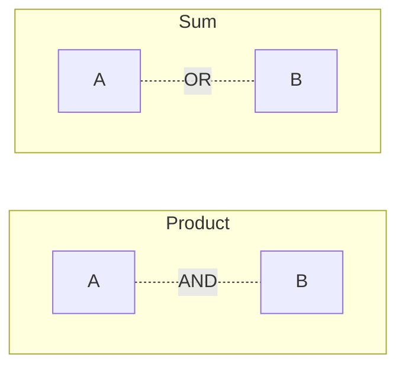
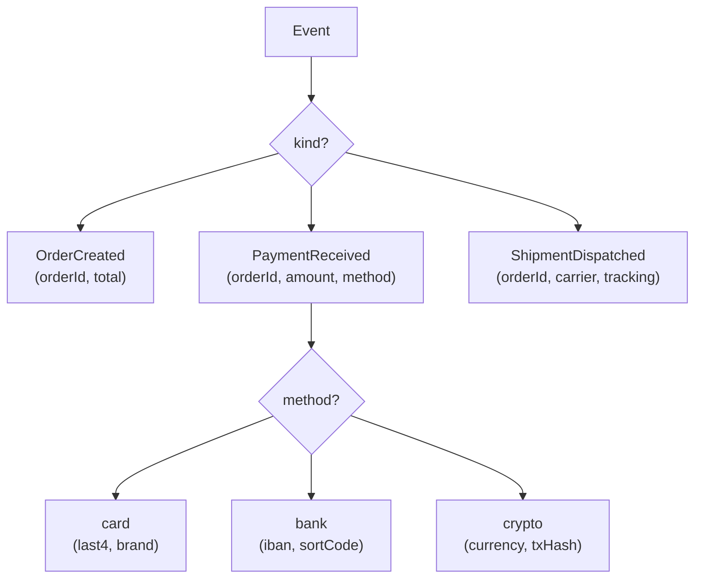

When you sit down to model a domain (an order, a user, a request,
a payment), you are choosing a *shape*. The shape determines which
states are possible, which are impossible, and which mistakes the
compiler can catch for you.

**Algebraic data types** (ADTs) are the type-level vocabulary
functional programmers use to build those shapes. There are exactly
two atomic moves — *and* and *or* — and you combine them to express
anything you need.

## Two operations: *and* (products) and *or* (sums)

- **Product** = "A *and* B". A pair. A record. A tuple.
  A `User` has a `name` *and* an `age`.
- **Sum** = "A *or* B". A choice. A union with a tag.
  A `Shape` is a `Circle` *or* a `Rectangle` *or* a `Triangle`.

That's the whole algebra. Every data model is some combination of
these two operations.

### Why "algebraic"?

If you count the values a type can have, products multiply and sums
add. A `boolean` has 2 values; a pair of booleans has `2 × 2 = 4`.
A choice between a `boolean` and a `string` has `2 + (all strings)`.
The cardinality literally follows the rules of arithmetic — hence
*algebraic* data types.

## Products in TypeScript: records and tuples

<CodeBlock
  adapter="typescript"
  initialCode={`// Record / object: a product
type User = {
  readonly name: string;
  readonly age: number;
};

const ada: User = { name: "Ada", age: 36 };

// Tuple: also a product (anonymous fields)
type Point = readonly [number, number];

const p: Point = [3, 4];

console.log(ada, p);
`}
/>

A product type is "all of these fields, simultaneously". TypeScript
already has them — they're records and tuples. There's nothing
novel here.

## Sums in TypeScript: discriminated unions

The interesting half. A sum says *"one of these alternatives"*. In
TypeScript, we model it as a **discriminated union** — a union of
record types, each with a unique tag field.

<CodeBlock
  adapter="typescript"
  initialCode={`type Shape =
  | { kind: "circle";    radius: number }
  | { kind: "rectangle"; width: number; height: number }
  | { kind: "triangle";  base: number; height: number };

function area(s: Shape): number {
  switch (s.kind) {
    case "circle":    return Math.PI * s.radius * s.radius;
    case "rectangle": return s.width * s.height;
    case "triangle":  return 0.5 * s.base * s.height;
  }
}

const shapes: readonly Shape[] = [
  { kind: "circle",    radius: 2 },
  { kind: "rectangle", width: 3, height: 4 },
  { kind: "triangle",  base: 5, height: 6 },
];

for (const s of shapes) console.log(s.kind, area(s));
`}
/>

A few things to notice:

1. The compiler **narrows** `s` to a specific variant inside each
   `case`. You can access `s.radius` only after confirming
   `s.kind === "circle"`. There is no need for type assertions or
   `as Circle`.
2. If you add a new variant (`square`) and forget to handle it, the
   compiler will warn — provided you use the `never` trick (next
   section).

### Exhaustiveness checking with `never`

<CodeBlock
  adapter="typescript"
  initialCode={`type Shape =
  | { kind: "circle";    radius: number }
  | { kind: "rectangle"; width: number; height: number };

function area(s: Shape): number {
  switch (s.kind) {
    case "circle":    return Math.PI * s.radius * s.radius;
    case "rectangle": return s.width * s.height;
    default: {
      // If we missed a case, 's' would be narrowed to that case,
      // and assigning to 'never' would fail to compile.
      const _exhaustive: never = s;
      return _exhaustive;
    }
  }
}

console.log(area({ kind: "circle", radius: 1 }));
console.log(area({ kind: "rectangle", width: 2, height: 3 }));
`}
/>

Try adding a `{ kind: "triangle"; base: number; height: number }`
variant to `Shape` and see how the compiler reacts. This is the
trick that turns "I think this `switch` covers everything" into "the
compiler will *prove* it does".

## Modeling possibility precisely

The most common beginner mistake is to model alternatives with
optional fields and booleans. That works, but it allows nonsense
states to exist in the type. Sums let you forbid them.

### Bad: "any of these fields might be set"

<CodeBlock
  adapter="typescript"
  initialCode={`type BadUser = {
  readonly id: string;
  readonly isActive: boolean;
  readonly isSuspended: boolean;
  readonly suspensionReason?: string;
  readonly suspendedUntil?: number;
};

// Is this user active and suspended at the same time? Allowed by the type:
const wat: BadUser = {
  id: "u1",
  isActive: true,
  isSuspended: true,
  suspensionReason: "spam",
};

console.log(wat);
`}
/>

The type *allows* "active and suspended" — a nonsense state. Every
function that takes `BadUser` now has to check at runtime: *is this
really suspended?*

### Good: a sum that forbids nonsense

<CodeBlock
  adapter="typescript"
  initialCode={`type UserStatus =
  | { kind: "active" }
  | { kind: "suspended"; reason: string; until: number }
  | { kind: "deleted";   deletedAt: number };

type User = {
  readonly id: string;
  readonly status: UserStatus;
};

function describe(u: User): string {
  switch (u.status.kind) {
    case "active":    return \`\${u.id} is active\`;
    case "suspended": return \`\${u.id} suspended until \${u.status.until} (\${u.status.reason})\`;
    case "deleted":   return \`\${u.id} deleted at \${u.status.deletedAt}\`;
  }
}

const a: User = { id: "u1", status: { kind: "active" } };
const s: User = { id: "u2", status: { kind: "suspended", reason: "spam", until: 2030 } };
const d: User = { id: "u3", status: { kind: "deleted", deletedAt: 2024 } };

[a, s, d].forEach((u) => console.log(describe(u)));
`}
/>

Now "active and suspended" is *unrepresentable*. The data carried by
each variant (`reason`, `until`, `deletedAt`) is tied to the case
that needs it — you can never have `suspendedUntil` without also
being suspended.

This is the slogan "**make illegal states unrepresentable**" in
action.

## A small zoo of useful sums

You'll use these shapes constantly. We define each here; later
chapters explore them in depth.

### Option: a value or nothing

<CodeBlock
  adapter="typescript"
  initialCode={`type Option<A> =
  | { kind: "none" }
  | { kind: "some"; value: A };

const some = <A,>(value: A): Option<A> => ({ kind: "some", value });
const none = <A,>(): Option<A> => ({ kind: "none" });

function head<A>(xs: readonly A[]): Option<A> {
  return xs.length === 0 ? none() : some(xs[0]);
}

const a = head([1, 2, 3]);
const b = head<number>([]);
console.log(a, b);
`}
/>

Replaces `null` and `undefined` with a type the compiler tracks.

### Result: success or failure

<CodeBlock
  adapter="typescript"
  initialCode={`type Result<E, A> =
  | { kind: "ok"; value: A }
  | { kind: "err"; error: E };

const ok  = <E, A>(value: A): Result<E, A> => ({ kind: "ok",  value });
const err = <E, A>(error: E): Result<E, A> => ({ kind: "err", error });

function parseInt2(s: string): Result<string, number> {
  const n = Number.parseInt(s, 10);
  return Number.isNaN(n) ? err("not an integer") : ok(n);
}

console.log(parseInt2("42"));
console.log(parseInt2("nope"));
`}
/>

Replaces exceptions with a type that *forces* the caller to handle
the error case.

### Tree: recursive sums

<CodeBlock
  adapter="typescript"
  initialCode={`type Tree<A> =
  | { kind: "leaf" }
  | { kind: "node"; value: A; left: Tree<A>; right: Tree<A> };

const leaf = <A,>(): Tree<A> => ({ kind: "leaf" });
const node = <A,>(value: A, left: Tree<A>, right: Tree<A>): Tree<A> =>
  ({ kind: "node", value, left, right });

function size<A>(t: Tree<A>): number {
  switch (t.kind) {
    case "leaf": return 0;
    case "node": return 1 + size(t.left) + size(t.right);
  }
}

const t: Tree<number> = node(1, node(2, leaf(), leaf()), node(3, leaf(), leaf()));
console.log("size:", size(t));
`}
/>

A *recursive* sum: a tree is either empty, or a node holding a value
and two subtrees. Three lines of definition; the entire algorithm
(walking it, transforming it, folding it) follows from `switch`.

## Designing with sums and products together

Real domain types interleave the two operations.

In TypeScript:

<CodeBlock
  adapter="typescript"
  initialCode={`type PaymentMethod =
  | { kind: "card";   last4: string; brand: "visa" | "mastercard" | "amex" }
  | { kind: "bank";   iban: string;  sortCode: string }
  | { kind: "crypto"; currency: "BTC" | "ETH"; txHash: string };

type Event =
  | { kind: "order_created";       orderId: string; total: number }
  | { kind: "payment_received";    orderId: string; amount: number; method: PaymentMethod }
  | { kind: "shipment_dispatched"; orderId: string; carrier: string; tracking: string };

function summarize(e: Event): string {
  switch (e.kind) {
    case "order_created":
      return \`order \${e.orderId} created for \${e.total}\`;
    case "payment_received":
      switch (e.method.kind) {
        case "card":   return \`paid \${e.amount} on \${e.orderId} via card *\${e.method.last4}\`;
        case "bank":   return \`paid \${e.amount} on \${e.orderId} via bank \${e.method.iban}\`;
        case "crypto": return \`paid \${e.amount} on \${e.orderId} in \${e.method.currency}\`;
      }
    case "shipment_dispatched":
      return \`order \${e.orderId} shipped via \${e.carrier} (\${e.tracking})\`;
  }
}

const events: readonly Event[] = [
  { kind: "order_created", orderId: "o1", total: 99 },
  { kind: "payment_received", orderId: "o1", amount: 99, method: { kind: "card", last4: "4242", brand: "visa" } },
  { kind: "shipment_dispatched", orderId: "o1", carrier: "DHL", tracking: "abc123" },
];

for (const e of events) console.log(summarize(e));
`}
/>

Sums nest inside sums (`Event.payment_received.method` is itself a
sum). Records carry the fields appropriate to each variant. The
compiler tracks both layers automatically.

## A multi-file challenge

<ChallengeCard
  adapter="typescript"
  title="Type a small geometry library"
  instructions={`In \`shape.ts\`, define a discriminated union \`Shape\`
that has four variants:

- \`circle\` — \`radius\`
- \`rectangle\` — \`width\`, \`height\`
- \`triangle\` — \`base\`, \`height\`
- \`square\` — \`side\`

Implement \`area(s: Shape): number\`. Use a \`switch\` and the
\`never\` exhaustiveness pattern in the default case.

In \`main.ts\`, the test data is shipped; do not modify it.

**Expected output**

\`\`\`
circle:   12.566370614359172
rectangle: 12
triangle: 15
square:   16
\`\`\``}
  entryFilename="main.ts"
  files={[
    {
      filename: "main.ts",
      initialContent: `import { area } from "./shape";

console.log("circle:  ", area({ kind: "circle",    radius: 2 }));
console.log("rectangle:", area({ kind: "rectangle", width: 3,  height: 4 }));
console.log("triangle:", area({ kind: "triangle",  base: 5,   height: 6 }));
console.log("square:  ", area({ kind: "square",    side: 4 }));
`,
    },
    {
      filename: "shape.ts",
      initialContent: `export type Shape =
  | { kind: "circle"; radius: number };
  // TODO: add rectangle, triangle, square variants

export function area(s: Shape): number {
  // TODO: switch over s.kind, return the appropriate area.
  // Use a 'never' default case for exhaustiveness.
  return 0;
}
`,
      solutionContent: `export type Shape =
  | { kind: "circle";    radius: number }
  | { kind: "rectangle"; width: number; height: number }
  | { kind: "triangle";  base: number;  height: number }
  | { kind: "square";    side: number };

export function area(s: Shape): number {
  switch (s.kind) {
    case "circle":    return Math.PI * s.radius * s.radius;
    case "rectangle": return s.width * s.height;
    case "triangle":  return 0.5 * s.base * s.height;
    case "square":    return s.side * s.side;
    default: {
      const _e: never = s;
      return _e;
    }
  }
}
`,
    },
  ]}
  tests={[
    {
      id: "geometry",
      name: "Exhaustive Shape union with area",
      description: "All four variants compute the right area.",
      expect: { stdoutEquals: "circle:   12.566370614359172\nrectangle: 12\ntriangle: 15\nsquare:   16" },
    },
  ]}
/>

---

<MultipleChoice
  markdown={`Why is a discriminated union ("sum type") often a better model than a record with several optional fields?

- Unions compile faster
  > Compilation speed is unaffected.
- Unions use less memory at runtime
  > Memory layout is essentially the same — both are plain objects.
- [o] A discriminated union ties each piece of data to the variant that needs it, so impossible combinations of fields cannot exist
  > Correct. With optional fields, the type permits nonsense like "active AND suspended". A union forbids that statically: each variant carries exactly the data it needs, no more.
- Unions don't need a "kind" tag
  > They do — the tag is what makes the union *discriminated* and what TypeScript narrows on.

Sums forbid illegal combinations *by construction*, eliminating a class of runtime checks entirely.`}
/>
