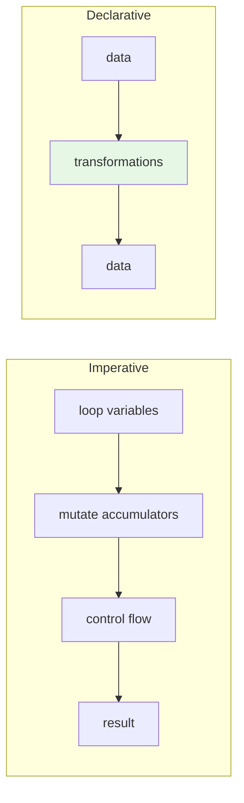

The most important shift you'll make in this course is not learning
a new operator or library. It is learning to *think* in a different
shape. **Imperative** code says: *do this, then this, then this.*
**Declarative** code says: *the answer is described by this
expression.*

Both styles are valid. Both can solve the same problem. But once
you internalize the declarative shape, code becomes dramatically
smaller, easier to read, and easier to change.

## The same task, both styles

**Problem.** From a list of orders, keep only the paid ones over
$50, take their customer names, deduplicate, and sort alphabetically.

### Imperative

<CodeBlock
  adapter="typescript"
  initialCode={`type Order = {
  readonly id: string;
  readonly status: "draft" | "paid" | "cancelled";
  readonly total: number;
  readonly customer: string;
};

const orders: readonly Order[] = [
  { id: "1", status: "paid",      total: 80,  customer: "Ada"   },
  { id: "2", status: "draft",     total: 200, customer: "Linus" },
  { id: "3", status: "paid",      total: 30,  customer: "Grace" },
  { id: "4", status: "paid",      total: 90,  customer: "Ada"   },
  { id: "5", status: "cancelled", total: 60,  customer: "Edsger"},
  { id: "6", status: "paid",      total: 120, customer: "Linus" },
];

const seen = new Set<string>();
const names: string[] = [];

for (let i = 0; i < orders.length; i++) {
  const o = orders[i];
  if (o.status === "paid" && o.total > 50) {
    if (!seen.has(o.customer)) {
      seen.add(o.customer);
      names.push(o.customer);
    }
  }
}

names.sort();
console.log(names);
`}
/>

This works. It is also full of *mechanical bookkeeping*: an index
variable, a `seen` set, a `for` loop, an explicit mutation, an
in-place sort. To read it, you have to *execute it in your head*
step by step.

### Declarative

<CodeBlock
  adapter="typescript"
  initialCode={`type Order = {
  readonly id: string;
  readonly status: "draft" | "paid" | "cancelled";
  readonly total: number;
  readonly customer: string;
};

const orders: readonly Order[] = [
  { id: "1", status: "paid",      total: 80,  customer: "Ada"   },
  { id: "2", status: "draft",     total: 200, customer: "Linus" },
  { id: "3", status: "paid",      total: 30,  customer: "Grace" },
  { id: "4", status: "paid",      total: 90,  customer: "Ada"   },
  { id: "5", status: "cancelled", total: 60,  customer: "Edsger"},
  { id: "6", status: "paid",      total: 120, customer: "Linus" },
];

const names = [...new Set(
  orders
    .filter((o) => o.status === "paid" && o.total > 50)
    .map((o) => o.customer),
)].sort();

console.log(names);
`}
/>

The declarative version reads like the English sentence we started
with: *from orders, filter to paid > 50, take the customer, dedupe,
sort.* There's no index, no mutation, no `seen` set, no `for` loop.

## What "declarative" actually means

Declarative code:

1. **Describes the answer**, not the procedure that produces it.
2. **Uses named transformations** (`filter`, `map`, `reduce`,
   `groupBy`) instead of generic control flow (`for`, `while`,
   `if`).
3. **Composes** — each step is a value that flows into the next.
4. **Avoids intermediate mutable state** — no `let acc = ...; acc =
   acc + 1`.

You can think of it as moving up one level of abstraction: instead of
working at the level of *statements*, you work at the level of
*pipelines of values*.

## Why this matters: density and locality

Imperative code spreads the meaning of an operation across many
lines. A `for` loop with a conditional and an accumulator is *five
or six syntactic elements* to express *one* idea ("the sum of the
even squares"). Declarative code packs that idea into a single
expression you can read in one breath.

That has two consequences:

- **Less code to write.** Less code means fewer places for bugs.
- **Locality of meaning.** The whole pipeline is visible in one
  spot. To understand it, you don't have to scroll. You don't have
  to track variables. The pipeline *is* the meaning.

## The vocabulary: a small set of transformations

Most of declarative data work is done with a handful of
combinators. We'll use them throughout the course.

| Operator | Type sketch | What it does |
| --- | --- | --- |
| `map` | `(A => B) => Array<A> => Array<B>` | apply `f` to each element |
| `filter` | `(A => boolean) => Array<A> => Array<A>` | keep elements that pass |
| `reduce` | `((acc, A) => acc) => acc => Array<A> => acc` | fold into one value |
| `flatMap` | `(A => Array<B>) => Array<A> => Array<B>` | map then flatten |
| `find` | `(A => boolean) => Array<A> => A \| undefined` | first match |
| `some` / `every` | `(A => boolean) => Array<A> => boolean` | existence quantifiers |
| `group / groupBy` | `(A => K) => Array<A> => Map<K, Array<A>>` | bucket by key |
| `sort` / `sortBy` | `(A => key) => Array<A> => Array<A>` | order |
| `zip` | `Array<A>, Array<B> => Array<[A, B]>` | pair element-wise |

Notice what's *not* on this list: `for`, `while`, `index`,
`accumulator`, `mutable variable`. Declarative code does not need
them.

## Building a pipeline, one stage at a time

Pipelines work best when each stage does *one thing*. Here is a
realistic example — computing per-customer paid totals.

<CodeBlock
  adapter="typescript"
  initialCode={`type Order = {
  readonly id: string;
  readonly status: "draft" | "paid" | "cancelled";
  readonly total: number;
  readonly customer: string;
};

const orders: readonly Order[] = [
  { id: "1", status: "paid",  total: 80,  customer: "Ada"   },
  { id: "2", status: "paid",  total: 30,  customer: "Linus" },
  { id: "3", status: "draft", total: 200, customer: "Ada"   },
  { id: "4", status: "paid",  total: 90,  customer: "Ada"   },
  { id: "5", status: "paid",  total: 60,  customer: "Linus" },
];

// 1. Keep only paid
const paid = orders.filter((o) => o.status === "paid");

// 2. Group by customer
const byCustomer = paid.reduce<Record<string, number>>((acc, o) => {
  acc[o.customer] = (acc[o.customer] ?? 0) + o.total;
  return acc;
}, {});

// 3. Turn into entries, sort by total desc
const ranked = Object.entries(byCustomer)
  .sort(([, a], [, b]) => b - a);

console.log(ranked);
`}
/>

Each stage is a named value (`paid`, `byCustomer`, `ranked`). You
could comment out the last line and still see what the middle
results look like. The whole thing is a *pipeline of values*, not a
sequence of steps that mutate a shared state.

## Declarative isn't only about arrays

The mental shift applies far beyond list processing.

### Configuration: data, not code

<CodeBlock
  adapter="typescript"
  initialCode={`type Validator = {
  readonly required?: boolean;
  readonly minLen?: number;
  readonly maxLen?: number;
  readonly regex?: RegExp;
};

const fields: Record<string, Validator> = {
  email:    { required: true, regex: /@/ },
  password: { required: true, minLen: 8 },
  bio:      { maxLen: 200 },
};

// A SINGLE generic engine that interprets the data
function validate(field: string, value: string | undefined, rule: Validator): string | null {
  if (rule.required && !value) return \`\${field} is required\`;
  if (value === undefined) return null;
  if (rule.minLen && value.length < rule.minLen) return \`\${field} too short\`;
  if (rule.maxLen && value.length > rule.maxLen) return \`\${field} too long\`;
  if (rule.regex && !rule.regex.test(value)) return \`\${field} invalid format\`;
  return null;
}

const errors = Object.entries(fields)
  .map(([name, rule]) => validate(name, ({ email: "x", password: "short", bio: undefined } as Record<string, string>)[name], rule))
  .filter((e): e is string => e !== null);

console.log(errors);
`}
/>

The validation *rules* are data. The engine that interprets them is
a small, generic function. Adding a new field is adding an entry to
the data, not writing a new procedure.

### Routing, queries, layouts, animations…

The same pattern recurs everywhere good software is written:

- **Routing.** Express a route as data (`{ path: "/users/:id",
  handler: ... }`) and let a generic engine dispatch.
- **SQL.** "What rows do I want?" not "loop the table and check
  each row".
- **CSS.** "Boxes that match `.button.primary` look like this." Not
  "find boxes, paint them".
- **Animations.** Keyframes describe *what* should be true *when*,
  not *how* to move the screen each frame.

Declarative thinking is the deepest unifying idea in modern
software. Functional programming is the discipline that makes it
the default.

## A multi-file challenge

<ChallengeCard
  adapter="typescript"
  title="Turn a loop into a pipeline"
  instructions={`The starter \`stats.ts\` contains an imperative function
that computes the **average value per category** from a list of sales.

Reimplement \`avgPerCategory\` in a **declarative pipeline** style:
chained \`filter\` / \`reduce\` / \`map\` (no \`for\`, no \`let\`,
no \`push\`). The output must match exactly.

**Expected output**

\`\`\`
books: 25
food: 8.5
toys: 14
\`\`\``}
  entryFilename="main.ts"
  files={[
    {
      filename: "main.ts",
      initialContent: `import { avgPerCategory, type Sale } from "./stats";

const sales: readonly Sale[] = [
  { category: "books", amount: 20 },
  { category: "books", amount: 30 },
  { category: "food",  amount: 5  },
  { category: "food",  amount: 12 },
  { category: "toys",  amount: 14 },
];

const avg = avgPerCategory(sales);
const lines = [...avg.entries()]
  .sort(([a], [b]) => a.localeCompare(b))
  .map(([k, v]) => \`\${k}: \${v}\`);

for (const line of lines) console.log(line);
`,
    },
    {
      filename: "stats.ts",
      initialContent: `export type Sale = { readonly category: string; readonly amount: number };

// Reimplement this declaratively — no \`for\`, no \`let\`, no mutation.
export function avgPerCategory(sales: readonly Sale[]): ReadonlyMap<string, number> {
  const out = new Map<string, number>();
  const totals: Record<string, { sum: number; count: number }> = {};
  for (let i = 0; i < sales.length; i++) {
    const s = sales[i];
    if (!totals[s.category]) totals[s.category] = { sum: 0, count: 0 };
    totals[s.category].sum += s.amount;
    totals[s.category].count += 1;
  }
  for (const k of Object.keys(totals)) {
    out.set(k, totals[k].sum / totals[k].count);
  }
  return out;
}
`,
      solutionContent: `export type Sale = { readonly category: string; readonly amount: number };

export function avgPerCategory(sales: readonly Sale[]): ReadonlyMap<string, number> {
  const totals = sales.reduce<ReadonlyMap<string, { sum: number; count: number }>>(
    (acc, s) => {
      const prev = acc.get(s.category) ?? { sum: 0, count: 0 };
      return new Map(acc).set(s.category, {
        sum: prev.sum + s.amount,
        count: prev.count + 1,
      });
    },
    new Map(),
  );

  return new Map(
    [...totals.entries()].map(([k, { sum, count }]) => [k, sum / count]),
  );
}
`,
    },
  ]}
  tests={[
    {
      id: "avg-per-category",
      name: "Computes per-category averages declaratively",
      description: "books=(20+30)/2=25, food=(5+12)/2=8.5, toys=14/1=14",
      expect: { stdoutEquals: "books: 25\nfood: 8.5\ntoys: 14" },
    },
  ]}
/>

---

<MultipleChoice
  markdown={`Which of these best captures the essence of *declarative* code?

- Code that uses arrow functions instead of \`function\` keyword
  > Syntax has nothing to do with it. You can write deeply imperative arrow-function code.
- Code that has no \`if\` statements
  > Conditionals are fine in declarative code (often as ternaries, pattern matches, or \`filter\` predicates).
- [o] Code that describes *what* you want as an expression over data, rather than *how* to compute it as a sequence of mutating steps
  > Correct. The defining shift is from "step-by-step procedure mutating state" to "expression that names the answer". Operators like \`map\`, \`filter\`, \`reduce\` give you the vocabulary; immutability and purity make it sound.
- Code that uses TypeScript classes
  > Classes are orthogonal to the imperative/declarative axis.

Declarative code is recognizable because the *shape* of the code mirrors the *shape* of the answer, with no surrounding bookkeeping.`}
/>
