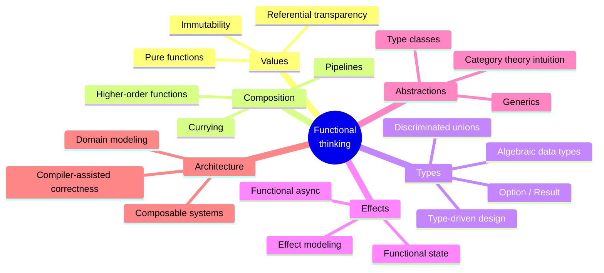

Welcome to **Functional Programming with TypeScript** — a deep,
unhurried course about *thinking functionally* and *modeling with
types*. It is written for developers who already know basic
JavaScript and TypeScript syntax and who now want to internalize the
ideas behind pure functions, immutability, algebraic data types,
composition, effect management, and type-driven architecture.

This course is intentionally **not** a tour of FP libraries. We
build every concept by hand in plain TypeScript before discussing any
ecosystem. Libraries like fp-ts, Effect, or Ramda are mentioned only
as optional case studies — they are downstream of the ideas, not the
core of the curriculum.

## What this course is about

You will spend most of your time on:

- **Functional principles** — pure functions, immutability, and
  referential transparency
- **Declarative programming** — describing *what* you want, not *how*
  to compute it step by step
- **Function composition** — building large transformations from
  small named pieces
- **Algebraic data types** — modeling possibility with sums, products,
  and discriminated unions
- **Type-driven design** — making illegal states unrepresentable
- **Pattern matching concepts** — exhaustive case analysis the
  compiler can check
- **Higher-order and generic abstractions** — code that works for
  every shape without losing precision
- **Effect management** — separating computation from I/O, time, and
  randomness
- **Functional async, state, and error workflows** — modeling change
  without mutation
- **Category-theory intuitions** — `Functor`, `Applicative`, `Monad`
  explained as everyday patterns
- **Composable architecture** — designing systems out of values and
  pipelines

This course is intentionally **not**:

- A React, Next.js, or Vue tutorial
- An Express, NestJS, or backend bootcamp
- A DevOps, CI/CD, or deployment guide
- A framework comparison or interview-prep cram course
- A boilerplate-heavy enterprise architecture course
- An OOP design-patterns book

We use plain TypeScript everywhere. The lessons transfer to any
framework you adopt later.

## Why this matters

Most large codebases suffer from the same handful of structural
problems: tangled mutable state, deeply nested control flow,
transformation logic copy-pasted with small variations, exceptions
that flow invisibly through call stacks, and step-by-step procedures
that nobody is brave enough to touch six months later. Functional
programming is not a silver bullet — but it directly attacks each of
these problems by changing the *unit of expression* from "a statement
that mutates a variable" to "a value that is the result of a
transformation".

TypeScript is uniquely suited to this style. Its structural type
system, discriminated unions, generics, and exhaustiveness checking
give you the mechanical machinery to turn FP intuitions into compiler
guarantees. You stop *hoping* your code is correct and start *proving*
it, one type at a time.

## How to use this site

Every page mixes prose with three kinds of interactive widget:

1. **Executable TypeScript code blocks.** Each `<CodeBlock>` is
   type-checked and transpiled in your browser, then executed by
   [almostnode](https://almostnode.dev/) — no setup required.
2. **Multi-file challenge cards.** Real software is spread across
   files. Many examples use multiple `.ts` modules so you can
   practice composing types across boundaries.
3. **Multiple-choice questions.** Single-answer comprehension checks
   at the end of most pages, with a per-answer explanation so even
   the wrong choices teach you something.

<Callout type="info" title="Each code block is independent">
A value, type, or function defined in one `<CodeBlock>` is **not**
visible in the next. Every example is self-contained. For a
persistent multi-file TypeScript workspace, open the
[TypeScript Playground](/playground/typescript) in a new tab.
</Callout>

## A tiny taste

Two programs that solve the same problem: *"From a list of orders,
keep the paid ones, take their totals, and sum them."* The first
uses the classic imperative style. The second uses functional
composition.

<CodeBlock
  adapter="typescript"
  starterCode={`type Order = {
  id: string;
  status: "draft" | "paid" | "cancelled";
  total: number;
};

const orders: Order[] = [
  { id: "a", status: "paid", total: 30 },
  { id: "b", status: "draft", total: 10 },
  { id: "c", status: "paid", total: 50 },
  { id: "d", status: "cancelled", total: 99 },
  { id: "e", status: "paid", total: 20 },
];

let total = 0;
for (let i = 0; i < orders.length; i++) {
  if (orders[i].status === "paid") {
    total += orders[i].total;
  }
}
console.log("Imperative total:", total);
`}
/>

<CodeBlock
  adapter="typescript"
  starterCode={`type Order = {
  id: string;
  status: "draft" | "paid" | "cancelled";
  total: number;
};

const orders: Order[] = [
  { id: "a", status: "paid", total: 30 },
  { id: "b", status: "draft", total: 10 },
  { id: "c", status: "paid", total: 50 },
  { id: "d", status: "cancelled", total: 99 },
  { id: "e", status: "paid", total: 20 },
];

const total = orders
  .filter((o) => o.status === "paid")
  .map((o) => o.total)
  .reduce((a, b) => a + b, 0);

console.log("Declarative total:", total);
`}
/>

Both produce `100`. But the second reads like the English sentence we
wrote above the code: *"From orders, keep the paid ones, take their
totals, sum them."* That alignment between intention and code is what
this entire course is about — and the rest of the chapters will give
you the principles and the type-level vocabulary to do it for
problems that are much harder than a sum of integers.

## What you should already know

- Variables, functions, arrays, objects, and modules in JavaScript
- Basic TypeScript syntax: type annotations, interfaces, generics
- The difference between `null`/`undefined` and a real value
- Roughly what a `Promise` is

You do **not** need any prior exposure to Haskell, Scala, fp-ts, or
category theory. Every concept is built from scratch with plain
TypeScript.

## Where to go next

Start with [The Evolution of Software Complexity](./evolution-of-complexity)
to see *why* functional programming emerged. Then proceed through
the menu on the left in order — each section depends on the one
before it.

When you're ready to test yourself, the
[capstone](./capstone-pipeline) ties every idea in the course into a
single multi-file analytical pipeline.
