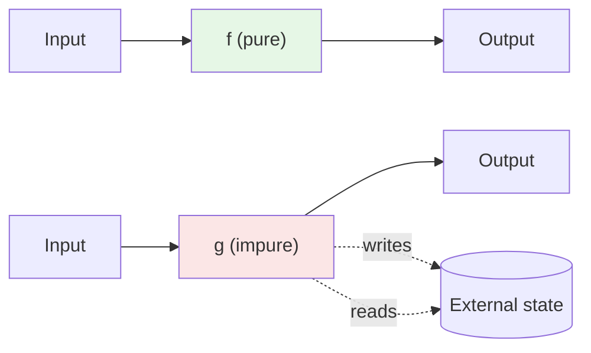
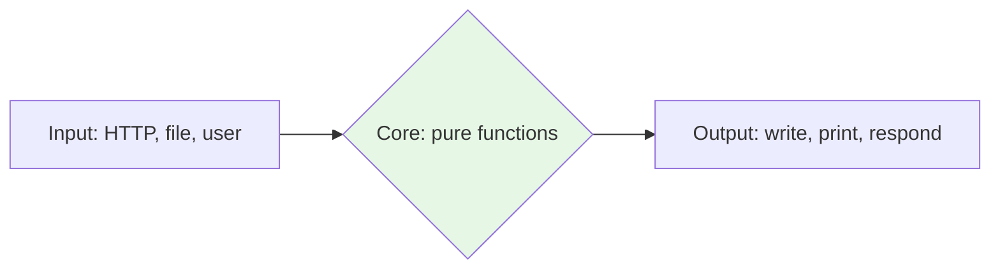

If you remember only one idea from this entire course, make it this
one: **a pure function is a function whose output depends only on its
inputs, and which has no observable side effects.**

That's it. Pure functions are the atom of functional programming.
Composition, immutability, type-driven design, parallelism, testing,
caching — they all get easier when the building blocks are pure.

<svg
  viewBox="0 0 640 210"
  role="img"
  aria-label="A sealed function box with one inlet and one outlet; dotted side channels from outside shapes are stopped by red bars above and below — a pure function's output depends on its input alone"
  style={{ display: "block", width: "100%", maxWidth: "640px", height: "auto", margin: "2.5rem auto" }}
>
  <g style={{ color: "var(--ds-blue-500)" }} fill="currentColor">
    <rect x="240" y="70" width="160" height="80" rx="18" />
    <circle cx="140" cy="110" r="10" />
    <polygon points="216,103 230,110 216,117" fillOpacity="0.6" />
  </g>
  <text x="320" y="123" fontFamily="Georgia, serif" fontStyle="italic" fontSize="34" textAnchor="middle" style={{ fill: "var(--ds-white)" }}>ƒ</text>
  <g fill="currentColor" opacity="0.3">
    <circle cx="172" cy="110" r="3.5" />
    <circle cx="196" cy="110" r="3.5" />
    <circle cx="424" cy="110" r="3.5" />
    <circle cx="448" cy="110" r="3.5" />
  </g>
  <g style={{ color: "var(--ds-green-500)" }} fill="currentColor">
    <polygon points="472,103 486,110 472,117" fillOpacity="0.6" />
    <circle cx="510" cy="110" r="10" />
  </g>
  <g style={{ color: "var(--ds-yellow-500)" }} fill="currentColor">
    <rect x="308" y="10" width="24" height="24" rx="6" />
    <circle cx="320" cy="192" r="10" />
  </g>
  <g fill="currentColor" opacity="0.3">
    <circle cx="320" cy="42" r="3" />
    <circle cx="320" cy="50" r="3" />
    <circle cx="320" cy="170" r="3" />
    <circle cx="320" cy="178" r="3" />
  </g>
  <g style={{ color: "var(--ds-red-500)" }} fill="currentColor">
    <rect x="298" y="56" width="44" height="6" rx="3" />
    <rect x="298" y="156" width="44" height="6" rx="3" />
  </g>
</svg>

## A definition you can hold in your head

A function `f` is **pure** if and only if:

1. **Same input → same output.** Given the same arguments, `f`
   always returns the same value. Forever. Across machines, threads,
   and times of day.
2. **No side effects.** `f` does not write to disk, print, mutate
   shared state, mutate its arguments, throw on the clock, send a
   network request, increment a global counter, read the time, or
   read from a random number generator.

The dashed arrows are what makes `g` impure: it reaches outside the
box.

## Pure vs impure: side by side

<CodeBlock
  adapter="typescript"
  files={[
    {
      filename: "main.ts",
      starterCode: `// PURE: depends only on x and y, returns a value, touches nothing else.
const add = (x: number, y: number): number => x + y;

// PURE: builds and returns a new array, never mutates input.
const doubled = (xs: readonly number[]): readonly number[] =>
  xs.map((x) => x * 2);

// IMPURE: reads from "outside" — the current time.
const nowMs = (): number => Date.now();

// IMPURE: writes to the console.
const greet = (name: string): void => console.log(\`Hello, \${name}\`);

// IMPURE: mutates its argument — a hidden side effect.
const appendOne = (xs: number[]): void => {
  xs.push(1);
};

console.log(add(2, 3));
console.log(doubled([1, 2, 3]));
console.log(nowMs());
greet("Ada");

const box: number[] = [10, 20];
appendOne(box);
console.log(box);
`,
    },
  ]}
/>

`add` and `doubled` are pure. `nowMs`, `greet`, and `appendOne` are
not — and each is impure in a *different* way.

## The four superpowers of pure functions

Pure functions are not an aesthetic preference. They have concrete,
measurable advantages.

### 1. They're trivially testable

A pure function's test is just `expected === f(input)`. No setup,
no mocks, no teardown.

<CodeBlock
  adapter="typescript"
  files={[
    {
      filename: "main.ts",
      starterCode: `const add = (x: number, y: number): number => x + y;

const check = (label: string, cond: boolean) =>
  console.log(\`\${cond ? "OK  " : "FAIL"} \${label}\`);

check("0+0=0", add(0, 0) === 0);
check("2+3=5", add(2, 3) === 5);
check("-1+1=0", add(-1, 1) === 0);
check("commutative", add(3, 4) === add(4, 3));
`,
    },
  ]}
/>

Contrast with testing an impure method that writes to a database:
you have to spin up a fixture, manage the connection, clean up
between tests, and reason about ordering. Pure tests are free.

### 2. They're safe to run in parallel

Two threads (or web workers, or async tasks) calling a pure function
with the same input cannot interfere — there's nothing shared to
interfere with. This is why functional pipelines parallelize so
easily.

### 3. They're cacheable (memoizable)

`f(x)` always returns the same value, so you can compute it once and
remember it. This is called **memoization**.

<CodeBlock
  adapter="typescript"
  files={[
    {
      filename: "main.ts",
      starterCode: `function memoize<A, B>(f: (a: A) => B): (a: A) => B {
  const cache = new Map<A, B>();
  return (a: A): B => {
    if (cache.has(a)) return cache.get(a)!;
    const v = f(a);
    cache.set(a, v);
    return v;
  };
}

let calls = 0;
const slow = (x: number): number => {
  calls++;
  return x * x;
};

const fast = memoize(slow);
console.log(fast(5)); // 25, calls=1
console.log(fast(5)); // 25, calls=1 (cache hit)
console.log(fast(6)); // 36, calls=2
console.log("calls:", calls);
`,
    },
  ]}
/>

You can only do this for pure functions. Memoizing an impure
function changes its behavior — you might cache "what time it is".

### 4. They're easy to reason about

You can read a pure function top to bottom, and once you understand
it, you understand it *forever*. It doesn't matter who calls it,
when, in what order, or with what state. The function is a
self-contained mathematical mapping.

## Spotting impurity in real code

Most "impurity" in everyday TypeScript falls into a small number of
categories. Learn to spot them:

| Pattern | Why it's impure |
| --- | --- |
| `console.log(...)`, `console.error(...)` | Writes to stdout |
| `fs.readFileSync(...)`, `fetch(...)` | Reads from disk / network |
| `Date.now()`, `new Date()` | Hidden input (the clock) |
| `Math.random()`, `crypto.randomUUID()` | Hidden input (RNG state) |
| `arr.push(x)` on a parameter | Mutates input |
| `let counter = 0; counter++;` (module-scope) | Mutates global |
| `throw new Error(...)` on some inputs | Subtle: same input → no return value |

The last one is interesting. A function that throws for some inputs
is *technically* impure (its output is not a value for those inputs),
but in practice we tolerate it for argument validation. We'll see in
[Option and Result](./option-and-result) how to model
"this function can fail" *in the type* and avoid throwing entirely.

## "But my program *has* to print things"

Of course. A program that does nothing but compute pure values is
useless. Real programs read input, do I/O, and produce output. The
functional answer is not "no side effects ever". It is:

> **Push side effects to the edges of the program. Keep the core
> pure.**

This is sometimes called the *functional core, imperative shell*
pattern.

In a pipeline, the *transformations* (filter, map, reduce, compose)
are pure. The materialization at the end (write to file, push to
DOM, send to network) is the impure shell.

## Refactoring an impure function to a pure one

A short, realistic refactor: turning a function that does its own
I/O and time-reading into a pure value-builder plus a tiny shell.

<CodeBlock
  adapter="typescript"
  files={[
    {
      filename: "main.ts",
      starterCode: `// Impure: logs, reads the clock, returns void
function recordPurchase(userId: string, amount: number): void {
  const timestamp = Date.now();
  const id = \`p-\${Math.floor(Math.random() * 1e9)}\`;
  console.log(\`[\${timestamp}] purchase \${id}: user=\${userId} amount=\${amount}\`);
}

recordPurchase("u-1", 19.99);
recordPurchase("u-2", 49.0);
`,
    },
  ]}
/>

<CodeBlock
  adapter="typescript"
  files={[
    {
      filename: "main.ts",
      starterCode: `// Pure: builds a value
type Purchase = {
  readonly id: string;
  readonly userId: string;
  readonly amount: number;
  readonly timestampMs: number;
};

function makePurchase(
  userId: string,
  amount: number,
  // "inputs" that were hidden in the impure version are now arguments
  timestampMs: number,
  randomId: string,
): Purchase {
  return { id: \`p-\${randomId}\`, userId, amount, timestampMs };
}

function describe(p: Purchase): string {
  return \`[\${p.timestampMs}] purchase \${p.id}: user=\${p.userId} amount=\${p.amount}\`;
}

// Impure shell: gathers time and randomness, calls pure functions, logs result
const p1 = makePurchase("u-1", 19.99, 1_700_000_000_000, "abc");
const p2 = makePurchase("u-2", 49.0, 1_700_000_000_001, "def");

console.log(describe(p1));
console.log(describe(p2));
`,
    },
  ]}
/>

The pure version is longer. It's also testable, deterministic,
memoizable, and trivially serializable. The "hidden inputs" of the
impure version (the clock and the RNG) became *explicit parameters*.
That's the trade.

## A multi-file challenge

You'll implement two small pure functions and a small impure
"driver" that uses them. The functions are pure; the driver does
the I/O. This is the functional-core / imperative-shell pattern in
miniature.

<ChallengeCard
  adapter="typescript"
  title="Pure core, impure shell"
  instructions={`Implement two **pure** functions in \`stats.ts\`:

- \`sumOfSquares(xs: readonly number[]): number\` — the sum of the
  squares of its inputs.
- \`meanOfSquares(xs: readonly number[]): number\` — the average of
  the squares of its inputs, or \`0\` for an empty input.

Do **not** print, mutate the input, or read external state. The
\`main.ts\` shell calls them and prints the results.

**Expected output**

\`\`\`
sum=55
mean=11
\`\`\``}
  entryFilename="main.ts"
  files={[
    {
      filename: "main.ts",
      starterCode: `import { sumOfSquares, meanOfSquares } from "./stats";

const xs = [1, 2, 3, 4, 5];
console.log(\`sum=\${sumOfSquares(xs)}\`);
console.log(\`mean=\${meanOfSquares(xs)}\`);
`,
    },
    {
      filename: "stats.ts",
      starterCode: `export function sumOfSquares(xs: readonly number[]): number {
  // your code here
  return 0;
}

export function meanOfSquares(xs: readonly number[]): number {
  // your code here
  return 0;
}
`,
      solutionCode: `export function sumOfSquares(xs: readonly number[]): number {
  return xs.reduce((acc, x) => acc + x * x, 0);
}

export function meanOfSquares(xs: readonly number[]): number {
  if (xs.length === 0) return 0;
  return sumOfSquares(xs) / xs.length;
}
`,
    },
  ]}
  tests={[
    {
      id: "sum_and_mean",
      name: "Prints sum=55 and mean=11",
      description: "1+4+9+16+25=55; mean=55/5=11",
      expect: { stdoutEquals: "sum=55\nmean=11" },
    },
  ]}
/>

---

<MultipleChoice
  markdown={`Which of these TypeScript functions is **pure**?

- \`const roll = (): number => Math.floor(Math.random() * 6) + 1;\`
  > Not pure — it reads from a random number generator, so two calls with no arguments can give different results.
- [o] \`const triple = (x: number): number => x * 3;\`
  > Output depends only on the input, and the function has no side effects.
- \`const logAndReturn = (x: number): number => { console.log(x); return x; };\`
  > Not pure — it has the side effect of writing to standard output, even though the return value depends only on \`x\`.
- \`const push = (xs: number[], x: number): void => { xs.push(x); };\`
  > Not pure — it mutates its argument and returns void.

A pure function must satisfy both rules: same inputs → same output, and no side effects of any kind. Only \`triple\` meets both.`}
/>
