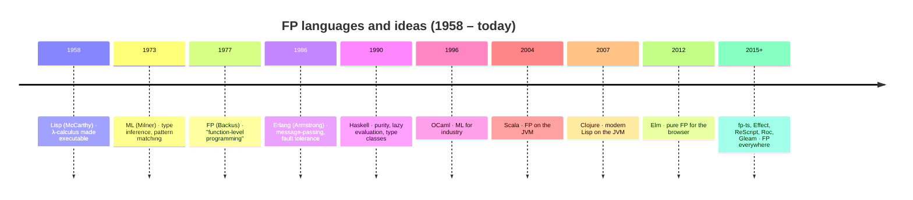
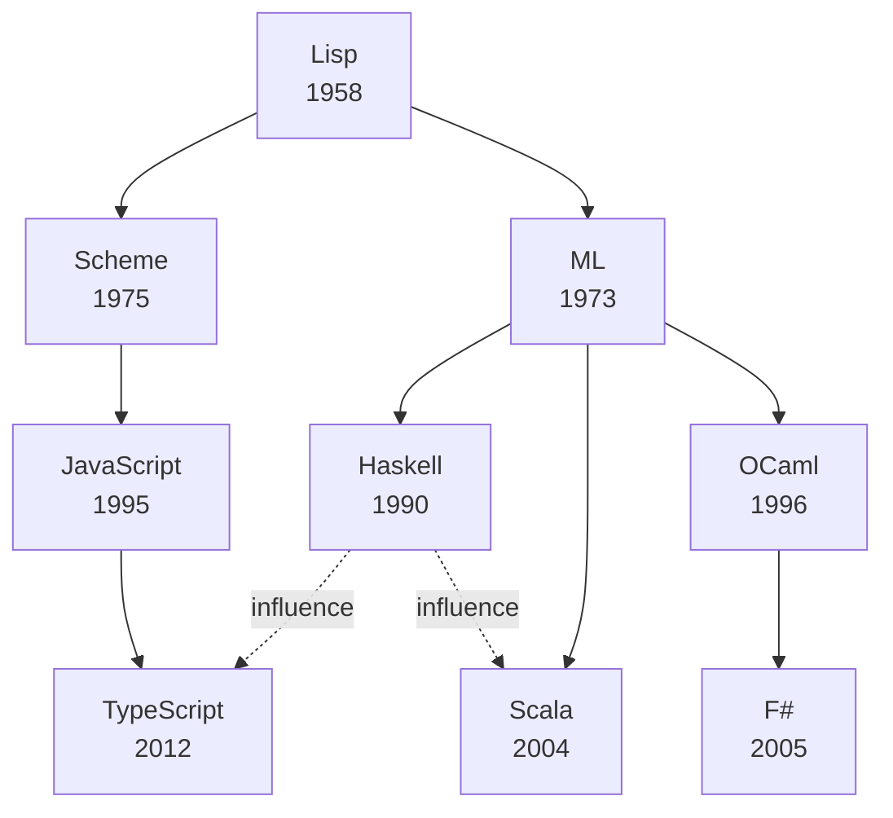

Functional programming is older than most languages people use today.
Its ideas were not invented in response to JavaScript or React or
microservices — they were invented in the 1930s, before computers
existed in any practical form. Understanding that lineage is the
single best way to demystify FP. Most of the "weird" vocabulary
(*lambda*, *combinator*, *functor*, *monad*) comes from a coherent
intellectual tradition stretching back nearly a hundred years.

This chapter is the cliff-notes version of that history.

## Lambda calculus: the math underneath

In 1936, the logician **Alonzo Church** introduced the **lambda
calculus**: a tiny formal system in which the only things that exist
are *functions* and *applications of functions*.

There are exactly three rules:

1. A **variable** is an expression: `x`
2. A **function** is an expression: `λx. body`
3. An **application** is an expression: `(f x)`

That's the entire language. No numbers, no booleans, no `if`, no
loops. Yet Church proved this system is **Turing-complete**:
anything any computer can compute can be expressed in lambda
calculus. Numbers, booleans, lists, recursion, and control flow can
all be *encoded* as functions.

The TypeScript equivalent of `λx. x + 1` is the arrow function `(x)
=> x + 1`. The keyword `lambda` is almost everywhere in functional
languages — it's the name of the abstraction that wraps a body in a
parameter.

<CodeBlock
  adapter="typescript"
  starterCode={`// A lambda is just a value that happens to be a function
const identity = <T,>(x: T): T => x;
const apply = <A, B>(f: (a: A) => B, a: A): B => f(a);

console.log(identity(42));
console.log(apply((n: number) => n + 1, 41));

// We can even encode booleans as functions — pure lambda calculus
const T =
  <A,>(a: A) =>
  (_b: A): A =>
    a; // "true"  picks first
const F =
  <A,>(_a: A) =>
  (b: A): A =>
    b; // "false" picks second
const cond = <A,>(p: (a: A) => (b: A) => A, a: A, b: A) => p(a)(b);

console.log(cond(T, "yes", "no")); // "yes"
console.log(cond(F, "yes", "no")); // "no"
`}
/>

The key insight: a function is not just a tool *inside* a program.
It is a *value* — the most fundamental value the language has.
Everything in functional programming follows from taking that idea
seriously.

## Lisp: functions become a programming language (1958)

In 1958, **John McCarthy** designed **Lisp** at MIT. Lisp took the
lambda calculus and turned it into a programmable language. Lists
were the universal data structure. Code was data (you could pass
functions around, build them at runtime, and even evaluate strings as
programs). Recursion replaced loops.

Lisp introduced (or popularized) almost every idea that working
programmers now take for granted: garbage collection, dynamic
dispatch, the REPL, the function as a first-class value, the symbolic
interpreter. Modern functional programming did not begin with Lisp,
but it became *usable* with Lisp.

## ML and Haskell: the type-theory branch (1973, 1990)

In 1973, **Robin Milner** designed **ML** to write proofs about
programs. ML introduced the world to **Hindley–Milner type
inference** — the idea that a compiler can figure out the types of
your program *automatically*, even without annotations, and reject
any program that doesn't type-check.

ML also introduced **algebraic data types**: a way to model "this is
either an A or a B" so the compiler forces you to handle both cases.
TypeScript's discriminated unions are a direct descendant.

<CodeBlock
  adapter="typescript"
  starterCode={`// ML-style "Maybe a" (an algebraic data type)
type Maybe<A> = { kind: "none" } | { kind: "some"; value: A };

const some = <A,>(a: A): Maybe<A> => ({ kind: "some", value: a });
const none = <A,>(): Maybe<A> => ({ kind: "none" });

function unwrapOr<A>(m: Maybe<A>, fallback: A): A {
  switch (m.kind) {
    case "some":
      return m.value;
    case "none":
      return fallback;
  }
}

console.log(unwrapOr(some(42), 0));
console.log(unwrapOr(none<number>(), 0));
`}
/>

In 1990, **Haskell** went further. It is a pure, lazy, statically
typed functional language. *Pure* means it has no side effects in
the language itself — every function returns a value and that's it.
Effects (I/O, randomness, mutation) are modeled as *data* and
sequenced by a special abstraction called a `Monad`. We will explore
this idea, gently, much later.

Haskell is where most of the vocabulary you'll hear in modern FP
("functor", "applicative", "monad", "kind", "typeclass") was crystallized.
TypeScript cannot fully express these patterns — its type system lacks
"higher-kinded types" — but the *intuitions* transfer perfectly.

## Erlang: functional concurrency (1986)

While the academy refined types, **Joe Armstrong** and colleagues at
Ericsson built **Erlang** to run telephone switches. The problem was
not type safety but *uptime*: switches must run for years without
crashing.

Erlang's answer was **immutable values, lightweight processes, and
message passing**. Each phone call lived in its own process. The
processes shared no memory. They communicated only by sending
immutable messages. If a process crashed, a supervisor restarted it.

This combination — immutability plus isolated processes — is what
later inspired Akka (Scala), the Actor model in Swift, Elixir, and
parts of modern distributed systems design. Erlang showed that
functional ideas were *practical* at industrial scale, not just
elegant in a paper.

## Scala, Clojure, F#: FP on top of mainstream platforms (2000s)

In the 2000s, FP arrived on the platforms developers actually
shipped on:

- **Scala** brought ML-style types and Haskell-style abstractions to
  the JVM, while remaining interoperable with Java.
- **Clojure** brought Lisp and immutable data structures to the JVM.
- **F#** brought ML to .NET.
- **OCaml** continued in research and crept into industry (Jane
  Street, Facebook's Flow and Hack toolchain).

These languages proved you could write large business systems —
banks, e-commerce, build tools — in a functional style without
abandoning your existing infrastructure. They also normalized ideas
that were once "academic": immutable collections, pattern matching,
algebraic data types, persistent data structures.

## JavaScript discovers functional programming

JavaScript had functions as first-class values from day one — it
inherited that from Scheme, a Lisp dialect. But for years, the
language was used mostly imperatively: `for` loops, mutation,
prototypes.

A few things changed that:

- **jQuery and Underscore (2009-2010)** popularized `.map`,
  `.filter`, `.reduce` for collection processing.
- **ES5 (2009)** added these methods to `Array.prototype`.
- **Promises and ES6 (2015)** made composing async operations feel
  more like building values than driving state machines.
- **React (2013)** treated the UI as a *pure function of state* —
  arguably the single biggest mainstreaming event for functional
  thinking in front-end work.
- **Redux (2015)** modeled state as immutable values transformed by
  pure reducers.

By 2018, "functional JavaScript" was no longer a niche style — it
was the *default* idiom of the most popular UI library in the world.
But pure JavaScript still lacked the *type system* to make
functional design watertight. That's where TypeScript enters the
story.

## Why TypeScript matters here

JavaScript can *imitate* functional programming. TypeScript can
*enforce* it. The same arrow function in both languages looks
identical, but in TypeScript you can:

- Encode algebraic data types as discriminated unions, and have the
  compiler force exhaustive handling
- Express generic abstractions without losing precision
- Model `Option`, `Result`, `IO`, `Task`, and `State` as types
- Detect entire classes of bug at compile time — `null`,
  forgotten error cases, partial functions

This is what the rest of the course will build. The next chapter
zooms in on the specific relationship between TypeScript's type
system and functional programming, and previews the techniques we'll
use throughout.

## A short demo: the same idea, three eras

The classic "sum of squares of evens" problem, written in three
historical voices:

<CodeBlock
  adapter="typescript"
  starterCode={`// 1. Imperative (1970s-style for loop in modern JS)
const xs = [1, 2, 3, 4, 5, 6, 7, 8, 9, 10];

let sum = 0;
for (let i = 0; i < xs.length; i++) {
  if (xs[i] % 2 === 0) {
    sum += xs[i] * xs[i];
  }
}
console.log("imperative:", sum);
`}
/>

<CodeBlock
  adapter="typescript"
  starterCode={`// 2. Lisp/Scheme-style: recursion over a list
const xs = [1, 2, 3, 4, 5, 6, 7, 8, 9, 10];

function sumSquaresOfEvens(list: readonly number[]): number {
  if (list.length === 0) return 0;
  const [head, ...rest] = list;
  const contribution = head % 2 === 0 ? head * head : 0;
  return contribution + sumSquaresOfEvens(rest);
}

console.log("recursive:", sumSquaresOfEvens(xs));
`}
/>

<CodeBlock
  adapter="typescript"
  starterCode={`// 3. ML/Haskell-style: pipelined transformations
const xs = [1, 2, 3, 4, 5, 6, 7, 8, 9, 10];

const result = xs
  .filter((x) => x % 2 === 0)
  .map((x) => x * x)
  .reduce((a, b) => a + b, 0);

console.log("functional pipeline:", result);
`}
/>

All three produce `220`. The first describes *how to compute*. The
second describes *the recursive structure of the answer*. The third
describes *the answer itself, as a sequence of transformations*. The
third is the style we will spend the rest of the course mastering.

---

<MultipleChoice
  markdown={`What is the lambda calculus, and why does it matter for functional programming?

- A category of bugs that occur in JavaScript closures
  > No — though closures are *implementations* of lambda abstraction, "lambda calculus" refers to a formal system, not a bug pattern.
- A library for working with mathematical functions in TypeScript
  > It is not a library. It is a formal system that predates computers.
- [o] A 1936 formal system in which functions are the only primitive — Turing-complete and the foundation of functional programming
  > The lambda calculus is where the *idea* "everything is a function" was first made rigorous. Every functional language is, at heart, a way of writing programs in that system.
- A type-inference algorithm used by Haskell and ML
  > Type inference (Hindley–Milner) is a *separate* invention from the lambda calculus, though it operates on lambda-calculus-like programs.

The lambda calculus is the conceptual root of functional programming: it shows that "function as a value" is sufficient on its own to express all computation.`}
/>
