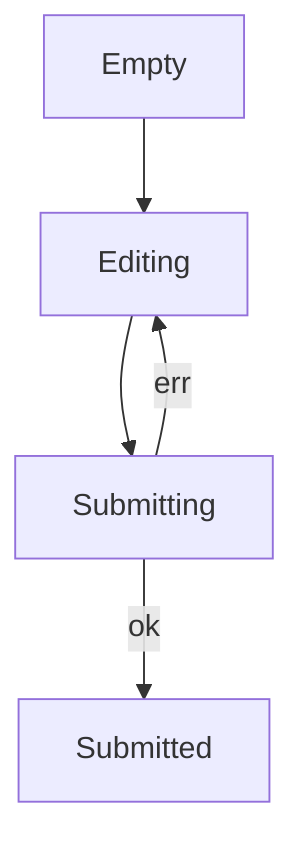

By now you have the building blocks: pure functions, discriminated
unions, exhaustiveness, `Option`, `Result`. The question becomes:
**how do you design programs around them?**

The answer is *type-driven design*: you start from the **types**
that describe your domain, and then write functions that fit the
shapes. If the types are tight enough, the compiler will reject
huge classes of bugs before you ever run the program.

There are three slogans that capture the approach.

## Slogan 1 — "Make illegal states unrepresentable"

If your data model can *express* a state that should never exist,
sooner or later your program will get into that state. The fix is
to redesign the type so the bad state cannot be written.

Consider a "remote data" wrapper used to model an API request:

<CodeBlock
  adapter="typescript"
  starterCode={`// ✗ WEAK MODEL — many illegal combinations
type ProfileWeak = {
  loading: boolean;
  data:    { name: string } | null;
  error:   string | null;
};

// All of these are legally constructible — and all are bugs:
const a: ProfileWeak = { loading: true,  data: { name: "x" }, error: null };
const b: ProfileWeak = { loading: false, data: null,           error: null };
const c: ProfileWeak = { loading: true,  data: null,           error: "x"  };

console.log(a, b, c);
`}
/>

The weak model allows "loading and have data and have an error" —
nonsense. With a discriminated union, only the *real* states are
representable:

<CodeBlock
  adapter="typescript"
  starterCode={`// ✓ TIGHT MODEL — only valid states can be written
type Profile<A> =
  | { kind: "idle" }
  | { kind: "loading" }
  | { kind: "loaded";  data: A }
  | { kind: "failed";  error: string };

const r1: Profile<{ name: string }> = { kind: "idle" };
const r2: Profile<{ name: string }> = { kind: "loading" };
const r3: Profile<{ name: string }> = { kind: "loaded", data: { name: "Ada" } };
const r4: Profile<{ name: string }> = { kind: "failed", error: "404" };

// You CANNOT construct { kind: "loading", data: { name: "x" } } — extra fields
// You CANNOT construct { kind: "loaded" } — missing data
// You CANNOT construct { kind: "failed", data: ... } — wrong shape

const render = <A,>(p: Profile<A>, show: (a: A) => string): string => {
  switch (p.kind) {
    case "idle":    return "—";
    case "loading": return "loading...";
    case "loaded":  return show(p.data);
    case "failed":  return \`error: \${p.error}\`;
  }
};

console.log(render(r1, (u) => u.name));
console.log(render(r3, (u) => u.name));
`}
/>

The four "real" states become four constructable shapes. Every
nonsense combination simply doesn't compile.

### Another example: form state



Each state carries different data. Modeling them as a single
"god object" with optional fields invites bugs. Modeling them as a
discriminated union by `kind` makes each transition obvious:

```ts
type Form<A, E> =
  | { kind: "empty" }
  | { kind: "editing";    draft: A }
  | { kind: "submitting"; draft: A }
  | { kind: "submitted";  result: A }
  | { kind: "rejected";   draft: A; error: E };
```

The transition functions become tiny, total, and exhaustive.

## Slogan 2 — "Parse, don't validate"

Validation is a *runtime check* that *returns the same type* you
already had. Parsing is a runtime check that *returns a stricter
type* — and from then on, the rest of the program *knows* the
constraint is satisfied because of the type signature.

<CodeBlock
  adapter="typescript"
  starterCode={`// ✗ VALIDATE — the constraint is checked, then immediately forgotten
function validateNonEmpty(s: string): boolean {
  return s.length > 0;
}

function greetA(name: string) {
  if (!validateNonEmpty(name)) throw new Error("empty");
  // ... 200 lines later, somebody calls greetA("") again
  console.log(\`Hello, \${name}\`);
}

// ✓ PARSE — the constraint becomes part of the type
type NonEmpty = string & { readonly __brand: "NonEmpty" };

function parseNonEmpty(s: string): NonEmpty | null {
  return s.length > 0 ? (s as NonEmpty) : null;
}

function greetB(name: NonEmpty) {
  // No re-check needed. The signature *guarantees* name.length > 0.
  console.log(\`Hello, \${name}\`);
}

const n = parseNonEmpty("Ada");
if (n) greetB(n);

const bad = parseNonEmpty("");
console.log("bad =", bad);

// greetB("") // <- compile error: "" is not NonEmpty
`}
/>

The trick is that **`NonEmpty` is a strict subtype of `string`**.
You can use a `NonEmpty` anywhere a `string` is expected (because
it *is* a string), but you cannot use a plain `string` anywhere a
`NonEmpty` is expected. The compiler propagates the guarantee.

This is called a **branded type** (or *nominal* type). The `__brand`
field exists only in the type system — at runtime it's still a
plain string.

### A small parser library

<CodeBlock
  adapter="typescript"
  starterCode={`type Result<E, A> = { kind: "ok"; value: A } | { kind: "err"; error: E };
const ok  = <E, A>(value: A): Result<E, A> => ({ kind: "ok",  value });
const err = <E, A>(error: E): Result<E, A> => ({ kind: "err", error });

// --- Branded subtypes ---
type Email     = string & { readonly __brand: "Email" };
type Age       = number & { readonly __brand: "Age" };
type AdultAge  = Age    & { readonly __adult: true };

// --- Parsers ---
const parseEmail = (s: string): Result<string, Email> =>
  /^[^@\\s]+@[^@\\s]+\\.[^@\\s]+$/.test(s) ? ok(s as Email) : err(\`bad email: \${s}\`);

const parseAge = (n: number): Result<string, Age> =>
  Number.isInteger(n) && n >= 0 && n <= 130 ? ok(n as Age) : err(\`bad age: \${n}\`);

const parseAdult = (a: Age): Result<string, AdultAge> =>
  a >= 18 ? ok(a as AdultAge) : err(\`must be 18+\`);

// --- Domain function: only callable with already-parsed inputs ---
function inviteAdult(email: Email, age: AdultAge) {
  console.log(\`Inviting \${email} (age \${age})\`);
}

const e = parseEmail("ada@example.com");
const a = parseAge(36);

if (e.kind === "ok" && a.kind === "ok") {
  const ad = parseAdult(a.value);
  if (ad.kind === "ok") inviteAdult(e.value, ad.value);
}

// The compiler refuses these even though the raw values are valid:
// inviteAdult("ada@example.com", 36);              // strings/numbers, not brands
// inviteAdult(e.kind === "ok" ? e.value : ("" as Email), a.kind === "ok" ? a.value : (0 as Age));
// because Age is not AdultAge — you must call parseAdult first.
`}
/>

The branded types create a *staircase* of trust. Each `parse` step
goes one level up; the deeper into the program you go, the
stronger the guarantees the types carry.

## Slogan 3 — "If it compiles, it (probably) works"

The combination of:

- Discriminated unions for *what shape the data is in right now*
- Branded types for *what invariants the value satisfies*
- Exhaustive `switch` for *what the function does in each case*
- `Option`/`Result` for *what could be missing or wrong*

…means that vast classes of bugs simply cannot exist in your
program. Not "would be caught by tests" — *cannot exist*. The
compiler refuses to build them.

This is what people mean when they say functional programmers
prefer *types* over *tests*. Tests are still valuable (especially
for business logic), but a huge fraction of "tests" in imperative
codebases exist only to re-check things the type system could have
enforced once and for all.

## A domain modeling challenge

<ChallengeCard
  adapter="typescript"
  title="Model a checkout state machine"
  instructions={`In \`checkout.ts\`, define a discriminated union
\`Checkout\` with these states:

- \`{ kind: "cart"; items: ReadonlyArray<{ sku: string; qty: number }> }\`
- \`{ kind: "shipping"; items: ...; address: string }\`
- \`{ kind: "paying"; items: ...; address: string; card: string }\`
- \`{ kind: "confirmed"; orderId: string }\`

Then implement \`next(state, event)\` that handles the events
\`add-address\`, \`add-card\`, and \`confirm\` (each carrying the
needed payload), throwing if a transition doesn't make sense.

Use exhaustive matching. **Do not allow** writing a "paying" state
without an address — that's what the type system is for.

**Expected output**

\`\`\`
state: shipping
state: paying
state: confirmed orderId=ORD-1
\`\`\``}
  entryFilename="main.ts"
  files={[
    {
      filename: "main.ts",
      initialContent: `import { Checkout, next } from "./checkout";

let s: Checkout = { kind: "cart", items: [{ sku: "A", qty: 1 }] };
s = next(s, { kind: "add-address", address: "1 Main St" });
console.log("state:", s.kind);
s = next(s, { kind: "add-card", card: "4242" });
console.log("state:", s.kind);
s = next(s, { kind: "confirm" });
console.log("state:", s.kind, "orderId=" + (s.kind === "confirmed" ? s.orderId : "?"));
`,
    },
    {
      filename: "checkout.ts",
      initialContent: `type Item = { sku: string; qty: number };

export type Checkout =
  | { kind: "cart";      items: ReadonlyArray<Item> }
  | { kind: "shipping";  items: ReadonlyArray<Item>; address: string }
  | { kind: "paying";    items: ReadonlyArray<Item>; address: string; card: string }
  | { kind: "confirmed"; orderId: string };

export type Event =
  | { kind: "add-address"; address: string }
  | { kind: "add-card";    card:    string }
  | { kind: "confirm" };

export function next(state: Checkout, event: Event): Checkout {
  // TODO: implement the transitions.
  // Hint: a nested switch on (state.kind, event.kind) keeps it clean.
  return state;
}
`,
      solutionContent: `type Item = { sku: string; qty: number };

export type Checkout =
  | { kind: "cart";      items: ReadonlyArray<Item> }
  | { kind: "shipping";  items: ReadonlyArray<Item>; address: string }
  | { kind: "paying";    items: ReadonlyArray<Item>; address: string; card: string }
  | { kind: "confirmed"; orderId: string };

export type Event =
  | { kind: "add-address"; address: string }
  | { kind: "add-card";    card:    string }
  | { kind: "confirm" };

let counter = 0;
const newOrderId = () => \`ORD-\${++counter}\`;

export function next(state: Checkout, event: Event): Checkout {
  switch (state.kind) {
    case "cart":
      if (event.kind === "add-address")
        return { kind: "shipping", items: state.items, address: event.address };
      break;
    case "shipping":
      if (event.kind === "add-card")
        return { kind: "paying", items: state.items, address: state.address, card: event.card };
      break;
    case "paying":
      if (event.kind === "confirm")
        return { kind: "confirmed", orderId: newOrderId() };
      break;
    case "confirmed":
      break;
    default: {
      const _exhaustive: never = state;
      return _exhaustive;
    }
  }
  throw new Error(\`invalid transition from \${state.kind} via \${event.kind}\`);
}
`,
    },
  ]}
  tests={[
    {
      id: "checkout-fsm",
      name: "Checkout state machine",
      description: "Transition cart -> shipping -> paying -> confirmed.",
      expect: { stdoutEquals: "state: shipping\nstate: paying\nstate: confirmed orderId=ORD-1" },
    },
  ]}
/>

---

<MultipleChoice
  markdown={`What's the difference between *validating* a value and *parsing* it (in the "parse, don't validate" sense)?

- They're synonyms in practice
  > They're related, but the distinction matters a lot.
- Parsing happens at compile time; validation happens at runtime
  > Both run at runtime. The difference is what they *return*.
- [o] Validation checks a constraint and returns the same type; parsing checks a constraint and returns a *stricter* type that carries the proof going forward
  > Once you have a value of the stricter type, the rest of the program doesn't need to re-check the constraint — the type system does.
- Validation is faster than parsing
  > No meaningful difference; both are typically a few CPU cycles.

"Parse, don't validate" pushes proofs from comments and tests into the type system itself.`}
/>
