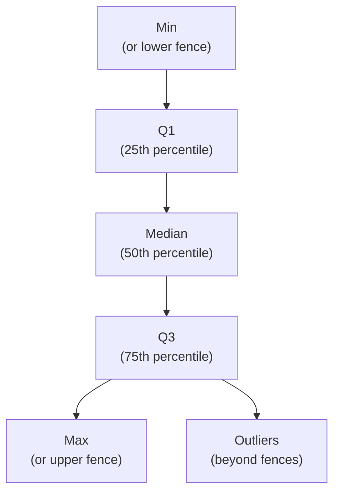

A **box plot** (or box-and-whisker plot) is a compact way to
summarize a numeric distribution. Unlike a histogram, which shows
*every* bin, a box plot reduces the distribution to a handful of
key summary statistics — and that compactness lets you compare
*many* distributions side by side without clutter.

## Anatomy of a box plot

The box itself spans from **Q1** (25th percentile) to **Q3** (75th
percentile). The line inside is the **median**. The "whiskers"
extend to the most extreme non-outlier values, and dots beyond
them are individually drawn **outliers**.

A box thus shows you, at a glance:

- **Center** (median).
- **Spread** (box height = interquartile range, or IQR).
- **Skew** (median position inside the box, whisker asymmetry).
- **Outliers** (individual dots).

In *one* compact glyph.

## A first box plot

<CodeBlock
  adapter="python"
  starterCode={`import plotly.express as px

df = px.data.tips()

fig = px.box(
    df, y="total_bill",
    template="simple_white",
    title="Distribution of restaurant bills (box plot)",
    labels={"total_bill": "Total bill (USD)"},
)
fig.show()
`}
/>

Hover over the box — Plotly shows you the median, Q1, Q3, min, max,
and lists each outlier. That's a lot of summary in one shape.

## Comparing groups: side by side

The real power of box plots is *side-by-side comparison*. Add an
`x="..."` and you get one box per category:

<CodeBlock
  adapter="python"
  starterCode={`import plotly.express as px

df = px.data.tips()

fig = px.box(
    df, x="day", y="total_bill", color="sex",
    template="simple_white",
    category_orders={"day": ["Thur", "Fri", "Sat", "Sun"]},
    title="Bill distribution by day and sex",
    labels={"total_bill": "Total bill (USD)", "day": "Day"},
)
fig.show()
`}
/>

Now you can compare *eight* distributions at once: 4 days × 2
sexes. Try this with histograms and you'd need eight separate
subplot panels.

## Show every point with `points="all"`

When sample sizes are small, the summary may hide too much. Add
the raw points back:

<CodeBlock
  adapter="python"
  starterCode={`import plotly.express as px

df = px.data.tips()

fig = px.box(
    df, x="day", y="total_bill",
    points="all",  # 'outliers' (default), 'all', 'suspectedoutliers', or False
    template="simple_white",
    category_orders={"day": ["Thur", "Fri", "Sat", "Sun"]},
    title="Bills by day — box plus every point",
    labels={"total_bill": "Total bill (USD)", "day": "Day"},
)
fig.show()
`}
/>

This hybrid (box + jittered dots) is sometimes the best of both
worlds: summary *and* raw data.

## Violin plots: when shape matters

Box plots hide the *shape* of the distribution. A **violin plot**
shows the same summary plus a smoothed density:

<CodeBlock
  adapter="python"
  starterCode={`import plotly.express as px

df = px.data.tips()

fig = px.violin(
    df, x="day", y="total_bill", color="sex",
    box=True, points="outliers",
    template="simple_white",
    category_orders={"day": ["Thur", "Fri", "Sat", "Sun"]},
    title="Bill distribution by day and sex (violin + box)",
    labels={"total_bill": "Total bill (USD)", "day": "Day"},
)
fig.show()
`}
/>

Violins reveal **bimodality**, **skew shape**, and other features
that a plain box would hide. They cost a bit more visual
complexity, but they're often worth it.

## When to use box plots vs histograms vs violins

| Question | Best chart |
| --- | --- |
| What does *this one variable* look like? | Histogram |
| How do *many groups* compare in their distribution summary? | Box plot |
| How do *many groups* compare in their distribution *shape*? | Violin plot |
| Where are the *individual* points? | Strip plot, or box with `points="all"` |

## Reading box plots: a few traps

- **Box plots can hide bimodality.** A bimodal distribution and a
  uniform distribution can look identical as boxes. If you suspect
  weird shape, switch to a violin or histogram.
- **Outlier dots ≠ "errors."** A point beyond the whiskers is just
  beyond ~1.5×IQR from the box. It may be legitimate data.
- **For very small n (e.g., 5 rows per group)** the summary
  becomes meaningless. Show the raw points instead.

## Check your understanding

<MultipleChoice
  markdown={`What does the **box** in a box plot represent?

- The range of all values.
- The mean ± one standard deviation.
- [o] The interquartile range — from Q1 (25th percentile) to Q3 (75th percentile), with the median line inside.
  > Yes. The box covers the middle 50% of the data; the line inside is the median. The whiskers extend to the most extreme non-outlier values (typically within 1.5×IQR), and individual dots beyond the whiskers represent outliers.
- The standard error of the mean.

Box plots are pure descriptive statistics — they don't make assumptions about the distribution.`}
/>

<MultipleChoice
  markdown={`What is a key **strength** of box plots over histograms?

- Box plots show more detail about distribution shape.
- Box plots always look prettier.
- [o] Box plots are compact enough to compare *many* distributions side by side without visual overload.
  > Right. A histogram for each of 10 groups takes 10 panels. Ten box plots fit easily on one chart, letting you compare medians, spreads, and outliers across groups instantly. The tradeoff is that box plots *hide the shape* of each distribution.
- Box plots are always more accurate.

Compactness + side-by-side comparison is the box plot's superpower. Just remember it summarizes — it doesn't show every detail.`}
/>

<MultipleChoice
  markdown={`A distribution is **bimodal** (two peaks). How might it look on a **box plot** vs a **violin plot**?

- Identical on both.
- A clear bimodal shape on the box; flat on the violin.
- [o] Featureless on the box plot (the box can't show two peaks), but clearly bimodal on the violin plot.
  > Yes. This is exactly why violin plots exist. Box plots reduce a distribution to 5 summary numbers, so two very different shapes (bimodal vs unimodal with the same median and IQR) look identical as boxes. Violin plots add the density curve, revealing the shape.
- The box would have two medians.

If you ever feel "this box is suspicious," reach for a violin or a histogram.`}
/>

<MultipleChoice
  markdown={`The dots beyond a box plot's whiskers are commonly called **outliers**. Are they always errors in the data?

- Yes, always.
- Yes, unless the chart says otherwise.
- [o] No — a dot beyond the whiskers is simply a value more than ~1.5×IQR from the box. It may be a real, legitimate observation.
  > Right. "Outlier" is a *statistical* term meaning "far from the bulk of the distribution," not a value judgment. The dot might be a typo, or it might be a real Mt. Everest in a chart of mountain heights. Always investigate outliers — don't reflexively delete them.
- No, only if the chart is wrong.

Box-plot outliers are an *invitation to investigate*, not a verdict.`}
/>
