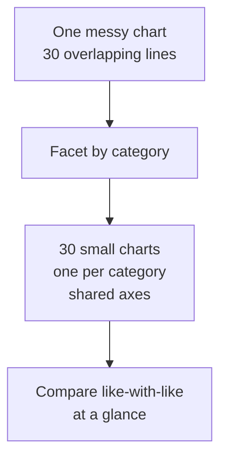

When a single chart starts to crowd, the fix is almost never "make
the chart bigger." It's **make many small charts** — one per
category, arranged in a grid with shared axes. This pattern is
called **small multiples** (a term coined by Edward Tufte) or
**faceting**.

It is one of the most powerful and underused techniques in modern
visualization, and Plotly Express makes it almost free.

## The pitch



Small multiples leverage a deep fact about perception: **the eye
compares parallel pictures faster than it parses one busy picture.**
Shared axes mean any difference between panels reflects a
difference in the *data*, not the *scale*.

## Faceting by column

`facet_col="..."` creates one chart per value of that column,
arranged horizontally.

<CodeBlock
  adapter="python"
  starterCode={`import plotly.express as px

df = px.data.tips()

fig = px.histogram(
    df, x="total_bill", color="sex",
    facet_col="time",
    template="simple_white",
    title="Bill distribution by sex, faceted by meal time",
    labels={"total_bill": "Total bill (USD)"},
)
fig.show()
`}
/>

You can now compare *lunch* vs *dinner* distributions side by side,
each split by sex. One chart, two stories.

## Faceting by row and column at once

Combine `facet_row` and `facet_col` for a full grid:

<CodeBlock
  adapter="python"
  starterCode={`import plotly.express as px

df = px.data.tips()

fig = px.scatter(
    df, x="total_bill", y="tip", color="smoker",
    facet_row="time", facet_col="day",
    category_orders={"day": ["Thur", "Fri", "Sat", "Sun"]},
    template="simple_white",
    title="Tip vs bill — full grid: time x day, color = smoker",
    labels={"total_bill": "Total bill (USD)", "tip": "Tip (USD)"},
)
fig.show()
`}
/>

You now have 4 days × 2 times = 8 mini-scatters, each split by
smoker. Eight charts at a glance, with shared axes so every
comparison is on the same scale.

## Spaghetti chart → small multiples

The classic use of facets is breaking up a too-busy line chart.

<CodeBlock
  adapter="python"
  starterCode={`import plotly.express as px

df = px.data.gapminder().query("continent in ['Europe', 'Asia']")

# Take just 6 countries for clarity
countries = ["Germany", "Italy", "France", "Japan", "China", "India"]
df = df[df["country"].isin(countries)]

fig = px.line(
    df, x="year", y="lifeExp",
    facet_col="country", facet_col_wrap=3,
    template="simple_white",
    title="Life expectancy over time — small multiples",
    labels={"year": "Year", "lifeExp": "Life expectancy"},
)
fig.show()
`}
/>

`facet_col_wrap=3` tells Plotly to wrap to a new row after every 3
panels — handy when you have many categories.

## Shared vs independent axes

By default, faceted Plotly Express charts use **shared axes**:
every panel has the same x range and the same y range. This makes
*comparison* straightforward.

Sometimes you want each panel to **scale independently** — for
example, if one country has a tiny range and another has a huge
range, sharing axes might flatten the small one.

```python
fig.update_xaxes(matches=None)
fig.update_yaxes(matches=None)
```

But beware: independent axes mean the reader cannot directly
compare values across panels. Each panel becomes a standalone
chart. Default to shared axes; use independent only when you have
a specific reason.

## Why this is so powerful

Small multiples solve three problems at once:

1. **Reduce visual clutter.** No more 30-line spaghetti.
2. **Enable comparison.** Shared axes make differences between
   panels read as differences in the *data*.
3. **Scale visually.** A 5×5 grid of small charts shows 25
   stories in the same space as one busy chart.

Tufte called small multiples "perhaps the best design solution for
a wide range of problems in data presentation." Almost every
sophisticated information graphic in major newspapers uses them.

## When NOT to facet

- When you have **2 or 3 series** — overlap them on one chart.
- When the *interaction between groups* matters more than the
  individual groups — overlapping series let you see crossover.
- When the categories aren't *comparable* — facets only make sense
  when the panels are "like with like."

## Check your understanding

<MultipleChoice
  markdown={`What does it mean to **facet** a chart in Plotly Express?

- Apply a fancy filter to the data.
- Make the chart 3-D.
- [o] Split the chart into multiple small panels, one per value of a categorical column, usually with shared axes.
  > Yes. Faceting is the implementation of *small multiples*: replace one busy chart with many small, comparable ones. Each panel shows the same encoding for a different slice of the data, and shared axes let the reader compare them directly.
- Add a third color to the legend.

**facet_col=...** and **facet_row=...** are the two arguments that turn one chart into a grid.`}
/>

<MultipleChoice
  markdown={`Which is the **biggest advantage** of small multiples with **shared axes**?

- They use less ink.
- They render faster.
- [o] Any difference between panels reflects a real difference in the **data**, not a difference in scale — making comparison fast and honest.
  > Right. Shared axes are the secret to small multiples. With a shared y range, a taller bar in one panel really means a bigger value than a shorter bar in another panel. With independent axes, the same visual height could mean different things.
- They never need labels.

Default to shared axes. Use independent axes only when you have a specific reason — and label them clearly.`}
/>

<MultipleChoice
  markdown={`A chart with **30 overlapping lines** is hard to read. Which is usually the **best** fix?

- Make the chart bigger.
- Use brighter colors.
- [o] Facet into small multiples — one mini-chart per series — with shared axes.
  > Yes. The "spaghetti chart" is a structural problem, and small multiples are the structural fix. 30 lines tangled together become 30 small charts arranged in a grid, comparable at a glance.
- Reduce the number of decimal places.

Stylistic fixes can't rescue a chart that's structurally overloaded.`}
/>
