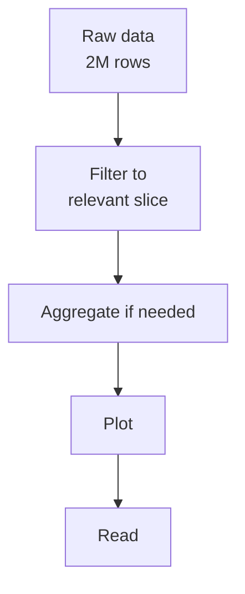

Plotly Express is happy to draw whatever you pass it — including
2 million rows of irrelevant data. A lot of "bad" charts are
*really* "right chart of the wrong slice of data." Spending 30
seconds filtering your DataFrame before the plot call is one of
the highest-leverage habits in visualization work.

This page is about the *pre-chart* step: choosing what to show.

## Why filter at all?

Most analytic questions are about a **subset** of the data:

- "How are sales in *Europe* trending?"
- "What did our *active* users do last *week*?"
- "Show me the *top 10* products."

If you skip the filter, the chart drowns in noise. Worse, the
chart may *technically* be correct but answer the wrong question.



## The big four operations

Four pandas operations cover almost every pre-chart need:

### 1. Boolean filter

```python
df_2007 = df[df["year"] == 2007]
df_eu   = df[df["continent"] == "Europe"]
df_both = df[(df["year"] == 2007) & (df["continent"] == "Europe")]
```

Or the equivalent `.query()` form:

```python
df.query("year == 2007 and continent == 'Europe'")
```

### 2. Top-N

```python
top10 = df.sort_values("revenue", ascending=False).head(10)
```

Almost any "top N" chart is just a sort + head + bar chart.

### 3. Group + aggregate

```python
avg_by_region = (
    df.groupby("region", as_index=False)["sales"].mean()
)
```

`groupby` collapses rows into one per group; the aggregation
function says how to combine.

### 4. Date range

```python
df_2024 = df[df["date"].between("2024-01-01", "2024-12-31")]
```

For time series, almost every chart starts with a date filter.

## Example: from raw data to a clean chart

Let's build a story together: *"Which European countries had the
biggest gain in life expectancy between 1952 and 2007?"*

<CodeBlock
  adapter="python"
  starterCode={`import plotly.express as px

df = px.data.gapminder()

# Step 1: filter to Europe
eu = df[df["continent"] == "Europe"]

# Step 2: pivot to get 1952 and 2007 side by side
pivot = eu.pivot(index="country", columns="year", values="lifeExp")

# Step 3: compute the difference
pivot["gain"] = pivot[2007] - pivot[1952]

# Step 4: sort and keep top 10
top = pivot.sort_values("gain", ascending=False).head(10).reset_index()

print(top[["country", 1952, 2007, "gain"]])

# Step 5: chart
fig = px.bar(
    top.sort_values("gain"),
    x="gain", y="country", orientation="h",
    template="simple_white",
    title="Top 10 European gains in life expectancy, 1952 → 2007",
    labels={"gain": "Gain in life expectancy (years)", "country": "Country"},
)
fig.show()
`}
/>

Notice how much of the work is *before* the `px.bar` line. The
chart itself is one line; the *data preparation* is four. That's
the normal ratio.

## Common filter mistakes

- **Forgetting to copy.** When you do `df_eu = df[df["continent"]
  == "Europe"]` and then mutate `df_eu`, you may get a warning
  about chained assignment. Use `df_eu = df[...].copy()` if you
  plan to add columns.
- **Filtering after aggregating.** Filter *first*, then aggregate.
  Aggregating first means you can't recover the rows you wanted.
- **Filtering with `==` vs `.isin()`.** For multiple values, use
  `df[df["continent"].isin(["Europe", "Asia"])]`, not chained
  ORs.

## The `.query()` style

`.query("...")` is often more readable for simple filters:

```python
df.query("year == 2007 and continent == 'Europe' and lifeExp > 80")
```

is equivalent to:

```python
df[(df["year"] == 2007) & (df["continent"] == "Europe") & (df["lifeExp"] > 80)]
```

Use whichever reads better in your context.

## Why "show less" usually beats "show more"

A chart of 200 countries is hard to read; a chart of the **top
15** is easy. A chart of every day of the year is busy; a chart
*facetted by month* is clear.

When you find yourself fighting a chart, the answer is often *not*
to add more encodings — it's to *remove rows*. Filter first.

## Check your understanding

<MultipleChoice
  markdown={`Why is **filtering before plotting** often more important than configuring the chart itself?

- Filtering makes the chart render faster.
- Filtering is required by Plotly.
- [o] A chart of the right subset is almost always more readable and more relevant than the same chart drawn on the entire dataset.
  > Yes. "Show less" is one of the most consistently effective moves in visualization. Picking the right rows to show is half the design decision, and it's usually a one-line pandas operation before the chart call.
- Filtering converts the DataFrame to a chart.

The best charts often start with the question: *what am I going to filter out?*`}
/>

<MultipleChoice
  markdown={`Which pandas idiom keeps rows where the **continent** column is in **["Europe", "Asia"]**?

- **df[df["continent"] == ["Europe", "Asia"]]**
- **df[df["continent"] in ["Europe", "Asia"]]**
- [o] **df[df["continent"].isin(["Europe", "Asia"])]**
  > Yes. **.isin([...])** is the canonical "value matches any of these" filter. It also works with **~df["continent"].isin([...])** for *NOT in*. The other two syntaxes either don't do what they look like or raise an error.
- **df.filter(continent=["Europe", "Asia"])**

**.isin()** is one of the most-used pandas methods. Worth memorizing.`}
/>

<MultipleChoice
  markdown={`If your chart of every customer is unreadable, the **best** first move is usually to:

- Add more colors.
- Make the chart taller.
- [o] Filter to a meaningful subset — top N, recent dates, a specific segment — before plotting.
  > Right. Charts have a finite visual budget. Trying to cram every observation into one picture leads to overlap, noise, and visual mush. A well-chosen filter does more for readability than any styling tweak.
- Switch to a 3-D chart.

Sometimes the answer is also "show many small charts" via faceting — which is itself a form of filtering applied per panel.`}
/>
