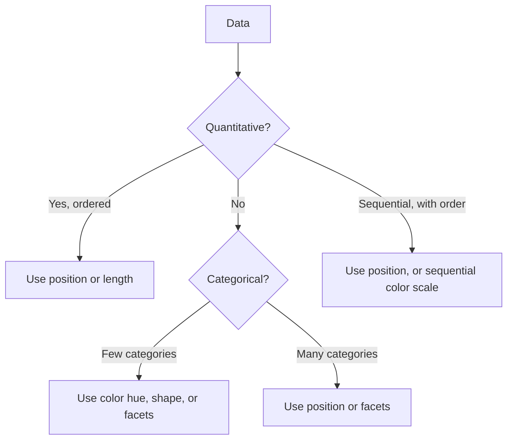

You have now met *encoding* twice — first as the formal definition
of what a visualization is, and then through the Cleveland-McGill
ranking of how *accurately* different encodings convey magnitude.
This page consolidates everything into a single working vocabulary.

By the end of this page you will be able to look at any chart and
say: "This chart maps column **A** to position-on-x, column **B**
to position-on-y, column **C** to color hue, and column **D** to
marker size." That sentence is the *anatomy* of a Plotly Express
call.

## The seven (or so) visual channels

Every chart that has ever been made encodes data through some
combination of these channels:

| Channel | What it shows well | Plotly Express argument |
| --- | --- | --- |
| **Position (x)** | Quantity or ordered category | `x="..."` |
| **Position (y)** | Quantity or ordered category | `y="..."` |
| **Length** | Quantity (bar charts) | implicit from `y` in `px.bar` |
| **Color hue** | Categorical grouping | `color="..."` |
| **Color luminance** | Sequential quantity | `color="..."` with continuous scale |
| **Size** | Quantity (less precise) | `size="..."` |
| **Shape** | Categorical grouping (small N) | `symbol="..."` |
| **Facets** | Categorical grouping (split panels) | `facet_col="..."`, `facet_row="..."` |
| **Hover text** | Identification of a single point | `hover_name="..."`, `hover_data=[...]` |

That is essentially the entire Plotly Express argument vocabulary
for "what data maps to what." Master these and you can describe
any Plotly Express chart in one sentence.

## The grammar in action

Here is a four-encoding chart. Notice how each `=` is mapping a
*column name* to a *visual channel*.

<CodeBlock
  adapter="python"
  starterCode={`import plotly.express as px

df = px.data.gapminder().query("year == 2007")

fig = px.scatter(
    df,
    x="gdpPercap",  # position-x  -> GDP per capita
    y="lifeExp",  # position-y  -> life expectancy
    color="continent",  # color hue   -> continent (categorical)
    size="pop",  # size        -> population
    hover_name="country",
    log_x=True,
    size_max=55,
    template="simple_white",
    title="Gapminder 2007: four encodings in one chart",
    labels={
        "gdpPercap": "GDP per capita (USD, log)",
        "lifeExp": "Life expectancy (years)",
    },
)
fig.show()
`}
/>

Read the call out loud:

> "Scatter plot. **GDP** on x. **Life expectancy** on y. Color by
> **continent**. Size by **population**."

The function call *is* the chart specification. There is nothing
hidden.

## Which channel is right for which kind of data?

Data comes in several flavors, and they suit different channels:



A bit more formally, four common data types:

- **Quantitative** (numbers with a meaningful magnitude): age,
  temperature, dollars. Use **position** or **length**.
- **Ordinal** (ordered but not numeric): low / medium / high.
  Use **position** along a ranked axis, or a sequential color scale.
- **Nominal** (unordered categories): country, color, sport. Use
  **color hue**, **shape**, or **facets**.
- **Temporal** (time): dates and times. Use the **x-axis**, almost
  always. Time is sacred — keep it on x.

## Encodings tell a story about importance

Recall the perceptual ranking. **Whichever variable you put on
the most accurate channel implicitly becomes the most important
one in the chart.** The reader's eye will go to it first.

This means you can convey your *narrative* through encoding
choice. Consider three variations of the same scatter:

```python
# Variation A: GDP on x, life expectancy on y
px.scatter(df, x="gdpPercap", y="lifeExp", color="continent")

# Variation B: continent on x, life expectancy on y
px.scatter(df, x="continent", y="lifeExp", color="gdpPercap")

# Variation C: GDP on x, life expectancy on y, but use color for population
px.scatter(df, x="gdpPercap", y="lifeExp", color="pop")
```

Variation A tells a story about *the relationship between GDP and
life expectancy*. Variation B tells a story about *how continents
differ in life expectancy*. Variation C makes *population* the
prominent third variable. Same data; three different stories.

## Encoding mistakes to avoid

- **Using color for a quantity that needs precise comparison.**
  Use position or length instead.
- **Using shape with more than ~6 categories.** People can't tell
  ●  ■  ▲  ▼  ◆  ★  ✦  ✚  apart in a crowded plot.
- **Doubling up two channels redundantly when one would do.** If
  you `color="continent"` AND `facet_col="continent"`, you've used
  two channels for one variable — wasteful and busy.
- **Using `size` for a *negative* meaning** (bigger dot = worse).
  The eye reads "bigger" as "more important" by default; flipping
  this confuses readers.

## A vocabulary check

Test yourself: read the chart below and say, in one sentence,
which column is mapped to which channel.

<CodeBlock
  adapter="python"
  starterCode={`import plotly.express as px

df = px.data.iris()

fig = px.scatter(
    df,
    x="sepal_width",
    y="sepal_length",
    color="species",
    symbol="species",
    size="petal_length",
    template="simple_white",
    title="Iris: four encodings",
    labels={"sepal_width": "Sepal width (cm)", "sepal_length": "Sepal length (cm)"},
)
fig.show()
`}
/>

The answer: **x = sepal width**, **y = sepal length**, **color &
shape = species**, **size = petal length**. The chart spends color
*and* shape on `species` (redundant encoding) which is sometimes
useful for color-blind viewers but can also be argued as wasted
ink. Tradeoffs.

## Check your understanding

<MultipleChoice
  markdown={`Which Plotly Express argument maps a column to **horizontal position**?

- **color="..."**
- **size="..."**
- [o] **x="..."**
  > **x="column_name"** tells Plotly Express to use that column for the horizontal axis. Combined with **y**, these two arguments do most of the work in any scatter, line, or bar chart.
- **facet_col="..."**

Position along x and y are the two most powerful encodings — use them for what matters most.`}
/>

<MultipleChoice
  markdown={`You have a chart of houses where you want to show **price**, **square footage**, **neighborhood** (categorical), and **year built**. Which mapping uses the **strongest channels for the most important comparisons**?

- color = price, x = year built, y = square footage, size = neighborhood
- size = price, color = year built, x = neighborhood, y = square footage
- [o] x = square footage, y = price, color = neighborhood, size = year built (or similar)
  > Position (x and y) is the most accurate channel — putting the two quantitative variables you most want to compare (**price** and **square footage**) on x and y gives the reader the clearest possible read of their relationship. Color carries the categorical neighborhood; size carries the secondary continuous variable.
- color = neighborhood, size = price, x = year built, y = price

A general rule: the two most important *quantitative* variables go on x and y.`}
/>

<MultipleChoice
  markdown={`Which kind of data is **best** encoded with **color hue** (rainbow categorical colors like the default Plotly palette)?

- Continuous prices (e.g., \\$0 – \\$1,000,000).
- An ordered scale of customer satisfaction (1-5).
- [o] A small number (~3-7) of distinct, unordered categories such as continents or product lines.
  > Hue is excellent at saying "these dots belong together" for a handful of categories, and the eye distinguishes the colors instantly. For continuous or ordered data, prefer a sequential or diverging *intensity* scale instead of a categorical hue palette.
- Time stamps over a 100-year span.

Color hue = categories. Color intensity (light → dark) = quantity. Mixing them up is a classic beginner mistake.`}
/>

<MultipleChoice
  markdown={`You facet a Plotly Express chart by **facet_col="region"** *and* also color by **color="region"**. What is the result?

- The chart will fail to render.
- Plotly will crash.
- [o] The chart will work, but you've spent two visual channels on a single variable — a missed opportunity that often adds clutter without adding information.
  > Redundant encoding is sometimes deliberate (e.g., for colorblind accessibility), but it's frequently a wasted channel. Each facet panel will be a single color anyway, so the color encoding adds nothing new — and you've used up a channel you could have given to a different variable.
- Plotly will use a random color per facet.

Use each channel intentionally. If you have five variables, try to give each its own channel before doubling up.`}
/>
