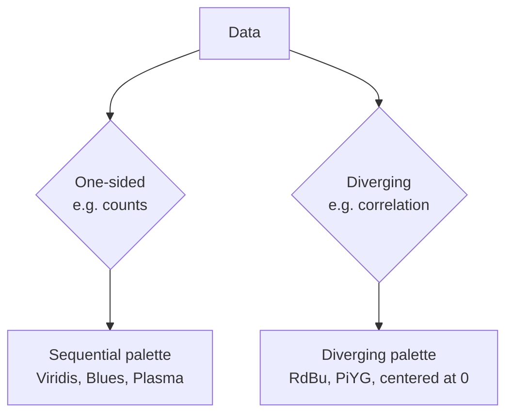

A **heatmap** is a grid of colored cells, where each cell's color
encodes a numeric value. It's the natural chart for any data that
sits in a *two-dimensional table* — categories on rows and columns,
numbers in the cells.

You will see heatmaps used for correlation matrices, schedule
calendars, hourly traffic, missing-data maps, and confusion
matrices in ML — all the same chart, applied to different data
shapes.

## When a heatmap is right

Use a heatmap when:

- You have a **2-D table** of values: rows × columns of numbers.
- You want to spot **patterns**, **clusters**, or **anomalies**
  across both axes simultaneously.
- The number of rows and columns isn't huge — a 20×20 grid is
  comfortable, a 1000×1000 grid is a different kind of chart.

## A simple heatmap

Plotly Express offers `px.imshow` (for image-like 2-D matrices) and
`px.density_heatmap` (which bins two continuous variables on the fly).

<CodeBlock
  adapter="python"
  starterCode={`import plotly.express as px

df = px.data.tips()

fig = px.density_heatmap(
    df,
    x="total_bill",
    y="tip",
    nbinsx=20,
    nbinsy=20,
    template="simple_white",
    title="2-D density: tip vs total bill",
    labels={"total_bill": "Total bill (USD)", "tip": "Tip (USD)"},
)
fig.show()
`}
/>

Where the scatter plot showed *every dot*, this shows *cell counts*.
The hot cells (yellow) are where most diners fall — small-to-medium
bill, small tip.

## A correlation matrix heatmap

A classic use is a **correlation matrix** — every numeric column
correlated against every other.

<CodeBlock
  adapter="python"
  starterCode={`import plotly.express as px

df = px.data.iris().select_dtypes("number")
corr = df.corr().round(2)

fig = px.imshow(
    corr,
    text_auto=True,
    color_continuous_scale="RdBu_r",
    color_continuous_midpoint=0,
    template="simple_white",
    title="Correlation matrix (iris)",
)
fig.show()
`}
/>

Three Plotly Express tricks worth noticing:

- `text_auto=True` writes the numeric value in each cell.
- `color_continuous_scale="RdBu_r"` picks a **diverging** palette.
- `color_continuous_midpoint=0` centers the white at 0 so positive
  correlations are blue and negative are red.

For *diverging* data (anything with a meaningful zero, like
correlations or year-over-year change), always use a diverging
palette centered at zero.

## A calendar/schedule heatmap

Heatmaps also show counts across two categorical axes:

<CodeBlock
  adapter="python"
  starterCode={`import pandas as pd
import plotly.express as px

df = px.data.tips()

# Cross-tab of customer counts by day x time:
counts = pd.crosstab(df["day"], df["time"])
print(counts)

fig = px.imshow(
    counts,
    text_auto=True,
    color_continuous_scale="Blues",
    template="simple_white",
    title="Number of customers by day and time",
    labels={"x": "Time", "y": "Day", "color": "Count"},
)
fig.show()
`}
/>

The hot cell (Sat dinner) leaps out immediately. A table of the
same numbers would require the reader to scan; the heatmap is
read in a single glance.

## Choosing a color scale

This is the single most important decision when making a heatmap.

- **Sequential** (light → dark of one hue): `"Viridis"`,
  `"Plasma"`, `"Blues"`, `"YlOrRd"`. Use for values that go from
  *low to high* with no special midpoint.
- **Diverging** (color → white → other color): `"RdBu"`,
  `"RdBu_r"` (reversed), `"PiYG"`. Use for values with a
  *meaningful zero* (correlations, deviations, gain/loss).
- **Avoid `Jet` / rainbow.** It is *perceptually non-uniform* —
  bright cyan and yellow bands look like ridges in the data even
  where there aren't any. `Viridis` is its modern replacement.

## Pitfalls of heatmaps

- **Too many cells** (1000×1000) make individual cells invisible.
  Either aggregate or switch to a density-based representation.
- **Wrong palette** (rainbow / Jet) introduces false structure.
- **Forgetting the colorbar legend** — without it, the chart's
  colors mean nothing to the reader. Always show the legend.
- **Truncating the color range** can mask outliers, similar to a
  truncated y-axis on a bar chart.

## Check your understanding

<MultipleChoice
  markdown={`A **heatmap** is best suited for visualizing:

- A single numeric variable's distribution.
- A trend over time.
- [o] A 2-D table of numeric values — rows × columns — where you want to spot patterns or hotspots.
  > Each cell's color encodes the numeric value at that row/column intersection. The eye perceives the dense, hot, or cold regions instantly, which makes heatmaps excellent for correlation matrices, calendar data, and any cross-tabulation.
- A part-of-a-whole composition.

For distributions use a histogram; for trends use a line chart; for compositions use a sorted bar chart.`}
/>

<MultipleChoice
  markdown={`For a **correlation matrix** heatmap (values from -1 to +1), which color palette is most appropriate?

- A sequential palette like **Viridis**.
- A categorical palette like **Plotly**.
- [o] A **diverging** palette like **RdBu** or **RdBu_r**, centered at zero.
  > Correlations have a meaningful midpoint (0 = no correlation). A diverging palette uses two distinct hues for positive vs negative and intensity for magnitude, so viewers can read sign and strength simultaneously. Always center the palette midpoint at zero (**color_continuous_midpoint=0**).
- A grayscale ramp.

Diverging data deserves a diverging palette. Mixing it up is a common mistake.`}
/>

<MultipleChoice
  markdown={`Why should you **avoid** the **Jet** (rainbow) colormap for heatmaps?

- It is copyrighted.
- It is only available on Windows.
- [o] It is **perceptually non-uniform** — bright cyan and yellow bands appear as visual "ridges" even where data is flat, leading viewers to see structure that isn't there.
  > Jet was popular in the 1990s but is now known to introduce false features. Modern perceptually uniform palettes (Viridis, Cividis, Magma) increase smoothly in luminance and reveal the actual structure of the data without visual artifacts.
- It uses too many colors.

This is one of the genuinely settled debates in modern visualization. Just don't use rainbow palettes for quantitative data.`}
/>
